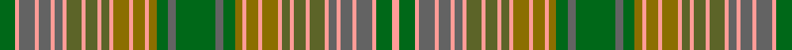

This is one **variant** — a specific cloth: this exact thread count and colourway, with its own
provenance below. It is one weaving of the [sett](/setts/dg4lr1n4lr1n3lr1n2lr1g4lr1g3lr1g2lr1y4lr1y3lr1y2dg3n2dg10n2dg3y2lr1y3lr1y4lr1g2lr1g3lr1g4lr1n2lr1n3lr1n4lr1dg4lr2/) (the scale-free proportion — the
same cloth at any scale or shade), whose colour order is pattern [GYBYBYBYGYGYGYGYGYGGBGBGGYGYGYGYGYGYBYBYBYGY](/stripes/gybybybygygygygygyggbgbggygygygygygybybybygy/).

Part of the [Kirkton](/tartans/k/ki/kirkton/) tartan — the named design grouping this sett with its other cloths.

Sourced from register-of-tartans.  It is a [44 stripe tartan](/stripes/stripes44/).

Original link [https://www.tartanregister.gov.uk/tartanDetails.aspx?ref=2006](https://www.tartanregister.gov.uk/tartanDetails.aspx?ref=2006)

Dataset <small>— provenance for this record, inherited from the source manifest</small>

<dl class="dataset-prov">
<dt>source</dt><dd><a href="/sources/register-of-tartans/">Scottish Register of Tartans</a></dd>
<dt>data captured from</dt><dd><a href="https://github.com/thetartan/tartan-database/blob/master/data/register-of-tartans/data.csv">https://github.com/thetartan/tartan-database/blob/master/data/register-of-tartans/data.csv</a></dd>
<dt>data date</dt><dd>1984 <small>(this record)</small></dd>
<dt>licence</dt><dd><a href="https://www.tartanregister.gov.uk/copyright">Crown copyright</a></dd>
</dl>

Capture chain <small>— the hands this data passed through, oldest first; each capture carries its own licence</small>

<ol class="capture-chain">
<li><a href="https://www.tartanregister.gov.uk/">Scottish Register of Tartans</a> · <a href="https://www.tartanregister.gov.uk/copyright">Crown copyright</a> <small>the living register — still published by National Records of Scotland</small></li>
<li><a href="https://github.com/thetartan/tartan-database">thetartan/tartan-database</a> <small>2016-2017</small> · <a href="https://creativecommons.org/licenses/by-nc-nd/4.0/">CC BY-NC-ND 4.0</a> <small>Levko Kravets's frozen compilation — the capture we vendored, and where its CC licence text came from</small></li>
<li>this dictionary <small>captured 2026-06-10 · commit 5bf86c7566</small> <small>each re-capture is a git commit to data/sources</small></li>
</ol>

## Register references

External register numbers recorded for this tartan.

- Scottish Register of Tartans: [2006](https://www.tartanregister.gov.uk/tartanDetails.aspx?ref=2006)
- Scottish Tartans Authority (ITI): 5368

## Thread count
DG/16 LR4 N16 LR4 N12 LR4 N8 LR4 G16 LR4 G12 LR4 G8 LR4 Y16 LR4 Y12 LR4 Y8 DG12 N8 DG40 N8 DG12 Y8 LR4 Y12 LR4 Y16 LR4 G8 LR4 G12 LR4 G16 LR4 N8 LR4 N12 LR4 N16 LR4 DG16 LR/8

One full sett is **792 threads**.

## Palette
<table><thead><tr><th>Colour</th><th>Shade</th><th>OKLCh</th></tr></thead><tbody><tr><td>DG</td><td><code style="background-color:#006818;">#006818</code> <small style="color:#888">#006818</small></td><td><small style="color:#888">oklch(45.0% 0.142 145.0)</small></td></tr><tr><td>G</td><td><code style="background-color:#5C6428;">#5C6428</code> <small style="color:#888">#5C6428</small></td><td><small style="color:#888">oklch(48.3% 0.084 116.0)</small></td></tr><tr><td>Y</td><td><code style="background-color:#8B6E00;">#8B6E00</code> <small style="color:#888">#8B6E00</small></td><td><small style="color:#888">oklch(55.1% 0.113 90.4)</small></td></tr><tr><td>N</td><td><code style="background-color:#636363;">#636363</code> <small style="color:#888">#636363</small></td><td><small style="color:#888">oklch(50.0% 0.000 89.9)</small></td></tr><tr><td>LR</td><td><code style="background-color:#FF9C97;">#FF9C97</code> <small style="color:#888">#FF9C97</small></td><td><small style="color:#888">oklch(79.3% 0.119 23.2)</small></td></tr></tbody></table>

# Sample pattern

ID: /variants/s44/dg4lr1n4lr1n3lr1n2lr1g4lr1g3lr1g2lr1y4lr1y3lr1y2dg3n2dg10n2dg3y2lr1y3lr1y4lr1g2lr1g3lr1g4lr1n2lr1n3lr1n4lr1dg4lr2~x4~dg1806142-g1903114/
