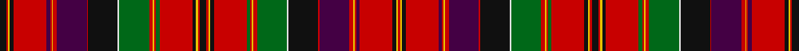

This page is one **sett** — a single exact thread-count. It belongs to the [tartan](/setts/k14r4ly4k8r70dp8r3ly3r8dp64r3k63w3g64r8ly3r3g8r70k8ly4r4k14/)
(the same proportion at any scale), whose colour order is pattern [KRYKRBRYRBRKWGRYRGRKYRKRYKRGRYRGWKRBRYRBRKYR](/stripes/krykrbryrbrkwgryrgrkyrkrykrgryrgwkrbryrbrkyr/).

Part of the [Leith](/tartans/leith/) tartan — the named design grouping this sett with its other cloths.

Sourced from register-of-tartans.  It is a [44 stripe tartan](/stripes/stripes44/).

Original link https://www.tartanregister.gov.uk/tartanDetails.aspx?ref=2091

## Also known as

This cloth is also recorded under:

- Hay or Leith
- Leith & Hay

2 attestations — the source records this cloth was collapsed from (oldest owns this page)

<ul>
<li>01/01/1819 — Leith (Hay) (register-of-tartans, <a href="https://www.tartanregister.gov.uk/tartanDetails.aspx?ref=2091">record</a>)</li>
<li>1819 — Leith & Hay (Clan) (tartans-authority, <a href="http://www.tartansauthority.com/tartan-ferret/display/2131/">record</a>)</li>
</ul>

## Register references

External register numbers recorded for this tartan.

- Scottish Register of Tartans: [2091](https://www.tartanregister.gov.uk/tartanDetails.aspx?ref=2091)
- Scottish Tartans Authority (ITI): 2131
- Scottish Tartans World Register: 2131

## Thread count
K/14 R4 Y4 K8 R70 DP8 R3 Y3 R8 DP64 R3 K63 LN3 G64 R8 Y3 R3 G8 R70 K8 Y4 R4 K14 R4 Y4 K8 R70 G8 R3 Y3 R8 G64 LN3 K63 R3 DP64 R8 Y3 R3 DP8 R70 K8 Y4 R/4

One full sett is **1690 threads**.

## Palette

Palette: <strong>Tartan Register</strong>
<table><thead><tr><th>Colour</th><th>Threads</th><th>Shade</th><th>Base</th><th>OKLCh</th></tr></thead><tbody><tr><td>K/</td><td style="text-align:right;font-variant-numeric:tabular-nums">14</td><td><code style="background-color:#101010;">#101010</code> <small style="color:#888">#101010</small></td><td>K <code style="background-color:#000000;">#000000</code></td><td><small style="color:#888">oklch(17.3% 0.000 89.9)</small></td></tr><tr><td>R</td><td style="text-align:right;font-variant-numeric:tabular-nums">4</td><td><code style="background-color:#C80000;">#C80000</code> <small style="color:#888">#C80000</small></td><td>R <code style="background-color:#CC0000;">#CC0000</code></td><td><small style="color:#888">oklch(52.3% 0.215 29.2)</small></td></tr><tr><td>Y</td><td style="text-align:right;font-variant-numeric:tabular-nums">4</td><td><code style="background-color:#E8C000;">#E8C000</code> <small style="color:#888">#E8C000</small></td><td>Y <code style="background-color:#F2BF00;">#F2BF00</code></td><td><small style="color:#888">oklch(81.9% 0.168 93.7)</small></td></tr><tr><td>K</td><td style="text-align:right;font-variant-numeric:tabular-nums">8</td><td><code style="background-color:#101010;">#101010</code> <small style="color:#888">#101010</small></td><td>K <code style="background-color:#000000;">#000000</code></td><td><small style="color:#888">oklch(17.3% 0.000 89.9)</small></td></tr><tr><td>R</td><td style="text-align:right;font-variant-numeric:tabular-nums">70</td><td><code style="background-color:#C80000;">#C80000</code> <small style="color:#888">#C80000</small></td><td>R <code style="background-color:#CC0000;">#CC0000</code></td><td><small style="color:#888">oklch(52.3% 0.215 29.2)</small></td></tr><tr><td>DP</td><td style="text-align:right;font-variant-numeric:tabular-nums">8</td><td><code style="background-color:#440044;">#440044</code> <small style="color:#888">#440044</small></td><td>B <code style="background-color:#2A418A;">#2A418A</code></td><td><small style="color:#888">oklch(27.1% 0.125 328.4)</small></td></tr><tr><td>R</td><td style="text-align:right;font-variant-numeric:tabular-nums">3</td><td><code style="background-color:#C80000;">#C80000</code> <small style="color:#888">#C80000</small></td><td>R <code style="background-color:#CC0000;">#CC0000</code></td><td><small style="color:#888">oklch(52.3% 0.215 29.2)</small></td></tr><tr><td>Y</td><td style="text-align:right;font-variant-numeric:tabular-nums">3</td><td><code style="background-color:#E8C000;">#E8C000</code> <small style="color:#888">#E8C000</small></td><td>Y <code style="background-color:#F2BF00;">#F2BF00</code></td><td><small style="color:#888">oklch(81.9% 0.168 93.7)</small></td></tr><tr><td>R</td><td style="text-align:right;font-variant-numeric:tabular-nums">8</td><td><code style="background-color:#C80000;">#C80000</code> <small style="color:#888">#C80000</small></td><td>R <code style="background-color:#CC0000;">#CC0000</code></td><td><small style="color:#888">oklch(52.3% 0.215 29.2)</small></td></tr><tr><td>DP</td><td style="text-align:right;font-variant-numeric:tabular-nums">64</td><td><code style="background-color:#440044;">#440044</code> <small style="color:#888">#440044</small></td><td>B <code style="background-color:#2A418A;">#2A418A</code></td><td><small style="color:#888">oklch(27.1% 0.125 328.4)</small></td></tr><tr><td>R</td><td style="text-align:right;font-variant-numeric:tabular-nums">3</td><td><code style="background-color:#C80000;">#C80000</code> <small style="color:#888">#C80000</small></td><td>R <code style="background-color:#CC0000;">#CC0000</code></td><td><small style="color:#888">oklch(52.3% 0.215 29.2)</small></td></tr><tr><td>K</td><td style="text-align:right;font-variant-numeric:tabular-nums">63</td><td><code style="background-color:#101010;">#101010</code> <small style="color:#888">#101010</small></td><td>K <code style="background-color:#000000;">#000000</code></td><td><small style="color:#888">oklch(17.3% 0.000 89.9)</small></td></tr><tr><td>LN</td><td style="text-align:right;font-variant-numeric:tabular-nums">3</td><td><code style="background-color:#E0E0E0;">#E0E0E0</code> <small style="color:#888">#E0E0E0</small></td><td>W <code style="background-color:#F7F7F7;">#F7F7F7</code></td><td><small style="color:#888">oklch(90.7% 0.000 89.9)</small></td></tr><tr><td>G</td><td style="text-align:right;font-variant-numeric:tabular-nums">64</td><td><code style="background-color:#006818;">#006818</code> <small style="color:#888">#006818</small></td><td>G <code style="background-color:#006100;">#006100</code></td><td><small style="color:#888">oklch(45.0% 0.142 145.0)</small></td></tr><tr><td>R</td><td style="text-align:right;font-variant-numeric:tabular-nums">8</td><td><code style="background-color:#C80000;">#C80000</code> <small style="color:#888">#C80000</small></td><td>R <code style="background-color:#CC0000;">#CC0000</code></td><td><small style="color:#888">oklch(52.3% 0.215 29.2)</small></td></tr><tr><td>Y</td><td style="text-align:right;font-variant-numeric:tabular-nums">3</td><td><code style="background-color:#E8C000;">#E8C000</code> <small style="color:#888">#E8C000</small></td><td>Y <code style="background-color:#F2BF00;">#F2BF00</code></td><td><small style="color:#888">oklch(81.9% 0.168 93.7)</small></td></tr><tr><td>R</td><td style="text-align:right;font-variant-numeric:tabular-nums">3</td><td><code style="background-color:#C80000;">#C80000</code> <small style="color:#888">#C80000</small></td><td>R <code style="background-color:#CC0000;">#CC0000</code></td><td><small style="color:#888">oklch(52.3% 0.215 29.2)</small></td></tr><tr><td>G</td><td style="text-align:right;font-variant-numeric:tabular-nums">8</td><td><code style="background-color:#006818;">#006818</code> <small style="color:#888">#006818</small></td><td>G <code style="background-color:#006100;">#006100</code></td><td><small style="color:#888">oklch(45.0% 0.142 145.0)</small></td></tr><tr><td>R</td><td style="text-align:right;font-variant-numeric:tabular-nums">70</td><td><code style="background-color:#C80000;">#C80000</code> <small style="color:#888">#C80000</small></td><td>R <code style="background-color:#CC0000;">#CC0000</code></td><td><small style="color:#888">oklch(52.3% 0.215 29.2)</small></td></tr><tr><td>K</td><td style="text-align:right;font-variant-numeric:tabular-nums">8</td><td><code style="background-color:#101010;">#101010</code> <small style="color:#888">#101010</small></td><td>K <code style="background-color:#000000;">#000000</code></td><td><small style="color:#888">oklch(17.3% 0.000 89.9)</small></td></tr><tr><td>Y</td><td style="text-align:right;font-variant-numeric:tabular-nums">4</td><td><code style="background-color:#E8C000;">#E8C000</code> <small style="color:#888">#E8C000</small></td><td>Y <code style="background-color:#F2BF00;">#F2BF00</code></td><td><small style="color:#888">oklch(81.9% 0.168 93.7)</small></td></tr><tr><td>R</td><td style="text-align:right;font-variant-numeric:tabular-nums">4</td><td><code style="background-color:#C80000;">#C80000</code> <small style="color:#888">#C80000</small></td><td>R <code style="background-color:#CC0000;">#CC0000</code></td><td><small style="color:#888">oklch(52.3% 0.215 29.2)</small></td></tr><tr><td>K</td><td style="text-align:right;font-variant-numeric:tabular-nums">14</td><td><code style="background-color:#101010;">#101010</code> <small style="color:#888">#101010</small></td><td>K <code style="background-color:#000000;">#000000</code></td><td><small style="color:#888">oklch(17.3% 0.000 89.9)</small></td></tr><tr><td>R</td><td style="text-align:right;font-variant-numeric:tabular-nums">4</td><td><code style="background-color:#C80000;">#C80000</code> <small style="color:#888">#C80000</small></td><td>R <code style="background-color:#CC0000;">#CC0000</code></td><td><small style="color:#888">oklch(52.3% 0.215 29.2)</small></td></tr><tr><td>Y</td><td style="text-align:right;font-variant-numeric:tabular-nums">4</td><td><code style="background-color:#E8C000;">#E8C000</code> <small style="color:#888">#E8C000</small></td><td>Y <code style="background-color:#F2BF00;">#F2BF00</code></td><td><small style="color:#888">oklch(81.9% 0.168 93.7)</small></td></tr><tr><td>K</td><td style="text-align:right;font-variant-numeric:tabular-nums">8</td><td><code style="background-color:#101010;">#101010</code> <small style="color:#888">#101010</small></td><td>K <code style="background-color:#000000;">#000000</code></td><td><small style="color:#888">oklch(17.3% 0.000 89.9)</small></td></tr><tr><td>R</td><td style="text-align:right;font-variant-numeric:tabular-nums">70</td><td><code style="background-color:#C80000;">#C80000</code> <small style="color:#888">#C80000</small></td><td>R <code style="background-color:#CC0000;">#CC0000</code></td><td><small style="color:#888">oklch(52.3% 0.215 29.2)</small></td></tr><tr><td>G</td><td style="text-align:right;font-variant-numeric:tabular-nums">8</td><td><code style="background-color:#006818;">#006818</code> <small style="color:#888">#006818</small></td><td>G <code style="background-color:#006100;">#006100</code></td><td><small style="color:#888">oklch(45.0% 0.142 145.0)</small></td></tr><tr><td>R</td><td style="text-align:right;font-variant-numeric:tabular-nums">3</td><td><code style="background-color:#C80000;">#C80000</code> <small style="color:#888">#C80000</small></td><td>R <code style="background-color:#CC0000;">#CC0000</code></td><td><small style="color:#888">oklch(52.3% 0.215 29.2)</small></td></tr><tr><td>Y</td><td style="text-align:right;font-variant-numeric:tabular-nums">3</td><td><code style="background-color:#E8C000;">#E8C000</code> <small style="color:#888">#E8C000</small></td><td>Y <code style="background-color:#F2BF00;">#F2BF00</code></td><td><small style="color:#888">oklch(81.9% 0.168 93.7)</small></td></tr><tr><td>R</td><td style="text-align:right;font-variant-numeric:tabular-nums">8</td><td><code style="background-color:#C80000;">#C80000</code> <small style="color:#888">#C80000</small></td><td>R <code style="background-color:#CC0000;">#CC0000</code></td><td><small style="color:#888">oklch(52.3% 0.215 29.2)</small></td></tr><tr><td>G</td><td style="text-align:right;font-variant-numeric:tabular-nums">64</td><td><code style="background-color:#006818;">#006818</code> <small style="color:#888">#006818</small></td><td>G <code style="background-color:#006100;">#006100</code></td><td><small style="color:#888">oklch(45.0% 0.142 145.0)</small></td></tr><tr><td>LN</td><td style="text-align:right;font-variant-numeric:tabular-nums">3</td><td><code style="background-color:#E0E0E0;">#E0E0E0</code> <small style="color:#888">#E0E0E0</small></td><td>W <code style="background-color:#F7F7F7;">#F7F7F7</code></td><td><small style="color:#888">oklch(90.7% 0.000 89.9)</small></td></tr><tr><td>K</td><td style="text-align:right;font-variant-numeric:tabular-nums">63</td><td><code style="background-color:#101010;">#101010</code> <small style="color:#888">#101010</small></td><td>K <code style="background-color:#000000;">#000000</code></td><td><small style="color:#888">oklch(17.3% 0.000 89.9)</small></td></tr><tr><td>R</td><td style="text-align:right;font-variant-numeric:tabular-nums">3</td><td><code style="background-color:#C80000;">#C80000</code> <small style="color:#888">#C80000</small></td><td>R <code style="background-color:#CC0000;">#CC0000</code></td><td><small style="color:#888">oklch(52.3% 0.215 29.2)</small></td></tr><tr><td>DP</td><td style="text-align:right;font-variant-numeric:tabular-nums">64</td><td><code style="background-color:#440044;">#440044</code> <small style="color:#888">#440044</small></td><td>B <code style="background-color:#2A418A;">#2A418A</code></td><td><small style="color:#888">oklch(27.1% 0.125 328.4)</small></td></tr><tr><td>R</td><td style="text-align:right;font-variant-numeric:tabular-nums">8</td><td><code style="background-color:#C80000;">#C80000</code> <small style="color:#888">#C80000</small></td><td>R <code style="background-color:#CC0000;">#CC0000</code></td><td><small style="color:#888">oklch(52.3% 0.215 29.2)</small></td></tr><tr><td>Y</td><td style="text-align:right;font-variant-numeric:tabular-nums">3</td><td><code style="background-color:#E8C000;">#E8C000</code> <small style="color:#888">#E8C000</small></td><td>Y <code style="background-color:#F2BF00;">#F2BF00</code></td><td><small style="color:#888">oklch(81.9% 0.168 93.7)</small></td></tr><tr><td>R</td><td style="text-align:right;font-variant-numeric:tabular-nums">3</td><td><code style="background-color:#C80000;">#C80000</code> <small style="color:#888">#C80000</small></td><td>R <code style="background-color:#CC0000;">#CC0000</code></td><td><small style="color:#888">oklch(52.3% 0.215 29.2)</small></td></tr><tr><td>DP</td><td style="text-align:right;font-variant-numeric:tabular-nums">8</td><td><code style="background-color:#440044;">#440044</code> <small style="color:#888">#440044</small></td><td>B <code style="background-color:#2A418A;">#2A418A</code></td><td><small style="color:#888">oklch(27.1% 0.125 328.4)</small></td></tr><tr><td>R</td><td style="text-align:right;font-variant-numeric:tabular-nums">70</td><td><code style="background-color:#C80000;">#C80000</code> <small style="color:#888">#C80000</small></td><td>R <code style="background-color:#CC0000;">#CC0000</code></td><td><small style="color:#888">oklch(52.3% 0.215 29.2)</small></td></tr><tr><td>K</td><td style="text-align:right;font-variant-numeric:tabular-nums">8</td><td><code style="background-color:#101010;">#101010</code> <small style="color:#888">#101010</small></td><td>K <code style="background-color:#000000;">#000000</code></td><td><small style="color:#888">oklch(17.3% 0.000 89.9)</small></td></tr><tr><td>Y</td><td style="text-align:right;font-variant-numeric:tabular-nums">4</td><td><code style="background-color:#E8C000;">#E8C000</code> <small style="color:#888">#E8C000</small></td><td>Y <code style="background-color:#F2BF00;">#F2BF00</code></td><td><small style="color:#888">oklch(81.9% 0.168 93.7)</small></td></tr><tr><td>R/</td><td style="text-align:right;font-variant-numeric:tabular-nums">4</td><td><code style="background-color:#C80000;">#C80000</code> <small style="color:#888">#C80000</small></td><td>R <code style="background-color:#CC0000;">#CC0000</code></td><td><small style="color:#888">oklch(52.3% 0.215 29.2)</small></td></tr></tbody></table>

## Compared to the master

This cloth is one sett of its design; the master sett (the exemplar the design is anchored on) is below for comparison.

<figure style="margin:0"><figcaption style="color:#888;font-size:smaller">this sett</figcaption></figure>
<figure style="margin:0"><figcaption style="color:#888;font-size:smaller"><a href="/setts/b5k2b17db3b3db22b3dg22b3db3b27k2r4/">master sett →</a></figcaption></figure>

## Nearest tartans

The nearest existing variants by ΔTartan distance, with this tartan at the top so the swatches line up against it.

ΔTartan

Tartan

Sett

—

<a href="/ttd/edit/#slug=k14r4ly4k8r70dp8r3ly3r8dp64r3k63w3g64r8ly3r3g8r70k8ly4r4k14">Leith (Hay)</a> <a class="nn-out" href="/variants/s44/k14r4ly4k8r70dp8r3ly3r8dp64r3k63w3g64r8ly3r3g8r70k8ly4r4k14/" title="open its dictionary page">↗</a>

0.66

<a href="/variants/s42/k7r3ly2r60g7r2ly2r7g50w2k50r2dt50r7ly2r2dt7r60k7ly2r3k7/">Hay &amp; Leith #2</a>

1.21

<a href="/ttd/edit/#slug=w2db1r3m7dg7r2db1r2dg7r41db40w2r4m4r1m1r1m4r4dg15r4m4r1m1r1m4r4w2k40r3dg36r5m5r1m5r5db38r40dg16w2r8m8r3m2r1&amp;base=k14r4ly4k8r70dp8r3ly3r8dp64r3k63w3g64r8ly3r3g8r70k8ly4r4k14">Unnamed C18th - Hynde Cotton Plaid</a> <a class="nn-out" href="/variants/s45/w2db1r3m7dg7r2db1r2dg7r41db40w2r4m4r1m1r1m4r4dg15r4m4r1m1r1m4r4w2k40r3dg36r5m5r1m5r5db38r40dg16w2r8m8r3m2r1/" title="open its dictionary page">↗</a>

1.34

<a href="/ttd/edit/#slug=k10r3ly3k6r48dg6r2ly2r6dg40w2k38r2dp40r6ly2r2dp6r48k6ly2r3k10&amp;base=k14r4ly4k8r70dp8r3ly3r8dp64r3k63w3g64r8ly3r3g8r70k8ly4r4k14">Hay &amp; Leith - 1800 (Clan)</a> <a class="nn-out" href="/variants/s23/k10r3ly3k6r48dg6r2ly2r6dg40w2k38r2dp40r6ly2r2dp6r48k6ly2r3k10/" title="open its dictionary page">↗</a>

1.46

<a href="/ttd/edit/#slug=k3r1ly1k2r16dp2r1ly1r2dp15r1k15w1g15r2ly1r1g2r16k2ly1r1k3~x2&amp;base=k14r4ly4k8r70dp8r3ly3r8dp64r3k63w3g64r8ly3r3g8r70k8ly4r4k14">Hay or Leith Clan Tartan</a> <a class="nn-out" href="/variants/s23/k3r1ly1k2r16dp2r1ly1r2dp15r1k15w1g15r2ly1r1g2r16k2ly1r1k3~x2/" title="open its dictionary page">↗</a>

1.47

<a href="/variants/s34/dg14r6ri2k3r65k2t2r6k34r6t2k2r4dg66r12ri2k2t4/">Stuart/Stewart of Ardshiel</a>

1.48

<a href="/ttd/edit/#slug=t1ly1t1dg1g2dg2g2dg2g2dg1t1ly1t1ly1t1dg28r24ly1o2ly3t4r10oi16r4ly2r15oi5r9dg28t1ly1t1ly1t1dg1g2dg2g2dg2g2dg1t1ly1t1~x2&amp;base=k14r4ly4k8r70dp8r3ly3r8dp64r3k63w3g64r8ly3r3g8r70k8ly4r4k14">New Brunswick (Lyon Court Books)</a> <a class="nn-out" href="/variants/s44/t1ly1t1dg1g2dg2g2dg2g2dg1t1ly1t1ly1t1dg28r24ly1o2ly3t4r10oi16r4ly2r15oi5r9dg28t1ly1t1ly1t1dg1g2dg2g2dg2g2dg1t1ly1t1~x2/" title="open its dictionary page">↗</a>

1.48

<a href="/ttd/edit/#slug=r32g2dg12r4t4r4w2r4t4r4dg12r2w2r24t2r2dg44r2t2r64t2r2dg44r2t2r22w2r2db16r2w2r10dg12g2r8g2dg12r3w2r2db10~x2&amp;base=k14r4ly4k8r70dp8r3ly3r8dp64r3k63w3g64r8ly3r3g8r70k8ly4r4k14">MacAlister (Logan 1831)</a> <a class="nn-out" href="/variants/s41/r32g2dg12r4t4r4w2r4t4r4dg12r2w2r24t2r2dg44r2t2r64t2r2dg44r2t2r22w2r2db16r2w2r10dg12g2r8g2dg12r3w2r2db10~x2/" title="open its dictionary page">↗</a>

1.59

<a href="/ttd/edit/#slug=k3r1ly1k2r16dg2r1ly1r2dg15lr1k15r1n15r2ly1r1n2r16k2ly1r1k3~x2&amp;base=k14r4ly4k8r70dp8r3ly3r8dp64r3k63w3g64r8ly3r3g8r70k8ly4r4k14">Hay and Leith</a> <a class="nn-out" href="/variants/s23/k3r1ly1k2r16dg2r1ly1r2dg15lr1k15r1n15r2ly1r1n2r16k2ly1r1k3~x2/" title="open its dictionary page">↗</a>

1.59

<a href="/ttd/edit/#slug=k3r1ly1k2r16dg2r1ly1r2dg15lr1k15r1n15r2ly1r1n2r16k2ly1r1k3&amp;base=k14r4ly4k8r70dp8r3ly3r8dp64r3k63w3g64r8ly3r3g8r70k8ly4r4k14">Hay and Leith</a> <a class="nn-out" href="/variants/s23/k3r1ly1k2r16dg2r1ly1r2dg15lr1k15r1n15r2ly1r1n2r16k2ly1r1k3/" title="open its dictionary page">↗</a>

1.61

<a href="/ttd/edit/#slug=db41r2k42w2dg41r3ly2r3dg3r31k3ly2r3k5r3ly2k3r31db3r3ly2r3~x2&amp;base=k14r4ly4k8r70dp8r3ly3r8dp64r3k63w3g64r8ly3r3g8r70k8ly4r4k14">Hay or Leith</a> <a class="nn-out" href="/variants/s22/db41r2k42w2dg41r3ly2r3dg3r31k3ly2r3k5r3ly2k3r31db3r3ly2r3~x2/" title="open its dictionary page">↗</a>

## Neighbour map

Every grey dot is one of 14360 variants placed by the first two principal components of the ΔTartan feature space (44% of its variance). Red is this tartan; blue dots are its nearest — click one to open its page.

<svg viewBox="0 0 640 380" role="img" style="max-width:100%;height:auto;border:1px solid #e0e0e0;border-radius:4px;display:block" xmlns="http://www.w3.org/2000/svg"><image href="/nn/cloud.v1.png" width="640" height="380"/><a href="/variants/s42/k7r3ly2r60g7r2ly2r7g50w2k50r2dt50r7ly2r2dt7r60k7ly2r3k7/"><circle cx="218.6" cy="16.0" r="4" fill="#3465a4"><title>Hay &amp; Leith #2</title></circle></a><a href="/variants/s45/w2db1r3m7dg7r2db1r2dg7r41db40w2r4m4r1m1r1m4r4dg15r4m4r1m1r1m4r4w2k40r3dg36r5m5r1m5r5db38r40dg16w2r8m8r3m2r1/"><circle cx="191.9" cy="14.0" r="4" fill="#3465a4"><title>Unnamed C18th - Hynde Cotton Plaid</title></circle></a><a href="/variants/s23/k10r3ly3k6r48dg6r2ly2r6dg40w2k38r2dp40r6ly2r2dp6r48k6ly2r3k10/"><circle cx="204.6" cy="51.3" r="4" fill="#3465a4"><title>Hay &amp; Leith - 1800 (Clan)</title></circle></a><a href="/variants/s23/k3r1ly1k2r16dp2r1ly1r2dp15r1k15w1g15r2ly1r1g2r16k2ly1r1k3~x2/"><circle cx="178.1" cy="62.7" r="4" fill="#3465a4"><title>Hay or Leith Clan Tartan</title></circle></a><a href="/variants/s34/dg14r6ri2k3r65k2t2r6k34r6t2k2r4dg66r12ri2k2t4/"><circle cx="269.8" cy="28.1" r="4" fill="#3465a4"><title>Stuart/Stewart of Ardshiel</title></circle></a><a href="/variants/s44/t1ly1t1dg1g2dg2g2dg2g2dg1t1ly1t1ly1t1dg28r24ly1o2ly3t4r10oi16r4ly2r15oi5r9dg28t1ly1t1ly1t1dg1g2dg2g2dg2g2dg1t1ly1t1~x2/"><circle cx="173.0" cy="14.0" r="4" fill="#3465a4"><title>New Brunswick (Lyon Court Books)</title></circle></a><a href="/variants/s41/r32g2dg12r4t4r4w2r4t4r4dg12r2w2r24t2r2dg44r2t2r64t2r2dg44r2t2r22w2r2db16r2w2r10dg12g2r8g2dg12r3w2r2db10~x2/"><circle cx="274.8" cy="14.0" r="4" fill="#3465a4"><title>MacAlister (Logan 1831)</title></circle></a><a href="/variants/s23/k3r1ly1k2r16dg2r1ly1r2dg15lr1k15r1n15r2ly1r1n2r16k2ly1r1k3~x2/"><circle cx="172.3" cy="67.3" r="4" fill="#3465a4"><title>Hay and Leith</title></circle></a><a href="/variants/s23/k3r1ly1k2r16dg2r1ly1r2dg15lr1k15r1n15r2ly1r1n2r16k2ly1r1k3/"><circle cx="172.3" cy="67.3" r="4" fill="#3465a4"><title>Hay and Leith</title></circle></a><a href="/variants/s22/db41r2k42w2dg41r3ly2r3dg3r31k3ly2r3k5r3ly2k3r31db3r3ly2r3~x2/"><circle cx="171.5" cy="50.9" r="4" fill="#3465a4"><title>Hay or Leith</title></circle></a><circle cx="190.5" cy="21.8" r="5" fill="#c00000"/></svg>

ID: /variants/s44/k14r4ly4k8r70dp8r3ly3r8dp64r3k63w3g64r8ly3r3g8r70k8ly4r4k14/
