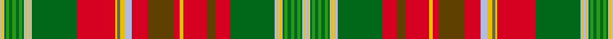

This is one **variant** — a specific cloth: this exact thread count and colourway, with its own
provenance below. It is one weaving of the [sett](/setts/lb1ly1lb1dg1g2dg2g2dg2g2dg1lb1ly1lb1ly1lb1dg28r24ly1n2ly3lb4r10dy16r4ly2r15dy5r9dg28lb1ly1lb1ly1lb1dg1g2dg2g2dg2g2dg1lb1ly1lb1/) (the scale-free proportion — the
same cloth at any scale or shade), whose colour order is pattern [WYWGGGGGGGWYWYWGRGRYRGRWYBYRGWYWYWGGGGGGGWYW](/stripes/wywgggggggwywywgrgryrgrwybyrgwywywgggggggwyw/).

Part of the [New Brunswick](/tartans/new-brunswick-3/) tartan — the named design grouping this sett with its other cloths.

Sourced from register-of-tartans.  It is a [44 stripe tartan](/stripes/stripes44/).

Original link [https://www.tartanregister.gov.uk/tartanDetails.aspx?ref=3110](https://www.tartanregister.gov.uk/tartanDetails.aspx?ref=3110)

2 attestations — the source records this cloth was collapsed from (oldest owns this page)

<ul>
<li>01/01/1959 — New Brunswick (register-of-tartans, <a href="https://www.tartanregister.gov.uk/tartanDetails.aspx?ref=3110">record</a>)  <em>This threadcount was taken from a woven sample held by the Scottish Tartans Authority, which differs from the threadcount recorded in the Lyon Court Books. Named in honour of King George III, who was from the House of Brunswick, this Atlantic seaboard province acquired its own official tartan in 1959. Designed Loomcrofters, Gagetown, the colours are forest green for the lumbering; meadow green for agriculture; blue for the coastal and inland waters and an interweaving of gold, symbol of the province's potential wealth. The red blocks signify the loyalty and devotion of the early loyalist settlers and the New Brunswick Regiment. The brown band possibly commemorates the 'beaver' from Lord Beaverbrook, the press baron who commissioned the first weaving. Although not born there, he published his first newspaper in the Province at the age of 13 and always regarded it as home.</em></li>
<li>Apr. 1959 — New Brunswick (District) (tartans-authority, <a href="https://www.tartanregister.gov.uk/tartanDetails.aspx?ref=1880">record</a>)  <em>Asymmetric. This IS the correct version of this tartan - regardless of any other threadcounts or samples that may be quoted. The thread count has been checked against the original application dated April 1959. Registered to Patricia Jenkins of Loomcrofters on 27th April 1959.The complicated threadcount of this tartan has brought about various erroneous records (including that of the Tartans Society) but this graphic matches the woven sample in the STA Collection AND the new threadcount in the errata slip in 'District Tartans' by Teal/Smith. Named in honour of King George III who was from the House of Brunswick, this Atlantic seaboard province acquired its own official tartan in 1959. The design came from the Loomcrofters company in Gagetown - a pretty village on the Saint John River. The colours are forest green for the lumbering; meadow green for agriculture; blue for the coastal and inland waters and an interweaving of gold, symbol of the province's potential wealth. The red blocks signify the loyalty and devotion of the early Loyalist settlers and the New Brunswick Regiment. Another observer adds that the brown band commemorates the 'beaver' from Lord Beaverbrook the press baron who commissioned the first weaving. Although not born there, he published his first newspaper in the Province at the age of 13 and always regarded it as home. The tartan was entered in the Lord Lyon's books but in such a complicated form as to be incomprehensible. The verbal description given in the CIDD reads as follows: "the first block having four outer corners coloured forest green, four squares of shepherd's check in the centre of the block woven of meadow green and forest green, and being separated from each other and from the forest green in the outer corners of the first block by three stripes each woven of azure blue and gold.; the second block having a red background with stripes of brown, azure blue, gold and grey; "</em></li>
</ul>

Dataset <small>— provenance for this record, inherited from the source manifest</small>

<dl class="dataset-prov">
<dt>source</dt><dd><a href="/sources/register-of-tartans/">Scottish Register of Tartans</a></dd>
<dt>data captured from</dt><dd><a href="https://github.com/thetartan/tartan-database/blob/master/data/register-of-tartans/data.csv">https://github.com/thetartan/tartan-database/blob/master/data/register-of-tartans/data.csv</a></dd>
<dt>data date</dt><dd>1959 <small>(this record)</small></dd>
<dt>licence</dt><dd><a href="https://www.tartanregister.gov.uk/copyright">Crown copyright</a></dd>
</dl>

Capture chain <small>— the hands this data passed through, oldest first; each capture carries its own licence</small>

<ol class="capture-chain">
<li><a href="https://www.tartanregister.gov.uk/">Scottish Register of Tartans</a> · <a href="https://www.tartanregister.gov.uk/copyright">Crown copyright</a> <small>the living register — still published by National Records of Scotland</small></li>
<li><a href="https://github.com/thetartan/tartan-database">thetartan/tartan-database</a> <small>2016-2017</small> · <a href="https://creativecommons.org/licenses/by-nc-nd/4.0/">CC BY-NC-ND 4.0</a> <small>Levko Kravets's frozen compilation — the capture we vendored, and where its CC licence text came from</small></li>
<li>this dictionary <small>captured 2026-06-10 · commit 5bf86c7566</small> <small>each re-capture is a git commit to data/sources</small></li>
</ol>

## Register references

External register numbers recorded for this tartan.

- Scottish Register of Tartans: [3110](https://www.tartanregister.gov.uk/tartanDetails.aspx?ref=3110)
- Scottish Tartans Authority (ITI): 1880
- Scottish Tartans World Register: 1880

## Thread count
LB/2 LY2 LB2 DG2 G4 DG4 G4 DG4 G4 DG2 LB2 LY2 LB2 LY2 LB2 DG56 R48 LY2 N4 LY6 LB8 R20 DY32 R8 LY4 R30 DY10 R18 DG56 LB2 LY2 LB2 LY2 LB2 DG2 G4 DG4 G4 DG4 G4 DG2 LB2 LY2 LB/2

One full sett is **760 threads**.

## Palette
<table><thead><tr><th>Colour</th><th>Shade</th><th>OKLCh</th></tr></thead><tbody><tr><td>LB</td><td><code style="background-color:#B5BBDE;">#B5BBDE</code> <small style="color:#888">#B5BBDE</small></td><td><small style="color:#888">oklch(79.9% 0.050 277.6)</small></td></tr><tr><td>DG</td><td><code style="background-color:#006818;">#006818</code> <small style="color:#888">#006818</small></td><td><small style="color:#888">oklch(45.0% 0.142 145.0)</small></td></tr><tr><td>G</td><td><code style="background-color:#289C18;">#289C18</code> <small style="color:#888">#289C18</small></td><td><small style="color:#888">oklch(60.6% 0.191 141.6)</small></td></tr><tr><td>N</td><td><code style="background-color:#636363;">#636363</code> <small style="color:#888">#636363</small></td><td><small style="color:#888">oklch(50.0% 0.000 89.9)</small></td></tr><tr><td>R</td><td><code style="background-color:#D60020;">#D60020</code> <small style="color:#888">#D60020</small></td><td><small style="color:#888">oklch(55.2% 0.224 25.5)</small></td></tr><tr><td>DY</td><td><code style="background-color:#604000;">#604000</code> <small style="color:#888">#604000</small></td><td><small style="color:#888">oklch(39.8% 0.083 76.8)</small></td></tr><tr><td>LY</td><td><code style="background-color:#E8C000;">#E8C000</code> <small style="color:#888">#E8C000</small></td><td><small style="color:#888">oklch(81.9% 0.168 93.7)</small></td></tr></tbody></table>

# Sample pattern

## Nearest tartan variants

The nearest existing variants by ΔTartan distance, with this cloth at the top so the swatches line up against it.

ΔTartan

Threads

Variant

Sett

—

760

<a href="/variants/s44/lb1ly1lb1dg1g2dg2g2dg2g2dg1lb1ly1lb1ly1lb1dg28r24ly1n2ly3lb4r10dy16r4ly2r15dy5r9dg28lb1ly1lb1ly1lb1dg1g2dg2g2dg2g2dg1lb1ly1lb1~x2~ly3307090-dg1806142-g2408144-dy1603076/">New Brunswick</a>

<a href="/ttd/edit/#slug=y2lb2dg1g2dg2g2dg2g2dg2lb2y2lb2dg28r24y1n2y3lb4r10dy16r4y2r14dy5r10dg28lb2y2lb2dg1g2dg2g2dg2g2dg1lb2y2~dg1806142-g2408144&amp;base=lb1ly1lb1dg1g2dg2g2dg2g2dg1lb1ly1lb1ly1lb1dg28r24ly1n2ly3lb4r10dy16r4ly2r15dy5r9dg28lb1ly1lb1ly1lb1dg1g2dg2g2dg2g2dg1lb1ly1lb1~x2~ly3307090-dg1806142-g2408144-dy1603076" title="compare in the TTD">1.22</a>

388

<a href="/variants/s38/y2lb2dg1g2dg2g2dg2g2dg2lb2y2lb2dg28r24y1n2y3lb4r10dy16r4y2r14dy5r10dg28lb2y2lb2dg1g2dg2g2dg2g2dg1lb2y2~dg1806142-g2408144/">New Brunswick variation Canadian Tartan</a>

<a href="/ttd/edit/#slug=y2lb2g1b2g2b2g2b2g2lb2y2lb2g28r24y1n2y3lb4r10o16r4y2r14o5r10g28lb2y2lb2g1b2g2b2g2b2g1lb2y2&amp;base=lb1ly1lb1dg1g2dg2g2dg2g2dg1lb1ly1lb1ly1lb1dg28r24ly1n2ly3lb4r10dy16r4ly2r15dy5r9dg28lb1ly1lb1ly1lb1dg1g2dg2g2dg2g2dg1lb1ly1lb1~x2~ly3307090-dg1806142-g2408144-dy1603076" title="compare in the TTD">2.05</a>

388

<a href="/variants/s38/y2lb2g1b2g2b2g2b2g2lb2y2lb2g28r24y1n2y3lb4r10o16r4y2r14o5r10g28lb2y2lb2g1b2g2b2g2b2g1lb2y2/">New Brunswick, variation</a>

<a href="/ttd/edit/#slug=lb1y1lb1dg1g2dg2g2dg2g2dg1lb1y1lb1y1lb1dg28r24y1n2y3lb4r10dy16r4y2r15dy5r9dg28lb1y1lb1y1lb1dg1g2dg2g2dg2g2dg1lb1y1lb1~x2&amp;base=lb1ly1lb1dg1g2dg2g2dg2g2dg1lb1ly1lb1ly1lb1dg28r24ly1n2ly3lb4r10dy16r4ly2r15dy5r9dg28lb1ly1lb1ly1lb1dg1g2dg2g2dg2g2dg1lb1ly1lb1~x2~ly3307090-dg1806142-g2408144-dy1603076" title="compare in the TTD">2.32</a>

760

<a href="/variants/s44/lb1y1lb1dg1g2dg2g2dg2g2dg1lb1y1lb1y1lb1dg28r24y1n2y3lb4r10dy16r4y2r15dy5r9dg28lb1y1lb1y1lb1dg1g2dg2g2dg2g2dg1lb1y1lb1~x2/">New Brunswick (Lyon Court Books)</a>

<a href="/ttd/edit/#slug=lb1y1lb1dg1g2dg2g2dg2g2dg1lb1y1lb1y1lb1dg18r16y1n2y3lb4r8dr9r3y2r9dr5r6dg18lb1y1lb1y1lb1dg1g2dg2g2dg2g2dg1lb1y1lb1~x2&amp;base=lb1ly1lb1dg1g2dg2g2dg2g2dg1lb1ly1lb1ly1lb1dg28r24ly1n2ly3lb4r10dy16r4ly2r15dy5r9dg28lb1ly1lb1ly1lb1dg1g2dg2g2dg2g2dg1lb1ly1lb1~x2~ly3307090-dg1806142-g2408144-dy1603076" title="compare in the TTD">2.70</a>

572

<a href="/variants/s44/lb1y1lb1dg1g2dg2g2dg2g2dg1lb1y1lb1y1lb1dg18r16y1n2y3lb4r8dr9r3y2r9dr5r6dg18lb1y1lb1y1lb1dg1g2dg2g2dg2g2dg1lb1y1lb1~x2/">New Brunswick or Beaverbrook District Tartan</a>

<a href="/ttd/edit/#slug=lb1y1lb1dg1b2dg2b2dg2b2dg1lb1y1lb1y1lb1dg18r16y1n2y3lb4r8o9r3y2r9o5r6dg18lb1y1lb1y1lb1dg1b2dg2b2dg2b2dg1lb1y1lb1~x2&amp;base=lb1ly1lb1dg1g2dg2g2dg2g2dg1lb1ly1lb1ly1lb1dg28r24ly1n2ly3lb4r10dy16r4ly2r15dy5r9dg28lb1ly1lb1ly1lb1dg1g2dg2g2dg2g2dg1lb1ly1lb1~x2~ly3307090-dg1806142-g2408144-dy1603076" title="compare in the TTD">3.00</a>

572

<a href="/variants/s44/lb1y1lb1dg1b2dg2b2dg2b2dg1lb1y1lb1y1lb1dg18r16y1n2y3lb4r8o9r3y2r9o5r6dg18lb1y1lb1y1lb1dg1b2dg2b2dg2b2dg1lb1y1lb1~x2/">New Brunswick, or Beaverbrook</a>

<a href="/ttd/edit/#slug=o99g6o8g4o10dy34r2dy6r4dy4r6dy2r7w3r7dy2r6dy4r4dy6r2dy34lb36dy6lb18~g2408144&amp;base=lb1ly1lb1dg1g2dg2g2dg2g2dg1lb1ly1lb1ly1lb1dg28r24ly1n2ly3lb4r10dy16r4ly2r15dy5r9dg28lb1ly1lb1ly1lb1dg1g2dg2g2dg2g2dg1lb1ly1lb1~x2~ly3307090-dg1806142-g2408144-dy1603076" title="compare in the TTD">3.28</a>

523

<a href="/variants/s25/o99g6o8g4o10dy34r2dy6r4dy4r6dy2r7w3r7dy2r6dy4r4dy6r2dy34lb36dy6lb18~g2408144/">Unidentified Cant #11</a>

3.61

—

<a href="/variants/s81/g2dg2g2dg1lb1y1lb1y1lb1dg18r6o5r9y2r3o9r8lb4y3n2y1r16dg18lb1y1lb1y1lb1dg1g2dg2g2dg2g2dg1lb1y1lb1y1lb1dg1g2dg2g2dg2g2dg1lb1y1lb1y1lb1dg18r16y1n2y3lb4r8o9r3y2r9o5r6dg18lb1y1lb1y1lb1dg1g2dg2g2dg2g2dg1lb1-hd274d753e4425850/">Beaverbrook (District)</a>

<a href="/ttd/edit/#slug=y1ly1y1ly1r4y1ly1y1ly1y1ly1y1ly1y1ly1y1ly1y1ly1y1ly1y1ly1y1ly1y1ly1y1ly1y1ly1do28g28db4g28do28y1ly1y1ly1y1ly1y1ly1w4y1ly1y1ly1w4y1ly1y1ly1y1ly1y1ly1y1ly1y1ly1y1ly1y1ly1y1~x2&amp;base=lb1ly1lb1dg1g2dg2g2dg2g2dg1lb1ly1lb1ly1lb1dg28r24ly1n2ly3lb4r10dy16r4ly2r15dy5r9dg28lb1ly1lb1ly1lb1dg1g2dg2g2dg2g2dg1lb1ly1lb1~x2~ly3307090-dg1806142-g2408144-dy1603076" title="compare in the TTD">3.74</a>

744

<a href="/variants/s67/y1ly1y1ly1r4y1ly1y1ly1y1ly1y1ly1y1ly1y1ly1y1ly1y1ly1y1ly1y1ly1y1ly1y1ly1y1ly1do28g28db4g28do28y1ly1y1ly1y1ly1y1ly1w4y1ly1y1ly1w4y1ly1y1ly1y1ly1y1ly1y1ly1y1ly1y1ly1y1ly1y1~x2/">Hash House Harriers Trail (Corp)</a>

## Neighbour map

Every grey dot is one of 13621 variants placed by the first two principal components of the ΔTartan feature space (42% of its variance). Red is this tartan; blue dots are its nearest — click one to open its page.

<svg viewBox="0 0 640 380" role="img" style="max-width:100%;height:auto;border:1px solid #e0e0e0;border-radius:4px;display:block" xmlns="http://www.w3.org/2000/svg"><image href="/nn/cloud.v1.png" width="640" height="380"/><a href="/variants/s38/y2lb2dg1g2dg2g2dg2g2dg2lb2y2lb2dg28r24y1n2y3lb4r10dy16r4y2r14dy5r10dg28lb2y2lb2dg1g2dg2g2dg2g2dg1lb2y2~dg1806142-g2408144/"><circle cx="185.2" cy="40.0" r="4" fill="#3465a4"><title>New Brunswick variation Canadian Tartan</title></circle></a><a href="/variants/s38/y2lb2g1b2g2b2g2b2g2lb2y2lb2g28r24y1n2y3lb4r10o16r4y2r14o5r10g28lb2y2lb2g1b2g2b2g2b2g1lb2y2/"><circle cx="200.0" cy="44.1" r="4" fill="#3465a4"><title>New Brunswick, variation</title></circle></a><a href="/variants/s44/lb1y1lb1dg1g2dg2g2dg2g2dg1lb1y1lb1y1lb1dg28r24y1n2y3lb4r10dy16r4y2r15dy5r9dg28lb1y1lb1y1lb1dg1g2dg2g2dg2g2dg1lb1y1lb1~x2/"><circle cx="180.7" cy="17.3" r="4" fill="#3465a4"><title>New Brunswick (Lyon Court Books)</title></circle></a><a href="/variants/s44/lb1y1lb1dg1g2dg2g2dg2g2dg1lb1y1lb1y1lb1dg18r16y1n2y3lb4r8dr9r3y2r9dr5r6dg18lb1y1lb1y1lb1dg1g2dg2g2dg2g2dg1lb1y1lb1~x2/"><circle cx="136.1" cy="46.2" r="4" fill="#3465a4"><title>New Brunswick or Beaverbrook District Tartan</title></circle></a><a href="/variants/s44/lb1y1lb1dg1b2dg2b2dg2b2dg1lb1y1lb1y1lb1dg18r16y1n2y3lb4r8o9r3y2r9o5r6dg18lb1y1lb1y1lb1dg1b2dg2b2dg2b2dg1lb1y1lb1~x2/"><circle cx="137.4" cy="44.8" r="4" fill="#3465a4"><title>New Brunswick, or Beaverbrook</title></circle></a><a href="/variants/s25/o99g6o8g4o10dy34r2dy6r4dy4r6dy2r7w3r7dy2r6dy4r4dy6r2dy34lb36dy6lb18~g2408144/"><circle cx="210.2" cy="14.0" r="4" fill="#3465a4"><title>Unidentified Cant #11</title></circle></a><a href="/variants/s81/g2dg2g2dg1lb1y1lb1y1lb1dg18r6o5r9y2r3o9r8lb4y3n2y1r16dg18lb1y1lb1y1lb1dg1g2dg2g2dg2g2dg1lb1y1lb1y1lb1dg1g2dg2g2dg2g2dg1lb1y1lb1y1lb1dg18r16y1n2y3lb4r8o9r3y2r9o5r6dg18lb1y1lb1y1lb1dg1g2dg2g2dg2g2dg1lb1-hd274d753e4425850/"><circle cx="125.8" cy="24.3" r="4" fill="#3465a4"><title>Beaverbrook (District)</title></circle></a><a href="/variants/s67/y1ly1y1ly1r4y1ly1y1ly1y1ly1y1ly1y1ly1y1ly1y1ly1y1ly1y1ly1y1ly1y1ly1y1ly1y1ly1do28g28db4g28do28y1ly1y1ly1y1ly1y1ly1w4y1ly1y1ly1w4y1ly1y1ly1y1ly1y1ly1y1ly1y1ly1y1ly1y1ly1y1~x2/"><circle cx="150.9" cy="14.0" r="4" fill="#3465a4"><title>Hash House Harriers Trail (Corp)</title></circle></a><circle cx="187.7" cy="22.6" r="5" fill="#c00000"/><text x="320" y="376" text-anchor="middle" font-size="11" fill="#999">ground</text><text x="11" y="190" text-anchor="middle" font-size="11" fill="#999" transform="rotate(-90 11 190)">complexity</text></svg>

ID: /variants/s44/lb1ly1lb1dg1g2dg2g2dg2g2dg1lb1ly1lb1ly1lb1dg28r24ly1n2ly3lb4r10dy16r4ly2r15dy5r9dg28lb1ly1lb1ly1lb1dg1g2dg2g2dg2g2dg1lb1ly1lb1~x2~ly3307090-dg1806142-g2408144-dy1603076/
