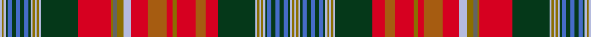

This page is one **sett** — a single exact thread-count. It belongs to the [tartan](/setts/lb1y1lb1dg1b2dg2b2dg2b2dg1lb1y1lb1y1lb1dg18r16y1n2y3lb4r8o9r3y2r9o5r6dg18lb1y1lb1y1lb1dg1b2dg2b2dg2b2dg1lb1y1lb1/)
(the same proportion at any scale), whose colour order is pattern [WGWGBGBGBGWGWGWGRGBGWRRRGRRRGWGWGWGBGBGBGWGW](/stripes/wgwgbgbgbgwgwgwgrgbgwrrrgrrrgwgwgwgbgbgbgwgw/).

Sourced from weddslist.  It is a [44 stripe tartan](/stripes/stripes44/).

Original link http://www.weddslist.com/cgi-bin/tartans/pg.pl?source=sts

## Thread count
LB/2 Y2 LB2 DG2 B4 DG4 B4 DG4 B4 DG2 LB2 Y2 LB2 Y2 LB2 DG36 R32 Y2 N4 Y6 LB8 R16 O18 R6 Y4 R18 O10 R12 DG36 LB2 Y2 LB2 Y2 LB2 DG2 B4 DG4 B4 DG4 B4 DG2 LB2 Y2 LB/2

One full sett is **572 threads**.

## Palette
<table><thead><tr><th>Colour</th><th>Shade</th><th>OKLCh</th></tr></thead><tbody><tr><td>LB</td><td><code style="background-color:#B5BBDE;">#B5BBDE</code> <small style="color:#888">#B5BBDE</small></td><td><small style="color:#888">oklch(79.9% 0.050 277.6)</small></td></tr><tr><td>DG</td><td><code style="background-color:#053819;">#053819</code> <small style="color:#888">#053819</small></td><td><small style="color:#888">oklch(30.0% 0.075 151.3)</small></td></tr><tr><td>B</td><td><code style="background-color:#466CC8;">#466CC8</code> <small style="color:#888">#466CC8</small></td><td><small style="color:#888">oklch(55.1% 0.149 265.0)</small></td></tr><tr><td>N</td><td><code style="background-color:#636363;">#636363</code> <small style="color:#888">#636363</small></td><td><small style="color:#888">oklch(50.0% 0.000 89.9)</small></td></tr><tr><td>R</td><td><code style="background-color:#D60020;">#D60020</code> <small style="color:#888">#D60020</small></td><td><small style="color:#888">oklch(55.2% 0.224 25.5)</small></td></tr><tr><td>O</td><td><code style="background-color:#A65C11;">#A65C11</code> <small style="color:#888">#A65C11</small></td><td><small style="color:#888">oklch(55.0% 0.125 58.3)</small></td></tr><tr><td>Y</td><td><code style="background-color:#8B6E00;">#8B6E00</code> <small style="color:#888">#8B6E00</small></td><td><small style="color:#888">oklch(55.1% 0.113 90.4)</small></td></tr></tbody></table>

# Sample pattern

## Nearest tartan variants

The nearest existing variants by ΔTartan distance, with this cloth at the top so the swatches line up against it.

ΔTartan

Threads

Variant

Sett

—

572

<a href="/variants/s44/lb1y1lb1dg1b2dg2b2dg2b2dg1lb1y1lb1y1lb1dg18r16y1n2y3lb4r8o9r3y2r9o5r6dg18lb1y1lb1y1lb1dg1b2dg2b2dg2b2dg1lb1y1lb1~x2/">New Brunswick, or Beaverbrook</a>

<a href="/ttd/edit/#slug=lb1y1lb1dg1g2dg2g2dg2g2dg1lb1y1lb1y1lb1dg18r16y1n2y3lb4r8dr9r3y2r9dr5r6dg18lb1y1lb1y1lb1dg1g2dg2g2dg2g2dg1lb1y1lb1~x2&amp;base=lb1y1lb1dg1b2dg2b2dg2b2dg1lb1y1lb1y1lb1dg18r16y1n2y3lb4r8o9r3y2r9o5r6dg18lb1y1lb1y1lb1dg1b2dg2b2dg2b2dg1lb1y1lb1~x2" title="compare in the TTD">1.00</a>

572

<a href="/variants/s44/lb1y1lb1dg1g2dg2g2dg2g2dg1lb1y1lb1y1lb1dg18r16y1n2y3lb4r8dr9r3y2r9dr5r6dg18lb1y1lb1y1lb1dg1g2dg2g2dg2g2dg1lb1y1lb1~x2/">New Brunswick or Beaverbrook District Tartan</a>

<a href="/ttd/edit/#slug=y2lb2g1b2g2b2g2b2g2lb2y2lb2g28r24y1n2y3lb4r10o16r4y2r14o5r10g28lb2y2lb2g1b2g2b2g2b2g1lb2y2&amp;base=lb1y1lb1dg1b2dg2b2dg2b2dg1lb1y1lb1y1lb1dg18r16y1n2y3lb4r8o9r3y2r9o5r6dg18lb1y1lb1y1lb1dg1b2dg2b2dg2b2dg1lb1y1lb1~x2" title="compare in the TTD">2.18</a>

388

<a href="/variants/s38/y2lb2g1b2g2b2g2b2g2lb2y2lb2g28r24y1n2y3lb4r10o16r4y2r14o5r10g28lb2y2lb2g1b2g2b2g2b2g1lb2y2/">New Brunswick, variation</a>

<a href="/ttd/edit/#slug=lb1y1lb1dg1g2dg2g2dg2g2dg1lb1y1lb1y1lb1dg28r24y1n2y3lb4r10dy16r4y2r15dy5r9dg28lb1y1lb1y1lb1dg1g2dg2g2dg2g2dg1lb1y1lb1~x2&amp;base=lb1y1lb1dg1b2dg2b2dg2b2dg1lb1y1lb1y1lb1dg18r16y1n2y3lb4r8o9r3y2r9o5r6dg18lb1y1lb1y1lb1dg1b2dg2b2dg2b2dg1lb1y1lb1~x2" title="compare in the TTD">2.20</a>

760

<a href="/variants/s44/lb1y1lb1dg1g2dg2g2dg2g2dg1lb1y1lb1y1lb1dg28r24y1n2y3lb4r10dy16r4y2r15dy5r9dg28lb1y1lb1y1lb1dg1g2dg2g2dg2g2dg1lb1y1lb1~x2/">New Brunswick (Lyon Court Books)</a>

<a href="/ttd/edit/#slug=y2lb2dg1g2dg2g2dg2g2dg2lb2y2lb2dg28r24y1n2y3lb4r10dy16r4y2r14dy5r10dg28lb2y2lb2dg1g2dg2g2dg2g2dg1lb2y2~dg1806142-g2408144&amp;base=lb1y1lb1dg1b2dg2b2dg2b2dg1lb1y1lb1y1lb1dg18r16y1n2y3lb4r8o9r3y2r9o5r6dg18lb1y1lb1y1lb1dg1b2dg2b2dg2b2dg1lb1y1lb1~x2" title="compare in the TTD">2.70</a>

388

<a href="/variants/s38/y2lb2dg1g2dg2g2dg2g2dg2lb2y2lb2dg28r24y1n2y3lb4r10dy16r4y2r14dy5r10dg28lb2y2lb2dg1g2dg2g2dg2g2dg1lb2y2~dg1806142-g2408144/">New Brunswick variation Canadian Tartan</a>

2.84

—

<a href="/variants/s81/g2dg2g2dg1lb1y1lb1y1lb1dg18r6o5r9y2r3o9r8lb4y3n2y1r16dg18lb1y1lb1y1lb1dg1g2dg2g2dg2g2dg1lb1y1lb1y1lb1dg1g2dg2g2dg2g2dg1lb1y1lb1y1lb1dg18r16y1n2y3lb4r8o9r3y2r9o5r6dg18lb1y1lb1y1lb1dg1g2dg2g2dg2g2dg1lb1-hd274d753e4425850/">Beaverbrook (District)</a>

<a href="/ttd/edit/#slug=lb1ly1lb1dg1g2dg2g2dg2g2dg1lb1ly1lb1ly1lb1dg28r24ly1n2ly3lb4r10dy16r4ly2r15dy5r9dg28lb1ly1lb1ly1lb1dg1g2dg2g2dg2g2dg1lb1ly1lb1~x2~ly3307090-dg1806142-g2408144-dy1603076&amp;base=lb1y1lb1dg1b2dg2b2dg2b2dg1lb1y1lb1y1lb1dg18r16y1n2y3lb4r8o9r3y2r9o5r6dg18lb1y1lb1y1lb1dg1b2dg2b2dg2b2dg1lb1y1lb1~x2" title="compare in the TTD">3.01</a>

760

<a href="/variants/s44/lb1ly1lb1dg1g2dg2g2dg2g2dg1lb1ly1lb1ly1lb1dg28r24ly1n2ly3lb4r10dy16r4ly2r15dy5r9dg28lb1ly1lb1ly1lb1dg1g2dg2g2dg2g2dg1lb1ly1lb1~x2~ly3307090-dg1806142-g2408144-dy1603076/">New Brunswick</a>

<a href="/ttd/edit/#slug=r44o4db16r4o6db8o6r6db2r4db2r4db2r6w1g24lb6w1&amp;base=lb1y1lb1dg1b2dg2b2dg2b2dg1lb1y1lb1y1lb1dg18r16y1n2y3lb4r8o9r3y2r9o5r6dg18lb1y1lb1y1lb1dg1b2dg2b2dg2b2dg1lb1y1lb1~x2" title="compare in the TTD">3.89</a>

247

<a href="/variants/s18/r44o4db16r4o6db8o6r6db2r4db2r4db2r6w1g24lb6w1/">Unidentified Cant #13</a>

3.95

—

<a href="/variants/s66/r8lb2k15lb2t5lb2dg20g2dg4g2dg20g3ly3r2lb2r2ly3g3dg20lb2r32lb2dg20lb2t5lb2g4k15lb2t20lb2r8lb2r8lb2t20lb2k15g4lb2t5lb2dg20lb2r32lb2dg20g3ly3r2lb2r2ly3g3dg20g2dg4g2dg20lb2t5lb2k15lb2r8lb2~lb3200000-t2503-hc89951fb8ca95beb/">Hunter</a>

<a href="/ttd/edit/#slug=lb1b4dg2r2g27r4g2r4dp10b3dg2r2dg2b3g10r10g10r2dp2r26b3dg2r3lb1~x2&amp;base=lb1y1lb1dg1b2dg2b2dg2b2dg1lb1y1lb1y1lb1dg18r16y1n2y3lb4r8o9r3y2r9o5r6dg18lb1y1lb1y1lb1dg1b2dg2b2dg2b2dg1lb1y1lb1~x2" title="compare in the TTD">3.97</a>

544

<a href="/variants/s24/lb1b4dg2r2g27r4g2r4dp10b3dg2r2dg2b3g10r10g10r2dp2r26b3dg2r3lb1~x2/">MacDougal 1</a>

<a href="/ttd/edit/#slug=o99g6o8g4o10dy34r2dy6r4dy4r6dy2r7w3r7dy2r6dy4r4dy6r2dy34lb36dy6lb18~g2408144&amp;base=lb1y1lb1dg1b2dg2b2dg2b2dg1lb1y1lb1y1lb1dg18r16y1n2y3lb4r8o9r3y2r9o5r6dg18lb1y1lb1y1lb1dg1b2dg2b2dg2b2dg1lb1y1lb1~x2" title="compare in the TTD">3.99</a>

523

<a href="/variants/s25/o99g6o8g4o10dy34r2dy6r4dy4r6dy2r7w3r7dy2r6dy4r4dy6r2dy34lb36dy6lb18~g2408144/">Unidentified Cant #11</a>

## Neighbour map

Every grey dot is one of 13620 variants placed by the first two principal components of the ΔTartan feature space (42% of its variance). Red is this tartan; blue dots are its nearest — click one to open its page.

<svg viewBox="0 0 640 380" role="img" style="max-width:100%;height:auto;border:1px solid #e0e0e0;border-radius:4px;display:block" xmlns="http://www.w3.org/2000/svg"><image href="/nn/cloud.v1.png" width="640" height="380"/><a href="/variants/s44/lb1y1lb1dg1g2dg2g2dg2g2dg1lb1y1lb1y1lb1dg18r16y1n2y3lb4r8dr9r3y2r9dr5r6dg18lb1y1lb1y1lb1dg1g2dg2g2dg2g2dg1lb1y1lb1~x2/"><circle cx="136.3" cy="46.5" r="4" fill="#3465a4"><title>New Brunswick or Beaverbrook District Tartan</title></circle></a><a href="/variants/s38/y2lb2g1b2g2b2g2b2g2lb2y2lb2g28r24y1n2y3lb4r10o16r4y2r14o5r10g28lb2y2lb2g1b2g2b2g2b2g1lb2y2/"><circle cx="200.2" cy="44.6" r="4" fill="#3465a4"><title>New Brunswick, variation</title></circle></a><a href="/variants/s44/lb1y1lb1dg1g2dg2g2dg2g2dg1lb1y1lb1y1lb1dg28r24y1n2y3lb4r10dy16r4y2r15dy5r9dg28lb1y1lb1y1lb1dg1g2dg2g2dg2g2dg1lb1y1lb1~x2/"><circle cx="180.9" cy="17.8" r="4" fill="#3465a4"><title>New Brunswick (Lyon Court Books)</title></circle></a><a href="/variants/s38/y2lb2dg1g2dg2g2dg2g2dg2lb2y2lb2dg28r24y1n2y3lb4r10dy16r4y2r14dy5r10dg28lb2y2lb2dg1g2dg2g2dg2g2dg1lb2y2~dg1806142-g2408144/"><circle cx="185.4" cy="40.4" r="4" fill="#3465a4"><title>New Brunswick variation Canadian Tartan</title></circle></a><a href="/variants/s81/g2dg2g2dg1lb1y1lb1y1lb1dg18r6o5r9y2r3o9r8lb4y3n2y1r16dg18lb1y1lb1y1lb1dg1g2dg2g2dg2g2dg1lb1y1lb1y1lb1dg1g2dg2g2dg2g2dg1lb1y1lb1y1lb1dg18r16y1n2y3lb4r8o9r3y2r9o5r6dg18lb1y1lb1y1lb1dg1g2dg2g2dg2g2dg1lb1-hd274d753e4425850/"><circle cx="126.0" cy="24.8" r="4" fill="#3465a4"><title>Beaverbrook (District)</title></circle></a><a href="/variants/s44/lb1ly1lb1dg1g2dg2g2dg2g2dg1lb1ly1lb1ly1lb1dg28r24ly1n2ly3lb4r10dy16r4ly2r15dy5r9dg28lb1ly1lb1ly1lb1dg1g2dg2g2dg2g2dg1lb1ly1lb1~x2~ly3307090-dg1806142-g2408144-dy1603076/"><circle cx="187.9" cy="23.0" r="4" fill="#3465a4"><title>New Brunswick</title></circle></a><a href="/variants/s18/r44o4db16r4o6db8o6r6db2r4db2r4db2r6w1g24lb6w1/"><circle cx="189.8" cy="38.7" r="4" fill="#3465a4"><title>Unidentified Cant #13</title></circle></a><a href="/variants/s66/r8lb2k15lb2t5lb2dg20g2dg4g2dg20g3ly3r2lb2r2ly3g3dg20lb2r32lb2dg20lb2t5lb2g4k15lb2t20lb2r8lb2r8lb2t20lb2k15g4lb2t5lb2dg20lb2r32lb2dg20g3ly3r2lb2r2ly3g3dg20g2dg4g2dg20lb2t5lb2k15lb2r8lb2~lb3200000-t2503-hc89951fb8ca95beb/"><circle cx="65.8" cy="30.8" r="4" fill="#3465a4"><title>Hunter</title></circle></a><a href="/variants/s24/lb1b4dg2r2g27r4g2r4dp10b3dg2r2dg2b3g10r10g10r2dp2r26b3dg2r3lb1~x2/"><circle cx="217.1" cy="74.9" r="4" fill="#3465a4"><title>MacDougal 1</title></circle></a><a href="/variants/s25/o99g6o8g4o10dy34r2dy6r4dy4r6dy2r7w3r7dy2r6dy4r4dy6r2dy34lb36dy6lb18~g2408144/"><circle cx="210.5" cy="14.0" r="4" fill="#3465a4"><title>Unidentified Cant #11</title></circle></a><circle cx="137.6" cy="45.2" r="5" fill="#c00000"/><text x="320" y="376" text-anchor="middle" font-size="11" fill="#999">ground</text><text x="11" y="190" text-anchor="middle" font-size="11" fill="#999" transform="rotate(-90 11 190)">complexity</text></svg>

ID: /variants/s44/lb1y1lb1dg1b2dg2b2dg2b2dg1lb1y1lb1y1lb1dg18r16y1n2y3lb4r8o9r3y2r9o5r6dg18lb1y1lb1y1lb1dg1b2dg2b2dg2b2dg1lb1y1lb1~x2/
