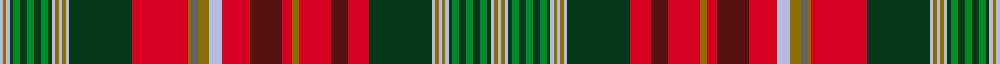

This page is one **sett** — a single exact thread-count. It belongs to the [tartan](/setts/lb1y1lb1dg1g2dg2g2dg2g2dg1lb1y1lb1y1lb1dg18r16y1n2y3lb4r8dr9r3y2r9dr5r6dg18lb1y1lb1y1lb1dg1g2dg2g2dg2g2dg1lb1y1lb1/)
(the same proportion at any scale), whose colour order is pattern [WGWGGGGGGGWGWGWGRBRGRBRWGBGRGWGWGWGGGGGGGWGW](/stripes/wgwgggggggwgwgwgrbrgrbrwgbgrgwgwgwgggggggwgw/).

Sourced from house-of-tartan.  It is a [44 stripe tartan](/stripes/stripes44/).

Original link http://www.house-of-tartan.scotland.net/house/TartanViewjs.asp?colr=Def&tnam=663

## Provenance

Earliest known date: 1959 The entry in the Lyon Court Books reads, "This tartan is assymetrical. The sett reading along the warp from the left may be divided into four equal sections of 190 threads. The first is symetrical, The second is assymetrical, The third is the same as the first, The fourth is the same as the second but in reverse" In reality the pattern is symetrical and has 380 threads in half sett as careful reading of Lord Lyons description reveals. The design was commissioned by Lord Beaverbrook and adopted by the Province.

## Thread count
LB/2 Y2 LB2 DG2 G4 DG4 G4 DG4 G4 DG2 LB2 Y2 LB2 Y2 LB2 DG36 R32 Y2 N4 Y6 LB8 R16 DR18 R6 Y4 R18 DR10 R12 DG36 LB2 Y2 LB2 Y2 LB2 DG2 G4 DG4 G4 DG4 G4 DG2 LB2 Y2 LB/2

One full sett is **572 threads**.

## Palette
<table><thead><tr><th>Colour</th><th>Shade</th><th>OKLCh</th></tr></thead><tbody><tr><td>LB</td><td><code style="background-color:#B5BBDE;">#B5BBDE</code> <small style="color:#888">#B5BBDE</small></td><td><small style="color:#888">oklch(79.9% 0.050 277.6)</small></td></tr><tr><td>DG</td><td><code style="background-color:#053819;">#053819</code> <small style="color:#888">#053819</small></td><td><small style="color:#888">oklch(30.0% 0.075 151.3)</small></td></tr><tr><td>DR</td><td><code style="background-color:#55120C;">#55120C</code> <small style="color:#888">#55120C</small></td><td><small style="color:#888">oklch(30.0% 0.099 29.3)</small></td></tr><tr><td>G</td><td><code style="background-color:#008B2A;">#008B2A</code> <small style="color:#888">#008B2A</small></td><td><small style="color:#888">oklch(55.4% 0.170 145.9)</small></td></tr><tr><td>N</td><td><code style="background-color:#636363;">#636363</code> <small style="color:#888">#636363</small></td><td><small style="color:#888">oklch(50.0% 0.000 89.9)</small></td></tr><tr><td>R</td><td><code style="background-color:#D60020;">#D60020</code> <small style="color:#888">#D60020</small></td><td><small style="color:#888">oklch(55.2% 0.224 25.5)</small></td></tr><tr><td>Y</td><td><code style="background-color:#8B6E00;">#8B6E00</code> <small style="color:#888">#8B6E00</small></td><td><small style="color:#888">oklch(55.1% 0.113 90.4)</small></td></tr></tbody></table>

# Sample pattern

ID: /variants/s44/lb1y1lb1dg1g2dg2g2dg2g2dg1lb1y1lb1y1lb1dg18r16y1n2y3lb4r8dr9r3y2r9dr5r6dg18lb1y1lb1y1lb1dg1g2dg2g2dg2g2dg1lb1y1lb1~x2/
