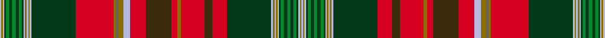
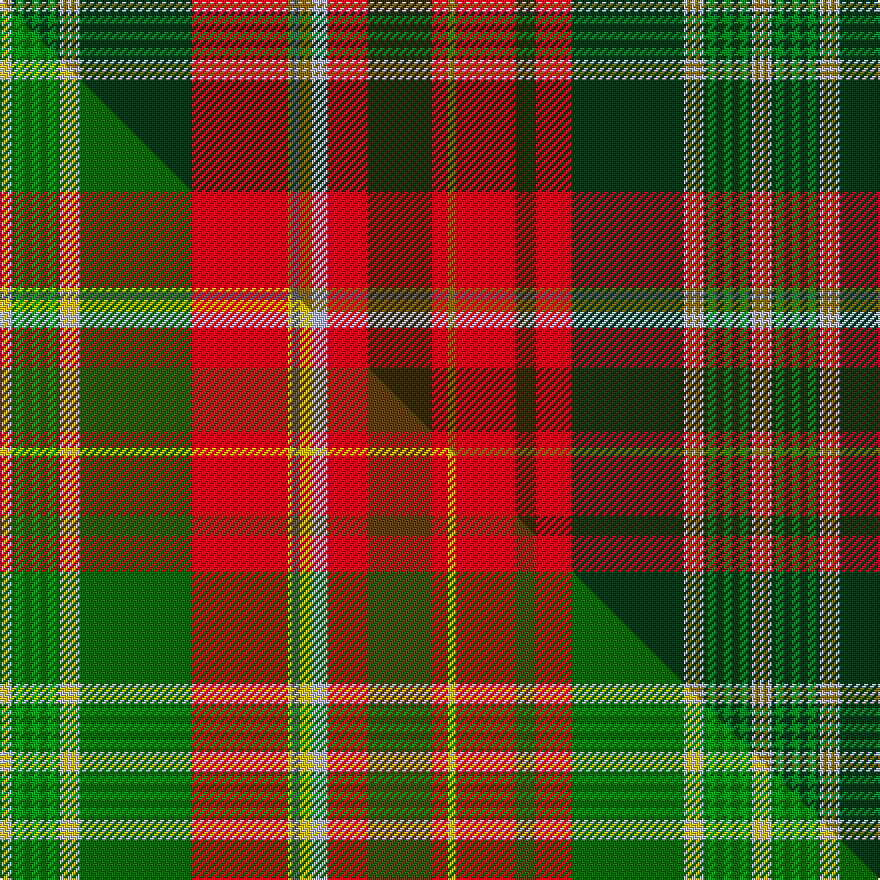

This is one **variant** — a specific cloth: this exact thread count and colourway, with its own
provenance below. It is one weaving of the [sett](/tartans/n/ne/new-brunswick-3/) (the scale-free proportion — the
same cloth at any scale or shade), whose colour order is pattern [WGWGGGGGGGWGWGWGRGBGWRGRGRGRGWGWGWGGGGGGGWGW](/stripes/wgwgggggggwgwgwgrgbgwrgrgrgrgwgwgwgggggggwgw/).

Part of the [New Brunswick](/tartans/n/ne/new-brunswick-3/) tartan — the named design grouping this sett with its other cloths.

Sourced from register-of-tartans.  It is a [44 stripe tartan](/stripes/stripes44/).

Original link [https://www.tartanregister.gov.uk/tartanDetails.aspx?ref=238](https://www.tartanregister.gov.uk/tartanDetails.aspx?ref=238)

Dataset <small>— provenance for this record, inherited from the source manifest</small>

<dl class="dataset-prov">
<dt>source</dt><dd><a href="/sources/register-of-tartans/">Scottish Register of Tartans</a></dd>
<dt>data captured from</dt><dd><a href="https://github.com/thetartan/tartan-database/blob/master/data/register-of-tartans/data.csv">https://github.com/thetartan/tartan-database/blob/master/data/register-of-tartans/data.csv</a></dd>
<dt>data date</dt><dd>1959 <small>(this record)</small></dd>
<dt>licence</dt><dd><a href="https://www.tartanregister.gov.uk/copyright">Crown copyright</a></dd>
</dl>

Capture chain <small>— the hands this data passed through, oldest first; each capture carries its own licence</small>

<ol class="capture-chain">
<li><a href="https://www.tartanregister.gov.uk/">Scottish Register of Tartans</a> · <a href="https://www.tartanregister.gov.uk/copyright">Crown copyright</a> <small>the living register — still published by National Records of Scotland</small></li>
<li><a href="https://github.com/thetartan/tartan-database">thetartan/tartan-database</a> <small>2016-2017</small> · <a href="https://creativecommons.org/licenses/by-nc-nd/4.0/">CC BY-NC-ND 4.0</a> <small>Levko Kravets's frozen compilation — the capture we vendored, and where its CC licence text came from</small></li>
<li>this dictionary <small>captured 2026-06-10 · commit 5bf86c7566</small> <small>each re-capture is a git commit to data/sources</small></li>
</ol>

## Register references

External register numbers recorded for this tartan.

- Scottish Register of Tartans: [238](https://www.tartanregister.gov.uk/tartanDetails.aspx?ref=238)
- Scottish Tartans Authority (ITI): 663
- Scottish Tartans World Register: 663

## Thread count
LB/2 Y2 LB2 DG2 G4 DG4 G4 DG4 G4 DG2 LB2 Y2 LB2 Y2 LB2 DG56 R48 Y2 N4 Y6 LB8 R20 DY32 R8 Y4 R30 DY10 R18 DG56 LB2 Y2 LB2 Y2 LB2 DG2 G4 DG4 G4 DG4 G4 DG2 LB2 Y2 LB/2

One full sett is **760 threads**.

## Palette
<table><thead><tr><th>Colour</th><th>Shade</th><th>OKLCh</th></tr></thead><tbody><tr><td>LB</td><td><code style="background-color:#B5BBDE;">#B5BBDE</code> <small style="color:#888">#B5BBDE</small></td><td><small style="color:#888">oklch(79.9% 0.050 277.6)</small></td></tr><tr><td>DG</td><td><code style="background-color:#053819;">#053819</code> <small style="color:#888">#053819</small></td><td><small style="color:#888">oklch(30.0% 0.075 151.3)</small></td></tr><tr><td>DY</td><td><code style="background-color:#3A2B0D;">#3A2B0D</code> <small style="color:#888">#3A2B0D</small></td><td><small style="color:#888">oklch(30.0% 0.049 82.0)</small></td></tr><tr><td>G</td><td><code style="background-color:#008B2A;">#008B2A</code> <small style="color:#888">#008B2A</small></td><td><small style="color:#888">oklch(55.4% 0.170 145.9)</small></td></tr><tr><td>N</td><td><code style="background-color:#636363;">#636363</code> <small style="color:#888">#636363</small></td><td><small style="color:#888">oklch(50.0% 0.000 89.9)</small></td></tr><tr><td>R</td><td><code style="background-color:#D60020;">#D60020</code> <small style="color:#888">#D60020</small></td><td><small style="color:#888">oklch(55.2% 0.224 25.5)</small></td></tr><tr><td>Y</td><td><code style="background-color:#8B6E00;">#8B6E00</code> <small style="color:#888">#8B6E00</small></td><td><small style="color:#888">oklch(55.1% 0.113 90.4)</small></td></tr></tbody></table>

# Sample pattern

## Compared to the master

This cloth is one sett of its design; the master sett (the exemplar the design is anchored on) is below for comparison.

Its **ΔTartan distance** from the master is **2.36** — the same measure the nearest-tartans table ranks by (0 is identical; a re-scale of the same cloth is near 0, a recolour or a different proportion further).

<figure class="master-compare" style="margin:0">

this sett
master sett ★

<figcaption style="color:#888;font-size:smaller">One weave of this sett against the <a href="/setts/lb1ly1lb1dg1g2dg2g2dg2g2dg1lb1ly1lb1ly1lb1dg28r24ly1n2ly3lb4r10dy16r4ly2r15dy5r9dg28lb1ly1lb1ly1lb1dg1g2dg2g2dg2g2dg1lb1ly1lb1/">master sett ★</a>, split on the diagonal: a shared proportion runs seamlessly across it with only the shades shifting; a different proportion breaks on it.</figcaption>
</figure>

## Nearest tartan variants

The nearest existing variants by ΔTartan distance, with this cloth at the top so the swatches line up against it.

ΔTartan

Threads

Variant

Sett

—

760

<a href="/variants/s44/lb1y1lb1dg1g2dg2g2dg2g2dg1lb1y1lb1y1lb1dg28r24y1n2y3lb4r10dy16r4y2r15dy5r9dg28lb1y1lb1y1lb1dg1g2dg2g2dg2g2dg1lb1y1lb1~x2/">New Brunswick (Lyon Court Books)</a>

<a href="/ttd/edit/#slug=y2lb2dg1g2dg2g2dg2g2dg2lb2y2lb2dg28r24y1n2y3lb4r10dy16r4y2r14dy5r10dg28lb2y2lb2dg1g2dg2g2dg2g2dg1lb2y2~dg1806142-g2408144&amp;base=lb1y1lb1dg1g2dg2g2dg2g2dg1lb1y1lb1y1lb1dg28r24y1n2y3lb4r10dy16r4y2r15dy5r9dg28lb1y1lb1y1lb1dg1g2dg2g2dg2g2dg1lb1y1lb1~x2" title="compare in the TTD">1.90</a>

388

<a href="/variants/s38/y2lb2dg1g2dg2g2dg2g2dg2lb2y2lb2dg28r24y1n2y3lb4r10dy16r4y2r14dy5r10dg28lb2y2lb2dg1g2dg2g2dg2g2dg1lb2y2~dg1806142-g2408144/">New Brunswick variation Canadian Tartan</a>

<a href="/ttd/edit/#slug=lb1y1lb1dg1g2dg2g2dg2g2dg1lb1y1lb1y1lb1dg18r16y1n2y3lb4r8dr9r3y2r9dr5r6dg18lb1y1lb1y1lb1dg1g2dg2g2dg2g2dg1lb1y1lb1~x2&amp;base=lb1y1lb1dg1g2dg2g2dg2g2dg1lb1y1lb1y1lb1dg28r24y1n2y3lb4r10dy16r4y2r15dy5r9dg28lb1y1lb1y1lb1dg1g2dg2g2dg2g2dg1lb1y1lb1~x2" title="compare in the TTD">1.95</a>

572

<a href="/variants/s44/lb1y1lb1dg1g2dg2g2dg2g2dg1lb1y1lb1y1lb1dg18r16y1n2y3lb4r8dr9r3y2r9dr5r6dg18lb1y1lb1y1lb1dg1g2dg2g2dg2g2dg1lb1y1lb1~x2/">New Brunswick or Beaverbrook District Tartan</a>

<a href="/ttd/edit/#slug=lb1y1lb1dg1b2dg2b2dg2b2dg1lb1y1lb1y1lb1dg18r16y1n2y3lb4r8o9r3y2r9o5r6dg18lb1y1lb1y1lb1dg1b2dg2b2dg2b2dg1lb1y1lb1~x2&amp;base=lb1y1lb1dg1g2dg2g2dg2g2dg1lb1y1lb1y1lb1dg28r24y1n2y3lb4r10dy16r4y2r15dy5r9dg28lb1y1lb1y1lb1dg1g2dg2g2dg2g2dg1lb1y1lb1~x2" title="compare in the TTD">2.20</a>

572

<a href="/variants/s44/lb1y1lb1dg1b2dg2b2dg2b2dg1lb1y1lb1y1lb1dg18r16y1n2y3lb4r8o9r3y2r9o5r6dg18lb1y1lb1y1lb1dg1b2dg2b2dg2b2dg1lb1y1lb1~x2/">New Brunswick, or Beaverbrook</a>

<a href="/ttd/edit/#slug=lb1ly1lb1dg1g2dg2g2dg2g2dg1lb1ly1lb1ly1lb1dg28r24ly1n2ly3lb4r10dy16r4ly2r15dy5r9dg28lb1ly1lb1ly1lb1dg1g2dg2g2dg2g2dg1lb1ly1lb1~x2~ly3307090-dg1806142-g2408144-dy1603076&amp;base=lb1y1lb1dg1g2dg2g2dg2g2dg1lb1y1lb1y1lb1dg28r24y1n2y3lb4r10dy16r4y2r15dy5r9dg28lb1y1lb1y1lb1dg1g2dg2g2dg2g2dg1lb1y1lb1~x2" title="compare in the TTD">2.32</a>

760

<a href="/variants/s44/lb1ly1lb1dg1g2dg2g2dg2g2dg1lb1ly1lb1ly1lb1dg28r24ly1n2ly3lb4r10dy16r4ly2r15dy5r9dg28lb1ly1lb1ly1lb1dg1g2dg2g2dg2g2dg1lb1ly1lb1~x2~ly3307090-dg1806142-g2408144-dy1603076/">New Brunswick</a>

<a href="/ttd/edit/#slug=o99g6o8g4o10dy34r2dy6r4dy4r6dy2r7w3r7dy2r6dy4r4dy6r2dy34lb36dy6lb18~g2408144&amp;base=lb1y1lb1dg1g2dg2g2dg2g2dg1lb1y1lb1y1lb1dg28r24y1n2y3lb4r10dy16r4y2r15dy5r9dg28lb1y1lb1y1lb1dg1g2dg2g2dg2g2dg1lb1y1lb1~x2" title="compare in the TTD">2.82</a>

523

<a href="/variants/s25/o99g6o8g4o10dy34r2dy6r4dy4r6dy2r7w3r7dy2r6dy4r4dy6r2dy34lb36dy6lb18~g2408144/">Unidentified Cant #11</a>

<a href="/ttd/edit/#slug=y2lb2g1b2g2b2g2b2g2lb2y2lb2g28r24y1n2y3lb4r10o16r4y2r14o5r10g28lb2y2lb2g1b2g2b2g2b2g1lb2y2&amp;base=lb1y1lb1dg1g2dg2g2dg2g2dg1lb1y1lb1y1lb1dg28r24y1n2y3lb4r10dy16r4y2r15dy5r9dg28lb1y1lb1y1lb1dg1g2dg2g2dg2g2dg1lb1y1lb1~x2" title="compare in the TTD">3.07</a>

388

<a href="/variants/s38/y2lb2g1b2g2b2g2b2g2lb2y2lb2g28r24y1n2y3lb4r10o16r4y2r14o5r10g28lb2y2lb2g1b2g2b2g2b2g1lb2y2/">New Brunswick, variation</a>

3.39

—

<a href="/variants/s81/g2dg2g2dg1lb1y1lb1y1lb1dg18r6o5r9y2r3o9r8lb4y3n2y1r16dg18lb1y1lb1y1lb1dg1g2dg2g2dg2g2dg1lb1y1lb1y1lb1dg1g2dg2g2dg2g2dg1lb1y1lb1y1lb1dg18r16y1n2y3lb4r8o9r3y2r9o5r6dg18lb1y1lb1y1lb1dg1g2dg2g2dg2g2dg1lb1-hd274d753e4425850/">Beaverbrook (District)</a>

<a href="/ttd/edit/#slug=r44o4db16r4o6db8o6r6db2r4db2r4db2r6w1g24lb6w1&amp;base=lb1y1lb1dg1g2dg2g2dg2g2dg1lb1y1lb1y1lb1dg28r24y1n2y3lb4r10dy16r4y2r15dy5r9dg28lb1y1lb1y1lb1dg1g2dg2g2dg2g2dg1lb1y1lb1~x2" title="compare in the TTD">3.73</a>

247

<a href="/variants/s18/r44o4db16r4o6db8o6r6db2r4db2r4db2r6w1g24lb6w1/">Unidentified Cant #13</a>

<a href="/ttd/edit/#slug=r5dy1r8w1db20w1lb20w1g20dy1r5dy1r5dy1g20dy2r52w1dy5w1~x2&amp;base=lb1y1lb1dg1g2dg2g2dg2g2dg1lb1y1lb1y1lb1dg28r24y1n2y3lb4r10dy16r4y2r15dy5r9dg28lb1y1lb1y1lb1dg1g2dg2g2dg2g2dg1lb1y1lb1~x2" title="compare in the TTD">3.79</a>

672

<a href="/variants/s20/r5dy1r8w1db20w1lb20w1g20dy1r5dy1r5dy1g20dy2r52w1dy5w1~x2/">Whitworth</a>

<a href="/ttd/edit/#slug=lb2dp10r3ri4g72ri7g4ri10db24dp6r5ri4r5dp7g24ri24g24ri3db3ri74dp7r5ri6lb2~x2~r2208029-ri2209032&amp;base=lb1y1lb1dg1g2dg2g2dg2g2dg1lb1y1lb1y1lb1dg28r24y1n2y3lb4r10dy16r4y2r15dy5r9dg28lb1y1lb1y1lb1dg1g2dg2g2dg2g2dg1lb1y1lb1~x2" title="compare in the TTD">3.85</a>

1332

<a href="/variants/s24/lb2dp10r3ri4g72ri7g4ri10db24dp6r5ri4r5dp7g24ri24g24ri3db3ri74dp7r5ri6lb2~x2~r2208029-ri2209032/">MacDougall of MacDougall</a>

## Neighbour map

Every grey dot is one of 13657 variants placed by the first two principal components of the ΔTartan feature space (42% of its variance). Red is this tartan; blue dots are its nearest — click one to open its page. The map is a flat projection of a many-dimensional space — [how to read it](/posts/neighbourhood-maps/).

<svg viewBox="0 0 640 380" role="img" style="max-width:100%;height:auto;border:1px solid #e0e0e0;border-radius:4px;display:block" xmlns="http://www.w3.org/2000/svg"><image href="/nn/cloud.v1.png" width="640" height="380"/><a href="/variants/s38/y2lb2dg1g2dg2g2dg2g2dg2lb2y2lb2dg28r24y1n2y3lb4r10dy16r4y2r14dy5r10dg28lb2y2lb2dg1g2dg2g2dg2g2dg1lb2y2~dg1806142-g2408144/"><circle cx="185.6" cy="40.6" r="4" fill="#3465a4"><title>New Brunswick variation Canadian Tartan</title></circle></a><a href="/variants/s44/lb1y1lb1dg1g2dg2g2dg2g2dg1lb1y1lb1y1lb1dg18r16y1n2y3lb4r8dr9r3y2r9dr5r6dg18lb1y1lb1y1lb1dg1g2dg2g2dg2g2dg1lb1y1lb1~x2/"><circle cx="136.5" cy="46.7" r="4" fill="#3465a4"><title>New Brunswick or Beaverbrook District Tartan</title></circle></a><a href="/variants/s44/lb1y1lb1dg1b2dg2b2dg2b2dg1lb1y1lb1y1lb1dg18r16y1n2y3lb4r8o9r3y2r9o5r6dg18lb1y1lb1y1lb1dg1b2dg2b2dg2b2dg1lb1y1lb1~x2/"><circle cx="137.8" cy="45.3" r="4" fill="#3465a4"><title>New Brunswick, or Beaverbrook</title></circle></a><a href="/variants/s44/lb1ly1lb1dg1g2dg2g2dg2g2dg1lb1ly1lb1ly1lb1dg28r24ly1n2ly3lb4r10dy16r4ly2r15dy5r9dg28lb1ly1lb1ly1lb1dg1g2dg2g2dg2g2dg1lb1ly1lb1~x2~ly3307090-dg1806142-g2408144-dy1603076/"><circle cx="188.2" cy="23.2" r="4" fill="#3465a4"><title>New Brunswick</title></circle></a><a href="/variants/s25/o99g6o8g4o10dy34r2dy6r4dy4r6dy2r7w3r7dy2r6dy4r4dy6r2dy34lb36dy6lb18~g2408144/"><circle cx="210.7" cy="14.0" r="4" fill="#3465a4"><title>Unidentified Cant #11</title></circle></a><a href="/variants/s38/y2lb2g1b2g2b2g2b2g2lb2y2lb2g28r24y1n2y3lb4r10o16r4y2r14o5r10g28lb2y2lb2g1b2g2b2g2b2g1lb2y2/"><circle cx="200.4" cy="44.8" r="4" fill="#3465a4"><title>New Brunswick, variation</title></circle></a><a href="/variants/s81/g2dg2g2dg1lb1y1lb1y1lb1dg18r6o5r9y2r3o9r8lb4y3n2y1r16dg18lb1y1lb1y1lb1dg1g2dg2g2dg2g2dg1lb1y1lb1y1lb1dg1g2dg2g2dg2g2dg1lb1y1lb1y1lb1dg18r16y1n2y3lb4r8o9r3y2r9o5r6dg18lb1y1lb1y1lb1dg1g2dg2g2dg2g2dg1lb1-hd274d753e4425850/"><circle cx="126.3" cy="25.0" r="4" fill="#3465a4"><title>Beaverbrook (District)</title></circle></a><a href="/variants/s18/r44o4db16r4o6db8o6r6db2r4db2r4db2r6w1g24lb6w1/"><circle cx="190.0" cy="38.8" r="4" fill="#3465a4"><title>Unidentified Cant #13</title></circle></a><a href="/variants/s20/r5dy1r8w1db20w1lb20w1g20dy1r5dy1r5dy1g20dy2r52w1dy5w1~x2/"><circle cx="222.1" cy="14.0" r="4" fill="#3465a4"><title>Whitworth</title></circle></a><a href="/variants/s24/lb2dp10r3ri4g72ri7g4ri10db24dp6r5ri4r5dp7g24ri24g24ri3db3ri74dp7r5ri6lb2~x2~r2208029-ri2209032/"><circle cx="235.3" cy="49.6" r="4" fill="#3465a4"><title>MacDougall of MacDougall</title></circle></a><circle cx="181.1" cy="18.0" r="5" fill="#c00000"/><text x="320" y="376" text-anchor="middle" font-size="11" fill="#999">ground</text><text x="11" y="190" text-anchor="middle" font-size="11" fill="#999" transform="rotate(-90 11 190)">complexity</text></svg>

ID: /variants/s44/lb1y1lb1dg1g2dg2g2dg2g2dg1lb1y1lb1y1lb1dg28r24y1n2y3lb4r10dy16r4y2r15dy5r9dg28lb1y1lb1y1lb1dg1g2dg2g2dg2g2dg1lb1y1lb1~x2/
