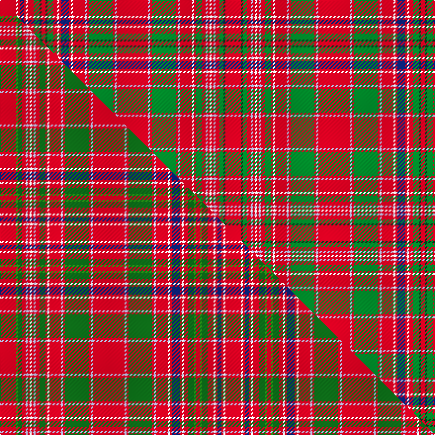

This page is one **sett** — a single exact thread-count. It belongs to the [tartan](/setts/r8dg1g2r2lb1r1w1r1lb1r2g3r1w1r6lb1r1g12r1lb1r16lb1r1g12r1lb1r6w1r1db4r1w1r2g3dg1r2dg1g3r3w1r1db2r1w1r8/)
(the same proportion at any scale), whose colour order is pattern [RGGRWRWRWRGRWRWRGRWRWRGRWRWRBRWRGGRGGRWRBRWR](/stripes/rggrwrwrwrgrwrwrgrwrwrgrwrwrbrwrggrggrwrbrwr/).

Part of the [MacAlister](/tartans/macalister-2/) tartan — the named design grouping this sett with its other cloths.

Sourced from weddslist.  It is a [44 stripe tartan](/stripes/stripes44/).

Original link http://www.weddslist.com/cgi-bin/tartans/pg.pl?source=tinsel

2 attestations — the source records this cloth was collapsed from (oldest owns this page)

<ul>
<li>undated — MacAlister (weddslist, <a href="http://www.weddslist.com/cgi-bin/tartans/pg.pl?source=tinsel">record</a>) </li>
<li>undated — MacAlister (weddslist, <a href="http://www.weddslist.com/cgi-bin/tartans/pg.pl?source=x">record</a>) </li>
</ul>

## Thread count
R/16 W2 R2 DB4 R2 W2 R6 G6 DG2 R4 DG2 G6 R4 W2 R2 DB8 R2 W2 R12 LB2 R2 G24 R2 LB2 R32 LB2 R2 G24 R2 LB2 R12 W2 R2 G6 R4 LB2 R2 W2 R2 LB2 R4 G4 DG2 R/16

One full sett is **456 threads**.

## Palette
<table><thead><tr><th>Colour</th><th>Shade</th><th>OKLCh</th></tr></thead><tbody><tr><td>LB</td><td><code style="background-color:#B5BBDE;">#B5BBDE</code> <small style="color:#888">#B5BBDE</small></td><td><small style="color:#888">oklch(79.9% 0.050 277.6)</small></td></tr><tr><td>DB</td><td><code style="background-color:#082077;">#082077</code> <small style="color:#888">#082077</small></td><td><small style="color:#888">oklch(30.0% 0.149 265.1)</small></td></tr><tr><td>G</td><td><code style="background-color:#008B2A;">#008B2A</code> <small style="color:#888">#008B2A</small></td><td><small style="color:#888">oklch(55.4% 0.170 145.9)</small></td></tr><tr><td>R</td><td><code style="background-color:#D60020;">#D60020</code> <small style="color:#888">#D60020</small></td><td><small style="color:#888">oklch(55.2% 0.224 25.5)</small></td></tr><tr><td>DG</td><td><code style="background-color:#053819;">#053819</code> <small style="color:#888">#053819</small></td><td><small style="color:#888">oklch(30.0% 0.075 151.3)</small></td></tr><tr><td>W</td><td><code style="background-color:#F7F7F7;">#F7F7F7</code> <small style="color:#888">#F7F7F7</small></td><td><small style="color:#888">oklch(97.6% 0.000 89.9)</small></td></tr></tbody></table>

# Sample pattern

## Compared to the master

This cloth is one sett of its design; the master sett (the exemplar the design is anchored on) is below for comparison.

Its **ΔTartan distance** from the master is **1.00** — the same measure the nearest-tartans table ranks by (0 is identical; a re-scale of the same cloth is near 0, a recolour or a different proportion further).

<figure class="master-compare" style="margin:0">

this sett
master sett ★

<figcaption style="color:#888;font-size:smaller">One weave of this sett against the <a href="/setts/r8g1dg2r2lb1r1w1r1lb1r2dg3r1w1r6lb1r1dg12r1lb1r16lb1r1dg12r1lb1r6w1r1db4r1w1r2dg3g1r2g1dg3r3w1r1db2r1w1r8/">master sett ★</a>, split on the diagonal: a shared proportion runs seamlessly across it with only the shades shifting; a different proportion breaks on it.</figcaption>
</figure>

## Nearest tartan variants

The nearest existing variants by ΔTartan distance, with this cloth at the top so the swatches line up against it.

ΔTartan

Threads

Variant

Sett

—

456

<a href="/variants/s44/r8dg1g2r2lb1r1w1r1lb1r2g3r1w1r6lb1r1g12r1lb1r16lb1r1g12r1lb1r6w1r1db4r1w1r2g3dg1r2dg1g3r3w1r1db2r1w1r8~x2/">MacAlister</a>

<a href="/ttd/edit/#slug=r8b1g2r2lb1r1w1r1lb1r2g3r1w1r6lb1r1g12r1lb1r16lb1r1g12r1lb1r6w1r1db4r1w1r2g3b1r2b1g3r3w1r1db2r1w1r8~x2&amp;base=r8dg1g2r2lb1r1w1r1lb1r2g3r1w1r6lb1r1g12r1lb1r16lb1r1g12r1lb1r6w1r1db4r1w1r2g3dg1r2dg1g3r3w1r1db2r1w1r8~x2" title="compare in the TTD">1.00</a>

456

<a href="/variants/s44/r8b1g2r2lb1r1w1r1lb1r2g3r1w1r6lb1r1g12r1lb1r16lb1r1g12r1lb1r6w1r1db4r1w1r2g3b1r2b1g3r3w1r1db2r1w1r8~x2/">MacAlister</a>

<a href="/ttd/edit/#slug=r8g1dg2r2lb1r1w1r1lb1r2dg3r1w1r6lb1r1dg12r1lb1r16lb1r1dg12r1lb1r6w1r1db4r1w1r2dg3g1r2g1dg3r3w1r1db2r1w1r8~x2~g2408144-dg1806142&amp;base=r8dg1g2r2lb1r1w1r1lb1r2g3r1w1r6lb1r1g12r1lb1r16lb1r1g12r1lb1r6w1r1db4r1w1r2g3dg1r2dg1g3r3w1r1db2r1w1r8~x2" title="compare in the TTD">1.00</a>

456

<a href="/variants/s44/r8g1dg2r2lb1r1w1r1lb1r2dg3r1w1r6lb1r1dg12r1lb1r16lb1r1dg12r1lb1r6w1r1db4r1w1r2dg3g1r2g1dg3r3w1r1db2r1w1r8~x2~g2408144-dg1806142/">MacAlister (Clan)</a>

<a href="/ttd/edit/#slug=r8g1dg2r2lb1r1w1r1lb1r2dg3r1w1r6lb1r1dg12r1lb1r16lb1r1dg12r1lb1r6w1r1db4r1w1r2dg3g1r2g1dg3r3w1r1db2r1w1r8~x2&amp;base=r8dg1g2r2lb1r1w1r1lb1r2g3r1w1r6lb1r1g12r1lb1r16lb1r1g12r1lb1r6w1r1db4r1w1r2g3dg1r2dg1g3r3w1r1db2r1w1r8~x2" title="compare in the TTD">1.62</a>

456

<a href="/variants/s44/r8g1dg2r2lb1r1w1r1lb1r2dg3r1w1r6lb1r1dg12r1lb1r16lb1r1dg12r1lb1r6w1r1db4r1w1r2dg3g1r2g1dg3r3w1r1db2r1w1r8~x2/">MacAlister Clan Tartan</a>

<a href="/ttd/edit/#slug=r23g2r3g2r3g2r5y5r5g2r3g2r3g2r23g23r5g15r5g23r23g2r3g2r3g2r5w5r5g2r3g2r3g2r23db15r5db15r5db15~x2&amp;base=r8dg1g2r2lb1r1w1r1lb1r2g3r1w1r6lb1r1g12r1lb1r16lb1r1g12r1lb1r6w1r1db4r1w1r2g3dg1r2dg1g3r3w1r1db2r1w1r8~x2" title="compare in the TTD">2.61</a>

1108

<a href="/variants/s40/r23g2r3g2r3g2r5y5r5g2r3g2r3g2r23g23r5g15r5g23r23g2r3g2r3g2r5w5r5g2r3g2r3g2r23db15r5db15r5db15~x2/">MacRae of Inverinate</a>

<a href="/ttd/edit/#slug=g32r7g32r33g4r12g4r33lb3r12ly3dp33r7dp33ly3r12lb3r33dp2r2dp5r2dp2r33dp2r2dp5r2dp2r33g32r7g32~x2&amp;base=r8dg1g2r2lb1r1w1r1lb1r2g3r1w1r6lb1r1g12r1lb1r16lb1r1g12r1lb1r6w1r1db4r1w1r2g3dg1r2dg1g3r3w1r1db2r1w1r8~x2" title="compare in the TTD">3.02</a>

1720

<a href="/variants/s33/g32r7g32r33g4r12g4r33lb3r12ly3dp33r7dp33ly3r12lb3r33dp2r2dp5r2dp2r33dp2r2dp5r2dp2r33g32r7g32~x2/">Marchioness of Huntly's</a>

<a href="/ttd/edit/#slug=r32g2dg12r4lb4r4w2r4lb4r4dg12r2w2r24lb2r2dg44r2lb2r64lb2r2dg44r2lb2r22w2r2db16r2w2r10dg12g2r8g2dg12r3w2r2db10~x2&amp;base=r8dg1g2r2lb1r1w1r1lb1r2g3r1w1r6lb1r1g12r1lb1r16lb1r1g12r1lb1r6w1r1db4r1w1r2g3dg1r2dg1g3r3w1r1db2r1w1r8~x2" title="compare in the TTD">3.14</a>

1472

<a href="/variants/s41/r32g2dg12r4lb4r4w2r4lb4r4dg12r2w2r24lb2r2dg44r2lb2r64lb2r2dg44r2lb2r22w2r2db16r2w2r10dg12g2r8g2dg12r3w2r2db10~x2/">MacAlister (Logan 1831)</a>

<a href="/ttd/edit/#slug=r32b2dg12r4lb4r4w2r4lb4r4dg12r2w2r24lb2r2dg44r2lb2r64lb2r2dg44r2lb2r22w2r2db16r2w2r10dg12b2r8b2dg12r3w2r2db10~x2&amp;base=r8dg1g2r2lb1r1w1r1lb1r2g3r1w1r6lb1r1g12r1lb1r16lb1r1g12r1lb1r6w1r1db4r1w1r2g3dg1r2dg1g3r3w1r1db2r1w1r8~x2" title="compare in the TTD">3.20</a>

1472

<a href="/variants/s41/r32b2dg12r4lb4r4w2r4lb4r4dg12r2w2r24lb2r2dg44r2lb2r64lb2r2dg44r2lb2r22w2r2db16r2w2r10dg12b2r8b2dg12r3w2r2db10~x2/">MacAlister</a>

<a href="/ttd/edit/#slug=r3g5r1db1r15dg2r1w1r1dg2r15db1r1g5r5g5dg2r1dg2db5r2g1r2g15r1db2w1~x2&amp;base=r8dg1g2r2lb1r1w1r1lb1r2g3r1w1r6lb1r1g12r1lb1r16lb1r1g12r1lb1r6w1r1db4r1w1r2g3dg1r2dg1g3r3w1r1db2r1w1r8~x2" title="compare in the TTD">3.21</a>

384

<a href="/variants/s27/r3g5r1db1r15dg2r1w1r1dg2r15db1r1g5r5g5dg2r1dg2db5r2g1r2g15r1db2w1~x2/">MacDougall D</a>

<a href="/ttd/edit/#slug=db5r3w2db1w2r3g9dy2w1dy2g9r1g1r27db1r1db1r27db1r1db9w1db1w4~x2&amp;base=r8dg1g2r2lb1r1w1r1lb1r2g3r1w1r6lb1r1g12r1lb1r16lb1r1g12r1lb1r6w1r1db4r1w1r2g3dg1r2dg1g3r3w1r1db2r1w1r8~x2" title="compare in the TTD">3.23</a>

442

<a href="/variants/s24/db5r3w2db1w2r3g9dy2w1dy2g9r1g1r27db1r1db1r27db1r1db9w1db1w4~x2/">Hebrides North Uist</a>

<a href="/ttd/edit/#slug=g8r2g8r12g2r3g2r12w1r3y1db12r3db12y1r3w1r12db1r1db2r1db1r12db1r1db2r1db1r12g8r2g8~x2&amp;base=r8dg1g2r2lb1r1w1r1lb1r2g3r1w1r6lb1r1g12r1lb1r16lb1r1g12r1lb1r6w1r1db4r1w1r2g3dg1r2dg1g3r3w1r1db2r1w1r8~x2" title="compare in the TTD">3.24</a>

576

<a href="/variants/s33/g8r2g8r12g2r3g2r12w1r3y1db12r3db12y1r3w1r12db1r1db2r1db1r12db1r1db2r1db1r12g8r2g8~x2/">Huntly</a>

## Neighbour map

Every grey dot is one of 13620 variants placed by the first two principal components of the ΔTartan feature space (42% of its variance). Red is this tartan; blue dots are its nearest — click one to open its page.

<svg viewBox="0 0 640 380" role="img" style="max-width:100%;height:auto;border:1px solid #e0e0e0;border-radius:4px;display:block" xmlns="http://www.w3.org/2000/svg"><image href="/nn/cloud.v1.png" width="640" height="380"/><a href="/variants/s44/r8b1g2r2lb1r1w1r1lb1r2g3r1w1r6lb1r1g12r1lb1r16lb1r1g12r1lb1r6w1r1db4r1w1r2g3b1r2b1g3r3w1r1db2r1w1r8~x2/"><circle cx="252.8" cy="57.8" r="4" fill="#3465a4"><title>MacAlister</title></circle></a><a href="/variants/s44/r8g1dg2r2lb1r1w1r1lb1r2dg3r1w1r6lb1r1dg12r1lb1r16lb1r1dg12r1lb1r6w1r1db4r1w1r2dg3g1r2g1dg3r3w1r1db2r1w1r8~x2~g2408144-dg1806142/"><circle cx="252.2" cy="56.8" r="4" fill="#3465a4"><title>MacAlister (Clan)</title></circle></a><a href="/variants/s44/r8g1dg2r2lb1r1w1r1lb1r2dg3r1w1r6lb1r1dg12r1lb1r16lb1r1dg12r1lb1r6w1r1db4r1w1r2dg3g1r2g1dg3r3w1r1db2r1w1r8~x2/"><circle cx="242.4" cy="51.3" r="4" fill="#3465a4"><title>MacAlister Clan Tartan</title></circle></a><a href="/variants/s40/r23g2r3g2r3g2r5y5r5g2r3g2r3g2r23g23r5g15r5g23r23g2r3g2r3g2r5w5r5g2r3g2r3g2r23db15r5db15r5db15~x2/"><circle cx="248.9" cy="102.5" r="4" fill="#3465a4"><title>MacRae of Inverinate</title></circle></a><a href="/variants/s33/g32r7g32r33g4r12g4r33lb3r12ly3dp33r7dp33ly3r12lb3r33dp2r2dp5r2dp2r33dp2r2dp5r2dp2r33g32r7g32~x2/"><circle cx="258.0" cy="103.1" r="4" fill="#3465a4"><title>Marchioness of Huntly's</title></circle></a><a href="/variants/s41/r32g2dg12r4lb4r4w2r4lb4r4dg12r2w2r24lb2r2dg44r2lb2r64lb2r2dg44r2lb2r22w2r2db16r2w2r10dg12g2r8g2dg12r3w2r2db10~x2/"><circle cx="268.7" cy="22.6" r="4" fill="#3465a4"><title>MacAlister (Logan 1831)</title></circle></a><a href="/variants/s41/r32b2dg12r4lb4r4w2r4lb4r4dg12r2w2r24lb2r2dg44r2lb2r64lb2r2dg44r2lb2r22w2r2db16r2w2r10dg12b2r8b2dg12r3w2r2db10~x2/"><circle cx="269.0" cy="22.5" r="4" fill="#3465a4"><title>MacAlister</title></circle></a><a href="/variants/s27/r3g5r1db1r15dg2r1w1r1dg2r15db1r1g5r5g5dg2r1dg2db5r2g1r2g15r1db2w1~x2/"><circle cx="252.8" cy="99.7" r="4" fill="#3465a4"><title>MacDougall D</title></circle></a><a href="/variants/s24/db5r3w2db1w2r3g9dy2w1dy2g9r1g1r27db1r1db1r27db1r1db9w1db1w4~x2/"><circle cx="297.2" cy="29.4" r="4" fill="#3465a4"><title>Hebrides North Uist</title></circle></a><a href="/variants/s33/g8r2g8r12g2r3g2r12w1r3y1db12r3db12y1r3w1r12db1r1db2r1db1r12db1r1db2r1db1r12g8r2g8~x2/"><circle cx="246.0" cy="111.1" r="4" fill="#3465a4"><title>Huntly</title></circle></a><circle cx="250.5" cy="57.0" r="5" fill="#c00000"/><text x="320" y="376" text-anchor="middle" font-size="11" fill="#999">ground</text><text x="11" y="190" text-anchor="middle" font-size="11" fill="#999" transform="rotate(-90 11 190)">complexity</text></svg>

ID: /variants/s44/r8dg1g2r2lb1r1w1r1lb1r2g3r1w1r6lb1r1g12r1lb1r16lb1r1g12r1lb1r6w1r1db4r1w1r2g3dg1r2dg1g3r3w1r1db2r1w1r8~x2/
