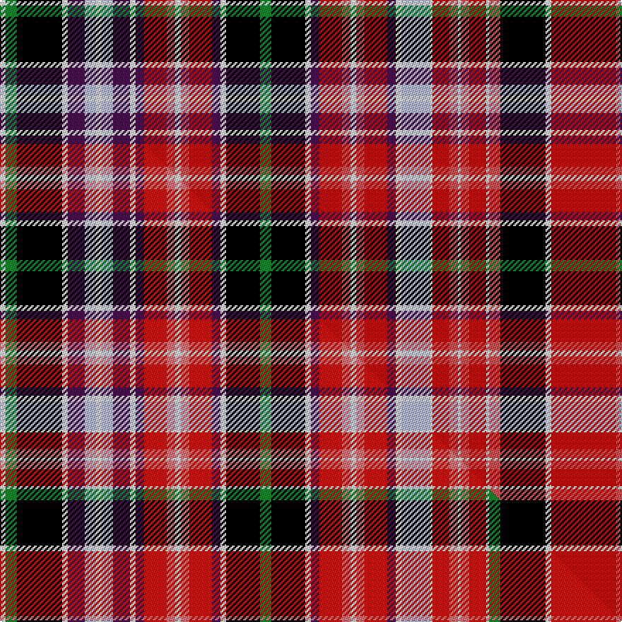

This is one **variant** — a specific cloth: this exact thread count and colourway, with its own
provenance below. It is one weaving of the [sett](/setts/w2g4k16w2dp6lb4w2lb4dp6w2dp3r8ri3w2ri3r8dp3w2k12g4k12w2dp3r8ri3w2ri3r8dp3w2lb10w1r6ri3w1ri3r6w1ri4k16w2r23ri3w2/) (the scale-free proportion — the
same cloth at any scale or shade), whose colour order is pattern [WGKWBWWWBWBRRWRRBWKGKWBRRWRRBWWWRRWRRWRKWRRW](/stripes/wgkwbwwwbwbrrwrrbwkgkwbrrwrrbwwwrrwrrwrkwrrw/).

Part of the [Aberdeen](/tartans/aberdeen/) tartan — the named design grouping this sett with its other cloths.

Sourced from house-of-tartan.  It is a [44 stripe tartan](/stripes/stripes44/).

Original link [http://www.house-of-tartan.scotland.net/house/TartanViewjs.asp?colr=Def&tnam=1801](http://www.house-of-tartan.scotland.net/house/TartanViewjs.asp?colr=Def&tnam=1801)

## Provenance

Earliest known date: pre 1794 There is evidence to suggest that the sett was introduced and named by Wilsons of Bannockburn during the period 1746-82 when tartan was proscribed by law. Aberdeen is one of Scotlands oldest district tartans. The first documentary evidence is contained in a purchase order, addressed to Wilson's, from Scott and Anderson, dated 20th June 1794.

Dataset <small>— provenance for this record, inherited from the source manifest</small>

<dl class="dataset-prov">
<dt>source</dt><dd><a href="/sources/house-of-tartan/">House of Tartan</a></dd>
<dt>data captured from</dt><dd><a href="https://github.com/thetartan/tartan-database/blob/master/data/house-of-tartan/data.csv">https://github.com/thetartan/tartan-database/blob/master/data/house-of-tartan/data.csv</a></dd>
<dt>data date</dt><dd>pre 1794 <small>(this record)</small></dd>
<dt>licence</dt><dd><a href="https://creativecommons.org/licenses/by-nc-nd/4.0/">CC BY-NC-ND 4.0</a></dd>
</dl>

Capture chain <small>— the hands this data passed through, oldest first; each capture carries its own licence</small>

<ol class="capture-chain">
<li><a href="http://www.house-of-tartan.scotland.net/">House of Tartan</a> <small>the weaver/retailer's database — the site is now offline; the URL is kept as the ultimate source's identity</small></li>
<li><a href="https://github.com/thetartan/tartan-database">thetartan/tartan-database</a> <small>2016-2017</small> · <a href="https://creativecommons.org/licenses/by-nc-nd/4.0/">CC BY-NC-ND 4.0</a> <small>Levko Kravets's frozen compilation — the capture we vendored, and where its CC licence text came from</small></li>
<li>this dictionary <small>captured 2026-06-10 · commit 5bf86c7566</small> <small>each re-capture is a git commit to data/sources</small></li>
</ol>

## Thread count
W/4 G8 K32 W4 DP12 LB8 W4 LB8 DP12 W4 DP6 R16 Ri6 W4 Ri6 R16 DP6 W4 K24 G8 K24 W4 DP6 R16 Ri6 W4 Ri6 R16 DP6 W4 LB20 W2 R12 Ri6 W2 Ri6 R12 W2 Ri8 K32 W4 R46 Ri6 W/4

One full sett is **884 threads**.

## Palette
<table><thead><tr><th>Colour</th><th>Shade</th><th>OKLCh</th></tr></thead><tbody><tr><td>LB</td><td><code style="background-color:#B5BBDE;">#B5BBDE</code> <small style="color:#888">#B5BBDE</small></td><td><small style="color:#888">oklch(79.9% 0.050 277.6)</small></td></tr><tr><td>R</td><td><code style="background-color:#D05054;">#D05054</code> <small style="color:#888">#D05054</small></td><td><small style="color:#888">oklch(60.2% 0.162 21.5)</small></td></tr><tr><td>G</td><td><code style="background-color:#008B2A;">#008B2A</code> <small style="color:#888">#008B2A</small></td><td><small style="color:#888">oklch(55.4% 0.170 145.9)</small></td></tr><tr><td>K</td><td><code style="background-color:#000000;">#000000</code> <small style="color:#888">#000000</small></td><td><small style="color:#888">oklch(0.0% 0.000 0.0)</small></td></tr><tr><td>W</td><td><code style="background-color:#F7F7F7;">#F7F7F7</code> <small style="color:#888">#F7F7F7</small></td><td><small style="color:#888">oklch(97.6% 0.000 89.9)</small></td></tr><tr><td>DP</td><td><code style="background-color:#4B0B4F;">#4B0B4F</code> <small style="color:#888">#4B0B4F</small></td><td><small style="color:#888">oklch(30.1% 0.125 325.4)</small></td></tr><tr><td>R</td><td><code style="background-color:#C80000;">#C80000</code> <small style="color:#888">#C80000</small></td><td><small style="color:#888">oklch(52.3% 0.215 29.2)</small></td></tr></tbody></table>

# Sample pattern

## Compared to the master

This cloth is one sett of its design; the master sett (the exemplar the design is anchored on) is below for comparison.

Its **ΔTartan distance** from the master is **0.33** — the same measure the nearest-tartans table ranks by (0 is identical; a re-scale of the same cloth is near 0, a recolour or a different proportion further).

<figure class="master-compare" style="margin:0">

this sett
master sett ★

<figcaption style="color:#888;font-size:smaller">One weave of this sett against the <a href="/setts/w2g4k16w2dp6lb4w2lb4dp6w2dp3r8ri3w2ri3r8dp3w2k12g4k12w2dp3r8ri3w2ri3r8dp3w2lb10w1r6ri3w1ri3r6w1g4k16w2r23ri3w2/">master sett ★</a>, split on the diagonal: a shared proportion runs seamlessly across it with only the shades shifting; a different proportion breaks on it.</figcaption>
</figure>

## Nearest tartan variants

The nearest existing variants by ΔTartan distance, with this cloth at the top so the swatches line up against it.

ΔTartan

Threads

Variant

Sett

—

884

<a href="/variants/s44/w2g4k16w2dp6lb4w2lb4dp6w2dp3r8ri3w2ri3r8dp3w2k12g4k12w2dp3r8ri3w2ri3r8dp3w2lb10w1r6ri3w1ri3r6w1ri4k16w2r23ri3w2~x2~r2109032-ri2406019/">Aberdeen District Tartan</a>

<a href="/ttd/edit/#slug=w2g4k16w2dp6lb4w2lb4dp6w2dp3r8ri3w2ri3r8dp3w2k12g4k12w2dp3r8ri3w2ri3r8dp3w2lb10w1r6ri3w1ri3r6w1g4k16w2r23ri3w2~x2~r2209032-ri2806019&amp;base=w2g4k16w2dp6lb4w2lb4dp6w2dp3r8ri3w2ri3r8dp3w2k12g4k12w2dp3r8ri3w2ri3r8dp3w2lb10w1r6ri3w1ri3r6w1ri4k16w2r23ri3w2~x2~r2109032-ri2406019" title="compare in the TTD">0.33</a>

884

<a href="/variants/s44/w2g4k16w2dp6lb4w2lb4dp6w2dp3r8ri3w2ri3r8dp3w2k12g4k12w2dp3r8ri3w2ri3r8dp3w2lb10w1r6ri3w1ri3r6w1g4k16w2r23ri3w2~x2~r2209032-ri2806019/">Aberdeen - 1819 (District)</a>

<a href="/ttd/edit/#slug=w2b4k16w2dp6lb4w2lb4dp6w2dp3r8dg3w2dg3r8dp3w2k12b4k12w2dp3r8dg3w2dg3r8dp3w2lb10w2r6dg3w1dg3r6w2b4k16w2r23dg3w2~x2&amp;base=w2g4k16w2dp6lb4w2lb4dp6w2dp3r8ri3w2ri3r8dp3w2k12g4k12w2dp3r8ri3w2ri3r8dp3w2lb10w1r6ri3w1ri3r6w1ri4k16w2r23ri3w2~x2~r2109032-ri2406019" title="compare in the TTD">1.18</a>

892

<a href="/variants/s44/w2b4k16w2dp6lb4w2lb4dp6w2dp3r8dg3w2dg3r8dp3w2k12b4k12w2dp3r8dg3w2dg3r8dp3w2lb10w2r6dg3w1dg3r6w2b4k16w2r23dg3w2~x2/">Aberdeen</a>

2.80

—

<a href="/variants/s82/g4w1ri6r3w1r3ri6w1lb10w2dp3ri8r3w2r3ri8dp3w2k12g4k12w2dp3ri8r3w2r3ri8dp3w2dp6lb4w2lb4dp6w2k16g4w2g4k16w2dp6lb4w2lb4dp6w2dp3ri8r3w2r3ri8dp3w2k12g4k12w2dp3ri8r3w2r3ri8dp3w2lb10w1ri6r3w1r3ri6w1g4k16w2ri2-h9a2519dbca078ee2/">Aberdeen</a>

<a href="/ttd/edit/#slug=r44g25k2w6k2y3k16lb12r6lb12k16y3k2w6r44w6k2y3k16lb12r6lb12k16y3k2w6k2g22~x2&amp;base=w2g4k16w2dp6lb4w2lb4dp6w2dp3r8ri3w2ri3r8dp3w2k12g4k12w2dp3r8ri3w2ri3r8dp3w2lb10w1r6ri3w1ri3r6w1ri4k16w2r23ri3w2~x2~r2109032-ri2406019" title="compare in the TTD">3.30</a>

1096

<a href="/variants/s28/r44g25k2w6k2y3k16lb12r6lb12k16y3k2w6r44w6k2y3k16lb12r6lb12k16y3k2w6k2g22~x2/">Wilson's No.017</a>

<a href="/ttd/edit/#slug=r14w2db3w2r14k2r2db2y2lb7w2lb7y2k4r7w1r7w1r7k4y5lb7y5k2r2k2r2k2r2k2y2lb7y2db3y2db3~x2&amp;base=w2g4k16w2dp6lb4w2lb4dp6w2dp3r8ri3w2ri3r8dp3w2k12g4k12w2dp3r8ri3w2ri3r8dp3w2lb10w1r6ri3w1ri3r6w1ri4k16w2r23ri3w2~x2~r2109032-ri2406019" title="compare in the TTD">3.61</a>

534

<a href="/variants/s36/r14w2db3w2r14k2r2db2y2lb7w2lb7y2k4r7w1r7w1r7k4y5lb7y5k2r2k2r2k2r2k2y2lb7y2db3y2db3~x2/">Ogilvy of Airlie Clan Tartan</a>

<a href="/ttd/edit/#slug=w2r8w2k15w2lb5w2dg20g2dg4g2dg20g3y3r2w2r2y3g3dg20w2r32w2dg20w2lb5w2g4k15w2lb5w2r8w2&amp;base=w2g4k16w2dp6lb4w2lb4dp6w2dp3r8ri3w2ri3r8dp3w2k12g4k12w2dp3r8ri3w2ri3r8dp3w2lb10w1r6ri3w1ri3r6w1ri4k16w2r23ri3w2~x2~r2109032-ri2406019" title="compare in the TTD">3.91</a>

446

<a href="/variants/s34/w2r8w2k15w2lb5w2dg20g2dg4g2dg20g3y3r2w2r2y3g3dg20w2r32w2dg20w2lb5w2g4k15w2lb5w2r8w2/">Hunter (Wilsons1819)</a>

<a href="/ttd/edit/#slug=k14r4y4k8r70dp8r3y3r8dp64r3k63w3g64r8y3r3g8r70k8y4r4k14&amp;base=w2g4k16w2dp6lb4w2lb4dp6w2dp3r8ri3w2ri3r8dp3w2k12g4k12w2dp3r8ri3w2ri3r8dp3w2lb10w1r6ri3w1ri3r6w1ri4k16w2r23ri3w2~x2~r2109032-ri2406019" title="compare in the TTD">3.97</a>

854

<a href="/variants/s23/k14r4y4k8r70dp8r3y3r8dp64r3k63w3g64r8y3r3g8r70k8y4r4k14/">Leith (Hay)</a>

## Neighbour map

Every grey dot is one of 13621 variants placed by the first two principal components of the ΔTartan feature space (42% of its variance). Red is this tartan; blue dots are its nearest — click one to open its page.

<svg viewBox="0 0 640 380" role="img" style="max-width:100%;height:auto;border:1px solid #e0e0e0;border-radius:4px;display:block" xmlns="http://www.w3.org/2000/svg"><image href="/nn/cloud.v1.png" width="640" height="380"/><a href="/variants/s44/w2g4k16w2dp6lb4w2lb4dp6w2dp3r8ri3w2ri3r8dp3w2k12g4k12w2dp3r8ri3w2ri3r8dp3w2lb10w1r6ri3w1ri3r6w1g4k16w2r23ri3w2~x2~r2209032-ri2806019/"><circle cx="28.1" cy="29.5" r="4" fill="#3465a4"><title>Aberdeen - 1819 (District)</title></circle></a><a href="/variants/s44/w2b4k16w2dp6lb4w2lb4dp6w2dp3r8dg3w2dg3r8dp3w2k12b4k12w2dp3r8dg3w2dg3r8dp3w2lb10w2r6dg3w1dg3r6w2b4k16w2r23dg3w2~x2/"><circle cx="28.8" cy="33.9" r="4" fill="#3465a4"><title>Aberdeen</title></circle></a><a href="/variants/s82/g4w1ri6r3w1r3ri6w1lb10w2dp3ri8r3w2r3ri8dp3w2k12g4k12w2dp3ri8r3w2r3ri8dp3w2dp6lb4w2lb4dp6w2k16g4w2g4k16w2dp6lb4w2lb4dp6w2dp3ri8r3w2r3ri8dp3w2k12g4k12w2dp3ri8r3w2r3ri8dp3w2lb10w1ri6r3w1r3ri6w1g4k16w2ri2-h9a2519dbca078ee2/"><circle cx="14.0" cy="14.0" r="4" fill="#3465a4"><title>Aberdeen</title></circle></a><a href="/variants/s28/r44g25k2w6k2y3k16lb12r6lb12k16y3k2w6r44w6k2y3k16lb12r6lb12k16y3k2w6k2g22~x2/"><circle cx="75.5" cy="56.0" r="4" fill="#3465a4"><title>Wilson's No.017</title></circle></a><a href="/variants/s36/r14w2db3w2r14k2r2db2y2lb7w2lb7y2k4r7w1r7w1r7k4y5lb7y5k2r2k2r2k2r2k2y2lb7y2db3y2db3~x2/"><circle cx="84.0" cy="77.5" r="4" fill="#3465a4"><title>Ogilvy of Airlie Clan Tartan</title></circle></a><a href="/variants/s34/w2r8w2k15w2lb5w2dg20g2dg4g2dg20g3y3r2w2r2y3g3dg20w2r32w2dg20w2lb5w2g4k15w2lb5w2r8w2/"><circle cx="76.0" cy="44.6" r="4" fill="#3465a4"><title>Hunter (Wilsons1819)</title></circle></a><a href="/variants/s23/k14r4y4k8r70dp8r3y3r8dp64r3k63w3g64r8y3r3g8r70k8y4r4k14/"><circle cx="138.2" cy="15.7" r="4" fill="#3465a4"><title>Leith (Hay)</title></circle></a><circle cx="30.2" cy="29.0" r="5" fill="#c00000"/><text x="320" y="376" text-anchor="middle" font-size="11" fill="#999">ground</text><text x="11" y="190" text-anchor="middle" font-size="11" fill="#999" transform="rotate(-90 11 190)">complexity</text></svg>

ID: /variants/s44/w2g4k16w2dp6lb4w2lb4dp6w2dp3r8ri3w2ri3r8dp3w2k12g4k12w2dp3r8ri3w2ri3r8dp3w2lb10w1r6ri3w1ri3r6w1ri4k16w2r23ri3w2~x2~r2109032-ri2406019/
