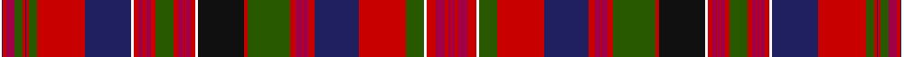

This page is one **sett** — a single exact thread-count. It belongs to the [tartan](/setts/w2db1r3m7dg7r2db1r2dg7r41db40w2r4m4r1m1r1m4r4dg15r4m4r1m1r1m4r4w2k40r3dg36r5m5r1m5r5db38r40dg16w2r8m8r3m2r1/)
(the same proportion at any scale), whose colour order is pattern [RRRRRWGRBRRRRRGRKWRRRRRRRGRRRRRRRWBRGRBRGRRBW](/stripes/rrrrrwgrbrrrrrgrkwrrrrrrrgrrrrrrrwbrgrbrgrrbw/).

Part of the [Unnamed C18th](/tartans/unnamed-c18th/) tartan — the named design grouping this sett with its other cloths.

Sourced from tartans-authority.  It is a [45 stripe tartan](/stripes/stripes45/).

Original link http://www.tartansauthority.com/tartan-ferret/display/8419/

## Also known as

This cloth is also recorded under:

- Prince Charles Edward
- Stuart / Stewart, Plaid

## Register references

External register numbers recorded for this tartan.

- Scottish Tartans Authority (ITI): 8419

## Thread count
W/2 DB1 R3 Ra7 G7 R2 DB1 R2 G7 R41 DB40 W2 R4 Ra4 R1 Ra1 R1 Ra4 R4 G15 R4 Ra4 R1 Ra1 R1 Ra4 R4 W2 K40 R3 G36 R5 Ra5 R1 Ra5 R5 DB38 R40 G16 W2 R8 Ra8 R3 Ra2 R/1

One full sett is **773 threads**.

## Palette

Palette: <strong>Tartan Register</strong>
<table><thead><tr><th>Colour</th><th>Threads</th><th>Shade</th><th>Base</th><th>OKLCh</th></tr></thead><tbody><tr><td>W/</td><td style="text-align:right;font-variant-numeric:tabular-nums">2</td><td><code style="background-color:#FCFCFC;">#FCFCFC</code> <small style="color:#888">#FCFCFC</small></td><td>W <code style="background-color:#F7F7F7;">#F7F7F7</code></td><td><small style="color:#888">oklch(99.1% 0.000 89.9)</small></td></tr><tr><td>DB</td><td style="text-align:right;font-variant-numeric:tabular-nums">1</td><td><code style="background-color:#202060;">#202060</code> <small style="color:#888">#202060</small></td><td>B <code style="background-color:#2A418A;">#2A418A</code></td><td><small style="color:#888">oklch(28.9% 0.111 276.9)</small></td></tr><tr><td>R</td><td style="text-align:right;font-variant-numeric:tabular-nums">3</td><td><code style="background-color:#C80000;">#C80000</code> <small style="color:#888">#C80000</small></td><td>R <code style="background-color:#CC0000;">#CC0000</code></td><td><small style="color:#888">oklch(52.3% 0.215 29.2)</small></td></tr><tr><td>Ra</td><td style="text-align:right;font-variant-numeric:tabular-nums">7</td><td><code style="background-color:#A00048;">#A00048</code> <small style="color:#888">#A00048</small></td><td>R <code style="background-color:#CC0000;">#CC0000</code></td><td><small style="color:#888">oklch(45.4% 0.182 5.3)</small></td></tr><tr><td>G</td><td style="text-align:right;font-variant-numeric:tabular-nums">7</td><td><code style="background-color:#285800;">#285800</code> <small style="color:#888">#285800</small></td><td>G <code style="background-color:#006100;">#006100</code></td><td><small style="color:#888">oklch(41.0% 0.122 135.8)</small></td></tr><tr><td>R</td><td style="text-align:right;font-variant-numeric:tabular-nums">2</td><td><code style="background-color:#C80000;">#C80000</code> <small style="color:#888">#C80000</small></td><td>R <code style="background-color:#CC0000;">#CC0000</code></td><td><small style="color:#888">oklch(52.3% 0.215 29.2)</small></td></tr><tr><td>DB</td><td style="text-align:right;font-variant-numeric:tabular-nums">1</td><td><code style="background-color:#202060;">#202060</code> <small style="color:#888">#202060</small></td><td>B <code style="background-color:#2A418A;">#2A418A</code></td><td><small style="color:#888">oklch(28.9% 0.111 276.9)</small></td></tr><tr><td>R</td><td style="text-align:right;font-variant-numeric:tabular-nums">2</td><td><code style="background-color:#C80000;">#C80000</code> <small style="color:#888">#C80000</small></td><td>R <code style="background-color:#CC0000;">#CC0000</code></td><td><small style="color:#888">oklch(52.3% 0.215 29.2)</small></td></tr><tr><td>G</td><td style="text-align:right;font-variant-numeric:tabular-nums">7</td><td><code style="background-color:#285800;">#285800</code> <small style="color:#888">#285800</small></td><td>G <code style="background-color:#006100;">#006100</code></td><td><small style="color:#888">oklch(41.0% 0.122 135.8)</small></td></tr><tr><td>R</td><td style="text-align:right;font-variant-numeric:tabular-nums">41</td><td><code style="background-color:#C80000;">#C80000</code> <small style="color:#888">#C80000</small></td><td>R <code style="background-color:#CC0000;">#CC0000</code></td><td><small style="color:#888">oklch(52.3% 0.215 29.2)</small></td></tr><tr><td>DB</td><td style="text-align:right;font-variant-numeric:tabular-nums">40</td><td><code style="background-color:#202060;">#202060</code> <small style="color:#888">#202060</small></td><td>B <code style="background-color:#2A418A;">#2A418A</code></td><td><small style="color:#888">oklch(28.9% 0.111 276.9)</small></td></tr><tr><td>W</td><td style="text-align:right;font-variant-numeric:tabular-nums">2</td><td><code style="background-color:#FCFCFC;">#FCFCFC</code> <small style="color:#888">#FCFCFC</small></td><td>W <code style="background-color:#F7F7F7;">#F7F7F7</code></td><td><small style="color:#888">oklch(99.1% 0.000 89.9)</small></td></tr><tr><td>R</td><td style="text-align:right;font-variant-numeric:tabular-nums">4</td><td><code style="background-color:#C80000;">#C80000</code> <small style="color:#888">#C80000</small></td><td>R <code style="background-color:#CC0000;">#CC0000</code></td><td><small style="color:#888">oklch(52.3% 0.215 29.2)</small></td></tr><tr><td>Ra</td><td style="text-align:right;font-variant-numeric:tabular-nums">4</td><td><code style="background-color:#A00048;">#A00048</code> <small style="color:#888">#A00048</small></td><td>R <code style="background-color:#CC0000;">#CC0000</code></td><td><small style="color:#888">oklch(45.4% 0.182 5.3)</small></td></tr><tr><td>R</td><td style="text-align:right;font-variant-numeric:tabular-nums">1</td><td><code style="background-color:#C80000;">#C80000</code> <small style="color:#888">#C80000</small></td><td>R <code style="background-color:#CC0000;">#CC0000</code></td><td><small style="color:#888">oklch(52.3% 0.215 29.2)</small></td></tr><tr><td>Ra</td><td style="text-align:right;font-variant-numeric:tabular-nums">1</td><td><code style="background-color:#A00048;">#A00048</code> <small style="color:#888">#A00048</small></td><td>R <code style="background-color:#CC0000;">#CC0000</code></td><td><small style="color:#888">oklch(45.4% 0.182 5.3)</small></td></tr><tr><td>R</td><td style="text-align:right;font-variant-numeric:tabular-nums">1</td><td><code style="background-color:#C80000;">#C80000</code> <small style="color:#888">#C80000</small></td><td>R <code style="background-color:#CC0000;">#CC0000</code></td><td><small style="color:#888">oklch(52.3% 0.215 29.2)</small></td></tr><tr><td>Ra</td><td style="text-align:right;font-variant-numeric:tabular-nums">4</td><td><code style="background-color:#A00048;">#A00048</code> <small style="color:#888">#A00048</small></td><td>R <code style="background-color:#CC0000;">#CC0000</code></td><td><small style="color:#888">oklch(45.4% 0.182 5.3)</small></td></tr><tr><td>R</td><td style="text-align:right;font-variant-numeric:tabular-nums">4</td><td><code style="background-color:#C80000;">#C80000</code> <small style="color:#888">#C80000</small></td><td>R <code style="background-color:#CC0000;">#CC0000</code></td><td><small style="color:#888">oklch(52.3% 0.215 29.2)</small></td></tr><tr><td>G</td><td style="text-align:right;font-variant-numeric:tabular-nums">15</td><td><code style="background-color:#285800;">#285800</code> <small style="color:#888">#285800</small></td><td>G <code style="background-color:#006100;">#006100</code></td><td><small style="color:#888">oklch(41.0% 0.122 135.8)</small></td></tr><tr><td>R</td><td style="text-align:right;font-variant-numeric:tabular-nums">4</td><td><code style="background-color:#C80000;">#C80000</code> <small style="color:#888">#C80000</small></td><td>R <code style="background-color:#CC0000;">#CC0000</code></td><td><small style="color:#888">oklch(52.3% 0.215 29.2)</small></td></tr><tr><td>Ra</td><td style="text-align:right;font-variant-numeric:tabular-nums">4</td><td><code style="background-color:#A00048;">#A00048</code> <small style="color:#888">#A00048</small></td><td>R <code style="background-color:#CC0000;">#CC0000</code></td><td><small style="color:#888">oklch(45.4% 0.182 5.3)</small></td></tr><tr><td>R</td><td style="text-align:right;font-variant-numeric:tabular-nums">1</td><td><code style="background-color:#C80000;">#C80000</code> <small style="color:#888">#C80000</small></td><td>R <code style="background-color:#CC0000;">#CC0000</code></td><td><small style="color:#888">oklch(52.3% 0.215 29.2)</small></td></tr><tr><td>Ra</td><td style="text-align:right;font-variant-numeric:tabular-nums">1</td><td><code style="background-color:#A00048;">#A00048</code> <small style="color:#888">#A00048</small></td><td>R <code style="background-color:#CC0000;">#CC0000</code></td><td><small style="color:#888">oklch(45.4% 0.182 5.3)</small></td></tr><tr><td>R</td><td style="text-align:right;font-variant-numeric:tabular-nums">1</td><td><code style="background-color:#C80000;">#C80000</code> <small style="color:#888">#C80000</small></td><td>R <code style="background-color:#CC0000;">#CC0000</code></td><td><small style="color:#888">oklch(52.3% 0.215 29.2)</small></td></tr><tr><td>Ra</td><td style="text-align:right;font-variant-numeric:tabular-nums">4</td><td><code style="background-color:#A00048;">#A00048</code> <small style="color:#888">#A00048</small></td><td>R <code style="background-color:#CC0000;">#CC0000</code></td><td><small style="color:#888">oklch(45.4% 0.182 5.3)</small></td></tr><tr><td>R</td><td style="text-align:right;font-variant-numeric:tabular-nums">4</td><td><code style="background-color:#C80000;">#C80000</code> <small style="color:#888">#C80000</small></td><td>R <code style="background-color:#CC0000;">#CC0000</code></td><td><small style="color:#888">oklch(52.3% 0.215 29.2)</small></td></tr><tr><td>W</td><td style="text-align:right;font-variant-numeric:tabular-nums">2</td><td><code style="background-color:#FCFCFC;">#FCFCFC</code> <small style="color:#888">#FCFCFC</small></td><td>W <code style="background-color:#F7F7F7;">#F7F7F7</code></td><td><small style="color:#888">oklch(99.1% 0.000 89.9)</small></td></tr><tr><td>K</td><td style="text-align:right;font-variant-numeric:tabular-nums">40</td><td><code style="background-color:#101010;">#101010</code> <small style="color:#888">#101010</small></td><td>K <code style="background-color:#000000;">#000000</code></td><td><small style="color:#888">oklch(17.3% 0.000 89.9)</small></td></tr><tr><td>R</td><td style="text-align:right;font-variant-numeric:tabular-nums">3</td><td><code style="background-color:#C80000;">#C80000</code> <small style="color:#888">#C80000</small></td><td>R <code style="background-color:#CC0000;">#CC0000</code></td><td><small style="color:#888">oklch(52.3% 0.215 29.2)</small></td></tr><tr><td>G</td><td style="text-align:right;font-variant-numeric:tabular-nums">36</td><td><code style="background-color:#285800;">#285800</code> <small style="color:#888">#285800</small></td><td>G <code style="background-color:#006100;">#006100</code></td><td><small style="color:#888">oklch(41.0% 0.122 135.8)</small></td></tr><tr><td>R</td><td style="text-align:right;font-variant-numeric:tabular-nums">5</td><td><code style="background-color:#C80000;">#C80000</code> <small style="color:#888">#C80000</small></td><td>R <code style="background-color:#CC0000;">#CC0000</code></td><td><small style="color:#888">oklch(52.3% 0.215 29.2)</small></td></tr><tr><td>Ra</td><td style="text-align:right;font-variant-numeric:tabular-nums">5</td><td><code style="background-color:#A00048;">#A00048</code> <small style="color:#888">#A00048</small></td><td>R <code style="background-color:#CC0000;">#CC0000</code></td><td><small style="color:#888">oklch(45.4% 0.182 5.3)</small></td></tr><tr><td>R</td><td style="text-align:right;font-variant-numeric:tabular-nums">1</td><td><code style="background-color:#C80000;">#C80000</code> <small style="color:#888">#C80000</small></td><td>R <code style="background-color:#CC0000;">#CC0000</code></td><td><small style="color:#888">oklch(52.3% 0.215 29.2)</small></td></tr><tr><td>Ra</td><td style="text-align:right;font-variant-numeric:tabular-nums">5</td><td><code style="background-color:#A00048;">#A00048</code> <small style="color:#888">#A00048</small></td><td>R <code style="background-color:#CC0000;">#CC0000</code></td><td><small style="color:#888">oklch(45.4% 0.182 5.3)</small></td></tr><tr><td>R</td><td style="text-align:right;font-variant-numeric:tabular-nums">5</td><td><code style="background-color:#C80000;">#C80000</code> <small style="color:#888">#C80000</small></td><td>R <code style="background-color:#CC0000;">#CC0000</code></td><td><small style="color:#888">oklch(52.3% 0.215 29.2)</small></td></tr><tr><td>DB</td><td style="text-align:right;font-variant-numeric:tabular-nums">38</td><td><code style="background-color:#202060;">#202060</code> <small style="color:#888">#202060</small></td><td>B <code style="background-color:#2A418A;">#2A418A</code></td><td><small style="color:#888">oklch(28.9% 0.111 276.9)</small></td></tr><tr><td>R</td><td style="text-align:right;font-variant-numeric:tabular-nums">40</td><td><code style="background-color:#C80000;">#C80000</code> <small style="color:#888">#C80000</small></td><td>R <code style="background-color:#CC0000;">#CC0000</code></td><td><small style="color:#888">oklch(52.3% 0.215 29.2)</small></td></tr><tr><td>G</td><td style="text-align:right;font-variant-numeric:tabular-nums">16</td><td><code style="background-color:#285800;">#285800</code> <small style="color:#888">#285800</small></td><td>G <code style="background-color:#006100;">#006100</code></td><td><small style="color:#888">oklch(41.0% 0.122 135.8)</small></td></tr><tr><td>W</td><td style="text-align:right;font-variant-numeric:tabular-nums">2</td><td><code style="background-color:#FCFCFC;">#FCFCFC</code> <small style="color:#888">#FCFCFC</small></td><td>W <code style="background-color:#F7F7F7;">#F7F7F7</code></td><td><small style="color:#888">oklch(99.1% 0.000 89.9)</small></td></tr><tr><td>R</td><td style="text-align:right;font-variant-numeric:tabular-nums">8</td><td><code style="background-color:#C80000;">#C80000</code> <small style="color:#888">#C80000</small></td><td>R <code style="background-color:#CC0000;">#CC0000</code></td><td><small style="color:#888">oklch(52.3% 0.215 29.2)</small></td></tr><tr><td>Ra</td><td style="text-align:right;font-variant-numeric:tabular-nums">8</td><td><code style="background-color:#A00048;">#A00048</code> <small style="color:#888">#A00048</small></td><td>R <code style="background-color:#CC0000;">#CC0000</code></td><td><small style="color:#888">oklch(45.4% 0.182 5.3)</small></td></tr><tr><td>R</td><td style="text-align:right;font-variant-numeric:tabular-nums">3</td><td><code style="background-color:#C80000;">#C80000</code> <small style="color:#888">#C80000</small></td><td>R <code style="background-color:#CC0000;">#CC0000</code></td><td><small style="color:#888">oklch(52.3% 0.215 29.2)</small></td></tr><tr><td>Ra</td><td style="text-align:right;font-variant-numeric:tabular-nums">2</td><td><code style="background-color:#A00048;">#A00048</code> <small style="color:#888">#A00048</small></td><td>R <code style="background-color:#CC0000;">#CC0000</code></td><td><small style="color:#888">oklch(45.4% 0.182 5.3)</small></td></tr><tr><td>R/</td><td style="text-align:right;font-variant-numeric:tabular-nums">1</td><td><code style="background-color:#C80000;">#C80000</code> <small style="color:#888">#C80000</small></td><td>R <code style="background-color:#CC0000;">#CC0000</code></td><td><small style="color:#888">oklch(52.3% 0.215 29.2)</small></td></tr></tbody></table>

## Compared to the master

This cloth is one sett of its design; the master sett (the exemplar the design is anchored on) is below for comparison.

<figure style="margin:0"><figcaption style="color:#888;font-size:smaller">this sett</figcaption></figure>
<figure style="margin:0"><figcaption style="color:#888;font-size:smaller"><a href="/setts/r12g3ly4k2ly4g12ly2r3w1/">master sett →</a></figcaption></figure>

## Nearest tartans

The nearest existing variants by ΔTartan distance, with this tartan at the top so the swatches line up against it.

ΔTartan

Tartan

Sett

—

<a href="/ttd/edit/#slug=w2db1r3m7dg7r2db1r2dg7r41db40w2r4m4r1m1r1m4r4dg15r4m4r1m1r1m4r4w2k40r3dg36r5m5r1m5r5db38r40dg16w2r8m8r3m2r1">Unnamed C18th - Hynde Cotton Plaid</a> <a class="nn-out" href="/variants/s45/w2db1r3m7dg7r2db1r2dg7r41db40w2r4m4r1m1r1m4r4dg15r4m4r1m1r1m4r4w2k40r3dg36r5m5r1m5r5db38r40dg16w2r8m8r3m2r1/" title="open its dictionary page">↗</a>

1.05

<a href="/ttd/edit/#slug=k7r1k2r2k2r2k1r3w2r3k1r2k2r2k2r1k7n10k2n4k2n10k7r1k2r2k2r2k1r3w2r3k1r2k2r2k2r1k7dp2g2dp2g2dp40g2dp2g2dp2~x2&amp;base=w2db1r3m7dg7r2db1r2dg7r41db40w2r4m4r1m1r1m4r4dg15r4m4r1m1r1m4r4w2k40r3dg36r5m5r1m5r5db38r40dg16w2r8m8r3m2r1">Arran, Isle of (Lochcarron)</a> <a class="nn-out" href="/variants/s48/k7r1k2r2k2r2k1r3w2r3k1r2k2r2k2r1k7n10k2n4k2n10k7r1k2r2k2r2k1r3w2r3k1r2k2r2k2r1k7dp2g2dp2g2dp40g2dp2g2dp2~x2/" title="open its dictionary page">↗</a>

1.19

<a href="/variants/s42/k7r3ly2r60g7r2ly2r7g50w2k50r2dt50r7ly2r2dt7r60k7ly2r3k7/">Hay &amp; Leith #2</a>

1.21

<a href="/variants/s44/k14r4ly4k8r70dp8r3ly3r8dp64r3k63w3g64r8ly3r3g8r70k8ly4r4k14/">Leith (Hay)</a>

1.23

<a href="/variants/s34/r44m4db16r4m6db8m6r6db2r4db2r4db2r6w1g24t6w1/">Unidentified Cant #13</a>

1.47

<a href="/variants/s38/r5ly1r8w1db20w1t20w1g20ly1r5ly1r5ly1g20ly2r52w1ly5w1~x2/">Whitworth</a>

1.51

<a href="/ttd/edit/#slug=t1ly1t1dg1g2dg2g2dg2g2dg1t1ly1t1ly1t1dg28r24ly1o2ly3t4r10oi16r4ly2r15oi5r9dg28t1ly1t1ly1t1dg1g2dg2g2dg2g2dg1t1ly1t1~x2&amp;base=w2db1r3m7dg7r2db1r2dg7r41db40w2r4m4r1m1r1m4r4dg15r4m4r1m1r1m4r4w2k40r3dg36r5m5r1m5r5db38r40dg16w2r8m8r3m2r1">New Brunswick (Lyon Court Books)</a> <a class="nn-out" href="/variants/s44/t1ly1t1dg1g2dg2g2dg2g2dg1t1ly1t1ly1t1dg28r24ly1o2ly3t4r10oi16r4ly2r15oi5r9dg28t1ly1t1ly1t1dg1g2dg2g2dg2g2dg1t1ly1t1~x2/" title="open its dictionary page">↗</a>

1.60

<a href="/ttd/edit/#slug=k12r4ly4k8r66g8r1ly1r8g60w3k60r3dp60r8ly3r3dp8r66k8ly4r4k6~x2&amp;base=w2db1r3m7dg7r2db1r2dg7r41db40w2r4m4r1m1r1m4r4dg15r4m4r1m1r1m4r4w2k40r3dg36r5m5r1m5r5db38r40dg16w2r8m8r3m2r1">Hay</a> <a class="nn-out" href="/variants/s23/k12r4ly4k8r66g8r1ly1r8g60w3k60r3dp60r8ly3r3dp8r66k8ly4r4k6~x2/" title="open its dictionary page">↗</a>

1.63

<a href="/ttd/edit/#slug=t2dp10ri3r4dg72r7dg4r10db24dp6ri5r4ri5dp7dg24r24dg24r3db3r74dp7ri5r6t2~x2&amp;base=w2db1r3m7dg7r2db1r2dg7r41db40w2r4m4r1m1r1m4r4dg15r4m4r1m1r1m4r4w2k40r3dg36r5m5r1m5r5db38r40dg16w2r8m8r3m2r1">MacDougall of MacDougall</a> <a class="nn-out" href="/variants/s24/t2dp10ri3r4dg72r7dg4r10db24dp6ri5r4ri5dp7dg24r24dg24r3db3r74dp7ri5r6t2~x2/" title="open its dictionary page">↗</a>

1.68

<a href="/variants/s48/m99g6m8g4m10dy34r2dy6r4dy4r6dy2r7w3r7dy2r6dy4r4dy6r2dy34t36dy6t18/">Unidentified Cant #11</a>

1.71

<a href="/variants/s66/db4k1db2k1db1k2db1k6g1k2g2k2g2k1g3k1g28r2g6r6w2r33k1r3k1r2k2r2k2r1k6g8k1ly2~x2/">Unidentified (Paisley)</a>

## Neighbour map

Every grey dot is one of 14360 variants placed by the first two principal components of the ΔTartan feature space (44% of its variance). Red is this tartan; blue dots are its nearest — click one to open its page.

<svg viewBox="0 0 640 380" role="img" style="max-width:100%;height:auto;border:1px solid #e0e0e0;border-radius:4px;display:block" xmlns="http://www.w3.org/2000/svg"><image href="/nn/cloud.v1.png" width="640" height="380"/><a href="/variants/s48/k7r1k2r2k2r2k1r3w2r3k1r2k2r2k2r1k7n10k2n4k2n10k7r1k2r2k2r2k1r3w2r3k1r2k2r2k2r1k7dp2g2dp2g2dp40g2dp2g2dp2~x2/"><circle cx="192.3" cy="14.0" r="4" fill="#3465a4"><title>Arran, Isle of (Lochcarron)</title></circle></a><a href="/variants/s42/k7r3ly2r60g7r2ly2r7g50w2k50r2dt50r7ly2r2dt7r60k7ly2r3k7/"><circle cx="218.6" cy="16.0" r="4" fill="#3465a4"><title>Hay &amp; Leith #2</title></circle></a><a href="/variants/s44/k14r4ly4k8r70dp8r3ly3r8dp64r3k63w3g64r8ly3r3g8r70k8ly4r4k14/"><circle cx="190.5" cy="21.8" r="4" fill="#3465a4"><title>Leith (Hay)</title></circle></a><a href="/variants/s34/r44m4db16r4m6db8m6r6db2r4db2r4db2r6w1g24t6w1/"><circle cx="206.9" cy="26.1" r="4" fill="#3465a4"><title>Unidentified Cant #13</title></circle></a><a href="/variants/s38/r5ly1r8w1db20w1t20w1g20ly1r5ly1r5ly1g20ly2r52w1ly5w1~x2/"><circle cx="228.4" cy="14.0" r="4" fill="#3465a4"><title>Whitworth</title></circle></a><a href="/variants/s44/t1ly1t1dg1g2dg2g2dg2g2dg1t1ly1t1ly1t1dg28r24ly1o2ly3t4r10oi16r4ly2r15oi5r9dg28t1ly1t1ly1t1dg1g2dg2g2dg2g2dg1t1ly1t1~x2/"><circle cx="173.0" cy="14.0" r="4" fill="#3465a4"><title>New Brunswick (Lyon Court Books)</title></circle></a><a href="/variants/s23/k12r4ly4k8r66g8r1ly1r8g60w3k60r3dp60r8ly3r3dp8r66k8ly4r4k6~x2/"><circle cx="231.9" cy="19.8" r="4" fill="#3465a4"><title>Hay</title></circle></a><a href="/variants/s24/t2dp10ri3r4dg72r7dg4r10db24dp6ri5r4ri5dp7dg24r24dg24r3db3r74dp7ri5r6t2~x2/"><circle cx="249.0" cy="36.5" r="4" fill="#3465a4"><title>MacDougall of MacDougall</title></circle></a><a href="/variants/s48/m99g6m8g4m10dy34r2dy6r4dy4r6dy2r7w3r7dy2r6dy4r4dy6r2dy34t36dy6t18/"><circle cx="244.8" cy="14.0" r="4" fill="#3465a4"><title>Unidentified Cant #11</title></circle></a><a href="/variants/s66/db4k1db2k1db1k2db1k6g1k2g2k2g2k1g3k1g28r2g6r6w2r33k1r3k1r2k2r2k2r1k6g8k1ly2~x2/"><circle cx="207.7" cy="14.0" r="4" fill="#3465a4"><title>Unidentified (Paisley)</title></circle></a><circle cx="191.9" cy="14.0" r="5" fill="#c00000"/></svg>

ID: /variants/s45/w2db1r3m7dg7r2db1r2dg7r41db40w2r4m4r1m1r1m4r4dg15r4m4r1m1r1m4r4w2k40r3dg36r5m5r1m5r5db38r40dg16w2r8m8r3m2r1/
