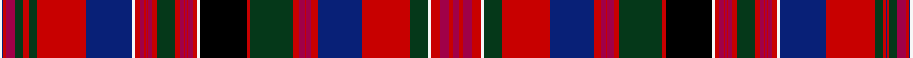

This page is one **sett** — a single exact thread-count. It belongs to the [tartan](/setts/w2db1ri3r7dg7ri2db1ri2dg7ri41db40w2ri4r4ri1r1ri1r4ri4dg15ri4r4ri1r1ri1r4ri4w2k40ri3dg36ri5r5ri1r5ri5db38ri40dg16w2ri8r8ri3r2ri1/)
(the same proportion at any scale), whose colour order is pattern [RRRRRWGRBRRRRRGRKWRRRRRRRGRRRRRRRWBRGRBRGRRBW](/stripes/rrrrrwgrbrrrrrgrkwrrrrrrrgrrrrrrrwbrgrbrgrrbw/).

Sourced from tartans-authority.  It is a [45 stripe tartan](/stripes/stripes45/).

Original link http://www.tartansauthority.com/tartan-ferret/display/8419/

## Register references

External register numbers recorded for this tartan.

- Scottish Tartans Authority (ITI): 8419

## Thread count
W/2 DB1 Ri3 R7 DG7 Ri2 DB1 Ri2 DG7 Ri41 DB40 W2 Ri4 R4 Ri1 R1 Ri1 R4 Ri4 DG15 Ri4 R4 Ri1 R1 Ri1 R4 Ri4 W2 K40 Ri3 DG36 Ri5 R5 Ri1 R5 Ri5 DB38 Ri40 DG16 W2 Ri8 R8 Ri3 R2 Ri/1

One full sett is **773 threads**.

## Palette
<table><thead><tr><th>Colour</th><th>Shade</th><th>OKLCh</th></tr></thead><tbody><tr><td>DB</td><td><code style="background-color:#082077;">#082077</code> <small style="color:#888">#082077</small></td><td><small style="color:#888">oklch(30.0% 0.149 265.1)</small></td></tr><tr><td>G</td><td><code style="background-color:#053819;">#053819</code> <small style="color:#888">#053819</small></td><td><small style="color:#888">oklch(30.0% 0.075 151.3)</small></td></tr><tr><td>K</td><td><code style="background-color:#000000;">#000000</code> <small style="color:#888">#000000</small></td><td><small style="color:#888">oklch(0.0% 0.000 0.0)</small></td></tr><tr><td>R</td><td><code style="background-color:#C80000;">#C80000</code> <small style="color:#888">#C80000</small></td><td><small style="color:#888">oklch(52.3% 0.215 29.2)</small></td></tr><tr><td>Ra</td><td><code style="background-color:#A00048;">#A00048</code> <small style="color:#888">#A00048</small></td><td><small style="color:#888">oklch(45.4% 0.182 5.3)</small></td></tr><tr><td>W</td><td><code style="background-color:#F7F7F7;">#F7F7F7</code> <small style="color:#888">#F7F7F7</small></td><td><small style="color:#888">oklch(97.6% 0.000 89.9)</small></td></tr></tbody></table>

# Sample pattern

ID: /variants/s45/w2db1ri3r7dg7ri2db1ri2dg7ri41db40w2ri4r4ri1r1ri1r4ri4dg15ri4r4ri1r1ri1r4ri4w2k40ri3dg36ri5r5ri1r5ri5db38ri40dg16w2ri8r8ri3r2ri1~ri2109032-r1807008/
