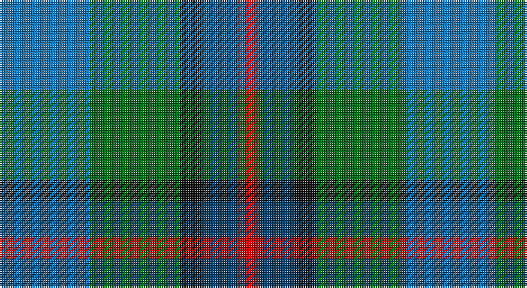

This page is one **sett** — a single exact thread-count. It belongs to the [tartan](/setts/b25g25k6dt10r6/)
(the same proportion at any scale), whose colour order is pattern [BGKBR](/stripes/bgkbr/).

Part of the [Breon](/tartans/breon/) tartan — the named design grouping this sett with its other cloths.

Sourced from tartans-authority.  It is a [5 stripe tartan](/stripes/stripes5/).

Original link http://www.tartansauthority.com/tartan-ferret/display/10488/

## Register references

External register numbers recorded for this tartan.

- Scottish Register of Tartans: [10488](https://www.tartanregister.gov.uk/tartanDetails?ref=10488)
- Scottish Tartans Authority (ITI): 10488

## Thread count
B/50 G50 K12 DB20 R/12

One full sett is **226 threads**.

## Palette

Palette: <strong>Tartan Register</strong>
<table><thead><tr><th>Colour</th><th>Threads</th><th>Shade</th><th>Base</th><th>OKLCh</th></tr></thead><tbody><tr><td>B/</td><td style="text-align:right;font-variant-numeric:tabular-nums">50</td><td><code style="background-color:#1474B4;">#1474B4</code> <small style="color:#888">#1474B4</small></td><td>B <code style="background-color:#2A418A;">#2A418A</code></td><td><small style="color:#888">oklch(54.0% 0.129 245.1)</small></td></tr><tr><td>G</td><td style="text-align:right;font-variant-numeric:tabular-nums">50</td><td><code style="background-color:#006818;">#006818</code> <small style="color:#888">#006818</small></td><td>G <code style="background-color:#006100;">#006100</code></td><td><small style="color:#888">oklch(45.0% 0.142 145.0)</small></td></tr><tr><td>K</td><td style="text-align:right;font-variant-numeric:tabular-nums">12</td><td><code style="background-color:#101010;">#101010</code> <small style="color:#888">#101010</small></td><td>K <code style="background-color:#000000;">#000000</code></td><td><small style="color:#888">oklch(17.3% 0.000 89.9)</small></td></tr><tr><td>DB</td><td style="text-align:right;font-variant-numeric:tabular-nums">20</td><td><code style="background-color:#003C64;">#003C64</code> <small style="color:#888">#003C64</small></td><td>B <code style="background-color:#2A418A;">#2A418A</code></td><td><small style="color:#888">oklch(34.5% 0.089 246.0)</small></td></tr><tr><td>R/</td><td style="text-align:right;font-variant-numeric:tabular-nums">12</td><td><code style="background-color:#C80000;">#C80000</code> <small style="color:#888">#C80000</small></td><td>R <code style="background-color:#CC0000;">#CC0000</code></td><td><small style="color:#888">oklch(52.3% 0.215 29.2)</small></td></tr></tbody></table>

# Sample pattern

## Compared to the master

This cloth is one sett of its design; the master sett (the exemplar the design is anchored on) is below for comparison.

<figure style="margin:0"><figcaption style="color:#888;font-size:smaller">this sett</figcaption></figure>
<figure style="margin:0"><figcaption style="color:#888;font-size:smaller"><a href="/setts/t25dg25k6dp10r6/">master sett →</a></figcaption></figure>

## Nearest tartans

The nearest existing variants by ΔTartan distance, with this tartan at the top so the swatches line up against it.

ΔTartan

Tartan

Sett

—

<a href="/ttd/edit/#slug=b25g25k6dt10r6~x2">Breon (Personal)</a> <a class="nn-out" href="/variants/s5/b25g25k6dt10r6~x2/" title="open its dictionary page">↗</a>

1.11

<a href="/ttd/edit/#slug=k4g16k14lo3n16r4~x2&amp;base=b25g25k6dt10r6~x2">Birse</a> <a class="nn-out" href="/variants/s6/k4g16k14lo3n16r4~x2/" title="open its dictionary page">↗</a>

1.25

<a href="/ttd/edit/#slug=r1db6k3dg6w1~x4&amp;base=b25g25k6dt10r6~x2">Davidson of Tulloch #2</a> <a class="nn-out" href="/variants/s5/r1db6k3dg6w1~x4/" title="open its dictionary page">↗</a>

1.27

<a href="/ttd/edit/#slug=g15dg18dt23w4r8~x2&amp;base=b25g25k6dt10r6~x2">Friebe (2014)</a> <a class="nn-out" href="/variants/s5/g15dg18dt23w4r8~x2/" title="open its dictionary page">↗</a>

1.28

<a href="/ttd/edit/#slug=db3g11t2db11b6g3~x2&amp;base=b25g25k6dt10r6~x2">Unnamed, No 29</a> <a class="nn-out" href="/variants/s6/db3g11t2db11b6g3~x2/" title="open its dictionary page">↗</a>

1.33

<a href="/ttd/edit/#slug=r2db12k7g8t2~x4&amp;base=b25g25k6dt10r6~x2">Forbo Nairn</a> <a class="nn-out" href="/variants/s5/r2db12k7g8t2~x4/" title="open its dictionary page">↗</a>

1.35

<a href="/ttd/edit/#slug=r4g11k11g2n11y3~x4&amp;base=b25g25k6dt10r6~x2">Casely</a> <a class="nn-out" href="/variants/s6/r4g11k11g2n11y3~x4/" title="open its dictionary page">↗</a>

1.37

<a href="/ttd/edit/#slug=t25dg25k6dp10r6~x2&amp;base=b25g25k6dt10r6~x2">Breon (Jersey Shore, Pennsylvania) (Personal)</a> <a class="nn-out" href="/variants/s5/t25dg25k6dp10r6~x2/" title="open its dictionary page">↗</a>

1.42

<a href="/ttd/edit/#slug=k4b2g13db13w2~x4&amp;base=b25g25k6dt10r6~x2">Bath</a> <a class="nn-out" href="/variants/s5/k4b2g13db13w2~x4/" title="open its dictionary page">↗</a>

1.47

<a href="/ttd/edit/#slug=t6db6g6r1~x2&amp;base=b25g25k6dt10r6~x2">Norwich No.040</a> <a class="nn-out" href="/variants/s4/t6db6g6r1~x2/" title="open its dictionary page">↗</a>

1.47

<a href="/ttd/edit/#slug=r9b6dt13b21o18w4~x2&amp;base=b25g25k6dt10r6~x2">Fox-Eves Wedding (Personal)</a> <a class="nn-out" href="/variants/s6/r9b6dt13b21o18w4~x2/" title="open its dictionary page">↗</a>

## Neighbour map

Every grey dot is one of 14360 variants placed by the first two principal components of the ΔTartan feature space (44% of its variance). Red is this tartan; blue dots are its nearest — click one to open its page.

<svg viewBox="0 0 640 380" role="img" style="max-width:100%;height:auto;border:1px solid #e0e0e0;border-radius:4px;display:block" xmlns="http://www.w3.org/2000/svg"><image href="/nn/cloud.v1.png" width="640" height="380"/><a href="/variants/s6/k4g16k14lo3n16r4~x2/"><circle cx="127.3" cy="255.8" r="4" fill="#3465a4"><title>Birse</title></circle></a><a href="/variants/s5/r1db6k3dg6w1~x4/"><circle cx="146.7" cy="248.4" r="4" fill="#3465a4"><title>Davidson of Tulloch #2</title></circle></a><a href="/variants/s5/g15dg18dt23w4r8~x2/"><circle cx="104.3" cy="262.5" r="4" fill="#3465a4"><title>Friebe (2014)</title></circle></a><a href="/variants/s6/db3g11t2db11b6g3~x2/"><circle cx="198.5" cy="274.3" r="4" fill="#3465a4"><title>Unnamed, No 29</title></circle></a><a href="/variants/s5/r2db12k7g8t2~x4/"><circle cx="159.8" cy="258.2" r="4" fill="#3465a4"><title>Forbo Nairn</title></circle></a><a href="/variants/s6/r4g11k11g2n11y3~x4/"><circle cx="133.1" cy="264.8" r="4" fill="#3465a4"><title>Casely</title></circle></a><a href="/variants/s5/t25dg25k6dp10r6~x2/"><circle cx="163.9" cy="282.9" r="4" fill="#3465a4"><title>Breon (Jersey Shore, Pennsylvania) (Personal)</title></circle></a><a href="/variants/s5/k4b2g13db13w2~x4/"><circle cx="170.2" cy="236.8" r="4" fill="#3465a4"><title>Bath</title></circle></a><a href="/variants/s4/t6db6g6r1~x2/"><circle cx="154.5" cy="304.5" r="4" fill="#3465a4"><title>Norwich No.040</title></circle></a><a href="/variants/s6/r9b6dt13b21o18w4~x2/"><circle cx="131.5" cy="258.4" r="4" fill="#3465a4"><title>Fox-Eves Wedding (Personal)</title></circle></a><circle cx="137.3" cy="276.7" r="5" fill="#c00000"/></svg>

ID: /variants/s5/b25g25k6dt10r6~x2/
