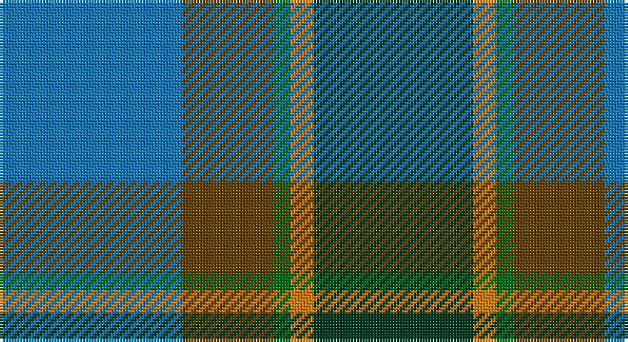

This page is one **sett** — a single exact thread-count. It belongs to the [tartan](/setts/b32dy16g3lo4dg28/)
(the same proportion at any scale), whose colour order is pattern [BGGYG](/stripes/bggyg/).

Sourced from tartans-authority.  It is a [5 stripe tartan](/stripes/stripes5/).

Original link http://www.tartansauthority.com/tartan-ferret/display/10824/

## Register references

External register numbers recorded for this tartan.

- Scottish Register of Tartans: [10824](https://www.tartanregister.gov.uk/tartanDetails?ref=10824)
- Scottish Tartans Authority (ITI): 10824

## Thread count
B/64 T32 G6 O8 DG/56

One full sett is **212 threads**.

## Palette

Palette: <strong>Tartan Register</strong>
<table><thead><tr><th>Colour</th><th>Threads</th><th>Shade</th><th>Base</th><th>OKLCh</th></tr></thead><tbody><tr><td>B/</td><td style="text-align:right;font-variant-numeric:tabular-nums">64</td><td><code style="background-color:#1474B4;">#1474B4</code> <small style="color:#888">#1474B4</small></td><td>B <code style="background-color:#2A418A;">#2A418A</code></td><td><small style="color:#888">oklch(54.0% 0.129 245.1)</small></td></tr><tr><td>T</td><td style="text-align:right;font-variant-numeric:tabular-nums">32</td><td><code style="background-color:#604000;">#604000</code> <small style="color:#888">#604000</small></td><td>G <code style="background-color:#006100;">#006100</code></td><td><small style="color:#888">oklch(39.8% 0.083 76.8)</small></td></tr><tr><td>G</td><td style="text-align:right;font-variant-numeric:tabular-nums">6</td><td><code style="background-color:#006818;">#006818</code> <small style="color:#888">#006818</small></td><td>G <code style="background-color:#006100;">#006100</code></td><td><small style="color:#888">oklch(45.0% 0.142 145.0)</small></td></tr><tr><td>O</td><td style="text-align:right;font-variant-numeric:tabular-nums">8</td><td><code style="background-color:#D87C00;">#D87C00</code> <small style="color:#888">#D87C00</small></td><td>Y <code style="background-color:#F2BF00;">#F2BF00</code></td><td><small style="color:#888">oklch(67.3% 0.155 61.8)</small></td></tr><tr><td>DG/</td><td style="text-align:right;font-variant-numeric:tabular-nums">56</td><td><code style="background-color:#003820;">#003820</code> <small style="color:#888">#003820</small></td><td>G <code style="background-color:#006100;">#006100</code></td><td><small style="color:#888">oklch(30.0% 0.070 158.3)</small></td></tr></tbody></table>

# Sample pattern

## Nearest tartans

The nearest existing variants by ΔTartan distance, with this tartan at the top so the swatches line up against it.

ΔTartan

Tartan

Sett

—

<a href="/ttd/edit/#slug=b32dy16g3lo4dg28~x2">Corey (Name)</a> <a class="nn-out" href="/variants/s5/b32dy16g3lo4dg28~x2/" title="open its dictionary page">↗</a>

0.86

<a href="/ttd/edit/#slug=k9lr6n22g28ly2~x2&amp;base=b32dy16g3lo4dg28~x2">Wellington (Lochcarron)</a> <a class="nn-out" href="/variants/s5/k9lr6n22g28ly2~x2/" title="open its dictionary page">↗</a>

1.05

<a href="/ttd/edit/#slug=dg6ly3dg26k10n30lb3~x2&amp;base=b32dy16g3lo4dg28~x2">Montrose (1983)</a> <a class="nn-out" href="/variants/s6/dg6ly3dg26k10n30lb3~x2/" title="open its dictionary page">↗</a>

1.06

<a href="/ttd/edit/#slug=dg5b2dg9dt19r9ly2~x2&amp;base=b32dy16g3lo4dg28~x2">Lyle and Scott</a> <a class="nn-out" href="/variants/s6/dg5b2dg9dt19r9ly2~x2/" title="open its dictionary page">↗</a>

1.09

<a href="/ttd/edit/#slug=b32do16dg3o4k28~x2&amp;base=b32dy16g3lo4dg28~x2">Corey in Balachuirn</a> <a class="nn-out" href="/variants/s5/b32do16dg3o4k28~x2/" title="open its dictionary page">↗</a>

1.12

<a href="/ttd/edit/#slug=r7ly3dg28db28w3~x2&amp;base=b32dy16g3lo4dg28~x2">Turnbull Hunting</a> <a class="nn-out" href="/variants/s5/r7ly3dg28db28w3~x2/" title="open its dictionary page">↗</a>

1.14

<a href="/ttd/edit/#slug=r1o5dt3dti11dt3o5lo1~x8&amp;base=b32dy16g3lo4dg28~x2">Newmill</a> <a class="nn-out" href="/variants/s7/r1o5dt3dti11dt3o5lo1~x8/" title="open its dictionary page">↗</a>

1.17

<a href="/ttd/edit/#slug=db9w4g36t36r4~x2&amp;base=b32dy16g3lo4dg28~x2">Alvis of Lee (Personal)</a> <a class="nn-out" href="/variants/s5/db9w4g36t36r4~x2/" title="open its dictionary page">↗</a>

1.17

<a href="/ttd/edit/#slug=b30ly3dy11ly3g33r6~x2&amp;base=b32dy16g3lo4dg28~x2">Balfour Hunting</a> <a class="nn-out" href="/variants/s6/b30ly3dy11ly3g33r6~x2/" title="open its dictionary page">↗</a>

1.18

<a href="/ttd/edit/#slug=dt37dg37o8k3dp5~x2&amp;base=b32dy16g3lo4dg28~x2">Dallard Personal Tartan</a> <a class="nn-out" href="/variants/s5/dt37dg37o8k3dp5~x2/" title="open its dictionary page">↗</a>

1.23

<a href="/ttd/edit/#slug=g31dg7lo3dg14g8db18dp5~x2&amp;base=b32dy16g3lo4dg28~x2">Reidy Wedding</a> <a class="nn-out" href="/variants/s7/g31dg7lo3dg14g8db18dp5~x2/" title="open its dictionary page">↗</a>

## Neighbour map

Every grey dot is one of 14360 variants placed by the first two principal components of the ΔTartan feature space (44% of its variance). Red is this tartan; blue dots are its nearest — click one to open its page.

<svg viewBox="0 0 640 380" role="img" style="max-width:100%;height:auto;border:1px solid #e0e0e0;border-radius:4px;display:block" xmlns="http://www.w3.org/2000/svg"><image href="/nn/cloud.v1.png" width="640" height="380"/><a href="/variants/s5/k9lr6n22g28ly2~x2/"><circle cx="230.4" cy="221.8" r="4" fill="#3465a4"><title>Wellington (Lochcarron)</title></circle></a><a href="/variants/s6/dg6ly3dg26k10n30lb3~x2/"><circle cx="254.3" cy="228.9" r="4" fill="#3465a4"><title>Montrose (1983)</title></circle></a><a href="/variants/s6/dg5b2dg9dt19r9ly2~x2/"><circle cx="220.3" cy="226.4" r="4" fill="#3465a4"><title>Lyle and Scott</title></circle></a><a href="/variants/s5/b32do16dg3o4k28~x2/"><circle cx="199.3" cy="230.5" r="4" fill="#3465a4"><title>Corey in Balachuirn</title></circle></a><a href="/variants/s5/r7ly3dg28db28w3~x2/"><circle cx="224.5" cy="219.3" r="4" fill="#3465a4"><title>Turnbull Hunting</title></circle></a><a href="/variants/s7/r1o5dt3dti11dt3o5lo1~x8/"><circle cx="205.9" cy="209.3" r="4" fill="#3465a4"><title>Newmill</title></circle></a><a href="/variants/s5/db9w4g36t36r4~x2/"><circle cx="221.1" cy="221.0" r="4" fill="#3465a4"><title>Alvis of Lee (Personal)</title></circle></a><a href="/variants/s6/b30ly3dy11ly3g33r6~x2/"><circle cx="216.7" cy="209.7" r="4" fill="#3465a4"><title>Balfour Hunting</title></circle></a><a href="/variants/s5/dt37dg37o8k3dp5~x2/"><circle cx="287.7" cy="237.6" r="4" fill="#3465a4"><title>Dallard Personal Tartan</title></circle></a><a href="/variants/s7/g31dg7lo3dg14g8db18dp5~x2/"><circle cx="245.7" cy="231.8" r="4" fill="#3465a4"><title>Reidy Wedding</title></circle></a><circle cx="218.0" cy="238.8" r="5" fill="#c00000"/></svg>

ID: /variants/s5/b32dy16g3lo4dg28~x2/
