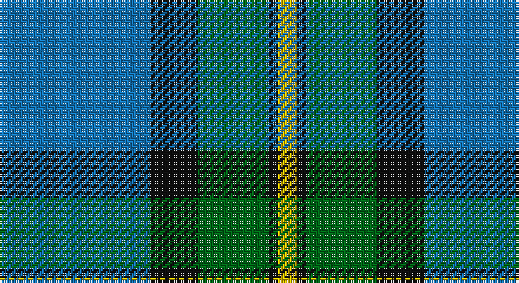

This page is one **sett** — a single exact thread-count. It belongs to the [tartan](/setts/b32k10g15k2ly4/)
(the same proportion at any scale), whose colour order is pattern [BKGKY](/stripes/bkgky/).

Sourced from tartans-authority.  It is a [5 stripe tartan](/stripes/stripes5/).

Original link http://www.tartansauthority.com/tartan-ferret/display/8857/

## Register references

External register numbers recorded for this tartan.

- Scottish Register of Tartans: [8857](https://www.tartanregister.gov.uk/tartanDetails?ref=8857)
- Scottish Tartans Authority (ITI): 8857

## Thread count
B/64 K20 G30 K4 Y/8

One full sett is **180 threads**.

## Palette

Palette: <strong>Tartan Register</strong>
<table><thead><tr><th>Colour</th><th>Threads</th><th>Shade</th><th>Base</th><th>OKLCh</th></tr></thead><tbody><tr><td>B/</td><td style="text-align:right;font-variant-numeric:tabular-nums">64</td><td><code style="background-color:#1474B4;">#1474B4</code> <small style="color:#888">#1474B4</small></td><td>B <code style="background-color:#2A418A;">#2A418A</code></td><td><small style="color:#888">oklch(54.0% 0.129 245.1)</small></td></tr><tr><td>K</td><td style="text-align:right;font-variant-numeric:tabular-nums">20</td><td><code style="background-color:#101010;">#101010</code> <small style="color:#888">#101010</small></td><td>K <code style="background-color:#000000;">#000000</code></td><td><small style="color:#888">oklch(17.3% 0.000 89.9)</small></td></tr><tr><td>G</td><td style="text-align:right;font-variant-numeric:tabular-nums">30</td><td><code style="background-color:#006818;">#006818</code> <small style="color:#888">#006818</small></td><td>G <code style="background-color:#006100;">#006100</code></td><td><small style="color:#888">oklch(45.0% 0.142 145.0)</small></td></tr><tr><td>K</td><td style="text-align:right;font-variant-numeric:tabular-nums">4</td><td><code style="background-color:#101010;">#101010</code> <small style="color:#888">#101010</small></td><td>K <code style="background-color:#000000;">#000000</code></td><td><small style="color:#888">oklch(17.3% 0.000 89.9)</small></td></tr><tr><td>Y/</td><td style="text-align:right;font-variant-numeric:tabular-nums">8</td><td><code style="background-color:#E8C000;">#E8C000</code> <small style="color:#888">#E8C000</small></td><td>Y <code style="background-color:#F2BF00;">#F2BF00</code></td><td><small style="color:#888">oklch(81.9% 0.168 93.7)</small></td></tr></tbody></table>

# Sample pattern

## Nearest tartans

The nearest existing variants by ΔTartan distance, with this tartan at the top so the swatches line up against it.

ΔTartan

Tartan

Sett

—

<a href="/ttd/edit/#slug=b32k10g15k2ly4~x2">Rothesay &amp; Caithness Fencibles (Mil)</a> <a class="nn-out" href="/variants/s5/b32k10g15k2ly4~x2/" title="open its dictionary page">↗</a>

0.90

<a href="/ttd/edit/#slug=g40k15b10k10ly3~x2&amp;base=b32k10g15k2ly4~x2">U.S. Border Patrol (Corporate)</a> <a class="nn-out" href="/variants/s5/g40k15b10k10ly3~x2/" title="open its dictionary page">↗</a>

0.93

<a href="/ttd/edit/#slug=b12k4g6ly1~x8&amp;base=b32k10g15k2ly4~x2">Sinclair of Ulbster (Portrait)</a> <a class="nn-out" href="/variants/s4/b12k4g6ly1~x8/" title="open its dictionary page">↗</a>

1.07

<a href="/ttd/edit/#slug=db5w3db36g38ly5g5~x2&amp;base=b32k10g15k2ly4~x2">St. Andrew Society, Sao Paulo (Corp)</a> <a class="nn-out" href="/variants/s6/db5w3db36g38ly5g5~x2/" title="open its dictionary page">↗</a>

1.14

<a href="/ttd/edit/#slug=t2db29t12g29w2~x2&amp;base=b32k10g15k2ly4~x2">Wallace Blue (Fashion)</a> <a class="nn-out" href="/variants/s5/t2db29t12g29w2~x2/" title="open its dictionary page">↗</a>

1.14

<a href="/ttd/edit/#slug=r2w7b30dg36ly2~x2&amp;base=b32k10g15k2ly4~x2">Centennial-King George Lodge No.171</a> <a class="nn-out" href="/variants/s5/r2w7b30dg36ly2~x2/" title="open its dictionary page">↗</a>

1.19

<a href="/ttd/edit/#slug=db10k3t65dg56ly6&amp;base=b32k10g15k2ly4~x2">Phoenix Police Honor Guard</a> <a class="nn-out" href="/variants/s5/db10k3t65dg56ly6/" title="open its dictionary page">↗</a>

1.20

<a href="/ttd/edit/#slug=r2db32g14db5g16w2~x2&amp;base=b32k10g15k2ly4~x2">Connacht Irish District Tartan</a> <a class="nn-out" href="/variants/s6/r2db32g14db5g16w2~x2/" title="open its dictionary page">↗</a>

1.24

<a href="/ttd/edit/#slug=dg35t40w11lo3dg7~x2&amp;base=b32k10g15k2ly4~x2">Fife Ethylene Plant</a> <a class="nn-out" href="/variants/s5/dg35t40w11lo3dg7~x2/" title="open its dictionary page">↗</a>

1.30

<a href="/ttd/edit/#slug=dt36t21ly4lb12dp2~x2&amp;base=b32k10g15k2ly4~x2">Emond, Kenneth (Personal)</a> <a class="nn-out" href="/variants/s5/dt36t21ly4lb12dp2~x2/" title="open its dictionary page">↗</a>

1.33

<a href="/variants/s6/k4t24k2g13t2ki3~x4/">Vance (Family Association) Corporate Family Tartan</a>

## Neighbour map

Every grey dot is one of 14360 variants placed by the first two principal components of the ΔTartan feature space (44% of its variance). Red is this tartan; blue dots are its nearest — click one to open its page.

<svg viewBox="0 0 640 380" role="img" style="max-width:100%;height:auto;border:1px solid #e0e0e0;border-radius:4px;display:block" xmlns="http://www.w3.org/2000/svg"><image href="/nn/cloud.v1.png" width="640" height="380"/><a href="/variants/s5/g40k15b10k10ly3~x2/"><circle cx="279.6" cy="217.2" r="4" fill="#3465a4"><title>U.S. Border Patrol (Corporate)</title></circle></a><a href="/variants/s4/b12k4g6ly1~x8/"><circle cx="278.0" cy="248.8" r="4" fill="#3465a4"><title>Sinclair of Ulbster (Portrait)</title></circle></a><a href="/variants/s6/db5w3db36g38ly5g5~x2/"><circle cx="293.6" cy="202.5" r="4" fill="#3465a4"><title>St. Andrew Society, Sao Paulo (Corp)</title></circle></a><a href="/variants/s5/t2db29t12g29w2~x2/"><circle cx="248.9" cy="224.0" r="4" fill="#3465a4"><title>Wallace Blue (Fashion)</title></circle></a><a href="/variants/s5/r2w7b30dg36ly2~x2/"><circle cx="255.3" cy="174.2" r="4" fill="#3465a4"><title>Centennial-King George Lodge No.171</title></circle></a><a href="/variants/s5/db10k3t65dg56ly6/"><circle cx="284.8" cy="181.9" r="4" fill="#3465a4"><title>Phoenix Police Honor Guard</title></circle></a><a href="/variants/s6/r2db32g14db5g16w2~x2/"><circle cx="323.1" cy="202.9" r="4" fill="#3465a4"><title>Connacht Irish District Tartan</title></circle></a><a href="/variants/s5/dg35t40w11lo3dg7~x2/"><circle cx="224.9" cy="204.3" r="4" fill="#3465a4"><title>Fife Ethylene Plant</title></circle></a><a href="/variants/s5/dt36t21ly4lb12dp2~x2/"><circle cx="239.8" cy="180.6" r="4" fill="#3465a4"><title>Emond, Kenneth (Personal)</title></circle></a><a href="/variants/s6/k4t24k2g13t2ki3~x4/"><circle cx="260.6" cy="179.0" r="4" fill="#3465a4"><title>Vance (Family Association) Corporate Family Tartan</title></circle></a><circle cx="276.6" cy="209.3" r="5" fill="#c00000"/></svg>

ID: /variants/s5/b32k10g15k2ly4~x2/
