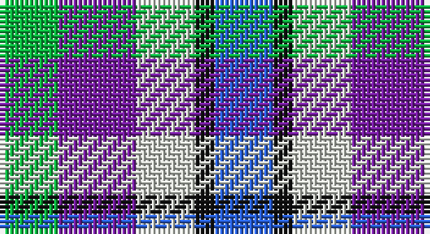

This page is one **sett** — a single exact thread-count. It belongs to the [tartan](/setts/b3k1lb3p4lg3/)
(the same proportion at any scale), whose colour order is pattern [BKWBY](/stripes/bkwby/).

Part of the [Crinnion](/tartans/crinnion/) tartan — the named design grouping this sett with its other cloths.

Sourced from register-of-tartans.  It is a [5 stripe tartan](/stripes/stripes5/).

Original link https://www.tartanregister.gov.uk/tartanDetails.aspx?ref=10789

## Register references

External register numbers recorded for this tartan.

- Scottish Register of Tartans: [10789](https://www.tartanregister.gov.uk/tartanDetails.aspx?ref=10789)

## Thread count
G/12 P16 N12 K4 B/12

One full sett is **88 threads**.

## Palette

Palette: <strong>Logan (The Scottish Gael, 1831)</strong> <small style="color:#888">(1 of 5 colours)</small>
<table><thead><tr><th>Colour</th><th>Threads</th><th>Shade</th><th>Base</th><th>OKLCh</th></tr></thead><tbody><tr><td>G/</td><td style="text-align:right;font-variant-numeric:tabular-nums">12</td><td><code style="background-color:#0BB43F;">#0BB43F</code> <small style="color:#888">#0BB43F</small></td><td>Y <code style="background-color:#F2BF00;">#F2BF00</code></td><td><small style="color:#888">oklch(67.1% 0.200 146.4)</small></td></tr><tr><td>P</td><td style="text-align:right;font-variant-numeric:tabular-nums">16</td><td><code style="background-color:#761CA0;">#761CA0</code> <small style="color:#888">#761CA0</small></td><td>B <code style="background-color:#2A418A;">#2A418A</code></td><td><small style="color:#888">oklch(44.2% 0.198 311.6)</small></td></tr><tr><td>N</td><td style="text-align:right;font-variant-numeric:tabular-nums">12</td><td><code style="background-color:#D1D5CD;">#D1D5CD</code> <small style="color:#888">#D1D5CD</small></td><td>W <code style="background-color:#F7F7F7;">#F7F7F7</code></td><td><small style="color:#888">oklch(86.8% 0.012 128.6)</small></td></tr><tr><td>K</td><td style="text-align:right;font-variant-numeric:tabular-nums">4</td><td><code style="background-color:#101010;">#101010</code> <small style="color:#888">#101010</small></td><td>K <code style="background-color:#000000;">#000000</code></td><td><small style="color:#888">oklch(17.3% 0.000 89.9)</small></td></tr><tr><td>B/</td><td style="text-align:right;font-variant-numeric:tabular-nums">12</td><td><code style="background-color:#275EDC;">#275EDC</code> <small style="color:#888">#275EDC</small></td><td>B <code style="background-color:#2A418A;">#2A418A</code></td><td><small style="color:#888">oklch(52.5% 0.202 263.3)</small></td></tr></tbody></table>

# Sample pattern

## Nearest tartans

The nearest existing variants by ΔTartan distance, with this tartan at the top so the swatches line up against it.

ΔTartan

Tartan

Sett

—

<a href="/ttd/edit/#slug=b3k1lb3p4lg3~x4">Crinnion (Middlesbrough) (Personal)</a> <a class="nn-out" href="/variants/s5/b3k1lb3p4lg3~x4/" title="open its dictionary page">↗</a>

1.54

<a href="/ttd/edit/#slug=t3w10db10g10r2~x4&amp;base=b3k1lb3p4lg3~x4">MacTeddy</a> <a class="nn-out" href="/variants/s5/t3w10db10g10r2~x4/" title="open its dictionary page">↗</a>

1.63

<a href="/ttd/edit/#slug=lt3w10db10g10k2~x4&amp;base=b3k1lb3p4lg3~x4">MacTeddy</a> <a class="nn-out" href="/variants/s5/lt3w10db10g10k2~x4/" title="open its dictionary page">↗</a>

1.71

<a href="/ttd/edit/#slug=r13ly13g13b22w4~x2&amp;base=b3k1lb3p4lg3~x4">Clan Haggis World (Corporate)</a> <a class="nn-out" href="/variants/s5/r13ly13g13b22w4~x2/" title="open its dictionary page">↗</a>

1.87

<a href="/ttd/edit/#slug=lb3lbi2db3r3k3ly1~x8&amp;base=b3k1lb3p4lg3~x4">Becker (Name)</a> <a class="nn-out" href="/variants/s6/lb3lbi2db3r3k3ly1~x8/" title="open its dictionary page">↗</a>

1.89

<a href="/ttd/edit/#slug=db9r12g9db5w2~x4&amp;base=b3k1lb3p4lg3~x4">Battle of Prestonpans (1745) Heritage Trust, The</a> <a class="nn-out" href="/variants/s5/db9r12g9db5w2~x4/" title="open its dictionary page">↗</a>

1.89

<a href="/ttd/edit/#slug=g3db3dp4w1~x4&amp;base=b3k1lb3p4lg3~x4">Pride of the Glen</a> <a class="nn-out" href="/variants/s4/g3db3dp4w1~x4/" title="open its dictionary page">↗</a>

1.92

<a href="/ttd/edit/#slug=r13lo13g13db22w4~x2&amp;base=b3k1lb3p4lg3~x4">Clan Haggis World (Corporate)</a> <a class="nn-out" href="/variants/s5/r13lo13g13db22w4~x2/" title="open its dictionary page">↗</a>

1.97

<a href="/ttd/edit/#slug=db5dp3w2dg3k1ly1~x10&amp;base=b3k1lb3p4lg3~x4">MacBlain (2016)</a> <a class="nn-out" href="/variants/s6/db5dp3w2dg3k1ly1~x10/" title="open its dictionary page">↗</a>

2.00

<a href="/ttd/edit/#slug=k6w11b11r13db17w10k2w4~x2&amp;base=b3k1lb3p4lg3~x4">Edinburgh Military Tattoo Dress</a> <a class="nn-out" href="/variants/s8/k6w11b11r13db17w10k2w4~x2/" title="open its dictionary page">↗</a>

2.01

<a href="/ttd/edit/#slug=db2m3g3o6ly2~x2&amp;base=b3k1lb3p4lg3~x4">Dunoon Burgh Hall Trust</a> <a class="nn-out" href="/variants/s5/db2m3g3o6ly2~x2/" title="open its dictionary page">↗</a>

## Neighbour map

Every grey dot is one of 14360 variants placed by the first two principal components of the ΔTartan feature space (44% of its variance). Red is this tartan; blue dots are its nearest — click one to open its page.

<svg viewBox="0 0 640 380" role="img" style="max-width:100%;height:auto;border:1px solid #e0e0e0;border-radius:4px;display:block" xmlns="http://www.w3.org/2000/svg"><image href="/nn/cloud.v1.png" width="640" height="380"/><a href="/variants/s5/t3w10db10g10r2~x4/"><circle cx="52.4" cy="239.3" r="4" fill="#3465a4"><title>MacTeddy</title></circle></a><a href="/variants/s5/lt3w10db10g10k2~x4/"><circle cx="32.7" cy="237.1" r="4" fill="#3465a4"><title>MacTeddy</title></circle></a><a href="/variants/s5/r13ly13g13b22w4~x2/"><circle cx="51.1" cy="238.0" r="4" fill="#3465a4"><title>Clan Haggis World (Corporate)</title></circle></a><a href="/variants/s6/lb3lbi2db3r3k3ly1~x8/"><circle cx="14.0" cy="256.4" r="4" fill="#3465a4"><title>Becker (Name)</title></circle></a><a href="/variants/s5/db9r12g9db5w2~x4/"><circle cx="120.3" cy="253.3" r="4" fill="#3465a4"><title>Battle of Prestonpans (1745) Heritage Trust, The</title></circle></a><a href="/variants/s4/g3db3dp4w1~x4/"><circle cx="99.7" cy="298.2" r="4" fill="#3465a4"><title>Pride of the Glen</title></circle></a><a href="/variants/s5/r13lo13g13db22w4~x2/"><circle cx="72.1" cy="247.0" r="4" fill="#3465a4"><title>Clan Haggis World (Corporate)</title></circle></a><a href="/variants/s6/db5dp3w2dg3k1ly1~x10/"><circle cx="35.1" cy="212.1" r="4" fill="#3465a4"><title>MacBlain (2016)</title></circle></a><a href="/variants/s8/k6w11b11r13db17w10k2w4~x2/"><circle cx="62.6" cy="192.3" r="4" fill="#3465a4"><title>Edinburgh Military Tattoo Dress</title></circle></a><a href="/variants/s5/db2m3g3o6ly2~x2/"><circle cx="63.3" cy="268.2" r="4" fill="#3465a4"><title>Dunoon Burgh Hall Trust</title></circle></a><circle cx="14.0" cy="270.6" r="5" fill="#c00000"/></svg>

ID: /variants/s5/b3k1lb3p4lg3~x4/
