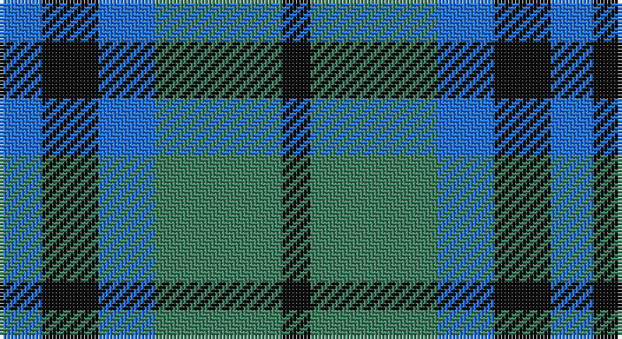

This page is one **sett** — a single exact thread-count. It belongs to the [tartan](/setts/b3k4b4g9k2/)
(the same proportion at any scale), whose colour order is pattern [BKBGK](/stripes/bkbgk/).

Sourced from register-of-tartans.  It is a [5 stripe tartan](/stripes/stripes5/).

Original link https://www.tartanregister.gov.uk/tartanDetails.aspx?ref=5239

## Also known as

This cloth is also recorded under:

- Keith
- Marshall
- Marshall #2

5 attestations — the source records this cloth was collapsed from (oldest owns this page)

<ul>
<li>01/01/1800 — Falconer (register-of-tartans, <a href="https://www.tartanregister.gov.uk/tartanDetails.aspx?ref=5239">record</a>)</li>
<li>pre 1800 — Falconer (Clan) (tartans-authority, <a href="http://www.tartansauthority.com/tartan-ferret/display/3874/">record</a>)</li>
<li>1838 — Keith (Clan) (tartans-authority, <a href="http://www.tartansauthority.com/tartan-ferret/display/253/">record</a>)</li>
<li>pre 2002 — Marshall (Clan) (tartans-authority, <a href="http://www.tartansauthority.com/tartan-ferret/display/3875/">record</a>)</li>
<li>undated — Marshall #2 (register-of-tartans, <a href="https://www.tartanregister.gov.uk/tartanDetails.aspx?ref=5240">record</a>)</li>
</ul>

## Register references

External register numbers recorded for this tartan.

- Scottish Register of Tartans: [5240](https://www.tartanregister.gov.uk/tartanDetails.aspx?ref=5240)
- Scottish Tartans Authority (ITI): 3875

## Thread count
B/12 K16 B16 G36 K/8

One full sett is **156 threads**.

## Palette

Palette: <strong>Tartan Register</strong>
<table><thead><tr><th>Colour</th><th>Threads</th><th>Shade</th><th>Base</th><th>OKLCh</th></tr></thead><tbody><tr><td>B/</td><td style="text-align:right;font-variant-numeric:tabular-nums">12</td><td><code style="background-color:#2474E8;">#2474E8</code> <small style="color:#888">#2474E8</small></td><td>B <code style="background-color:#2A418A;">#2A418A</code></td><td><small style="color:#888">oklch(57.8% 0.192 258.7)</small></td></tr><tr><td>K</td><td style="text-align:right;font-variant-numeric:tabular-nums">16</td><td><code style="background-color:#101010;">#101010</code> <small style="color:#888">#101010</small></td><td>K <code style="background-color:#000000;">#000000</code></td><td><small style="color:#888">oklch(17.3% 0.000 89.9)</small></td></tr><tr><td>B</td><td style="text-align:right;font-variant-numeric:tabular-nums">16</td><td><code style="background-color:#2474E8;">#2474E8</code> <small style="color:#888">#2474E8</small></td><td>B <code style="background-color:#2A418A;">#2A418A</code></td><td><small style="color:#888">oklch(57.8% 0.192 258.7)</small></td></tr><tr><td>G</td><td style="text-align:right;font-variant-numeric:tabular-nums">36</td><td><code style="background-color:#408060;">#408060</code> <small style="color:#888">#408060</small></td><td>G <code style="background-color:#006100;">#006100</code></td><td><small style="color:#888">oklch(54.8% 0.084 160.1)</small></td></tr><tr><td>K/</td><td style="text-align:right;font-variant-numeric:tabular-nums">8</td><td><code style="background-color:#101010;">#101010</code> <small style="color:#888">#101010</small></td><td>K <code style="background-color:#000000;">#000000</code></td><td><small style="color:#888">oklch(17.3% 0.000 89.9)</small></td></tr></tbody></table>

# Sample pattern

## Nearest tartans

The nearest existing variants by ΔTartan distance, with this tartan at the top so the swatches line up against it.

ΔTartan

Tartan

Sett

—

<a href="/ttd/edit/#slug=b3k4b4g9k2~x4">Falconer</a> <a class="nn-out" href="/variants/s5/b3k4b4g9k2~x4/" title="open its dictionary page">↗</a>

1.09

<a href="/ttd/edit/#slug=g9b4k4b3k4b4g9k2~x4&amp;base=b3k4b4g9k2~x4">Keith Clan</a> <a class="nn-out" href="/variants/s8/g9b4k4b3k4b4g9k2~x4/" title="open its dictionary page">↗</a>

1.11

<a href="/ttd/edit/#slug=g7k6b7k1b2~x2&amp;base=b3k4b4g9k2~x4">Campbell of Glenlyon</a> <a class="nn-out" href="/variants/s5/g7k6b7k1b2~x2/" title="open its dictionary page">↗</a>

1.11

<a href="/ttd/edit/#slug=g7k6b7k1b2~x4&amp;base=b3k4b4g9k2~x4">Campbell of Glenlyon Check (Clan)</a> <a class="nn-out" href="/variants/s5/g7k6b7k1b2~x4/" title="open its dictionary page">↗</a>

1.14

<a href="/ttd/edit/#slug=b6k6b18k18g22k5~x2&amp;base=b3k4b4g9k2~x4">Campbell, The 42nd</a> <a class="nn-out" href="/variants/s6/b6k6b18k18g22k5~x2/" title="open its dictionary page">↗</a>

1.32

<a href="/ttd/edit/#slug=t3o6k4t2~x2&amp;base=b3k4b4g9k2~x4">Bedford Check</a> <a class="nn-out" href="/variants/s4/t3o6k4t2~x2/" title="open its dictionary page">↗</a>

1.35

<a href="/ttd/edit/#slug=b10k10b10dg26ly5~x2&amp;base=b3k4b4g9k2~x4">Marshall of Keith (Personal)</a> <a class="nn-out" href="/variants/s5/b10k10b10dg26ly5~x2/" title="open its dictionary page">↗</a>

1.42

<a href="/ttd/edit/#slug=db9ly9db9t23r3~x2&amp;base=b3k4b4g9k2~x4">Tilburg (District)</a> <a class="nn-out" href="/variants/s5/db9ly9db9t23r3~x2/" title="open its dictionary page">↗</a>

1.46

<a href="/ttd/edit/#slug=t3dg12k14t11r3t3~x2&amp;base=b3k4b4g9k2~x4">Wellington or Waterloo</a> <a class="nn-out" href="/variants/s6/t3dg12k14t11r3t3~x2/" title="open its dictionary page">↗</a>

1.56

<a href="/ttd/edit/#slug=b3k2b8db8g8db2~x2&amp;base=b3k4b4g9k2~x4">Black Watch (Pendleton)</a> <a class="nn-out" href="/variants/s6/b3k2b8db8g8db2~x2/" title="open its dictionary page">↗</a>

1.61

<a href="/ttd/edit/#slug=db2g13db11t4w9db2~x2&amp;base=b3k4b4g9k2~x4">Loch Leven Check Trade Tartan</a> <a class="nn-out" href="/variants/s6/db2g13db11t4w9db2~x2/" title="open its dictionary page">↗</a>

## Neighbour map

Every grey dot is one of 14360 variants placed by the first two principal components of the ΔTartan feature space (44% of its variance). Red is this tartan; blue dots are its nearest — click one to open its page.

<svg viewBox="0 0 640 380" role="img" style="max-width:100%;height:auto;border:1px solid #e0e0e0;border-radius:4px;display:block" xmlns="http://www.w3.org/2000/svg"><image href="/nn/cloud.v1.png" width="640" height="380"/><a href="/variants/s8/g9b4k4b3k4b4g9k2~x4/"><circle cx="190.6" cy="283.9" r="4" fill="#3465a4"><title>Keith Clan</title></circle></a><a href="/variants/s5/g7k6b7k1b2~x2/"><circle cx="204.4" cy="290.4" r="4" fill="#3465a4"><title>Campbell of Glenlyon</title></circle></a><a href="/variants/s5/g7k6b7k1b2~x4/"><circle cx="204.4" cy="290.4" r="4" fill="#3465a4"><title>Campbell of Glenlyon Check (Clan)</title></circle></a><a href="/variants/s6/b6k6b18k18g22k5~x2/"><circle cx="181.0" cy="298.8" r="4" fill="#3465a4"><title>Campbell, The 42nd</title></circle></a><a href="/variants/s4/t3o6k4t2~x2/"><circle cx="149.3" cy="335.6" r="4" fill="#3465a4"><title>Bedford Check</title></circle></a><a href="/variants/s5/b10k10b10dg26ly5~x2/"><circle cx="157.6" cy="265.5" r="4" fill="#3465a4"><title>Marshall of Keith (Personal)</title></circle></a><a href="/variants/s5/db9ly9db9t23r3~x2/"><circle cx="194.3" cy="246.6" r="4" fill="#3465a4"><title>Tilburg (District)</title></circle></a><a href="/variants/s6/t3dg12k14t11r3t3~x2/"><circle cx="149.5" cy="265.5" r="4" fill="#3465a4"><title>Wellington or Waterloo</title></circle></a><a href="/variants/s6/b3k2b8db8g8db2~x2/"><circle cx="129.9" cy="282.9" r="4" fill="#3465a4"><title>Black Watch (Pendleton)</title></circle></a><a href="/variants/s6/db2g13db11t4w9db2~x2/"><circle cx="131.0" cy="233.8" r="4" fill="#3465a4"><title>Loch Leven Check Trade Tartan</title></circle></a><circle cx="180.5" cy="297.0" r="5" fill="#c00000"/></svg>

ID: /variants/s5/b3k4b4g9k2~x4/
