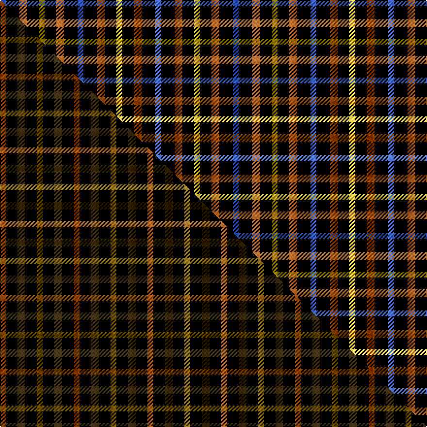

This page is one **sett** — a single exact thread-count. It belongs to the [tartan](/setts/b3k7o4k6ly3/)
(the same proportion at any scale), whose colour order is pattern [BKRKY](/stripes/bkrky/).

Part of the [Daks](/tartans/daks-3/) tartan — the named design grouping this sett with its other cloths.

Sourced from weddslist.  It is a [5 stripe tartan](/stripes/stripes5/).

Original link [http://www.weddslist.com/cgi-bin/tartans/pg.pl?source=sts](http://www.weddslist.com/cgi-bin/tartans/pg.pl?source=sts)

Dataset <small>— provenance for this record, inherited from the source manifest</small>

<dl class="dataset-prov">
<dt>source</dt><dd><a href="/sources/weddslist/">Weddslist</a></dd>
<dt>data captured from</dt><dd><a href="https://github.com/thetartan/tartan-database/blob/master/data/weddslist/data.csv">https://github.com/thetartan/tartan-database/blob/master/data/weddslist/data.csv</a></dd>
<dt>data date</dt><dd>2016-11-17 <small>(dataset default)</small></dd>
<dt>licence</dt><dd><a href="https://creativecommons.org/licenses/by-nc-nd/4.0/">CC BY-NC-ND 4.0</a></dd>
</dl>

Capture chain <small>— the hands this data passed through, oldest first; each capture carries its own licence</small>

<ol class="capture-chain">
<li><a href="https://www.weddslist.com/tartans/">Weddslist</a> <small>the living privately compiled reference</small></li>
<li><a href="https://github.com/thetartan/tartan-database">thetartan/tartan-database</a> <small>2016-2017</small> · <a href="https://creativecommons.org/licenses/by-nc-nd/4.0/">CC BY-NC-ND 4.0</a> <small>Levko Kravets's frozen compilation — the capture we vendored, and where its CC licence text came from</small></li>
<li>this dictionary <small>captured 2026-06-10 · commit 5bf86c7566</small> <small>each re-capture is a git commit to data/sources</small></li>
</ol>

## Thread count
B/6 K14 O8 K12 LY/6

One full sett is **80 threads**.

## Palette
<table><thead><tr><th>Colour</th><th>Shade</th><th>OKLCh</th></tr></thead><tbody><tr><td>B</td><td><code style="background-color:#466CC8;">#466CC8</code> <small style="color:#888">#466CC8</small></td><td><small style="color:#888">oklch(55.1% 0.149 265.0)</small></td></tr><tr><td>K</td><td><code style="background-color:#000000;">#000000</code> <small style="color:#888">#000000</small></td><td><small style="color:#888">oklch(0.0% 0.000 0.0)</small></td></tr><tr><td>O</td><td><code style="background-color:#A65C11;">#A65C11</code> <small style="color:#888">#A65C11</small></td><td><small style="color:#888">oklch(55.0% 0.125 58.3)</small></td></tr><tr><td>LY</td><td><code style="background-color:#DCBC32;">#DCBC32</code> <small style="color:#888">#DCBC32</small></td><td><small style="color:#888">oklch(80.0% 0.150 95.2)</small></td></tr></tbody></table>

# Sample pattern

## Compared to the master

This cloth is one sett of its design; the master sett (the exemplar the design is anchored on) is below for comparison.

Its **ΔTartan distance** from the master is **0.95** — the same measure the nearest-tartans table ranks by (0 is identical; a re-scale of the same cloth is near 0, a recolour or a different proportion further).

<figure class="master-compare" style="margin:0">

this sett
master sett ★

<figcaption style="color:#888;font-size:smaller">One weave of this sett against the <a href="/setts/o3k6dy4k6y3/">master sett ★</a>, split on the diagonal: a shared proportion runs seamlessly across it with only the shades shifting; a different proportion breaks on it.</figcaption>
</figure>

## Nearest tartan variants

The nearest existing variants by ΔTartan distance, with this cloth at the top so the swatches line up against it.

ΔTartan

Threads

Variant

Sett

—

80

<a href="/variants/s5/b3k7o4k6ly3~x2/">Daks - Black House Check, C.6700.06</a>

<a href="/ttd/edit/#slug=o3k6dy4k6y3~x2&amp;base=b3k7o4k6ly3~x2" title="compare in the TTD">0.95</a>

76

<a href="/variants/s5/o3k6dy4k6y3~x2/">Daks (Black)</a>

<a href="/ttd/edit/#slug=k4g8k7db8r4~x2&amp;base=b3k7o4k6ly3~x2" title="compare in the TTD">2.17</a>

108

<a href="/variants/s5/k4g8k7db8r4~x2/">Durham</a>

<a href="/ttd/edit/#slug=k1g3k3db3r1~x4&amp;base=b3k7o4k6ly3~x2" title="compare in the TTD">2.22</a>

80

<a href="/variants/s5/k1g3k3db3r1~x4/">Durham District Tartan</a>

<a href="/ttd/edit/#slug=db20k5db18lo26k6~x2&amp;base=b3k7o4k6ly3~x2" title="compare in the TTD">2.32</a>

248

<a href="/variants/s5/db20k5db18lo26k6~x2/">Johore Regiment (Military)</a>

<a href="/ttd/edit/#slug=k4y1k4y6r1~x4&amp;base=b3k7o4k6ly3~x2" title="compare in the TTD">2.36</a>

108

<a href="/variants/s5/k4y1k4y6r1~x4/">MacLeod Dress Clan Tartan</a>

<a href="/ttd/edit/#slug=lb3k16g16k16db3lb3~x2&amp;base=b3k7o4k6ly3~x2" title="compare in the TTD">2.92</a>

216

<a href="/variants/s6/lb3k16g16k16db3lb3~x2/">Murray</a>

<a href="/ttd/edit/#slug=db2k2db2o5dy1~x12&amp;base=b3k7o4k6ly3~x2" title="compare in the TTD">3.00</a>

252

<a href="/variants/s5/db2k2db2o5dy1~x12/">Chivas Regal (Corporate)</a>

<a href="/ttd/edit/#slug=db6k6db6o14dy3~x2&amp;base=b3k7o4k6ly3~x2" title="compare in the TTD">3.02</a>

122

<a href="/variants/s5/db6k6db6o14dy3~x2/">Chivas Regal</a>

<a href="/ttd/edit/#slug=k21r8n13k8&amp;base=b3k7o4k6ly3~x2" title="compare in the TTD">3.07</a>

71

<a href="/variants/s4/k21r8n13k8/">New Exeter Check (Fashion)</a>

<a href="/ttd/edit/#slug=k5g3lb2~x2&amp;base=b3k7o4k6ly3~x2" title="compare in the TTD">3.14</a>

26

<a href="/variants/s3/k5g3lb2~x2/">Glen Lyon, or Mull (No.53)</a>

## Neighbour map

Every grey dot is one of 13621 variants placed by the first two principal components of the ΔTartan feature space (42% of its variance). Red is this tartan; blue dots are its nearest — click one to open its page.

<svg viewBox="0 0 640 380" role="img" style="max-width:100%;height:auto;border:1px solid #e0e0e0;border-radius:4px;display:block" xmlns="http://www.w3.org/2000/svg"><image href="/nn/cloud.v1.png" width="640" height="380"/><a href="/variants/s5/o3k6dy4k6y3~x2/"><circle cx="151.6" cy="318.4" r="4" fill="#3465a4"><title>Daks (Black)</title></circle></a><a href="/variants/s5/k4g8k7db8r4~x2/"><circle cx="47.3" cy="324.7" r="4" fill="#3465a4"><title>Durham</title></circle></a><a href="/variants/s5/k1g3k3db3r1~x4/"><circle cx="86.0" cy="287.6" r="4" fill="#3465a4"><title>Durham District Tartan</title></circle></a><a href="/variants/s5/db20k5db18lo26k6~x2/"><circle cx="206.6" cy="261.6" r="4" fill="#3465a4"><title>Johore Regiment (Military)</title></circle></a><a href="/variants/s5/k4y1k4y6r1~x4/"><circle cx="230.3" cy="246.3" r="4" fill="#3465a4"><title>MacLeod Dress Clan Tartan</title></circle></a><a href="/variants/s6/lb3k16g16k16db3lb3~x2/"><circle cx="208.2" cy="224.2" r="4" fill="#3465a4"><title>Murray</title></circle></a><a href="/variants/s5/db2k2db2o5dy1~x12/"><circle cx="170.8" cy="259.4" r="4" fill="#3465a4"><title>Chivas Regal (Corporate)</title></circle></a><a href="/variants/s5/db6k6db6o14dy3~x2/"><circle cx="158.5" cy="267.2" r="4" fill="#3465a4"><title>Chivas Regal</title></circle></a><a href="/variants/s4/k21r8n13k8/"><circle cx="213.6" cy="303.1" r="4" fill="#3465a4"><title>New Exeter Check (Fashion)</title></circle></a><a href="/variants/s3/k5g3lb2~x2/"><circle cx="156.4" cy="333.7" r="4" fill="#3465a4"><title>Glen Lyon, or Mull (No.53)</title></circle></a><circle cx="144.8" cy="296.4" r="5" fill="#c00000"/><text x="320" y="376" text-anchor="middle" font-size="11" fill="#999">ground</text><text x="11" y="190" text-anchor="middle" font-size="11" fill="#999" transform="rotate(-90 11 190)">complexity</text></svg>

ID: /variants/s5/b3k7o4k6ly3~x2/
