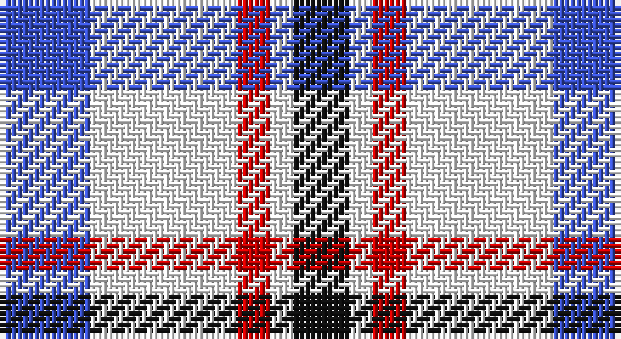

This page is one **sett** — a single exact thread-count. It belongs to the [tartan](/setts/b8w13r3w2k5/)
(the same proportion at any scale), whose colour order is pattern [BWRWK](/stripes/bwrwk/).

Part of the [Boswell Dress](/tartans/boswell-dress/) tartan — the named design grouping this sett with its other cloths.

Sourced from register-of-tartans.  It is a [5 stripe tartan](/stripes/stripes5/).

Original link https://www.tartanregister.gov.uk/tartanDetails.aspx?ref=318

## Also known as

This cloth is also recorded under:

- Boswell Dress Check
- Boswell Dress Personal

2 attestations — the source records this cloth was collapsed from (oldest owns this page)

<ul>
<li>01/08/2004 — Boswell Dress (Personal) (register-of-tartans, <a href="https://www.tartanregister.gov.uk/tartanDetails.aspx?ref=318">record</a>)</li>
<li>Aug 2004 — Boswell Dress Check (Personal) (tartans-authority, <a href="http://www.tartansauthority.com/tartan-ferret/display/6359/">record</a>)</li>
</ul>

## Register references

External register numbers recorded for this tartan.

- Scottish Register of Tartans: [318](https://www.tartanregister.gov.uk/tartanDetails.aspx?ref=318)
- Scottish Tartans Authority (ITI): 6359

## Thread count
B/16 W26 R6 W4 K/10

One full sett is **98 threads**.

## Palette

Palette: <strong>Tartan Register</strong>
<table><thead><tr><th>Colour</th><th>Threads</th><th>Shade</th><th>Base</th><th>OKLCh</th></tr></thead><tbody><tr><td>B/</td><td style="text-align:right;font-variant-numeric:tabular-nums">16</td><td><code style="background-color:#3850C8;">#3850C8</code> <small style="color:#888">#3850C8</small></td><td>B <code style="background-color:#2A418A;">#2A418A</code></td><td><small style="color:#888">oklch(48.8% 0.188 269.4)</small></td></tr><tr><td>W</td><td style="text-align:right;font-variant-numeric:tabular-nums">26</td><td><code style="background-color:#FFFFFF;">#FFFFFF</code> <small style="color:#888">#FFFFFF</small></td><td>W <code style="background-color:#F7F7F7;">#F7F7F7</code></td><td><small style="color:#888">oklch(100.0% 0.000 89.9)</small></td></tr><tr><td>R</td><td style="text-align:right;font-variant-numeric:tabular-nums">6</td><td><code style="background-color:#C80000;">#C80000</code> <small style="color:#888">#C80000</small></td><td>R <code style="background-color:#CC0000;">#CC0000</code></td><td><small style="color:#888">oklch(52.3% 0.215 29.2)</small></td></tr><tr><td>W</td><td style="text-align:right;font-variant-numeric:tabular-nums">4</td><td><code style="background-color:#FFFFFF;">#FFFFFF</code> <small style="color:#888">#FFFFFF</small></td><td>W <code style="background-color:#F7F7F7;">#F7F7F7</code></td><td><small style="color:#888">oklch(100.0% 0.000 89.9)</small></td></tr><tr><td>K/</td><td style="text-align:right;font-variant-numeric:tabular-nums">10</td><td><code style="background-color:#101010;">#101010</code> <small style="color:#888">#101010</small></td><td>K <code style="background-color:#000000;">#000000</code></td><td><small style="color:#888">oklch(17.3% 0.000 89.9)</small></td></tr></tbody></table>

# Sample pattern

## Nearest tartans

The nearest existing variants by ΔTartan distance, with this tartan at the top so the swatches line up against it.

ΔTartan

Tartan

Sett

—

<a href="/ttd/edit/#slug=b8w13r3w2k5~x2">Boswell Dress (Personal)</a> <a class="nn-out" href="/variants/s5/b8w13r3w2k5~x2/" title="open its dictionary page">↗</a>

0.95

<a href="/ttd/edit/#slug=r7w36db36ly7~x2&amp;base=b8w13r3w2k5~x2">MacRae of Conchra #3</a> <a class="nn-out" href="/variants/s4/r7w36db36ly7~x2/" title="open its dictionary page">↗</a>

1.30

<a href="/variants/s4/k5w24n24ki5~x2/">City of London</a>

1.33

<a href="/ttd/edit/#slug=r2w6db2w9db9w2db6ly2~x4&amp;base=b8w13r3w2k5~x2">North Vancouver Island</a> <a class="nn-out" href="/variants/s8/r2w6db2w9db9w2db6ly2~x4/" title="open its dictionary page">↗</a>

1.34

<a href="/ttd/edit/#slug=k5n24w24r5~x2&amp;base=b8w13r3w2k5~x2">City of London (Corporate)</a> <a class="nn-out" href="/variants/s4/k5n24w24r5~x2/" title="open its dictionary page">↗</a>

1.44

<a href="/ttd/edit/#slug=r2w6db2w9db9w2db6ly2~x2&amp;base=b8w13r3w2k5~x2">North Vancouver, Island</a> <a class="nn-out" href="/variants/s8/r2w6db2w9db9w2db6ly2~x2/" title="open its dictionary page">↗</a>

1.45

<a href="/ttd/edit/#slug=r1w8dt8ly1~x4&amp;base=b8w13r3w2k5~x2">MacRae of Conchra</a> <a class="nn-out" href="/variants/s4/r1w8dt8ly1~x4/" title="open its dictionary page">↗</a>

1.49

<a href="/ttd/edit/#slug=r21db61ly8w21~x2&amp;base=b8w13r3w2k5~x2">Kellogg College University of Oxford</a> <a class="nn-out" href="/variants/s4/r21db61ly8w21~x2/" title="open its dictionary page">↗</a>

1.52

<a href="/ttd/edit/#slug=w1b3w3b1w5k1w2k3lo1~x4&amp;base=b8w13r3w2k5~x2">Henderson Dress (Dance)</a> <a class="nn-out" href="/variants/s9/w1b3w3b1w5k1w2k3lo1~x4/" title="open its dictionary page">↗</a>

1.58

<a href="/ttd/edit/#slug=o22ly10w3db8~x2&amp;base=b8w13r3w2k5~x2">Louisburg</a> <a class="nn-out" href="/variants/s4/o22ly10w3db8~x2/" title="open its dictionary page">↗</a>

1.59

<a href="/ttd/edit/#slug=k1w8db8r1~x8&amp;base=b8w13r3w2k5~x2">MacRae Dress Purple</a> <a class="nn-out" href="/variants/s4/k1w8db8r1~x8/" title="open its dictionary page">↗</a>

## Neighbour map

Every grey dot is one of 14360 variants placed by the first two principal components of the ΔTartan feature space (44% of its variance). Red is this tartan; blue dots are its nearest — click one to open its page.

<svg viewBox="0 0 640 380" role="img" style="max-width:100%;height:auto;border:1px solid #e0e0e0;border-radius:4px;display:block" xmlns="http://www.w3.org/2000/svg"><image href="/nn/cloud.v1.png" width="640" height="380"/><a href="/variants/s4/r7w36db36ly7~x2/"><circle cx="160.8" cy="234.0" r="4" fill="#3465a4"><title>MacRae of Conchra #3</title></circle></a><a href="/variants/s4/k5w24n24ki5~x2/"><circle cx="146.1" cy="237.9" r="4" fill="#3465a4"><title>City of London</title></circle></a><a href="/variants/s8/r2w6db2w9db9w2db6ly2~x4/"><circle cx="156.0" cy="214.8" r="4" fill="#3465a4"><title>North Vancouver Island</title></circle></a><a href="/variants/s4/k5n24w24r5~x2/"><circle cx="154.9" cy="237.3" r="4" fill="#3465a4"><title>City of London (Corporate)</title></circle></a><a href="/variants/s8/r2w6db2w9db9w2db6ly2~x2/"><circle cx="169.0" cy="222.5" r="4" fill="#3465a4"><title>North Vancouver, Island</title></circle></a><a href="/variants/s4/r1w8dt8ly1~x4/"><circle cx="207.3" cy="213.6" r="4" fill="#3465a4"><title>MacRae of Conchra</title></circle></a><a href="/variants/s4/r21db61ly8w21~x2/"><circle cx="241.4" cy="223.6" r="4" fill="#3465a4"><title>Kellogg College University of Oxford</title></circle></a><a href="/variants/s9/w1b3w3b1w5k1w2k3lo1~x4/"><circle cx="173.3" cy="206.1" r="4" fill="#3465a4"><title>Henderson Dress (Dance)</title></circle></a><a href="/variants/s4/o22ly10w3db8~x2/"><circle cx="218.7" cy="236.7" r="4" fill="#3465a4"><title>Louisburg</title></circle></a><a href="/variants/s4/k1w8db8r1~x8/"><circle cx="212.0" cy="213.0" r="4" fill="#3465a4"><title>MacRae Dress Purple</title></circle></a><circle cx="164.3" cy="214.5" r="5" fill="#c00000"/></svg>

ID: /variants/s5/b8w13r3w2k5~x2/
