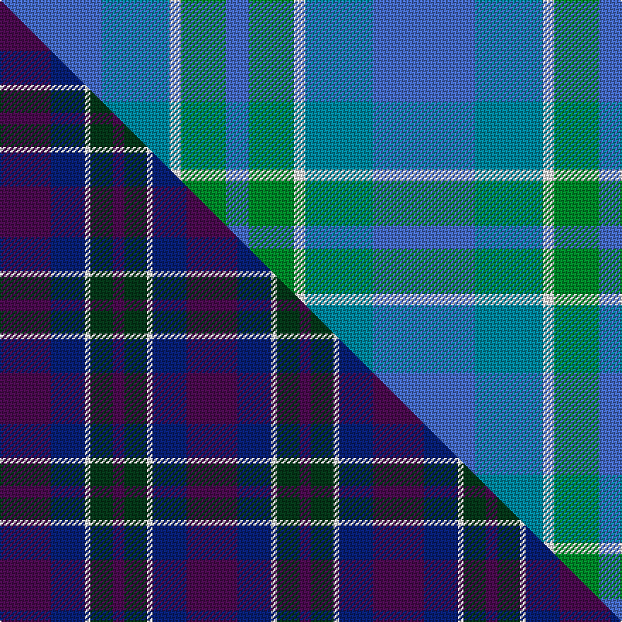

This is one **variant** — a specific cloth: this exact thread count and colourway, with its own
provenance below. It is one weaving of the [sett](/setts/b9t6w1g4b2/) (the scale-free proportion — the
same cloth at any scale or shade), whose colour order is pattern [BBWGB](/stripes/bbwgb/).

Part of the [Cathro](/tartans/c/ca/cathro/) tartan — the named design grouping this sett with its other cloths.

Sourced from tartans-authority.  It is a [5 stripe tartan](/stripes/stripes5/).

Original link [https://www.tartanregister.gov.uk/tartanDetails.aspx?ref=7354](https://www.tartanregister.gov.uk/tartanDetails.aspx?ref=7354)

Dataset <small>— provenance for this record, inherited from the source manifest</small>

<dl class="dataset-prov">
<dt>source</dt><dd><a href="/sources/tartans-authority/">Scottish Tartans Authority</a></dd>
<dt>data captured from</dt><dd><a href="https://github.com/thetartan/tartan-database/blob/master/data/tartans-authority/data.csv">https://github.com/thetartan/tartan-database/blob/master/data/tartans-authority/data.csv</a></dd>
<dt>data date</dt><dd>pre 2007 <small>(this record)</small></dd>
<dt>licence</dt><dd><a href="https://creativecommons.org/licenses/by-nc-nd/4.0/">CC BY-NC-ND 4.0</a></dd>
</dl>

Capture chain <small>— the hands this data passed through, oldest first; each capture carries its own licence</small>

<ol class="capture-chain">
<li><a href="https://www.tartansauthority.com/">Scottish Tartans Authority</a> <small>the heritage body's archive — its tartan-ferret record browser is retired (links repaired to the SRT, above)</small></li>
<li><a href="https://github.com/thetartan/tartan-database">thetartan/tartan-database</a> <small>2016-2017</small> · <a href="https://creativecommons.org/licenses/by-nc-nd/4.0/">CC BY-NC-ND 4.0</a> <small>Levko Kravets's frozen compilation — the capture we vendored, and where its CC licence text came from</small></li>
<li>this dictionary <small>captured 2026-06-10 · commit 5bf86c7566</small> <small>each re-capture is a git commit to data/sources</small></li>
</ol>

## Register references

External register numbers recorded for this tartan.

- Scottish Tartans Authority (ITI): 7354

## Thread count
B/72 T48 W8 G32 B/16

One full sett is **264 threads**.

## Palette
<table><thead><tr><th>Colour</th><th>Shade</th><th>OKLCh</th></tr></thead><tbody><tr><td>T</td><td><code style="background-color:#00879F;">#00879F</code> <small style="color:#888">#00879F</small></td><td><small style="color:#888">oklch(57.4% 0.102 216.1)</small></td></tr><tr><td>G</td><td><code style="background-color:#008B2A;">#008B2A</code> <small style="color:#888">#008B2A</small></td><td><small style="color:#888">oklch(55.4% 0.170 145.9)</small></td></tr><tr><td>W</td><td><code style="background-color:#F7F7F7;">#F7F7F7</code> <small style="color:#888">#F7F7F7</small></td><td><small style="color:#888">oklch(97.6% 0.000 89.9)</small></td></tr><tr><td>B</td><td><code style="background-color:#466CC8;">#466CC8</code> <small style="color:#888">#466CC8</small></td><td><small style="color:#888">oklch(55.1% 0.149 265.0)</small></td></tr></tbody></table>

# Sample pattern

## Compared to the master

This cloth is one sett of its design; the master sett (the exemplar the design is anchored on) is below for comparison.

Its **ΔTartan distance** from the master is **5.57** — the same measure the nearest-tartans table ranks by (0 is identical; a re-scale of the same cloth is near 0, a recolour or a different proportion further).

<figure class="master-compare" style="margin:0">

this sett
master sett ★

<figcaption style="color:#888;font-size:smaller">One weave of this sett against the <a href="/setts/dp9db6w1dg4dp2/">master sett ★</a>, split on the diagonal: a shared proportion runs seamlessly across it with only the shades shifting; a different proportion breaks on it.</figcaption>
</figure>

## Nearest tartan variants

The nearest existing variants by ΔTartan distance, with this cloth at the top so the swatches line up against it.

ΔTartan

Threads

Variant

Sett

—

264

<a href="/variants/s5/b9t6w1g4b2~x8/">Cathro (Name)</a>

<a href="/ttd/edit/#slug=db4b1dg14db14dr1~x4~db0906265-b1611266&amp;base=b9t6w1g4b2~x8" title="compare in the TTD">1.57</a>

252

<a href="/variants/s5/db4b1dg14db14dr1~x4~db0906265-b1611266/">Wcwm 1255-1</a>

<a href="/ttd/edit/#slug=db35w3db8t36dg9o3~x2~db1605267-t2605232&amp;base=b9t6w1g4b2~x8" title="compare in the TTD">1.67</a>

300

<a href="/variants/s6/db35w3db8t36dg9o3~x2~db1605267-t2605232/">Georgian Bay, Waters of</a>

<a href="/ttd/edit/#slug=t5dy2dg4n3w1t5~x8&amp;base=b9t6w1g4b2~x8" title="compare in the TTD">1.98</a>

240

<a href="/variants/s6/t5dy2dg4n3w1t5~x8/">Heriot Bay (District)</a>

<a href="/ttd/edit/#slug=db2b22dg11y2dg11db2~x2&amp;base=b9t6w1g4b2~x8" title="compare in the TTD">2.16</a>

192

<a href="/variants/s6/db2b22dg11y2dg11db2~x2/">Cetoloni</a>

<a href="/ttd/edit/#slug=db22n5dp9g14db10lo2~x2&amp;base=b9t6w1g4b2~x8" title="compare in the TTD">2.40</a>

200

<a href="/variants/s6/db22n5dp9g14db10lo2~x2/">Belfrage (Name)</a>

<a href="/ttd/edit/#slug=lb4w2g17lb17lo2~x4~w4000000-g2405163&amp;base=b9t6w1g4b2~x8" title="compare in the TTD">2.41</a>

312

<a href="/variants/s5/lb4w2g17lb17lo2~x4~w4000000-g2405163/">Bermuda (1986)</a>

<a href="/ttd/edit/#slug=y1db11dbi5db2g1~x4~db1003265-dbi1605267&amp;base=b9t6w1g4b2~x8" title="compare in the TTD">2.51</a>

152

<a href="/variants/s5/y1db11dbi5db2g1~x4~db1003265-dbi1605267/">Open Championship, The</a>

<a href="/ttd/edit/#slug=dp3dt15db15r2db15y3~x2&amp;base=b9t6w1g4b2~x8" title="compare in the TTD">2.59</a>

200

<a href="/variants/s6/dp3dt15db15r2db15y3~x2/">H.M.S. DUNCAN</a>

<a href="/ttd/edit/#slug=t4g8t18w3~x2&amp;base=b9t6w1g4b2~x8" title="compare in the TTD">2.70</a>

118

<a href="/variants/s4/t4g8t18w3~x2/">Blue Meadow Check (Fashion)</a>

<a href="/ttd/edit/#slug=g15b2w2b11n28b4~x2~g2003152-n2002277&amp;base=b9t6w1g4b2~x8" title="compare in the TTD">2.82</a>

210

<a href="/variants/s6/g15b2w2b11n28b4~x2~g2003152-n2002277/">Rhode Island, The State of</a>

## Neighbour map

Every grey dot is one of 13621 variants placed by the first two principal components of the ΔTartan feature space (42% of its variance). Red is this tartan; blue dots are its nearest — click one to open its page. The map is a flat projection of a many-dimensional space — [how to read it](/posts/neighbourhood-maps/).

<svg viewBox="0 0 640 380" role="img" style="max-width:100%;height:auto;border:1px solid #e0e0e0;border-radius:4px;display:block" xmlns="http://www.w3.org/2000/svg"><image href="/nn/cloud.v1.png" width="640" height="380"/><a href="/variants/s5/db4b1dg14db14dr1~x4~db0906265-b1611266/"><circle cx="476.9" cy="266.0" r="4" fill="#3465a4"><title>Wcwm 1255-1</title></circle></a><a href="/variants/s6/db35w3db8t36dg9o3~x2~db1605267-t2605232/"><circle cx="290.0" cy="208.2" r="4" fill="#3465a4"><title>Georgian Bay, Waters of</title></circle></a><a href="/variants/s6/t5dy2dg4n3w1t5~x8/"><circle cx="251.1" cy="305.7" r="4" fill="#3465a4"><title>Heriot Bay (District)</title></circle></a><a href="/variants/s6/db2b22dg11y2dg11db2~x2/"><circle cx="337.9" cy="242.3" r="4" fill="#3465a4"><title>Cetoloni</title></circle></a><a href="/variants/s6/db22n5dp9g14db10lo2~x2/"><circle cx="291.6" cy="245.4" r="4" fill="#3465a4"><title>Belfrage (Name)</title></circle></a><a href="/variants/s5/lb4w2g17lb17lo2~x4~w4000000-g2405163/"><circle cx="390.1" cy="279.3" r="4" fill="#3465a4"><title>Bermuda (1986)</title></circle></a><a href="/variants/s5/y1db11dbi5db2g1~x4~db1003265-dbi1605267/"><circle cx="516.4" cy="260.9" r="4" fill="#3465a4"><title>Open Championship, The</title></circle></a><a href="/variants/s6/dp3dt15db15r2db15y3~x2/"><circle cx="397.2" cy="268.3" r="4" fill="#3465a4"><title>H.M.S. DUNCAN</title></circle></a><a href="/variants/s4/t4g8t18w3~x2/"><circle cx="471.8" cy="323.3" r="4" fill="#3465a4"><title>Blue Meadow Check (Fashion)</title></circle></a><a href="/variants/s6/g15b2w2b11n28b4~x2~g2003152-n2002277/"><circle cx="457.9" cy="280.0" r="4" fill="#3465a4"><title>Rhode Island, The State of</title></circle></a><circle cx="381.1" cy="303.3" r="5" fill="#c00000"/><text x="320" y="376" text-anchor="middle" font-size="11" fill="#999">ground</text><text x="11" y="190" text-anchor="middle" font-size="11" fill="#999" transform="rotate(-90 11 190)">complexity</text></svg>

ID: /variants/s5/b9t6w1g4b2~x8/
