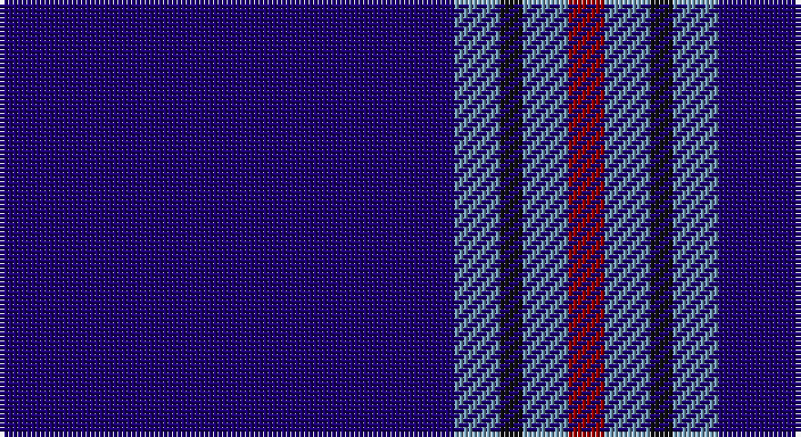

This page is one **sett** — a single exact thread-count. It belongs to the [tartan](/setts/db100t10k5t10r8/)
(the same proportion at any scale), whose colour order is pattern [BBKBR](/stripes/bbkbr/).

Part of the [Waugh](/tartans/waugh/) tartan — the named design grouping this sett with its other cloths.

Sourced from tartans-authority.  It is a [5 stripe tartan](/stripes/stripes5/).

Original link http://www.tartansauthority.com/tartan-ferret/display/10028/

## Register references

External register numbers recorded for this tartan.

- Scottish Register of Tartans: [10028](https://www.tartanregister.gov.uk/tartanDetails?ref=10028)
- Scottish Tartans Authority (ITI): 10028

## Thread count
DB/100 B10 K5 B10 DR/8

One full sett is **158 threads**.

## Palette

Palette: <strong>Tartan Register</strong> <small style="color:#888">(2 of 4 colours)</small>
<table><thead><tr><th>Colour</th><th>Threads</th><th>Shade</th><th>Base</th><th>OKLCh</th></tr></thead><tbody><tr><td>DB/</td><td style="text-align:right;font-variant-numeric:tabular-nums">100</td><td><code style="background-color:#1C0070;">#1C0070</code> <small style="color:#888">#1C0070</small></td><td>B <code style="background-color:#2A418A;">#2A418A</code></td><td><small style="color:#888">oklch(26.3% 0.162 277.1)</small></td></tr><tr><td>B</td><td style="text-align:right;font-variant-numeric:tabular-nums">10</td><td><code style="background-color:#7098B0;">#7098B0</code> <small style="color:#888">#7098B0</small></td><td>B <code style="background-color:#2A418A;">#2A418A</code></td><td><small style="color:#888">oklch(65.9% 0.057 235.1)</small></td></tr><tr><td>K</td><td style="text-align:right;font-variant-numeric:tabular-nums">5</td><td><code style="background-color:#101010;">#101010</code> <small style="color:#888">#101010</small></td><td>K <code style="background-color:#000000;">#000000</code></td><td><small style="color:#888">oklch(17.3% 0.000 89.9)</small></td></tr><tr><td>B</td><td style="text-align:right;font-variant-numeric:tabular-nums">10</td><td><code style="background-color:#7098B0;">#7098B0</code> <small style="color:#888">#7098B0</small></td><td>B <code style="background-color:#2A418A;">#2A418A</code></td><td><small style="color:#888">oklch(65.9% 0.057 235.1)</small></td></tr><tr><td>DR/</td><td style="text-align:right;font-variant-numeric:tabular-nums">8</td><td><code style="background-color:#980000;">#980000</code> <small style="color:#888">#980000</small></td><td>R <code style="background-color:#CC0000;">#CC0000</code></td><td><small style="color:#888">oklch(42.7% 0.175 29.2)</small></td></tr></tbody></table>

# Sample pattern

## Compared to the master

This cloth is one sett of its design; the master sett (the exemplar the design is anchored on) is below for comparison.

<figure style="margin:0"><figcaption style="color:#888;font-size:smaller">this sett</figcaption></figure>
<figure style="margin:0"><figcaption style="color:#888;font-size:smaller"><a href="/setts/db100y10k5y10r8/">master sett →</a></figcaption></figure>

## Nearest tartans

The nearest existing variants by ΔTartan distance, with this tartan at the top so the swatches line up against it.

ΔTartan

Tartan

Sett

—

<a href="/ttd/edit/#slug=db100t10k5t10r8">Waugh (Name)</a> <a class="nn-out" href="/variants/s5/db100t10k5t10r8/" title="open its dictionary page">↗</a>

0.78

<a href="/ttd/edit/#slug=db100y10k5y10r8&amp;base=db100t10k5t10r8">Waugh</a> <a class="nn-out" href="/variants/s5/db100y10k5y10r8/" title="open its dictionary page">↗</a>

0.91

<a href="/ttd/edit/#slug=r2k6db33w2~x4&amp;base=db100t10k5t10r8">McCallie</a> <a class="nn-out" href="/variants/s4/r2k6db33w2~x4/" title="open its dictionary page">↗</a>

1.33

<a href="/ttd/edit/#slug=db128r8t41n4t4n4&amp;base=db100t10k5t10r8">French Freemasons' Pride (Fashion)</a> <a class="nn-out" href="/variants/s6/db128r8t41n4t4n4/" title="open its dictionary page">↗</a>

1.37

<a href="/ttd/edit/#slug=db12lb1k2db1r1~x8&amp;base=db100t10k5t10r8">Lochcarron (1985)</a> <a class="nn-out" href="/variants/s5/db12lb1k2db1r1~x8/" title="open its dictionary page">↗</a>

1.38

<a href="/ttd/edit/#slug=db35w4db10ri3r3ri3~x4&amp;base=db100t10k5t10r8">Steffen, Morris (Personal)</a> <a class="nn-out" href="/variants/s6/db35w4db10ri3r3ri3~x4/" title="open its dictionary page">↗</a>

1.42

<a href="/ttd/edit/#slug=db35k10db4w2db3r2ly2~x2&amp;base=db100t10k5t10r8">Laidlaw's Highland Drovers (Corp)</a> <a class="nn-out" href="/variants/s7/db35k10db4w2db3r2ly2~x2/" title="open its dictionary page">↗</a>

1.52

<a href="/ttd/edit/#slug=db29dbi2db1dbi1db1dbi1t8lo1~x4&amp;base=db100t10k5t10r8">Marist School, The</a> <a class="nn-out" href="/variants/s8/db29dbi2db1dbi1db1dbi1t8lo1~x4/" title="open its dictionary page">↗</a>

1.52

<a href="/ttd/edit/#slug=db61r6w2r8lo2db3lo2db15~x2&amp;base=db100t10k5t10r8">Duke of York (Royal)</a> <a class="nn-out" href="/variants/s8/db61r6w2r8lo2db3lo2db15~x2/" title="open its dictionary page">↗</a>

1.52

<a href="/ttd/edit/#slug=db4w3b6db40b8db12g3~x2&amp;base=db100t10k5t10r8">JetBlue (Corporate)</a> <a class="nn-out" href="/variants/s7/db4w3b6db40b8db12g3~x2/" title="open its dictionary page">↗</a>

1.58

<a href="/ttd/edit/#slug=w2db49r5ly2r5ly2~x2&amp;base=db100t10k5t10r8">Balmer (Personal)</a> <a class="nn-out" href="/variants/s6/w2db49r5ly2r5ly2~x2/" title="open its dictionary page">↗</a>

## Neighbour map

Every grey dot is one of 14360 variants placed by the first two principal components of the ΔTartan feature space (44% of its variance). Red is this tartan; blue dots are its nearest — click one to open its page.

<svg viewBox="0 0 640 380" role="img" style="max-width:100%;height:auto;border:1px solid #e0e0e0;border-radius:4px;display:block" xmlns="http://www.w3.org/2000/svg"><image href="/nn/cloud.v1.png" width="640" height="380"/><a href="/variants/s5/db100y10k5y10r8/"><circle cx="500.7" cy="185.1" r="4" fill="#3465a4"><title>Waugh</title></circle></a><a href="/variants/s4/r2k6db33w2~x4/"><circle cx="506.8" cy="205.3" r="4" fill="#3465a4"><title>McCallie</title></circle></a><a href="/variants/s6/db128r8t41n4t4n4/"><circle cx="480.5" cy="159.3" r="4" fill="#3465a4"><title>French Freemasons' Pride (Fashion)</title></circle></a><a href="/variants/s5/db12lb1k2db1r1~x8/"><circle cx="475.1" cy="204.9" r="4" fill="#3465a4"><title>Lochcarron (1985)</title></circle></a><a href="/variants/s6/db35w4db10ri3r3ri3~x4/"><circle cx="493.9" cy="197.0" r="4" fill="#3465a4"><title>Steffen, Morris (Personal)</title></circle></a><a href="/variants/s7/db35k10db4w2db3r2ly2~x2/"><circle cx="452.2" cy="154.0" r="4" fill="#3465a4"><title>Laidlaw's Highland Drovers (Corp)</title></circle></a><a href="/variants/s8/db29dbi2db1dbi1db1dbi1t8lo1~x4/"><circle cx="501.9" cy="144.4" r="4" fill="#3465a4"><title>Marist School, The</title></circle></a><a href="/variants/s8/db61r6w2r8lo2db3lo2db15~x2/"><circle cx="550.3" cy="141.9" r="4" fill="#3465a4"><title>Duke of York (Royal)</title></circle></a><a href="/variants/s7/db4w3b6db40b8db12g3~x2/"><circle cx="470.9" cy="201.2" r="4" fill="#3465a4"><title>JetBlue (Corporate)</title></circle></a><a href="/variants/s6/w2db49r5ly2r5ly2~x2/"><circle cx="507.6" cy="140.8" r="4" fill="#3465a4"><title>Balmer (Personal)</title></circle></a><circle cx="511.7" cy="184.0" r="5" fill="#c00000"/></svg>

ID: /variants/s5/db100t10k5t10r8/
