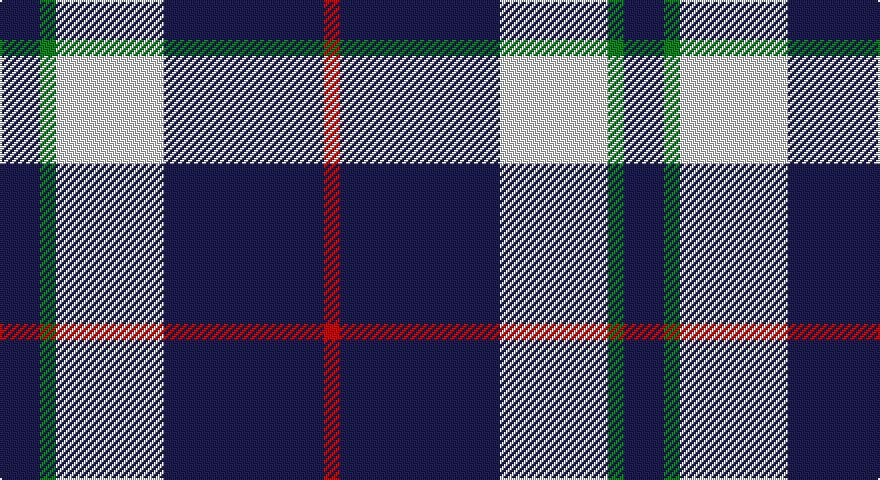

This page is one **sett** — a single exact thread-count. It belongs to the [tartan](/setts/db10g4w27db40r4/)
(the same proportion at any scale), whose colour order is pattern [BGWBR](/stripes/bgwbr/).

Sourced from tartans-authority.  It is a [5 stripe tartan](/stripes/stripes5/).

Original link http://www.tartansauthority.com/tartan-ferret/display/7398/

## Register references

External register numbers recorded for this tartan.

- Scottish Tartans Authority (ITI): 7398

## Thread count
DB/20 G8 LN54 DB80 R/8

One full sett is **312 threads**.

## Palette

Palette: <strong>Tartan Register</strong> <small style="color:#888">(3 of 4 colours)</small>
<table><thead><tr><th>Colour</th><th>Threads</th><th>Shade</th><th>Base</th><th>OKLCh</th></tr></thead><tbody><tr><td>DB/</td><td style="text-align:right;font-variant-numeric:tabular-nums">20</td><td><code style="background-color:#1C1C50;">#1C1C50</code> <small style="color:#888">#1C1C50</small></td><td>B <code style="background-color:#2A418A;">#2A418A</code></td><td><small style="color:#888">oklch(26.2% 0.093 277.9)</small></td></tr><tr><td>G</td><td style="text-align:right;font-variant-numeric:tabular-nums">8</td><td><code style="background-color:#00801C;">#00801C</code> <small style="color:#888">#00801C</small></td><td>G <code style="background-color:#006100;">#006100</code></td><td><small style="color:#888">oklch(52.1% 0.166 144.5)</small></td></tr><tr><td>LN</td><td style="text-align:right;font-variant-numeric:tabular-nums">54</td><td><code style="background-color:#E0E0E0;">#E0E0E0</code> <small style="color:#888">#E0E0E0</small></td><td>W <code style="background-color:#F7F7F7;">#F7F7F7</code></td><td><small style="color:#888">oklch(90.7% 0.000 89.9)</small></td></tr><tr><td>DB</td><td style="text-align:right;font-variant-numeric:tabular-nums">80</td><td><code style="background-color:#1C1C50;">#1C1C50</code> <small style="color:#888">#1C1C50</small></td><td>B <code style="background-color:#2A418A;">#2A418A</code></td><td><small style="color:#888">oklch(26.2% 0.093 277.9)</small></td></tr><tr><td>R/</td><td style="text-align:right;font-variant-numeric:tabular-nums">8</td><td><code style="background-color:#C80000;">#C80000</code> <small style="color:#888">#C80000</small></td><td>R <code style="background-color:#CC0000;">#CC0000</code></td><td><small style="color:#888">oklch(52.3% 0.215 29.2)</small></td></tr></tbody></table>

# Sample pattern

## Nearest tartans

The nearest existing variants by ΔTartan distance, with this tartan at the top so the swatches line up against it.

ΔTartan

Tartan

Sett

—

<a href="/ttd/edit/#slug=db10g4w27db40r4~x2">Turnbull Dress, Bruce (Personal)</a> <a class="nn-out" href="/variants/s5/db10g4w27db40r4~x2/" title="open its dictionary page">↗</a>

1.34

<a href="/ttd/edit/#slug=lo8w3db40k12w3lo3~x2&amp;base=db10g4w27db40r4~x2">Wolverines (Corporate)</a> <a class="nn-out" href="/variants/s6/lo8w3db40k12w3lo3~x2/" title="open its dictionary page">↗</a>

1.37

<a href="/ttd/edit/#slug=k3lr16k4lr3k12w2~x3&amp;base=db10g4w27db40r4~x2">MacMugen</a> <a class="nn-out" href="/variants/s6/k3lr16k4lr3k12w2~x3/" title="open its dictionary page">↗</a>

1.38

<a href="/ttd/edit/#slug=r21db61lo8w21~x2&amp;base=db10g4w27db40r4~x2">Kellogg College University of Oxford</a> <a class="nn-out" href="/variants/s4/r21db61lo8w21~x2/" title="open its dictionary page">↗</a>

1.39

<a href="/ttd/edit/#slug=r5k3t22k17t22k3ly5~x2&amp;base=db10g4w27db40r4~x2">MacCrimmon from Skye</a> <a class="nn-out" href="/variants/s7/r5k3t22k17t22k3ly5~x2/" title="open its dictionary page">↗</a>

1.40

<a href="/ttd/edit/#slug=k23ly3k23w36r4~x2&amp;base=db10g4w27db40r4~x2">Macleod, Winnifred Mary, Dress</a> <a class="nn-out" href="/variants/s5/k23ly3k23w36r4~x2/" title="open its dictionary page">↗</a>

1.46

<a href="/ttd/edit/#slug=k8ly2b21w3r2~x4&amp;base=db10g4w27db40r4~x2">Oklahoma</a> <a class="nn-out" href="/variants/s5/k8ly2b21w3r2~x4/" title="open its dictionary page">↗</a>

1.47

<a href="/ttd/edit/#slug=k5w25r6k45w4~x2&amp;base=db10g4w27db40r4~x2">Shembe Zulu Church</a> <a class="nn-out" href="/variants/s5/k5w25r6k45w4~x2/" title="open its dictionary page">↗</a>

1.47

<a href="/ttd/edit/#slug=db8w3db28w32k3w4~x2&amp;base=db10g4w27db40r4~x2">Ailsa, Navy (Dance)</a> <a class="nn-out" href="/variants/s6/db8w3db28w32k3w4~x2/" title="open its dictionary page">↗</a>

1.48

<a href="/ttd/edit/#slug=k1w3db2w4db8w1db1~x6&amp;base=db10g4w27db40r4~x2">Queen Margaret University (Corporate</a> <a class="nn-out" href="/variants/s7/k1w3db2w4db8w1db1~x6/" title="open its dictionary page">↗</a>

1.48

<a href="/ttd/edit/#slug=r21db61ly8w21~x2&amp;base=db10g4w27db40r4~x2">Kellogg College University of Oxford</a> <a class="nn-out" href="/variants/s4/r21db61ly8w21~x2/" title="open its dictionary page">↗</a>

## Neighbour map

Every grey dot is one of 14360 variants placed by the first two principal components of the ΔTartan feature space (44% of its variance). Red is this tartan; blue dots are its nearest — click one to open its page.

<svg viewBox="0 0 640 380" role="img" style="max-width:100%;height:auto;border:1px solid #e0e0e0;border-radius:4px;display:block" xmlns="http://www.w3.org/2000/svg"><image href="/nn/cloud.v1.png" width="640" height="380"/><a href="/variants/s6/lo8w3db40k12w3lo3~x2/"><circle cx="306.2" cy="167.4" r="4" fill="#3465a4"><title>Wolverines (Corporate)</title></circle></a><a href="/variants/s6/k3lr16k4lr3k12w2~x3/"><circle cx="251.0" cy="222.2" r="4" fill="#3465a4"><title>MacMugen</title></circle></a><a href="/variants/s4/r21db61lo8w21~x2/"><circle cx="230.1" cy="223.1" r="4" fill="#3465a4"><title>Kellogg College University of Oxford</title></circle></a><a href="/variants/s7/r5k3t22k17t22k3ly5~x2/"><circle cx="264.1" cy="215.5" r="4" fill="#3465a4"><title>MacCrimmon from Skye</title></circle></a><a href="/variants/s5/k23ly3k23w36r4~x2/"><circle cx="247.0" cy="200.0" r="4" fill="#3465a4"><title>Macleod, Winnifred Mary, Dress</title></circle></a><a href="/variants/s5/k8ly2b21w3r2~x4/"><circle cx="279.0" cy="182.1" r="4" fill="#3465a4"><title>Oklahoma</title></circle></a><a href="/variants/s5/k5w25r6k45w4~x2/"><circle cx="315.9" cy="199.2" r="4" fill="#3465a4"><title>Shembe Zulu Church</title></circle></a><a href="/variants/s6/db8w3db28w32k3w4~x2/"><circle cx="278.4" cy="190.9" r="4" fill="#3465a4"><title>Ailsa, Navy (Dance)</title></circle></a><a href="/variants/s7/k1w3db2w4db8w1db1~x6/"><circle cx="279.6" cy="209.8" r="4" fill="#3465a4"><title>Queen Margaret University (Corporate</title></circle></a><a href="/variants/s4/r21db61ly8w21~x2/"><circle cx="241.4" cy="223.6" r="4" fill="#3465a4"><title>Kellogg College University of Oxford</title></circle></a><circle cx="287.5" cy="201.3" r="5" fill="#c00000"/></svg>

ID: /variants/s5/db10g4w27db40r4~x2/
