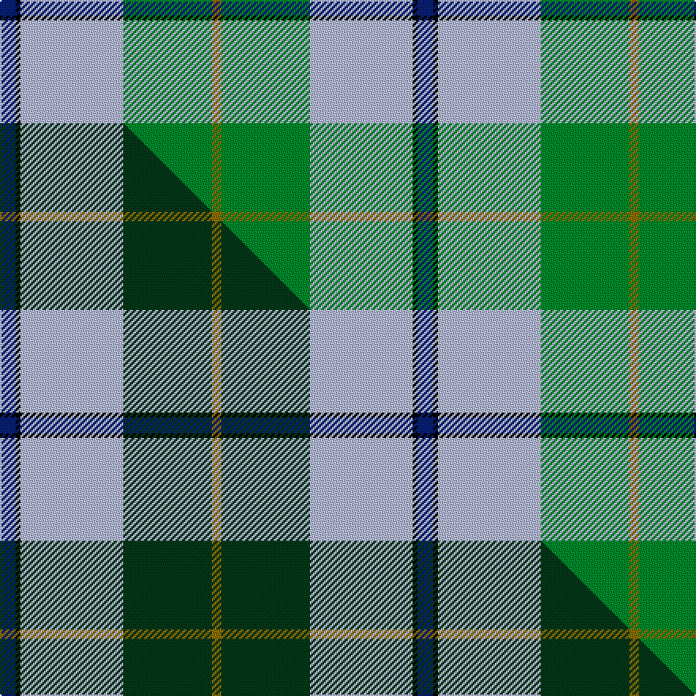

This page is one **sett** — a single exact thread-count. It belongs to the [tartan](/setts/db10k3lb65g56y6/)
(the same proportion at any scale), whose colour order is pattern [BKWGG](/stripes/bkwgg/).

Part of the [Phoenix Police Honor Guard](/tartans/phoenix-police-honor-guard/) tartan — the named design grouping this sett with its other cloths.

Sourced from tartans-authority.  It is a [5 stripe tartan](/stripes/stripes5/).

Original link http://www.tartansauthority.com/tartan-ferret/display/10334/

## Register references

External register numbers recorded for this tartan.

- Scottish Register of Tartans: [10334](https://www.tartanregister.gov.uk/tartanDetails?ref=10334)
- Scottish Tartans Authority (ITI): 10334

## Thread count
DB/10 K3 LB65 G56 Y/6

One full sett is **264 threads**.

## Palette
<table><thead><tr><th>Colour</th><th>Shade</th><th>OKLCh</th></tr></thead><tbody><tr><td>LB</td><td><code style="background-color:#B5BBDE;">#B5BBDE</code> <small style="color:#888">#B5BBDE</small></td><td><small style="color:#888">oklch(79.9% 0.050 277.6)</small></td></tr><tr><td>DB</td><td><code style="background-color:#082077;">#082077</code> <small style="color:#888">#082077</small></td><td><small style="color:#888">oklch(30.0% 0.149 265.1)</small></td></tr><tr><td>G</td><td><code style="background-color:#008B2A;">#008B2A</code> <small style="color:#888">#008B2A</small></td><td><small style="color:#888">oklch(55.4% 0.170 145.9)</small></td></tr><tr><td>K</td><td><code style="background-color:#000000;">#000000</code> <small style="color:#888">#000000</small></td><td><small style="color:#888">oklch(0.0% 0.000 0.0)</small></td></tr><tr><td>Y</td><td><code style="background-color:#8B6E00;">#8B6E00</code> <small style="color:#888">#8B6E00</small></td><td><small style="color:#888">oklch(55.1% 0.113 90.4)</small></td></tr></tbody></table>

# Sample pattern

## Compared to the master

This cloth is one sett of its design; the master sett (the exemplar the design is anchored on) is below for comparison.

Its **ΔTartan distance** from the master is **1.37** — the same measure the nearest-tartans table ranks by (0 is identical; a re-scale of the same cloth is near 0, a recolour or a different proportion further).

<figure class="master-compare" style="margin:0">

this sett
master sett ★

<figcaption style="color:#888;font-size:smaller">One weave of this sett against the <a href="/setts/db10k3lb65dg56y6/">master sett ★</a>, split on the diagonal: a shared proportion runs seamlessly across it with only the shades shifting; a different proportion breaks on it.</figcaption>
</figure>

## Nearest tartan variants

The nearest existing variants by ΔTartan distance, with this cloth at the top so the swatches line up against it.

ΔTartan

Threads

Variant

Sett

—

264

<a href="/variants/s5/db10k3lb65g56y6/">Phoenix Police Honor Guard (Corp.)</a>

<a href="/ttd/edit/#slug=db10k3lb65dg56y6&amp;base=db10k3lb65g56y6" title="compare in the TTD">0.00</a>

264

<a href="/variants/s5/db10k3lb65dg56y6/">Phoenix Police Honor Guard</a>

<a href="/ttd/edit/#slug=db9w4g36lb36r4&amp;base=db10k3lb65g56y6" title="compare in the TTD">1.19</a>

165

<a href="/variants/s5/db9w4g36lb36r4/">Alvis of Lee (Personal)</a>

<a href="/ttd/edit/#slug=g35k3dbi26k4db4w3~x2~dbi1406275-db1106275&amp;base=db10k3lb65g56y6" title="compare in the TTD">1.32</a>

224

<a href="/variants/s6/g35k3dbi26k4db4w3~x2~dbi1406275-db1106275/">Pride of Yorkland (Fashion)</a>

<a href="/ttd/edit/#slug=k2lb25k2t8k2g28y2~x2&amp;base=db10k3lb65g56y6" title="compare in the TTD">1.41</a>

268

<a href="/variants/s7/k2lb25k2t8k2g28y2~x2/">Presley of Lonmay</a>

<a href="/ttd/edit/#slug=w3b12db1g15o3w1~x4~b2409265-db1406275&amp;base=db10k3lb65g56y6" title="compare in the TTD">1.48</a>

264

<a href="/variants/s6/w3b12db1g15o3w1~x4~b2409265-db1406275/">Eeraerts, Laurent (Personal)</a>

<a href="/ttd/edit/#slug=r2w7db30g36y2~x2&amp;base=db10k3lb65g56y6" title="compare in the TTD">1.89</a>

300

<a href="/variants/s5/r2w7db30g36y2~x2/">Centennial-King George Lodge No.171</a>

<a href="/ttd/edit/#slug=k3g36db28r2db2y3~x2&amp;base=db10k3lb65g56y6" title="compare in the TTD">2.25</a>

284

<a href="/variants/s6/k3g36db28r2db2y3~x2/">Carmichael</a>

<a href="/ttd/edit/#slug=dp6y2dp1g25db16k2db4~x2~dp1105325&amp;base=db10k3lb65g56y6" title="compare in the TTD">2.29</a>

204

<a href="/variants/s7/dp6y2dp1g25db16k2db4~x2~dp1105325/">Lowry Clan Tartan</a>

<a href="/ttd/edit/#slug=k3db3g23db21w2~x2~db1406275&amp;base=db10k3lb65g56y6" title="compare in the TTD">2.46</a>

198

<a href="/variants/s5/k3db3g23db21w2~x2~db1406275/">Douglas Clan Tartan</a>

<a href="/ttd/edit/#slug=r1g9lb9k1lb1w1~x6&amp;base=db10k3lb65g56y6" title="compare in the TTD">2.51</a>

252

<a href="/variants/s6/r1g9lb9k1lb1w1~x6/">Irving of Glentulchan (Personal)</a>

## Neighbour map

Every grey dot is one of 13620 variants placed by the first two principal components of the ΔTartan feature space (42% of its variance). Red is this tartan; blue dots are its nearest — click one to open its page.

<svg viewBox="0 0 640 380" role="img" style="max-width:100%;height:auto;border:1px solid #e0e0e0;border-radius:4px;display:block" xmlns="http://www.w3.org/2000/svg"><image href="/nn/cloud.v1.png" width="640" height="380"/><a href="/variants/s5/db10k3lb65dg56y6/"><circle cx="241.6" cy="153.8" r="4" fill="#3465a4"><title>Phoenix Police Honor Guard</title></circle></a><a href="/variants/s5/db9w4g36lb36r4/"><circle cx="222.3" cy="223.3" r="4" fill="#3465a4"><title>Alvis of Lee (Personal)</title></circle></a><a href="/variants/s6/g35k3dbi26k4db4w3~x2~dbi1406275-db1106275/"><circle cx="219.4" cy="168.0" r="4" fill="#3465a4"><title>Pride of Yorkland (Fashion)</title></circle></a><a href="/variants/s7/k2lb25k2t8k2g28y2~x2/"><circle cx="196.7" cy="156.2" r="4" fill="#3465a4"><title>Presley of Lonmay</title></circle></a><a href="/variants/s6/w3b12db1g15o3w1~x4~b2409265-db1406275/"><circle cx="237.8" cy="187.3" r="4" fill="#3465a4"><title>Eeraerts, Laurent (Personal)</title></circle></a><a href="/variants/s5/r2w7db30g36y2~x2/"><circle cx="259.6" cy="179.2" r="4" fill="#3465a4"><title>Centennial-King George Lodge No.171</title></circle></a><a href="/variants/s6/k3g36db28r2db2y3~x2/"><circle cx="278.6" cy="150.5" r="4" fill="#3465a4"><title>Carmichael</title></circle></a><a href="/variants/s7/dp6y2dp1g25db16k2db4~x2~dp1105325/"><circle cx="255.4" cy="141.7" r="4" fill="#3465a4"><title>Lowry Clan Tartan</title></circle></a><a href="/variants/s5/k3db3g23db21w2~x2~db1406275/"><circle cx="226.9" cy="190.2" r="4" fill="#3465a4"><title>Douglas Clan Tartan</title></circle></a><a href="/variants/s6/r1g9lb9k1lb1w1~x6/"><circle cx="234.5" cy="187.8" r="4" fill="#3465a4"><title>Irving of Glentulchan (Personal)</title></circle></a><circle cx="268.2" cy="167.3" r="5" fill="#c00000"/><text x="320" y="376" text-anchor="middle" font-size="11" fill="#999">ground</text><text x="11" y="190" text-anchor="middle" font-size="11" fill="#999" transform="rotate(-90 11 190)">complexity</text></svg>

ID: /variants/s5/db10k3lb65g56y6/
