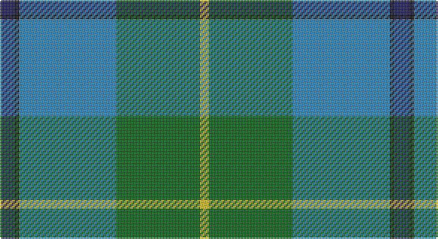

This page is one **sett** — a single exact thread-count. It belongs to the [tartan](/setts/db10k3t65g56ly6/)
(the same proportion at any scale), whose colour order is pattern [BKBGY](/stripes/bkbgy/).

Sourced from tartans-authority.  It is a [5 stripe tartan](/stripes/stripes5/).

Original link http://www.tartansauthority.com/tartan-ferret/display/10334/

## Register references

External register numbers recorded for this tartan.

- Scottish Register of Tartans: [10334](https://www.tartanregister.gov.uk/tartanDetails?ref=10334)
- Scottish Tartans Authority (ITI): 10334

## Thread count
DB/10 K3 B65 G56 Y/6

One full sett is **264 threads**.

## Palette

Palette: <strong>Tartan Register</strong>
<table><thead><tr><th>Colour</th><th>Threads</th><th>Shade</th><th>Base</th><th>OKLCh</th></tr></thead><tbody><tr><td>DB/</td><td style="text-align:right;font-variant-numeric:tabular-nums">10</td><td><code style="background-color:#202060;">#202060</code> <small style="color:#888">#202060</small></td><td>B <code style="background-color:#2A418A;">#2A418A</code></td><td><small style="color:#888">oklch(28.9% 0.111 276.9)</small></td></tr><tr><td>K</td><td style="text-align:right;font-variant-numeric:tabular-nums">3</td><td><code style="background-color:#101010;">#101010</code> <small style="color:#888">#101010</small></td><td>K <code style="background-color:#000000;">#000000</code></td><td><small style="color:#888">oklch(17.3% 0.000 89.9)</small></td></tr><tr><td>B</td><td style="text-align:right;font-variant-numeric:tabular-nums">65</td><td><code style="background-color:#2888C4;">#2888C4</code> <small style="color:#888">#2888C4</small></td><td>B <code style="background-color:#2A418A;">#2A418A</code></td><td><small style="color:#888">oklch(60.1% 0.125 241.5)</small></td></tr><tr><td>G</td><td style="text-align:right;font-variant-numeric:tabular-nums">56</td><td><code style="background-color:#006818;">#006818</code> <small style="color:#888">#006818</small></td><td>G <code style="background-color:#006100;">#006100</code></td><td><small style="color:#888">oklch(45.0% 0.142 145.0)</small></td></tr><tr><td>Y/</td><td style="text-align:right;font-variant-numeric:tabular-nums">6</td><td><code style="background-color:#E8C000;">#E8C000</code> <small style="color:#888">#E8C000</small></td><td>Y <code style="background-color:#F2BF00;">#F2BF00</code></td><td><small style="color:#888">oklch(81.9% 0.168 93.7)</small></td></tr></tbody></table>

# Sample pattern

## Nearest tartans

The nearest existing variants by ΔTartan distance, with this tartan at the top so the swatches line up against it.

ΔTartan

Tartan

Sett

—

<a href="/ttd/edit/#slug=db10k3t65g56ly6">Phoenix Police Honor Guard (Corp.)</a> <a class="nn-out" href="/variants/s5/db10k3t65g56ly6/" title="open its dictionary page">↗</a>

0.57

<a href="/ttd/edit/#slug=db10k3t65dg56ly6&amp;base=db10k3t65g56ly6">Phoenix Police Honor Guard</a> <a class="nn-out" href="/variants/s5/db10k3t65dg56ly6/" title="open its dictionary page">↗</a>

1.15

<a href="/ttd/edit/#slug=t4g16ly2db7t28w4~x2&amp;base=db10k3t65g56ly6">Allanton (Fashion)</a> <a class="nn-out" href="/variants/s6/t4g16ly2db7t28w4~x2/" title="open its dictionary page">↗</a>

1.22

<a href="/ttd/edit/#slug=r4k2g36k2b18ly3b18k2~x2&amp;base=db10k3t65g56ly6">Fox Hunting</a> <a class="nn-out" href="/variants/s8/r4k2g36k2b18ly3b18k2~x2/" title="open its dictionary page">↗</a>

1.35

<a href="/ttd/edit/#slug=m4g9w2g24db37r3~x2&amp;base=db10k3t65g56ly6">Hardie Clan Tartan</a> <a class="nn-out" href="/variants/s6/m4g9w2g24db37r3~x2/" title="open its dictionary page">↗</a>

1.38

<a href="/ttd/edit/#slug=dg4w1dg26b26k2b4~x4&amp;base=db10k3t65g56ly6">Melville (Two black lines)</a> <a class="nn-out" href="/variants/s6/dg4w1dg26b26k2b4~x4/" title="open its dictionary page">↗</a>

1.39

<a href="/ttd/edit/#slug=k3g36db28r2db2ly3~x2&amp;base=db10k3t65g56ly6">Carmichael</a> <a class="nn-out" href="/variants/s6/k3g36db28r2db2ly3~x2/" title="open its dictionary page">↗</a>

1.39

<a href="/ttd/edit/#slug=r2w7b30dg36ly2~x2&amp;base=db10k3t65g56ly6">Centennial-King George Lodge No.171</a> <a class="nn-out" href="/variants/s5/r2w7b30dg36ly2~x2/" title="open its dictionary page">↗</a>

1.42

<a href="/ttd/edit/#slug=k3t2g13w2t24r3~x4&amp;base=db10k3t65g56ly6">Vance</a> <a class="nn-out" href="/variants/s6/k3t2g13w2t24r3~x4/" title="open its dictionary page">↗</a>

1.44

<a href="/ttd/edit/#slug=b24k8g8r2g8k1w2~x2&amp;base=db10k3t65g56ly6">Ferguson of Atholl Clan</a> <a class="nn-out" href="/variants/s7/b24k8g8r2g8k1w2~x2/" title="open its dictionary page">↗</a>

1.44

<a href="/ttd/edit/#slug=db3r3db36g17ly2g21w2r3~x2&amp;base=db10k3t65g56ly6">Singh</a> <a class="nn-out" href="/variants/s8/db3r3db36g17ly2g21w2r3~x2/" title="open its dictionary page">↗</a>

## Neighbour map

Every grey dot is one of 14360 variants placed by the first two principal components of the ΔTartan feature space (44% of its variance). Red is this tartan; blue dots are its nearest — click one to open its page.

<svg viewBox="0 0 640 380" role="img" style="max-width:100%;height:auto;border:1px solid #e0e0e0;border-radius:4px;display:block" xmlns="http://www.w3.org/2000/svg"><image href="/nn/cloud.v1.png" width="640" height="380"/><a href="/variants/s5/db10k3t65dg56ly6/"><circle cx="284.8" cy="181.9" r="4" fill="#3465a4"><title>Phoenix Police Honor Guard</title></circle></a><a href="/variants/s6/t4g16ly2db7t28w4~x2/"><circle cx="281.0" cy="190.4" r="4" fill="#3465a4"><title>Allanton (Fashion)</title></circle></a><a href="/variants/s8/r4k2g36k2b18ly3b18k2~x2/"><circle cx="270.9" cy="163.7" r="4" fill="#3465a4"><title>Fox Hunting</title></circle></a><a href="/variants/s6/m4g9w2g24db37r3~x2/"><circle cx="299.0" cy="181.1" r="4" fill="#3465a4"><title>Hardie Clan Tartan</title></circle></a><a href="/variants/s6/dg4w1dg26b26k2b4~x4/"><circle cx="370.1" cy="193.7" r="4" fill="#3465a4"><title>Melville (Two black lines)</title></circle></a><a href="/variants/s6/k3g36db28r2db2ly3~x2/"><circle cx="296.0" cy="164.0" r="4" fill="#3465a4"><title>Carmichael</title></circle></a><a href="/variants/s5/r2w7b30dg36ly2~x2/"><circle cx="255.3" cy="174.2" r="4" fill="#3465a4"><title>Centennial-King George Lodge No.171</title></circle></a><a href="/variants/s6/k3t2g13w2t24r3~x4/"><circle cx="289.6" cy="180.8" r="4" fill="#3465a4"><title>Vance</title></circle></a><a href="/variants/s7/b24k8g8r2g8k1w2~x2/"><circle cx="253.3" cy="157.6" r="4" fill="#3465a4"><title>Ferguson of Atholl Clan</title></circle></a><a href="/variants/s8/db3r3db36g17ly2g21w2r3~x2/"><circle cx="281.0" cy="157.0" r="4" fill="#3465a4"><title>Singh</title></circle></a><circle cx="294.0" cy="186.3" r="5" fill="#c00000"/></svg>

ID: /variants/s5/db10k3t65g56ly6/
