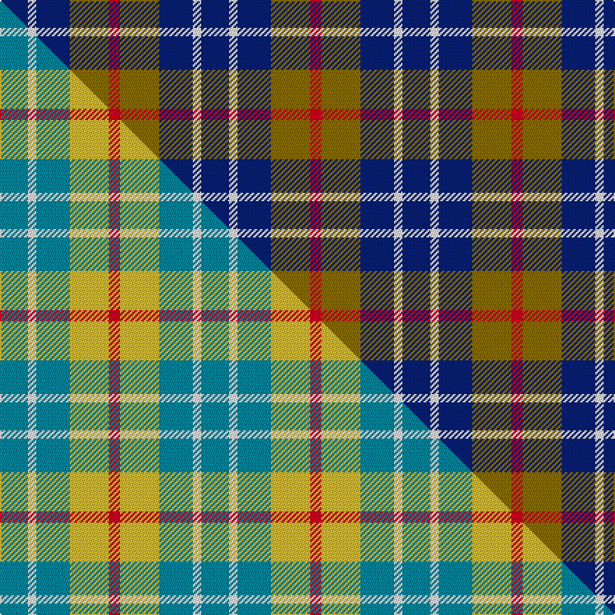

This page is one **sett** — a single exact thread-count. It belongs to the [tartan](/setts/db10w3db12y14r4/)
(the same proportion at any scale), whose colour order is pattern [BWBGR](/stripes/bwbgr/).

Part of the [MacLeod of Argentina](/tartans/macleod-of-argentina/) tartan — the named design grouping this sett with its other cloths.

Sourced from weddslist.  It is a [5 stripe tartan](/stripes/stripes5/).

Original link http://www.weddslist.com/cgi-bin/tartans/pg.pl?source=sts

## Thread count
DB/20 W6 DB24 Y28 R/8

One full sett is **144 threads**.

## Palette
<table><thead><tr><th>Colour</th><th>Shade</th><th>OKLCh</th></tr></thead><tbody><tr><td>DB</td><td><code style="background-color:#082077;">#082077</code> <small style="color:#888">#082077</small></td><td><small style="color:#888">oklch(30.0% 0.149 265.1)</small></td></tr><tr><td>W</td><td><code style="background-color:#F7F7F7;">#F7F7F7</code> <small style="color:#888">#F7F7F7</small></td><td><small style="color:#888">oklch(97.6% 0.000 89.9)</small></td></tr><tr><td>R</td><td><code style="background-color:#D60020;">#D60020</code> <small style="color:#888">#D60020</small></td><td><small style="color:#888">oklch(55.2% 0.224 25.5)</small></td></tr><tr><td>Y</td><td><code style="background-color:#8B6E00;">#8B6E00</code> <small style="color:#888">#8B6E00</small></td><td><small style="color:#888">oklch(55.1% 0.113 90.4)</small></td></tr></tbody></table>

# Sample pattern

## Compared to the master

This cloth is one sett of its design; the master sett (the exemplar the design is anchored on) is below for comparison.

Its **ΔTartan distance** from the master is **2.39** — the same measure the nearest-tartans table ranks by (0 is identical; a re-scale of the same cloth is near 0, a recolour or a different proportion further).

<figure class="master-compare" style="margin:0">

this sett
master sett ★

<figcaption style="color:#888;font-size:smaller">One weave of this sett against the <a href="/setts/t10w3t12ly14r4/">master sett ★</a>, split on the diagonal: a shared proportion runs seamlessly across it with only the shades shifting; a different proportion breaks on it.</figcaption>
</figure>

## Nearest variants

The nearest existing variants by ΔTartan distance, with this cloth at the top so the swatches line up against it.

ΔTartan

Threads

Variant

Sett

—

144

<a href="/variants/s5/db10w3db12y14r4~x2/">MacLeod, of Argentina</a>

<a href="/ttd/edit/#slug=db20k5db18y26k6~x2&amp;base=db10w3db12y14r4~x2" title="compare in the TTD">0.49</a>

248

<a href="/variants/s5/db20k5db18y26k6~x2/">Jahore</a>

<a href="/ttd/edit/#slug=db2y1r4db4w2~x10&amp;base=db10w3db12y14r4~x2" title="compare in the TTD">0.93</a>

220

<a href="/variants/s5/db2y1r4db4w2~x10/">Doohan (New South Wales), Andrew</a>

<a href="/ttd/edit/#slug=db27ly9w3dy16r7~x2&amp;base=db10w3db12y14r4~x2" title="compare in the TTD">1.76</a>

180

<a href="/variants/s5/db27ly9w3dy16r7~x2/">Unidentified (Sock Tie)</a>

<a href="/ttd/edit/#slug=db9r12dg9db5w2~x4&amp;base=db10w3db12y14r4~x2" title="compare in the TTD">1.83</a>

252

<a href="/variants/s5/db9r12dg9db5w2~x4/">Battle of Prestonpans (1745) Herit</a>

<a href="/ttd/edit/#slug=db20k5db18lo26k6~x2&amp;base=db10w3db12y14r4~x2" title="compare in the TTD">1.86</a>

248

<a href="/variants/s5/db20k5db18lo26k6~x2/">Johore Regiment (Military)</a>

<a href="/ttd/edit/#slug=r10dy60db13w24db24dy8&amp;base=db10w3db12y14r4~x2" title="compare in the TTD">1.92</a>

260

<a href="/variants/s6/r10dy60db13w24db24dy8/">Bronte House Check</a>

<a href="/ttd/edit/#slug=db2k2db2o5dy1~x12&amp;base=db10w3db12y14r4~x2" title="compare in the TTD">1.94</a>

252

<a href="/variants/s5/db2k2db2o5dy1~x12/">Chivas Regal (Corporate)</a>

<a href="/ttd/edit/#slug=db6k6db6o14dy3~x2&amp;base=db10w3db12y14r4~x2" title="compare in the TTD">1.94</a>

122

<a href="/variants/s5/db6k6db6o14dy3~x2/">Chivas Regal</a>

<a href="/ttd/edit/#slug=b10k10b10dg26y5~x2&amp;base=db10w3db12y14r4~x2" title="compare in the TTD">1.94</a>

214

<a href="/variants/s5/b10k10b10dg26y5~x2/">Marshall of Keith (Personal)</a>

<a href="/ttd/edit/#slug=db9y9db9lb23r3~x2&amp;base=db10w3db12y14r4~x2" title="compare in the TTD">2.04</a>

188

<a href="/variants/s5/db9y9db9lb23r3~x2/">Tilburg (District)</a>

## Neighbour map

Every grey dot is one of 13620 variants placed by the first two principal components of the ΔTartan feature space (42% of its variance). Red is this tartan; blue dots are its nearest — click one to open its page.

<svg viewBox="0 0 640 380" role="img" style="max-width:100%;height:auto;border:1px solid #e0e0e0;border-radius:4px;display:block" xmlns="http://www.w3.org/2000/svg"><image href="/nn/cloud.v1.png" width="640" height="380"/><a href="/variants/s5/db20k5db18y26k6~x2/"><circle cx="238.5" cy="272.8" r="4" fill="#3465a4"><title>Jahore</title></circle></a><a href="/variants/s5/db2y1r4db4w2~x10/"><circle cx="170.4" cy="281.9" r="4" fill="#3465a4"><title>Doohan (New South Wales), Andrew</title></circle></a><a href="/variants/s5/db27ly9w3dy16r7~x2/"><circle cx="183.4" cy="220.6" r="4" fill="#3465a4"><title>Unidentified (Sock Tie)</title></circle></a><a href="/variants/s5/db9r12dg9db5w2~x4/"><circle cx="169.8" cy="274.7" r="4" fill="#3465a4"><title>Battle of Prestonpans (1745) Herit</title></circle></a><a href="/variants/s5/db20k5db18lo26k6~x2/"><circle cx="206.4" cy="260.8" r="4" fill="#3465a4"><title>Johore Regiment (Military)</title></circle></a><a href="/variants/s6/r10dy60db13w24db24dy8/"><circle cx="221.8" cy="221.5" r="4" fill="#3465a4"><title>Bronte House Check</title></circle></a><a href="/variants/s5/db2k2db2o5dy1~x12/"><circle cx="170.7" cy="258.7" r="4" fill="#3465a4"><title>Chivas Regal (Corporate)</title></circle></a><a href="/variants/s5/db6k6db6o14dy3~x2/"><circle cx="158.3" cy="266.5" r="4" fill="#3465a4"><title>Chivas Regal</title></circle></a><a href="/variants/s5/b10k10b10dg26y5~x2/"><circle cx="180.9" cy="262.6" r="4" fill="#3465a4"><title>Marshall of Keith (Personal)</title></circle></a><a href="/variants/s5/db9y9db9lb23r3~x2/"><circle cx="209.9" cy="250.3" r="4" fill="#3465a4"><title>Tilburg (District)</title></circle></a><circle cx="224.9" cy="278.7" r="5" fill="#c00000"/><text x="320" y="376" text-anchor="middle" font-size="11" fill="#999">ground</text><text x="11" y="190" text-anchor="middle" font-size="11" fill="#999" transform="rotate(-90 11 190)">complexity</text></svg>

ID: /variants/s5/db10w3db12y14r4~x2/
