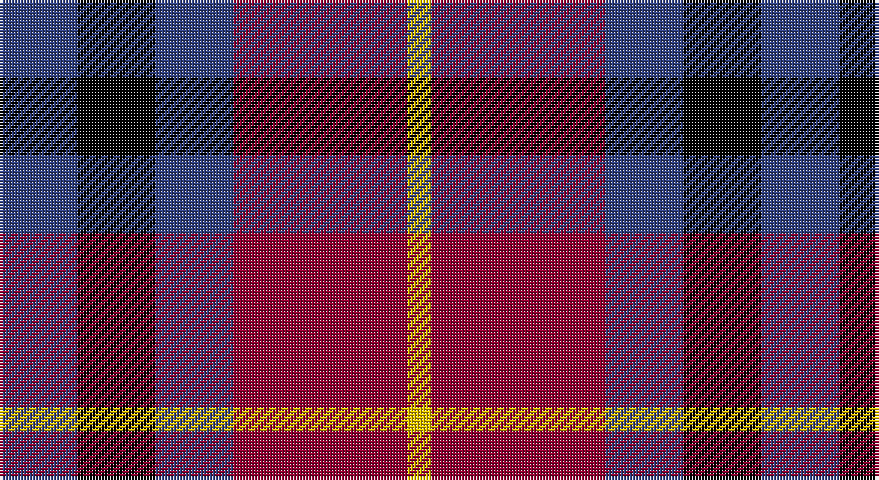

This page is one **sett** — a single exact thread-count. It belongs to the [tartan](/setts/db13k13db13r29ly4/)
(the same proportion at any scale), whose colour order is pattern [BKBRY](/stripes/bkbry/).

Part of the [Highland Pub Company](/tartans/highland-pub-company/) tartan — the named design grouping this sett with its other cloths.

Sourced from weddslist.  It is a [5 stripe tartan](/stripes/stripes5/).

Original link http://www.weddslist.com/cgi-bin/tartans/pg.pl?source=sts

## Thread count
B/26 K26 B26 DR58 Y/8

One full sett is **254 threads**.

## Palette

Palette: <strong>Ingles Buchan</strong> <small style="color:#888">(1 of 4 colours)</small>
<table><thead><tr><th>Colour</th><th>Threads</th><th>Shade</th><th>Base</th><th>OKLCh</th></tr></thead><tbody><tr><td>B/</td><td style="text-align:right;font-variant-numeric:tabular-nums">26</td><td><code style="background-color:#304080;">#304080</code> <small style="color:#888">#304080</small></td><td>B <code style="background-color:#2A418A;">#2A418A</code></td><td><small style="color:#888">oklch(39.4% 0.109 270.2)</small></td></tr><tr><td>K</td><td style="text-align:right;font-variant-numeric:tabular-nums">26</td><td><code style="background-color:#000000;">#000000</code> <small style="color:#888">#000000</small></td><td>K <code style="background-color:#000000;">#000000</code></td><td><small style="color:#888">oklch(0.0% 0.000 0.0)</small></td></tr><tr><td>B</td><td style="text-align:right;font-variant-numeric:tabular-nums">26</td><td><code style="background-color:#304080;">#304080</code> <small style="color:#888">#304080</small></td><td>B <code style="background-color:#2A418A;">#2A418A</code></td><td><small style="color:#888">oklch(39.4% 0.109 270.2)</small></td></tr><tr><td>DR</td><td style="text-align:right;font-variant-numeric:tabular-nums">58</td><td><code style="background-color:#900030;">#900030</code> <small style="color:#888">#900030</small></td><td>R <code style="background-color:#CC0000;">#CC0000</code></td><td><small style="color:#888">oklch(41.6% 0.166 13.6)</small></td></tr><tr><td>Y/</td><td style="text-align:right;font-variant-numeric:tabular-nums">8</td><td><code style="background-color:#F0C000;">#F0C000</code> <small style="color:#888">#F0C000</small></td><td>Y <code style="background-color:#F2BF00;">#F2BF00</code></td><td><small style="color:#888">oklch(82.7% 0.169 90.5)</small></td></tr></tbody></table>

# Sample pattern

## Compared to the master

This cloth is one sett of its design; the master sett (the exemplar the design is anchored on) is below for comparison.

<figure style="margin:0"><figcaption style="color:#888;font-size:smaller">this sett</figcaption></figure>
<figure style="margin:0"><figcaption style="color:#888;font-size:smaller"><a href="/setts/do16k13do13r30lo4/">master sett →</a></figcaption></figure>

## Nearest tartans

The nearest existing variants by ΔTartan distance, with this tartan at the top so the swatches line up against it.

ΔTartan

Tartan

Sett

—

<a href="/ttd/edit/#slug=db13k13db13r29ly4~x2">Highland Pub Company</a> <a class="nn-out" href="/variants/s5/db13k13db13r29ly4~x2/" title="open its dictionary page">↗</a>

1.04

<a href="/ttd/edit/#slug=r2dp8k8w1r2~x2&amp;base=db13k13db13r29ly4~x2">Inder (Corporate)</a> <a class="nn-out" href="/variants/s5/r2dp8k8w1r2~x2/" title="open its dictionary page">↗</a>

1.08

<a href="/ttd/edit/#slug=db14dg21db4r21db14ly2~x2&amp;base=db13k13db13r29ly4~x2">Kilgour</a> <a class="nn-out" href="/variants/s6/db14dg21db4r21db14ly2~x2/" title="open its dictionary page">↗</a>

1.18

<a href="/ttd/edit/#slug=db9r12dg9db5w2~x4&amp;base=db13k13db13r29ly4~x2">Battle of Prestonpans (1745) Herit</a> <a class="nn-out" href="/variants/s5/db9r12dg9db5w2~x4/" title="open its dictionary page">↗</a>

1.20

<a href="/ttd/edit/#slug=db8k3r4ly1~x2&amp;base=db13k13db13r29ly4~x2">Unidentified #17</a> <a class="nn-out" href="/variants/s4/db8k3r4ly1~x2/" title="open its dictionary page">↗</a>

1.20

<a href="/ttd/edit/#slug=db3r2g5r8db12w3~x2&amp;base=db13k13db13r29ly4~x2">Edinburgh Bus Company (Corporate)</a> <a class="nn-out" href="/variants/s6/db3r2g5r8db12w3~x2/" title="open its dictionary page">↗</a>

1.21

<a href="/ttd/edit/#slug=t1r6db1t3k3t1~x8&amp;base=db13k13db13r29ly4~x2">MacTavish #2</a> <a class="nn-out" href="/variants/s6/t1r6db1t3k3t1~x8/" title="open its dictionary page">↗</a>

1.23

<a href="/ttd/edit/#slug=r26t3r4k16db16k4~x2&amp;base=db13k13db13r29ly4~x2">Graham of Menteith, (Red)</a> <a class="nn-out" href="/variants/s6/r26t3r4k16db16k4~x2/" title="open its dictionary page">↗</a>

1.24

<a href="/ttd/edit/#slug=k60w8lo15dp74k14&amp;base=db13k13db13r29ly4~x2">Gingles (Personal)</a> <a class="nn-out" href="/variants/s5/k60w8lo15dp74k14/" title="open its dictionary page">↗</a>

1.27

<a href="/variants/s6/dg3k20ki20r20k3r3~x2/">Unidentified #65</a>

1.28

<a href="/ttd/edit/#slug=b2r12db2b6k6b1~x2&amp;base=db13k13db13r29ly4~x2">MacTavish</a> <a class="nn-out" href="/variants/s6/b2r12db2b6k6b1~x2/" title="open its dictionary page">↗</a>

## Neighbour map

Every grey dot is one of 14360 variants placed by the first two principal components of the ΔTartan feature space (44% of its variance). Red is this tartan; blue dots are its nearest — click one to open its page.

<svg viewBox="0 0 640 380" role="img" style="max-width:100%;height:auto;border:1px solid #e0e0e0;border-radius:4px;display:block" xmlns="http://www.w3.org/2000/svg"><image href="/nn/cloud.v1.png" width="640" height="380"/><a href="/variants/s5/r2dp8k8w1r2~x2/"><circle cx="203.1" cy="223.2" r="4" fill="#3465a4"><title>Inder (Corporate)</title></circle></a><a href="/variants/s6/db14dg21db4r21db14ly2~x2/"><circle cx="197.4" cy="228.2" r="4" fill="#3465a4"><title>Kilgour</title></circle></a><a href="/variants/s5/db9r12dg9db5w2~x4/"><circle cx="150.2" cy="264.3" r="4" fill="#3465a4"><title>Battle of Prestonpans (1745) Herit</title></circle></a><a href="/variants/s4/db8k3r4ly1~x2/"><circle cx="237.3" cy="247.0" r="4" fill="#3465a4"><title>Unidentified #17</title></circle></a><a href="/variants/s6/db3r2g5r8db12w3~x2/"><circle cx="181.6" cy="231.2" r="4" fill="#3465a4"><title>Edinburgh Bus Company (Corporate)</title></circle></a><a href="/variants/s6/t1r6db1t3k3t1~x8/"><circle cx="192.3" cy="235.8" r="4" fill="#3465a4"><title>MacTavish #2</title></circle></a><a href="/variants/s6/r26t3r4k16db16k4~x2/"><circle cx="205.3" cy="208.7" r="4" fill="#3465a4"><title>Graham of Menteith, (Red)</title></circle></a><a href="/variants/s5/k60w8lo15dp74k14/"><circle cx="247.5" cy="218.8" r="4" fill="#3465a4"><title>Gingles (Personal)</title></circle></a><a href="/variants/s6/dg3k20ki20r20k3r3~x2/"><circle cx="164.7" cy="227.9" r="4" fill="#3465a4"><title>Unidentified #65</title></circle></a><a href="/variants/s6/b2r12db2b6k6b1~x2/"><circle cx="209.9" cy="196.7" r="4" fill="#3465a4"><title>MacTavish</title></circle></a><circle cx="184.1" cy="249.7" r="5" fill="#c00000"/></svg>

ID: /variants/s5/db13k13db13r29ly4~x2/
