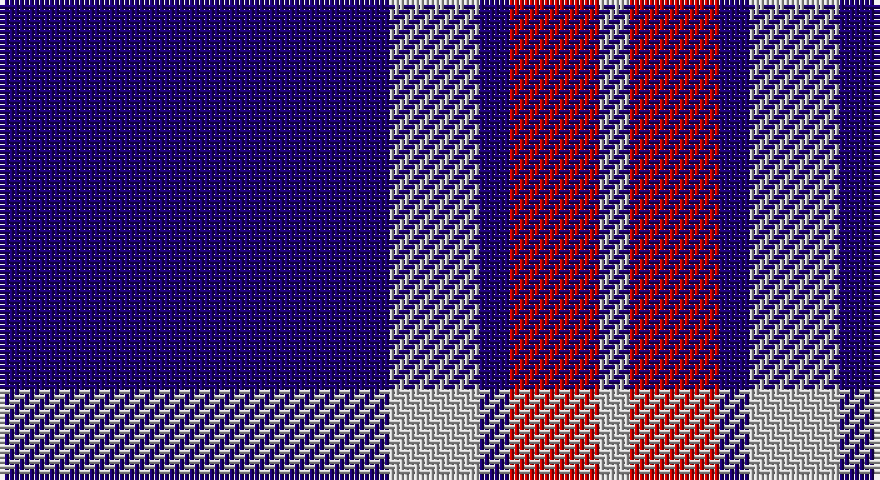

This page is one **sett** — a single exact thread-count. It belongs to the [tartan](/setts/db13lb3db1r3lb1/)
(the same proportion at any scale), whose colour order is pattern [BWBRW](/stripes/bwbrw/).

Part of the [Glen Moy](/tartans/glen-moy/) tartan — the named design grouping this sett with its other cloths.

Sourced from register-of-tartans.  It is a [5 stripe tartan](/stripes/stripes5/).

Original link https://www.tartanregister.gov.uk/tartanDetails.aspx?ref=1387

## Also known as

This cloth is also recorded under:

- Glen Moy #2
- Glen Moy 1986

2 attestations — the source records this cloth was collapsed from (oldest owns this page)

<ul>
<li>01/01/1986 — Glen Moy (register-of-tartans, <a href="https://www.tartanregister.gov.uk/tartanDetails.aspx?ref=1387">record</a>)</li>
<li>pre 1986 — Glen Moy 1986 (Fashion) (tartans-authority, <a href="http://www.tartansauthority.com/tartan-ferret/display/635/">record</a>)</li>
</ul>

## Register references

External register numbers recorded for this tartan.

- Scottish Register of Tartans: [1387](https://www.tartanregister.gov.uk/tartanDetails.aspx?ref=1387)
- Scottish Tartans Authority (ITI): 635
- Scottish Tartans World Register: 635

## Thread count
DB/78 N18 DB6 R18 N/6

One full sett is **168 threads**.

## Palette

Palette: <strong>Tartan Register</strong>
<table><thead><tr><th>Colour</th><th>Threads</th><th>Shade</th><th>Base</th><th>OKLCh</th></tr></thead><tbody><tr><td>DB/</td><td style="text-align:right;font-variant-numeric:tabular-nums">78</td><td><code style="background-color:#1C0070;">#1C0070</code> <small style="color:#888">#1C0070</small></td><td>B <code style="background-color:#2A418A;">#2A418A</code></td><td><small style="color:#888">oklch(26.3% 0.162 277.1)</small></td></tr><tr><td>N</td><td style="text-align:right;font-variant-numeric:tabular-nums">18</td><td><code style="background-color:#C0C0C0;">#C0C0C0</code> <small style="color:#888">#C0C0C0</small></td><td>W <code style="background-color:#F7F7F7;">#F7F7F7</code></td><td><small style="color:#888">oklch(80.8% 0.000 89.9)</small></td></tr><tr><td>DB</td><td style="text-align:right;font-variant-numeric:tabular-nums">6</td><td><code style="background-color:#1C0070;">#1C0070</code> <small style="color:#888">#1C0070</small></td><td>B <code style="background-color:#2A418A;">#2A418A</code></td><td><small style="color:#888">oklch(26.3% 0.162 277.1)</small></td></tr><tr><td>R</td><td style="text-align:right;font-variant-numeric:tabular-nums">18</td><td><code style="background-color:#C80000;">#C80000</code> <small style="color:#888">#C80000</small></td><td>R <code style="background-color:#CC0000;">#CC0000</code></td><td><small style="color:#888">oklch(52.3% 0.215 29.2)</small></td></tr><tr><td>N/</td><td style="text-align:right;font-variant-numeric:tabular-nums">6</td><td><code style="background-color:#C0C0C0;">#C0C0C0</code> <small style="color:#888">#C0C0C0</small></td><td>W <code style="background-color:#F7F7F7;">#F7F7F7</code></td><td><small style="color:#888">oklch(80.8% 0.000 89.9)</small></td></tr></tbody></table>

# Sample pattern

## Nearest tartans

The nearest existing variants by ΔTartan distance, with this tartan at the top so the swatches line up against it.

ΔTartan

Tartan

Sett

—

<a href="/ttd/edit/#slug=db13lb3db1r3lb1~x6">Glen Moy</a> <a class="nn-out" href="/variants/s5/db13lb3db1r3lb1~x6/" title="open its dictionary page">↗</a>

0.83

<a href="/ttd/edit/#slug=db37w9db3r9w3~x2&amp;base=db13lb3db1r3lb1~x6">Glen Moy</a> <a class="nn-out" href="/variants/s5/db37w9db3r9w3~x2/" title="open its dictionary page">↗</a>

1.20

<a href="/ttd/edit/#slug=db26lp11db3lp4k2~x4&amp;base=db13lb3db1r3lb1~x6">Debbie Munro Memorial (Corporate)</a> <a class="nn-out" href="/variants/s5/db26lp11db3lp4k2~x4/" title="open its dictionary page">↗</a>

1.23

<a href="/variants/s6/db60ly6db11r25~x2/">South Australian Pipes &amp; Drums (Corp</a>

1.26

<a href="/ttd/edit/#slug=db8r1w1r1k1~x8&amp;base=db13lb3db1r3lb1~x6">Laing of Archiestown</a> <a class="nn-out" href="/variants/s5/db8r1w1r1k1~x8/" title="open its dictionary page">↗</a>

1.38

<a href="/ttd/edit/#slug=db12lb1r3lb1r3lb1db6~x4&amp;base=db13lb3db1r3lb1~x6">BC Corps of Commissionaires, The</a> <a class="nn-out" href="/variants/s7/db12lb1r3lb1r3lb1db6~x4/" title="open its dictionary page">↗</a>

1.43

<a href="/ttd/edit/#slug=db12w1r3w1r3w1db6~x4&amp;base=db13lb3db1r3lb1~x6">BC Corps of Commissionaires</a> <a class="nn-out" href="/variants/s7/db12w1r3w1r3w1db6~x4/" title="open its dictionary page">↗</a>

1.45

<a href="/ttd/edit/#slug=db19r2w2r2k2~x4&amp;base=db13lb3db1r3lb1~x6">Laing of Archiestown</a> <a class="nn-out" href="/variants/s5/db19r2w2r2k2~x4/" title="open its dictionary page">↗</a>

1.52

<a href="/ttd/edit/#slug=db8r2db18r1db2w10db4~x2&amp;base=db13lb3db1r3lb1~x6">Nike ACG Lunarstorm (Fashion)</a> <a class="nn-out" href="/variants/s7/db8r2db18r1db2w10db4~x2/" title="open its dictionary page">↗</a>

1.53

<a href="/ttd/edit/#slug=db33w7db5r2db5w2r13db3~x2&amp;base=db13lb3db1r3lb1~x6">Americana - 1978 (Fashion)</a> <a class="nn-out" href="/variants/s8/db33w7db5r2db5w2r13db3~x2/" title="open its dictionary page">↗</a>

1.55

<a href="/ttd/edit/#slug=db36lo5db8lb3db8lb10db3~x2&amp;base=db13lb3db1r3lb1~x6">Scottish Qualifications Auth. (Corp)</a> <a class="nn-out" href="/variants/s7/db36lo5db8lb3db8lb10db3~x2/" title="open its dictionary page">↗</a>

## Neighbour map

Every grey dot is one of 14360 variants placed by the first two principal components of the ΔTartan feature space (44% of its variance). Red is this tartan; blue dots are its nearest — click one to open its page.

<svg viewBox="0 0 640 380" role="img" style="max-width:100%;height:auto;border:1px solid #e0e0e0;border-radius:4px;display:block" xmlns="http://www.w3.org/2000/svg"><image href="/nn/cloud.v1.png" width="640" height="380"/><a href="/variants/s5/db37w9db3r9w3~x2/"><circle cx="368.2" cy="202.6" r="4" fill="#3465a4"><title>Glen Moy</title></circle></a><a href="/variants/s5/db26lp11db3lp4k2~x4/"><circle cx="377.4" cy="207.0" r="4" fill="#3465a4"><title>Debbie Munro Memorial (Corporate)</title></circle></a><a href="/variants/s6/db60ly6db11r25~x2/"><circle cx="409.5" cy="215.7" r="4" fill="#3465a4"><title>South Australian Pipes &amp; Drums (Corp</title></circle></a><a href="/variants/s5/db8r1w1r1k1~x8/"><circle cx="369.2" cy="199.8" r="4" fill="#3465a4"><title>Laing of Archiestown</title></circle></a><a href="/variants/s7/db12lb1r3lb1r3lb1db6~x4/"><circle cx="405.8" cy="209.2" r="4" fill="#3465a4"><title>BC Corps of Commissionaires, The</title></circle></a><a href="/variants/s7/db12w1r3w1r3w1db6~x4/"><circle cx="395.0" cy="207.1" r="4" fill="#3465a4"><title>BC Corps of Commissionaires</title></circle></a><a href="/variants/s5/db19r2w2r2k2~x4/"><circle cx="413.9" cy="194.3" r="4" fill="#3465a4"><title>Laing of Archiestown</title></circle></a><a href="/variants/s7/db8r2db18r1db2w10db4~x2/"><circle cx="408.2" cy="184.3" r="4" fill="#3465a4"><title>Nike ACG Lunarstorm (Fashion)</title></circle></a><a href="/variants/s8/db33w7db5r2db5w2r13db3~x2/"><circle cx="394.0" cy="168.0" r="4" fill="#3465a4"><title>Americana - 1978 (Fashion)</title></circle></a><a href="/variants/s7/db36lo5db8lb3db8lb10db3~x2/"><circle cx="453.2" cy="202.5" r="4" fill="#3465a4"><title>Scottish Qualifications Auth. (Corp)</title></circle></a><circle cx="394.6" cy="201.9" r="5" fill="#c00000"/></svg>

ID: /variants/s5/db13lb3db1r3lb1~x6/
