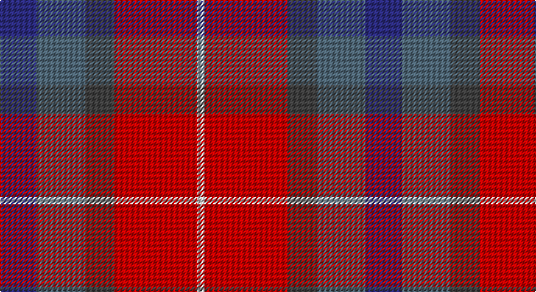

This page is one **sett** — a single exact thread-count. It belongs to the [tartan](/setts/db15n20do12r34lb3/)
(the same proportion at any scale), whose colour order is pattern [BBBRW](/stripes/bbbrw/).

Part of the [McCurdy-Stribbling](/tartans/mccurdy-stribbling/) tartan — the named design grouping this sett with its other cloths.

Sourced from tartans-authority.  It is a [5 stripe tartan](/stripes/stripes5/).

Original link http://www.tartansauthority.com/tartan-ferret/display/10284/

## Register references

External register numbers recorded for this tartan.

- Scottish Register of Tartans: [10284](https://www.tartanregister.gov.uk/tartanDetails?ref=10284)
- Scottish Tartans Authority (ITI): 10284

## Thread count
DB/30 Nb40 N24 R68 Na/6

One full sett is **300 threads**.

## Palette

Palette: <strong>Tartan Register</strong> <small style="color:#888">(2 of 5 colours)</small>
<table><thead><tr><th>Colour</th><th>Threads</th><th>Shade</th><th>Base</th><th>OKLCh</th></tr></thead><tbody><tr><td>DB/</td><td style="text-align:right;font-variant-numeric:tabular-nums">30</td><td><code style="background-color:#2C2C80;">#2C2C80</code> <small style="color:#888">#2C2C80</small></td><td>B <code style="background-color:#2A418A;">#2A418A</code></td><td><small style="color:#888">oklch(35.0% 0.138 276.6)</small></td></tr><tr><td>Nb</td><td style="text-align:right;font-variant-numeric:tabular-nums">40</td><td><code style="background-color:#506878;">#506878</code> <small style="color:#888">#506878</small></td><td>B <code style="background-color:#2A418A;">#2A418A</code></td><td><small style="color:#888">oklch(50.4% 0.038 237.7)</small></td></tr><tr><td>N</td><td style="text-align:right;font-variant-numeric:tabular-nums">24</td><td><code style="background-color:#404040;">#404040</code> <small style="color:#888">#404040</small></td><td>B <code style="background-color:#2A418A;">#2A418A</code></td><td><small style="color:#888">oklch(37.1% 0.000 89.9)</small></td></tr><tr><td>R</td><td style="text-align:right;font-variant-numeric:tabular-nums">68</td><td><code style="background-color:#C80000;">#C80000</code> <small style="color:#888">#C80000</small></td><td>R <code style="background-color:#CC0000;">#CC0000</code></td><td><small style="color:#888">oklch(52.3% 0.215 29.2)</small></td></tr><tr><td>Na/</td><td style="text-align:right;font-variant-numeric:tabular-nums">6</td><td><code style="background-color:#CCCCCC;">#CCCCCC</code> <small style="color:#888">#CCCCCC</small></td><td>W <code style="background-color:#F7F7F7;">#F7F7F7</code></td><td><small style="color:#888">oklch(84.5% 0.000 89.9)</small></td></tr></tbody></table>

# Sample pattern

## Compared to the master

This cloth is one sett of its design; the master sett (the exemplar the design is anchored on) is below for comparison.

<figure style="margin:0"><figcaption style="color:#888;font-size:smaller">this sett</figcaption></figure>
<figure style="margin:0"><figcaption style="color:#888;font-size:smaller"><a href="/setts/db15t20k12o34y3/">master sett →</a></figcaption></figure>

## Nearest tartans

The nearest existing variants by ΔTartan distance, with this tartan at the top so the swatches line up against it.

ΔTartan

Tartan

Sett

—

<a href="/ttd/edit/#slug=db15n20do12r34lb3~x2">McCurdy-Stribbling (Personal)</a> <a class="nn-out" href="/variants/s5/db15n20do12r34lb3~x2/" title="open its dictionary page">↗</a>

1.20

<a href="/ttd/edit/#slug=k1r9n8y8w1~x2&amp;base=db15n20do12r34lb3~x2">Pople (Name)</a> <a class="nn-out" href="/variants/s5/k1r9n8y8w1~x2/" title="open its dictionary page">↗</a>

1.30

<a href="/ttd/edit/#slug=dp2t9dp3r7ri19ly2~x2&amp;base=db15n20do12r34lb3~x2">Stevens #3</a> <a class="nn-out" href="/variants/s6/dp2t9dp3r7ri19ly2~x2/" title="open its dictionary page">↗</a>

1.46

<a href="/ttd/edit/#slug=r8ri1dg4ri1db4~x2&amp;base=db15n20do12r34lb3~x2">Moray of Abercairney #2</a> <a class="nn-out" href="/variants/s5/r8ri1dg4ri1db4~x2/" title="open its dictionary page">↗</a>

1.46

<a href="/ttd/edit/#slug=r11n3r12k11b11w1~x2&amp;base=db15n20do12r34lb3~x2">Dunfermline</a> <a class="nn-out" href="/variants/s6/r11n3r12k11b11w1~x2/" title="open its dictionary page">↗</a>

1.51

<a href="/ttd/edit/#slug=ri8r1g4r1db4~x2&amp;base=db15n20do12r34lb3~x2">Moray of Abercairney</a> <a class="nn-out" href="/variants/s5/ri8r1g4r1db4~x2/" title="open its dictionary page">↗</a>

1.55

<a href="/ttd/edit/#slug=k8lo2n30r30lb3~x2&amp;base=db15n20do12r34lb3~x2">Douglas Ancient Red</a> <a class="nn-out" href="/variants/s5/k8lo2n30r30lb3~x2/" title="open its dictionary page">↗</a>

1.55

<a href="/ttd/edit/#slug=db15t20k12o34y3~x2&amp;base=db15n20do12r34lb3~x2">McCurdy-Stribbling (Personal)</a> <a class="nn-out" href="/variants/s5/db15t20k12o34y3~x2/" title="open its dictionary page">↗</a>

1.58

<a href="/ttd/edit/#slug=r2dy8db2t4k4t1~x6&amp;base=db15n20do12r34lb3~x2">Thompson's Fancy Personal Tartan</a> <a class="nn-out" href="/variants/s6/r2dy8db2t4k4t1~x6/" title="open its dictionary page">↗</a>

1.59

<a href="/ttd/edit/#slug=ri15r98dp72t25dp8w15&amp;base=db15n20do12r34lb3~x2">Afternoon Tea / Assam</a> <a class="nn-out" href="/variants/s6/ri15r98dp72t25dp8w15/" title="open its dictionary page">↗</a>

1.60

<a href="/ttd/edit/#slug=db18r18dp2g12db1~x4&amp;base=db15n20do12r34lb3~x2">Wyeth (Personal)</a> <a class="nn-out" href="/variants/s5/db18r18dp2g12db1~x4/" title="open its dictionary page">↗</a>

## Neighbour map

Every grey dot is one of 14360 variants placed by the first two principal components of the ΔTartan feature space (44% of its variance). Red is this tartan; blue dots are its nearest — click one to open its page.

<svg viewBox="0 0 640 380" role="img" style="max-width:100%;height:auto;border:1px solid #e0e0e0;border-radius:4px;display:block" xmlns="http://www.w3.org/2000/svg"><image href="/nn/cloud.v1.png" width="640" height="380"/><a href="/variants/s5/k1r9n8y8w1~x2/"><circle cx="200.7" cy="237.5" r="4" fill="#3465a4"><title>Pople (Name)</title></circle></a><a href="/variants/s6/dp2t9dp3r7ri19ly2~x2/"><circle cx="244.9" cy="195.0" r="4" fill="#3465a4"><title>Stevens #3</title></circle></a><a href="/variants/s5/r8ri1dg4ri1db4~x2/"><circle cx="239.1" cy="232.3" r="4" fill="#3465a4"><title>Moray of Abercairney #2</title></circle></a><a href="/variants/s6/r11n3r12k11b11w1~x2/"><circle cx="214.8" cy="218.6" r="4" fill="#3465a4"><title>Dunfermline</title></circle></a><a href="/variants/s5/ri8r1g4r1db4~x2/"><circle cx="241.6" cy="236.1" r="4" fill="#3465a4"><title>Moray of Abercairney</title></circle></a><a href="/variants/s5/k8lo2n30r30lb3~x2/"><circle cx="283.4" cy="200.9" r="4" fill="#3465a4"><title>Douglas Ancient Red</title></circle></a><a href="/variants/s5/db15t20k12o34y3~x2/"><circle cx="231.5" cy="249.0" r="4" fill="#3465a4"><title>McCurdy-Stribbling (Personal)</title></circle></a><a href="/variants/s6/r2dy8db2t4k4t1~x6/"><circle cx="163.1" cy="226.4" r="4" fill="#3465a4"><title>Thompson's Fancy Personal Tartan</title></circle></a><a href="/variants/s6/ri15r98dp72t25dp8w15/"><circle cx="236.5" cy="179.3" r="4" fill="#3465a4"><title>Afternoon Tea / Assam</title></circle></a><a href="/variants/s5/db18r18dp2g12db1~x4/"><circle cx="241.4" cy="208.1" r="4" fill="#3465a4"><title>Wyeth (Personal)</title></circle></a><circle cx="206.0" cy="223.2" r="5" fill="#c00000"/></svg>

ID: /variants/s5/db15n20do12r34lb3~x2/
