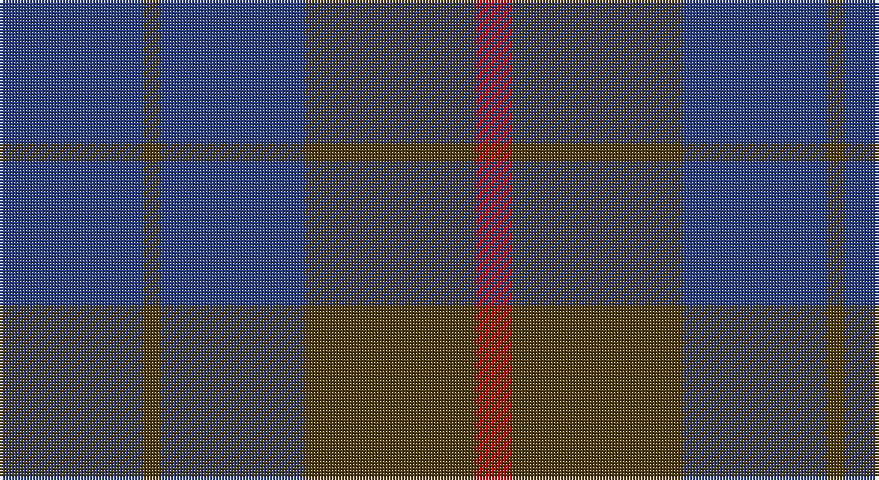

This page is one **sett** — a single exact thread-count. It belongs to the [tartan](/setts/db16dy2db16dy19r4/)
(the same proportion at any scale), whose colour order is pattern [BGBGR](/stripes/bgbgr/).

Part of the [Unidentified](/tartans/unidentified/) tartan — the named design grouping this sett with its other cloths.

Sourced from register-of-tartans.  It is a [5 stripe tartan](/stripes/stripes5/).

Original link https://www.tartanregister.gov.uk/tartanDetails.aspx?ref=4225

## Provenance

Earliest known date: 0 Seen by Alex Lumsden in a Toronto subway 1984.

## Also known as

This cloth is also recorded under:

- Unidentified #10
- Unidentified #12
- Unidentified #14
- Unidentified #15
- Unidentified #16
- Unidentified #18
- Unidentified #2
- Unidentified #21
- Unidentified #22
- Unidentified #24
- Unidentified #25
- Unidentified #28
- Unidentified #29
- Unidentified #30
- Unidentified #31
- Unidentified #32
- Unidentified #36
- Unidentified #37
- Unidentified #38
- Unidentified #40
- Unidentified #43
- Unidentified #44
- Unidentified #45
- Unidentified #46
- Unidentified #47
- Unidentified #48
- Unidentified #49
- Unidentified #5
- Unidentified #50
- Unidentified #51
- Unidentified #52
- Unidentified #53
- Unidentified #54
- Unidentified #55
- Unidentified #56
- Unidentified #57
- Unidentified #58
- Unidentified #59
- Unidentified #60
- Unidentified #61
- Unidentified #62
- Unidentified #63
- Unidentified #64
- Unidentified #65
- Unidentified #66
- Unidentified #7
- Unidentified #8
- Unidentified #9
- Unidentified 16
- Unidentified Artifact
- Unidentified Plaid
- Unidentified Plaid #11
- Unidentified Plaid #13
- Unidentified Plaid #2
- Unidentified Plaid #3
- Unidentified Plaid #7
- Unidentified Plaid #8
- Unidentified Plaid #9
- Unidentified Portrait

2 attestations — the source records this cloth was collapsed from (oldest owns this page)

<ul>
<li>undated — Unidentified #24 (register-of-tartans, <a href="https://www.tartanregister.gov.uk/tartanDetails.aspx?ref=4225">record</a>)</li>
<li>undated — Unidentified Tartan (house-of-tartan, <a href="http://www.house-of-tartan.scotland.net/house/TartanViewjs.asp?colr=Def&tnam=598">record</a>)</li>
</ul>

## Register references

External register numbers recorded for this tartan.

- Scottish Register of Tartans: [4225](https://www.tartanregister.gov.uk/tartanDetails.aspx?ref=4225)
- Scottish Tartans World Register: 598

## Thread count
B/48 T6 B48 T57 R/12

One full sett is **282 threads**.

## Palette

Palette: <strong>Tartan Register</strong>
<table><thead><tr><th>Colour</th><th>Threads</th><th>Shade</th><th>Base</th><th>OKLCh</th></tr></thead><tbody><tr><td>B/</td><td style="text-align:right;font-variant-numeric:tabular-nums">48</td><td><code style="background-color:#2C4084;">#2C4084</code> <small style="color:#888">#2C4084</small></td><td>B <code style="background-color:#2A418A;">#2A418A</code></td><td><small style="color:#888">oklch(39.4% 0.117 268.3)</small></td></tr><tr><td>T</td><td style="text-align:right;font-variant-numeric:tabular-nums">6</td><td><code style="background-color:#503C14;">#503C14</code> <small style="color:#888">#503C14</small></td><td>G <code style="background-color:#006100;">#006100</code></td><td><small style="color:#888">oklch(37.0% 0.062 81.8)</small></td></tr><tr><td>B</td><td style="text-align:right;font-variant-numeric:tabular-nums">48</td><td><code style="background-color:#2C4084;">#2C4084</code> <small style="color:#888">#2C4084</small></td><td>B <code style="background-color:#2A418A;">#2A418A</code></td><td><small style="color:#888">oklch(39.4% 0.117 268.3)</small></td></tr><tr><td>T</td><td style="text-align:right;font-variant-numeric:tabular-nums">57</td><td><code style="background-color:#503C14;">#503C14</code> <small style="color:#888">#503C14</small></td><td>G <code style="background-color:#006100;">#006100</code></td><td><small style="color:#888">oklch(37.0% 0.062 81.8)</small></td></tr><tr><td>R/</td><td style="text-align:right;font-variant-numeric:tabular-nums">12</td><td><code style="background-color:#DC0000;">#DC0000</code> <small style="color:#888">#DC0000</small></td><td>R <code style="background-color:#CC0000;">#CC0000</code></td><td><small style="color:#888">oklch(56.2% 0.230 29.2)</small></td></tr></tbody></table>

# Sample pattern

## Compared to the master

This cloth is one sett of its design; the master sett (the exemplar the design is anchored on) is below for comparison.

<figure style="margin:0"><figcaption style="color:#888;font-size:smaller">this sett</figcaption></figure>
<figure style="margin:0"><figcaption style="color:#888;font-size:smaller"><a href="/setts/dp4r3dp26r26dg26r4/">master sett →</a></figcaption></figure>

## Nearest tartans

The nearest existing variants by ΔTartan distance, with this tartan at the top so the swatches line up against it.

ΔTartan

Tartan

Sett

—

<a href="/ttd/edit/#slug=db16dy2db16dy19r4~x3">Unidentified #24</a> <a class="nn-out" href="/variants/s5/db16dy2db16dy19r4~x3/" title="open its dictionary page">↗</a>

0.60

<a href="/ttd/edit/#slug=db16o2db16o19r4~x3&amp;base=db16dy2db16dy19r4~x3">Unidentified 17</a> <a class="nn-out" href="/variants/s5/db16o2db16o19r4~x3/" title="open its dictionary page">↗</a>

1.46

<a href="/ttd/edit/#slug=db1r3db1r3db6g1~x4&amp;base=db16dy2db16dy19r4~x3">Robbins</a> <a class="nn-out" href="/variants/s6/db1r3db1r3db6g1~x4/" title="open its dictionary page">↗</a>

1.62

<a href="/ttd/edit/#slug=o15r5o30db32o4ly3~x2&amp;base=db16dy2db16dy19r4~x3">Cameron, hunting</a> <a class="nn-out" href="/variants/s6/o15r5o30db32o4ly3~x2/" title="open its dictionary page">↗</a>

1.63

<a href="/ttd/edit/#slug=db11dg2db15dg18w2~x2&amp;base=db16dy2db16dy19r4~x3">Hamilton Hunting</a> <a class="nn-out" href="/variants/s5/db11dg2db15dg18w2~x2/" title="open its dictionary page">↗</a>

1.65

<a href="/ttd/edit/#slug=n16r2n10r14t5~x2&amp;base=db16dy2db16dy19r4~x3">Mowbray (Personal)</a> <a class="nn-out" href="/variants/s5/n16r2n10r14t5~x2/" title="open its dictionary page">↗</a>

1.66

<a href="/ttd/edit/#slug=dg17r2db15~x2&amp;base=db16dy2db16dy19r4~x3">Ferguson (Old)</a> <a class="nn-out" href="/variants/s3/dg17r2db15~x2/" title="open its dictionary page">↗</a>

1.68

<a href="/ttd/edit/#slug=dr30db10dr3db30m3~x2&amp;base=db16dy2db16dy19r4~x3">Feniston (Personal)</a> <a class="nn-out" href="/variants/s5/dr30db10dr3db30m3~x2/" title="open its dictionary page">↗</a>

1.71

<a href="/ttd/edit/#slug=y9db3y1db11y1~x6&amp;base=db16dy2db16dy19r4~x3">MacCallum, High School</a> <a class="nn-out" href="/variants/s5/y9db3y1db11y1~x6/" title="open its dictionary page">↗</a>

1.76

<a href="/ttd/edit/#slug=dy34db27r3db27dy34w3~x2&amp;base=db16dy2db16dy19r4~x3">London Regiment</a> <a class="nn-out" href="/variants/s6/dy34db27r3db27dy34w3~x2/" title="open its dictionary page">↗</a>

1.77

<a href="/ttd/edit/#slug=db13n6r51db51n5~x2&amp;base=db16dy2db16dy19r4~x3">Hillsdale (Corporate?)</a> <a class="nn-out" href="/variants/s5/db13n6r51db51n5~x2/" title="open its dictionary page">↗</a>

## Neighbour map

Every grey dot is one of 14360 variants placed by the first two principal components of the ΔTartan feature space (44% of its variance). Red is this tartan; blue dots are its nearest — click one to open its page.

<svg viewBox="0 0 640 380" role="img" style="max-width:100%;height:auto;border:1px solid #e0e0e0;border-radius:4px;display:block" xmlns="http://www.w3.org/2000/svg"><image href="/nn/cloud.v1.png" width="640" height="380"/><a href="/variants/s5/db16o2db16o19r4~x3/"><circle cx="408.0" cy="307.9" r="4" fill="#3465a4"><title>Unidentified 17</title></circle></a><a href="/variants/s6/db1r3db1r3db6g1~x4/"><circle cx="364.5" cy="288.0" r="4" fill="#3465a4"><title>Robbins</title></circle></a><a href="/variants/s6/o15r5o30db32o4ly3~x2/"><circle cx="378.5" cy="245.6" r="4" fill="#3465a4"><title>Cameron, hunting</title></circle></a><a href="/variants/s5/db11dg2db15dg18w2~x2/"><circle cx="365.8" cy="292.4" r="4" fill="#3465a4"><title>Hamilton Hunting</title></circle></a><a href="/variants/s5/n16r2n10r14t5~x2/"><circle cx="397.5" cy="318.7" r="4" fill="#3465a4"><title>Mowbray (Personal)</title></circle></a><a href="/variants/s3/dg17r2db15~x2/"><circle cx="365.7" cy="335.8" r="4" fill="#3465a4"><title>Ferguson (Old)</title></circle></a><a href="/variants/s5/dr30db10dr3db30m3~x2/"><circle cx="424.9" cy="285.5" r="4" fill="#3465a4"><title>Feniston (Personal)</title></circle></a><a href="/variants/s5/y9db3y1db11y1~x6/"><circle cx="449.5" cy="290.1" r="4" fill="#3465a4"><title>MacCallum, High School</title></circle></a><a href="/variants/s6/dy34db27r3db27dy34w3~x2/"><circle cx="343.2" cy="255.2" r="4" fill="#3465a4"><title>London Regiment</title></circle></a><a href="/variants/s5/db13n6r51db51n5~x2/"><circle cx="386.6" cy="268.1" r="4" fill="#3465a4"><title>Hillsdale (Corporate?)</title></circle></a><circle cx="399.2" cy="307.0" r="5" fill="#c00000"/></svg>

ID: /variants/s5/db16dy2db16dy19r4~x3/
