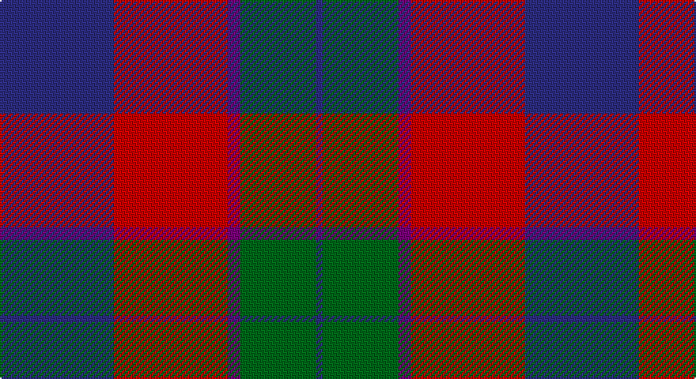

This page is one **sett** — a single exact thread-count. It belongs to the [tartan](/setts/db18r18dp2g12db1/)
(the same proportion at any scale), whose colour order is pattern [BGBRB](/stripes/bgbrb/).

Sourced from tartans-authority.  It is a [5 stripe tartan](/stripes/stripes5/).

Original link http://www.tartansauthority.com/tartan-ferret/display/6058/

## Register references

External register numbers recorded for this tartan.

- Scottish Tartans Authority (ITI): 6058

## Thread count
DB/72 R72 P8 G48 DB/4

One full sett is **332 threads**.

## Palette

Palette: <strong>Tartan Register</strong>
<table><thead><tr><th>Colour</th><th>Threads</th><th>Shade</th><th>Base</th><th>OKLCh</th></tr></thead><tbody><tr><td>DB/</td><td style="text-align:right;font-variant-numeric:tabular-nums">72</td><td><code style="background-color:#2C2C80;">#2C2C80</code> <small style="color:#888">#2C2C80</small></td><td>B <code style="background-color:#2A418A;">#2A418A</code></td><td><small style="color:#888">oklch(35.0% 0.138 276.6)</small></td></tr><tr><td>R</td><td style="text-align:right;font-variant-numeric:tabular-nums">72</td><td><code style="background-color:#C80000;">#C80000</code> <small style="color:#888">#C80000</small></td><td>R <code style="background-color:#CC0000;">#CC0000</code></td><td><small style="color:#888">oklch(52.3% 0.215 29.2)</small></td></tr><tr><td>P</td><td style="text-align:right;font-variant-numeric:tabular-nums">8</td><td><code style="background-color:#780078;">#780078</code> <small style="color:#888">#780078</small></td><td>B <code style="background-color:#2A418A;">#2A418A</code></td><td><small style="color:#888">oklch(40.2% 0.185 328.4)</small></td></tr><tr><td>G</td><td style="text-align:right;font-variant-numeric:tabular-nums">48</td><td><code style="background-color:#006818;">#006818</code> <small style="color:#888">#006818</small></td><td>G <code style="background-color:#006100;">#006100</code></td><td><small style="color:#888">oklch(45.0% 0.142 145.0)</small></td></tr><tr><td>DB/</td><td style="text-align:right;font-variant-numeric:tabular-nums">4</td><td><code style="background-color:#2C2C80;">#2C2C80</code> <small style="color:#888">#2C2C80</small></td><td>B <code style="background-color:#2A418A;">#2A418A</code></td><td><small style="color:#888">oklch(35.0% 0.138 276.6)</small></td></tr></tbody></table>

# Sample pattern

## Nearest tartans

The nearest existing variants by ΔTartan distance, with this tartan at the top so the swatches line up against it.

ΔTartan

Tartan

Sett

—

<a href="/ttd/edit/#slug=db18r18dp2g12db1~x4">Wyeth (Personal)</a> <a class="nn-out" href="/variants/s5/db18r18dp2g12db1~x4/" title="open its dictionary page">↗</a>

0.86

<a href="/ttd/edit/#slug=r31dt33g12w2~x2&amp;base=db18r18dp2g12db1~x4">Manor of Wrentnall (Personal)</a> <a class="nn-out" href="/variants/s4/r31dt33g12w2~x2/" title="open its dictionary page">↗</a>

0.90

<a href="/ttd/edit/#slug=w3dg18db22r19dg1r2~x2&amp;base=db18r18dp2g12db1~x4">Nibley (Personal)</a> <a class="nn-out" href="/variants/s6/w3dg18db22r19dg1r2~x2/" title="open its dictionary page">↗</a>

1.03

<a href="/ttd/edit/#slug=k4r37db37r2db37g37r37k4~x2&amp;base=db18r18dp2g12db1~x4">Skene of Cromar - 1950 (Clan)</a> <a class="nn-out" href="/variants/s8/k4r37db37r2db37g37r37k4~x2/" title="open its dictionary page">↗</a>

1.12

<a href="/ttd/edit/#slug=k4r37db37r2db37g37r37k4&amp;base=db18r18dp2g12db1~x4">Skene, of Cromar</a> <a class="nn-out" href="/variants/s8/k4r37db37r2db37g37r37k4/" title="open its dictionary page">↗</a>

1.17

<a href="/ttd/edit/#slug=t2r12db2t6k6t1~x2&amp;base=db18r18dp2g12db1~x4">MacTavish Thomson Clan Tartan</a> <a class="nn-out" href="/variants/s6/t2r12db2t6k6t1~x2/" title="open its dictionary page">↗</a>

1.19

<a href="/ttd/edit/#slug=db1r5dg18r4db9r10w1~x4&amp;base=db18r18dp2g12db1~x4">MacKintosh Geddes</a> <a class="nn-out" href="/variants/s7/db1r5dg18r4db9r10w1~x4/" title="open its dictionary page">↗</a>

1.23

<a href="/ttd/edit/#slug=o2dr14o1k14o14ly2~x2&amp;base=db18r18dp2g12db1~x4">United Distillers</a> <a class="nn-out" href="/variants/s6/o2dr14o1k14o14ly2~x2/" title="open its dictionary page">↗</a>

1.24

<a href="/ttd/edit/#slug=w4db30g10r25w2~x2&amp;base=db18r18dp2g12db1~x4">Highland Spring Dress (2004) (Corp)</a> <a class="nn-out" href="/variants/s5/w4db30g10r25w2~x2/" title="open its dictionary page">↗</a>

1.25

<a href="/ttd/edit/#slug=t2r12db2t6k6t1~x4&amp;base=db18r18dp2g12db1~x4">Thompson/Thomson/MacTavish</a> <a class="nn-out" href="/variants/s6/t2r12db2t6k6t1~x4/" title="open its dictionary page">↗</a>

1.26

<a href="/ttd/edit/#slug=w3g15db18r15g1r2~x2&amp;base=db18r18dp2g12db1~x4">Nibley</a> <a class="nn-out" href="/variants/s6/w3g15db18r15g1r2~x2/" title="open its dictionary page">↗</a>

## Neighbour map

Every grey dot is one of 14360 variants placed by the first two principal components of the ΔTartan feature space (44% of its variance). Red is this tartan; blue dots are its nearest — click one to open its page.

<svg viewBox="0 0 640 380" role="img" style="max-width:100%;height:auto;border:1px solid #e0e0e0;border-radius:4px;display:block" xmlns="http://www.w3.org/2000/svg"><image href="/nn/cloud.v1.png" width="640" height="380"/><a href="/variants/s4/r31dt33g12w2~x2/"><circle cx="258.8" cy="223.2" r="4" fill="#3465a4"><title>Manor of Wrentnall (Personal)</title></circle></a><a href="/variants/s6/w3dg18db22r19dg1r2~x2/"><circle cx="224.2" cy="180.6" r="4" fill="#3465a4"><title>Nibley (Personal)</title></circle></a><a href="/variants/s8/k4r37db37r2db37g37r37k4~x2/"><circle cx="234.4" cy="191.1" r="4" fill="#3465a4"><title>Skene of Cromar - 1950 (Clan)</title></circle></a><a href="/variants/s8/k4r37db37r2db37g37r37k4/"><circle cx="228.2" cy="189.0" r="4" fill="#3465a4"><title>Skene, of Cromar</title></circle></a><a href="/variants/s6/t2r12db2t6k6t1~x2/"><circle cx="220.0" cy="195.5" r="4" fill="#3465a4"><title>MacTavish Thomson Clan Tartan</title></circle></a><a href="/variants/s7/db1r5dg18r4db9r10w1~x4/"><circle cx="249.2" cy="180.7" r="4" fill="#3465a4"><title>MacKintosh Geddes</title></circle></a><a href="/variants/s6/o2dr14o1k14o14ly2~x2/"><circle cx="204.0" cy="194.2" r="4" fill="#3465a4"><title>United Distillers</title></circle></a><a href="/variants/s5/w4db30g10r25w2~x2/"><circle cx="227.2" cy="195.2" r="4" fill="#3465a4"><title>Highland Spring Dress (2004) (Corp)</title></circle></a><a href="/variants/s6/t2r12db2t6k6t1~x4/"><circle cx="215.9" cy="193.1" r="4" fill="#3465a4"><title>Thompson/Thomson/MacTavish</title></circle></a><a href="/variants/s6/w3g15db18r15g1r2~x2/"><circle cx="205.1" cy="188.0" r="4" fill="#3465a4"><title>Nibley</title></circle></a><circle cx="241.4" cy="208.1" r="5" fill="#c00000"/></svg>

ID: /variants/s5/db18r18dp2g12db1~x4/
