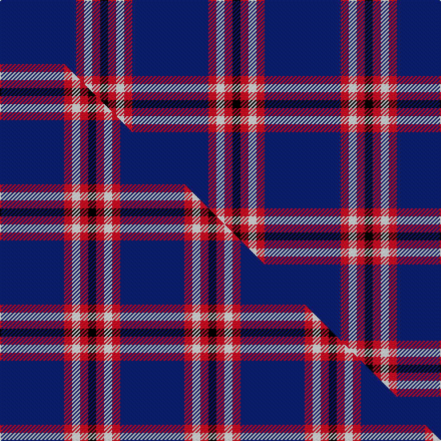

This page is one **sett** — a single exact thread-count. It belongs to the [tartan](/setts/db19r2w2r2k2/)
(the same proportion at any scale), whose colour order is pattern [BRWRK](/stripes/brwrk/).

Part of the [Laing of Archiestown](/tartans/laing-of-archiestown/) tartan — the named design grouping this sett with its other cloths.

Sourced from weddslist.  It is a [5 stripe tartan](/stripes/stripes5/).

Original link http://www.weddslist.com/cgi-bin/tartans/pg.pl?source=sts

## Thread count
DB/76 R8 W8 R8 K/8

One full sett is **132 threads**.

## Palette
<table><thead><tr><th>Colour</th><th>Shade</th><th>OKLCh</th></tr></thead><tbody><tr><td>DB</td><td><code style="background-color:#082077;">#082077</code> <small style="color:#888">#082077</small></td><td><small style="color:#888">oklch(30.0% 0.149 265.1)</small></td></tr><tr><td>K</td><td><code style="background-color:#000000;">#000000</code> <small style="color:#888">#000000</small></td><td><small style="color:#888">oklch(0.0% 0.000 0.0)</small></td></tr><tr><td>W</td><td><code style="background-color:#F7F7F7;">#F7F7F7</code> <small style="color:#888">#F7F7F7</small></td><td><small style="color:#888">oklch(97.6% 0.000 89.9)</small></td></tr><tr><td>R</td><td><code style="background-color:#D60020;">#D60020</code> <small style="color:#888">#D60020</small></td><td><small style="color:#888">oklch(55.2% 0.224 25.5)</small></td></tr></tbody></table>

# Sample pattern

## Compared to the master

This cloth is one sett of its design; the master sett (the exemplar the design is anchored on) is below for comparison.

Its **ΔTartan distance** from the master is **0.63** — the same measure the nearest-tartans table ranks by (0 is identical; a re-scale of the same cloth is near 0, a recolour or a different proportion further).

<figure class="master-compare" style="margin:0">

this sett
master sett ★

<figcaption style="color:#888;font-size:smaller">One weave of this sett against the <a href="/setts/db8r1w1r1k1/">master sett ★</a>, split on the diagonal: a shared proportion runs seamlessly across it with only the shades shifting; a different proportion breaks on it.</figcaption>
</figure>

## Nearest variants

The nearest existing variants by ΔTartan distance, with this cloth at the top so the swatches line up against it.

ΔTartan

Threads

Variant

Sett

—

132

<a href="/variants/s5/db19r2w2r2k2~x4/">Laing of Archiestown</a>

<a href="/ttd/edit/#slug=db8r1w1r1k1~x8&amp;base=db19r2w2r2k2~x4" title="compare in the TTD">0.16</a>

120

<a href="/variants/s5/db8r1w1r1k1~x8/">Laing of Archiestown</a>

<a href="/ttd/edit/#slug=db14k3dr3w1~x2&amp;base=db19r2w2r2k2~x4" title="compare in the TTD">0.71</a>

54

<a href="/variants/s4/db14k3dr3w1~x2/">Bacon, Blue</a>

<a href="/ttd/edit/#slug=r2k6db33w2~x4&amp;base=db19r2w2r2k2~x4" title="compare in the TTD">0.73</a>

328

<a href="/variants/s4/r2k6db33w2~x4/">McCallie</a>

<a href="/ttd/edit/#slug=r4db32k15w2~x2&amp;base=db19r2w2r2k2~x4" title="compare in the TTD">0.77</a>

200

<a href="/variants/s4/r4db32k15w2~x2/">Scottish Nuclear</a>

<a href="/ttd/edit/#slug=r1db9k4lb1~x4&amp;base=db19r2w2r2k2~x4" title="compare in the TTD">0.80</a>

112

<a href="/variants/s4/r1db9k4lb1~x4/">Scottish Nuclear (Corporate)</a>

<a href="/ttd/edit/#slug=r4g2r2k5db22w2~x4&amp;base=db19r2w2r2k2~x4" title="compare in the TTD">0.87</a>

272

<a href="/variants/s6/r4g2r2k5db22w2~x4/">Reese (Personal)</a>

<a href="/ttd/edit/#slug=db31k8dp4w2~x4&amp;base=db19r2w2r2k2~x4" title="compare in the TTD">1.04</a>

228

<a href="/variants/s4/db31k8dp4w2~x4/">Osborne, Luke Alexander (Personal)</a>

<a href="/ttd/edit/#slug=r14w6db38k3g2~x2&amp;base=db19r2w2r2k2~x4" title="compare in the TTD">1.12</a>

220

<a href="/variants/s5/r14w6db38k3g2~x2/">Doten (2013)</a>

<a href="/ttd/edit/#slug=lr8w3db40k12w3lr3~x2&amp;base=db19r2w2r2k2~x4" title="compare in the TTD">1.30</a>

254

<a href="/variants/s6/lr8w3db40k12w3lr3~x2/">Wolverines (Corporate)</a>

<a href="/ttd/edit/#slug=r14lr6db38k3g2~x2&amp;base=db19r2w2r2k2~x4" title="compare in the TTD">1.42</a>

220

<a href="/variants/s5/r14lr6db38k3g2~x2/">Doten (2013)</a>

## Neighbour map

Every grey dot is one of 13620 variants placed by the first two principal components of the ΔTartan feature space (42% of its variance). Red is this tartan; blue dots are its nearest — click one to open its page.

<svg viewBox="0 0 640 380" role="img" style="max-width:100%;height:auto;border:1px solid #e0e0e0;border-radius:4px;display:block" xmlns="http://www.w3.org/2000/svg"><image href="/nn/cloud.v1.png" width="640" height="380"/><a href="/variants/s5/db8r1w1r1k1~x8/"><circle cx="335.4" cy="175.5" r="4" fill="#3465a4"><title>Laing of Archiestown</title></circle></a><a href="/variants/s4/db14k3dr3w1~x2/"><circle cx="384.2" cy="192.8" r="4" fill="#3465a4"><title>Bacon, Blue</title></circle></a><a href="/variants/s4/r2k6db33w2~x4/"><circle cx="458.3" cy="161.6" r="4" fill="#3465a4"><title>McCallie</title></circle></a><a href="/variants/s4/r4db32k15w2~x2/"><circle cx="330.3" cy="186.3" r="4" fill="#3465a4"><title>Scottish Nuclear</title></circle></a><a href="/variants/s4/r1db9k4lb1~x4/"><circle cx="308.4" cy="210.7" r="4" fill="#3465a4"><title>Scottish Nuclear (Corporate)</title></circle></a><a href="/variants/s6/r4g2r2k5db22w2~x4/"><circle cx="273.4" cy="145.0" r="4" fill="#3465a4"><title>Reese (Personal)</title></circle></a><a href="/variants/s4/db31k8dp4w2~x4/"><circle cx="409.8" cy="185.8" r="4" fill="#3465a4"><title>Osborne, Luke Alexander (Personal)</title></circle></a><a href="/variants/s5/r14w6db38k3g2~x2/"><circle cx="299.6" cy="138.5" r="4" fill="#3465a4"><title>Doten (2013)</title></circle></a><a href="/variants/s6/lr8w3db40k12w3lr3~x2/"><circle cx="281.1" cy="154.7" r="4" fill="#3465a4"><title>Wolverines (Corporate)</title></circle></a><a href="/variants/s5/r14lr6db38k3g2~x2/"><circle cx="313.5" cy="141.4" r="4" fill="#3465a4"><title>Doten (2013)</title></circle></a><circle cx="374.8" cy="164.6" r="5" fill="#c00000"/><text x="320" y="376" text-anchor="middle" font-size="11" fill="#999">ground</text><text x="11" y="190" text-anchor="middle" font-size="11" fill="#999" transform="rotate(-90 11 190)">complexity</text></svg>

ID: /variants/s5/db19r2w2r2k2~x4/
