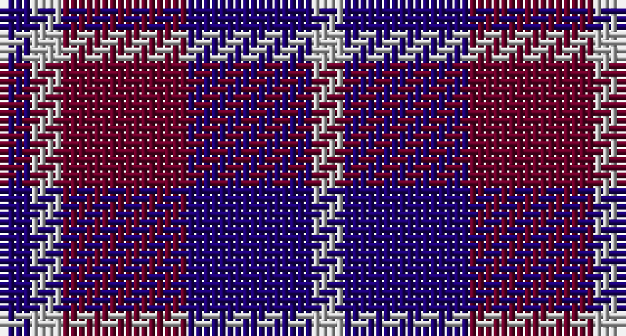

This page is one **sett** — a single exact thread-count. It belongs to the [tartan](/setts/db1lb1dr4db4lb1/)
(the same proportion at any scale), whose colour order is pattern [BWBBW](/stripes/bwbbw/).

Sourced from register-of-tartans.  It is a [5 stripe tartan](/stripes/stripes5/).

Original link https://www.tartanregister.gov.uk/tartanDetails.aspx?ref=2064

2 attestations — the source records this cloth was collapsed from (oldest owns this page)

<ul>
<li>01/01/1988 — Laval, Tartan de (register-of-tartans, <a href="https://www.tartanregister.gov.uk/tartanDetails.aspx?ref=2064">record</a>)</li>
<li>1988 — Laval, Tartan de (District) (tartans-authority, <a href="http://www.tartansauthority.com/tartan-ferret/display/2120/">record</a>)</li>
</ul>

## Register references

External register numbers recorded for this tartan.

- Scottish Register of Tartans: [2064](https://www.tartanregister.gov.uk/tartanDetails.aspx?ref=2064)
- Scottish Tartans Authority (ITI): 2120
- Scottish Tartans World Register: 2120

## Thread count
DB/4 N4 DR16 DB16 N/4

One full sett is **80 threads**.

## Palette

Palette: <strong>Tartan Register</strong>
<table><thead><tr><th>Colour</th><th>Threads</th><th>Shade</th><th>Base</th><th>OKLCh</th></tr></thead><tbody><tr><td>DB/</td><td style="text-align:right;font-variant-numeric:tabular-nums">4</td><td><code style="background-color:#1C0070;">#1C0070</code> <small style="color:#888">#1C0070</small></td><td>B <code style="background-color:#2A418A;">#2A418A</code></td><td><small style="color:#888">oklch(26.3% 0.162 277.1)</small></td></tr><tr><td>N</td><td style="text-align:right;font-variant-numeric:tabular-nums">4</td><td><code style="background-color:#C0C0C0;">#C0C0C0</code> <small style="color:#888">#C0C0C0</small></td><td>W <code style="background-color:#F7F7F7;">#F7F7F7</code></td><td><small style="color:#888">oklch(80.8% 0.000 89.9)</small></td></tr><tr><td>DR</td><td style="text-align:right;font-variant-numeric:tabular-nums">16</td><td><code style="background-color:#680028;">#680028</code> <small style="color:#888">#680028</small></td><td>B <code style="background-color:#2A418A;">#2A418A</code></td><td><small style="color:#888">oklch(33.1% 0.133 8.3)</small></td></tr><tr><td>DB</td><td style="text-align:right;font-variant-numeric:tabular-nums">16</td><td><code style="background-color:#1C0070;">#1C0070</code> <small style="color:#888">#1C0070</small></td><td>B <code style="background-color:#2A418A;">#2A418A</code></td><td><small style="color:#888">oklch(26.3% 0.162 277.1)</small></td></tr><tr><td>N/</td><td style="text-align:right;font-variant-numeric:tabular-nums">4</td><td><code style="background-color:#C0C0C0;">#C0C0C0</code> <small style="color:#888">#C0C0C0</small></td><td>W <code style="background-color:#F7F7F7;">#F7F7F7</code></td><td><small style="color:#888">oklch(80.8% 0.000 89.9)</small></td></tr></tbody></table>

# Sample pattern

## Nearest tartans

The nearest existing variants by ΔTartan distance, with this tartan at the top so the swatches line up against it.

ΔTartan

Tartan

Sett

—

<a href="/ttd/edit/#slug=db1lb1dr4db4lb1~x4">Laval, Tartan de</a> <a class="nn-out" href="/variants/s5/db1lb1dr4db4lb1~x4/" title="open its dictionary page">↗</a>

1.19

<a href="/ttd/edit/#slug=g5dp2db5dp10ly2~x2&amp;base=db1lb1dr4db4lb1~x4">Bryson (2000)</a> <a class="nn-out" href="/variants/s5/g5dp2db5dp10ly2~x2/" title="open its dictionary page">↗</a>

1.27

<a href="/ttd/edit/#slug=db2w2dr8db8w1~x2&amp;base=db1lb1dr4db4lb1~x4">Laval (Tartan de..)</a> <a class="nn-out" href="/variants/s5/db2w2dr8db8w1~x2/" title="open its dictionary page">↗</a>

1.57

<a href="/ttd/edit/#slug=dp23dg8dp23dg35w5~x2&amp;base=db1lb1dr4db4lb1~x4">Baru</a> <a class="nn-out" href="/variants/s5/dp23dg8dp23dg35w5~x2/" title="open its dictionary page">↗</a>

1.59

<a href="/ttd/edit/#slug=dp27k10dp27k35ly6&amp;base=db1lb1dr4db4lb1~x4">Moorlands (Corporate)</a> <a class="nn-out" href="/variants/s5/dp27k10dp27k35ly6/" title="open its dictionary page">↗</a>

1.64

<a href="/ttd/edit/#slug=r5db35k25db8ly10r5~x2&amp;base=db1lb1dr4db4lb1~x4">University of Notre Dame</a> <a class="nn-out" href="/variants/s6/r5db35k25db8ly10r5~x2/" title="open its dictionary page">↗</a>

1.65

<a href="/ttd/edit/#slug=db2lb2db7dr8lb10db2lb2db2~x2&amp;base=db1lb1dr4db4lb1~x4">Laval Dress, Tartan de</a> <a class="nn-out" href="/variants/s8/db2lb2db7dr8lb10db2lb2db2~x2/" title="open its dictionary page">↗</a>

1.67

<a href="/ttd/edit/#slug=db13r5g5w3~x8&amp;base=db1lb1dr4db4lb1~x4">International Highland Games Fed.</a> <a class="nn-out" href="/variants/s4/db13r5g5w3~x8/" title="open its dictionary page">↗</a>

1.68

<a href="/ttd/edit/#slug=db20k5db18lo26k6~x2&amp;base=db1lb1dr4db4lb1~x4">Johore Regiment (Military)</a> <a class="nn-out" href="/variants/s5/db20k5db18lo26k6~x2/" title="open its dictionary page">↗</a>

1.69

<a href="/ttd/edit/#slug=k4db1k1db1k1db4r2db4w2~x4&amp;base=db1lb1dr4db4lb1~x4">Broz Sanz Elementary (Corporate)</a> <a class="nn-out" href="/variants/s9/k4db1k1db1k1db4r2db4w2~x4/" title="open its dictionary page">↗</a>

1.79

<a href="/ttd/edit/#slug=db5k1dg1k1r3k1~x4&amp;base=db1lb1dr4db4lb1~x4">Clerk</a> <a class="nn-out" href="/variants/s6/db5k1dg1k1r3k1~x4/" title="open its dictionary page">↗</a>

## Neighbour map

Every grey dot is one of 14360 variants placed by the first two principal components of the ΔTartan feature space (44% of its variance). Red is this tartan; blue dots are its nearest — click one to open its page.

<svg viewBox="0 0 640 380" role="img" style="max-width:100%;height:auto;border:1px solid #e0e0e0;border-radius:4px;display:block" xmlns="http://www.w3.org/2000/svg"><image href="/nn/cloud.v1.png" width="640" height="380"/><a href="/variants/s5/g5dp2db5dp10ly2~x2/"><circle cx="217.9" cy="263.0" r="4" fill="#3465a4"><title>Bryson (2000)</title></circle></a><a href="/variants/s5/db2w2dr8db8w1~x2/"><circle cx="254.2" cy="244.1" r="4" fill="#3465a4"><title>Laval (Tartan de..)</title></circle></a><a href="/variants/s5/dp23dg8dp23dg35w5~x2/"><circle cx="292.8" cy="279.1" r="4" fill="#3465a4"><title>Baru</title></circle></a><a href="/variants/s5/dp27k10dp27k35ly6/"><circle cx="285.8" cy="287.6" r="4" fill="#3465a4"><title>Moorlands (Corporate)</title></circle></a><a href="/variants/s6/r5db35k25db8ly10r5~x2/"><circle cx="220.4" cy="222.4" r="4" fill="#3465a4"><title>University of Notre Dame</title></circle></a><a href="/variants/s8/db2lb2db7dr8lb10db2lb2db2~x2/"><circle cx="171.9" cy="228.4" r="4" fill="#3465a4"><title>Laval Dress, Tartan de</title></circle></a><a href="/variants/s4/db13r5g5w3~x8/"><circle cx="193.9" cy="271.4" r="4" fill="#3465a4"><title>International Highland Games Fed.</title></circle></a><a href="/variants/s5/db20k5db18lo26k6~x2/"><circle cx="226.7" cy="276.1" r="4" fill="#3465a4"><title>Johore Regiment (Military)</title></circle></a><a href="/variants/s9/k4db1k1db1k1db4r2db4w2~x4/"><circle cx="186.3" cy="247.5" r="4" fill="#3465a4"><title>Broz Sanz Elementary (Corporate)</title></circle></a><a href="/variants/s6/db5k1dg1k1r3k1~x4/"><circle cx="195.2" cy="243.4" r="4" fill="#3465a4"><title>Clerk</title></circle></a><circle cx="217.6" cy="275.7" r="5" fill="#c00000"/></svg>

ID: /variants/s5/db1lb1dr4db4lb1~x4/
