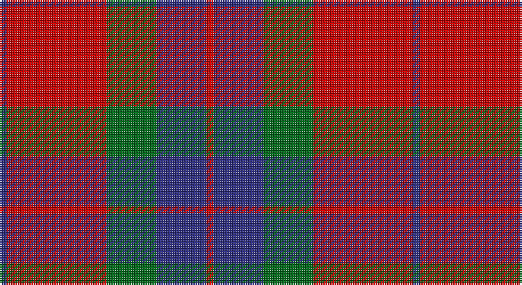

This page is one **sett** — a single exact thread-count. It belongs to the [tartan](/setts/db1r14g7db7r1/)
(the same proportion at any scale), whose colour order is pattern [BRGBR](/stripes/brgbr/).

Sourced from tartans-authority.  It is a [5 stripe tartan](/stripes/stripes5/).

Original link http://www.tartansauthority.com/tartan-ferret/display/2528/

2 attestations — the source records this cloth was collapsed from (oldest owns this page)

<ul>
<li>1805 — Fraser of Boblainy, Hugh (Personal) (tartans-authority, <a href="http://www.tartansauthority.com/tartan-ferret/display/2528/">record</a>)</li>
<li>undated — Fraser of Boblainy, Hugh (register-of-tartans, <a href="https://www.tartanregister.gov.uk/tartanDetails.aspx?ref=1263">record</a>)</li>
</ul>

## Register references

External register numbers recorded for this tartan.

- Scottish Register of Tartans: [1263](https://www.tartanregister.gov.uk/tartanDetails.aspx?ref=1263)
- Scottish Tartans Authority (ITI): 2528
- Scottish Tartans World Register: 2528

## Thread count
DB/4 R56 G28 DB28 R/4

One full sett is **232 threads**.

## Palette

Palette: <strong>Tartan Register</strong>
<table><thead><tr><th>Colour</th><th>Threads</th><th>Shade</th><th>Base</th><th>OKLCh</th></tr></thead><tbody><tr><td>DB/</td><td style="text-align:right;font-variant-numeric:tabular-nums">4</td><td><code style="background-color:#2C2C80;">#2C2C80</code> <small style="color:#888">#2C2C80</small></td><td>B <code style="background-color:#2A418A;">#2A418A</code></td><td><small style="color:#888">oklch(35.0% 0.138 276.6)</small></td></tr><tr><td>R</td><td style="text-align:right;font-variant-numeric:tabular-nums">56</td><td><code style="background-color:#C80000;">#C80000</code> <small style="color:#888">#C80000</small></td><td>R <code style="background-color:#CC0000;">#CC0000</code></td><td><small style="color:#888">oklch(52.3% 0.215 29.2)</small></td></tr><tr><td>G</td><td style="text-align:right;font-variant-numeric:tabular-nums">28</td><td><code style="background-color:#006818;">#006818</code> <small style="color:#888">#006818</small></td><td>G <code style="background-color:#006100;">#006100</code></td><td><small style="color:#888">oklch(45.0% 0.142 145.0)</small></td></tr><tr><td>DB</td><td style="text-align:right;font-variant-numeric:tabular-nums">28</td><td><code style="background-color:#2C2C80;">#2C2C80</code> <small style="color:#888">#2C2C80</small></td><td>B <code style="background-color:#2A418A;">#2A418A</code></td><td><small style="color:#888">oklch(35.0% 0.138 276.6)</small></td></tr><tr><td>R/</td><td style="text-align:right;font-variant-numeric:tabular-nums">4</td><td><code style="background-color:#C80000;">#C80000</code> <small style="color:#888">#C80000</small></td><td>R <code style="background-color:#CC0000;">#CC0000</code></td><td><small style="color:#888">oklch(52.3% 0.215 29.2)</small></td></tr></tbody></table>

# Sample pattern

## Nearest tartans

The nearest existing variants by ΔTartan distance, with this tartan at the top so the swatches line up against it.

ΔTartan

Tartan

Sett

—

<a href="/ttd/edit/#slug=db1r14g7db7r1~x4">Fraser of Boblainy, Hugh (Personal)</a> <a class="nn-out" href="/variants/s5/db1r14g7db7r1~x4/" title="open its dictionary page">↗</a>

0.60

<a href="/ttd/edit/#slug=r1r14g7db7r1~x4&amp;base=db1r14g7db7r1~x4">Hugh Fraser of Boblainy</a> <a class="nn-out" href="/variants/s5/r1r14g7db7r1~x4/" title="open its dictionary page">↗</a>

0.94

<a href="/ttd/edit/#slug=r12g8r54db45g6&amp;base=db1r14g7db7r1~x4">Wotherspoon</a> <a class="nn-out" href="/variants/s5/r12g8r54db45g6/" title="open its dictionary page">↗</a>

1.00

<a href="/ttd/edit/#slug=db2o28g13o2db13o2~x4&amp;base=db1r14g7db7r1~x4">Edinchat</a> <a class="nn-out" href="/variants/s6/db2o28g13o2db13o2~x4/" title="open its dictionary page">↗</a>

1.08

<a href="/ttd/edit/#slug=db2r25g10r2db10r2~x2&amp;base=db1r14g7db7r1~x4">Grant of Lurg</a> <a class="nn-out" href="/variants/s6/db2r25g10r2db10r2~x2/" title="open its dictionary page">↗</a>

1.11

<a href="/ttd/edit/#slug=r3db15r3g8r20k2~x2&amp;base=db1r14g7db7r1~x4">Finnigan (Estimated threadcount)</a> <a class="nn-out" href="/variants/s6/r3db15r3g8r20k2~x2/" title="open its dictionary page">↗</a>

1.15

<a href="/ttd/edit/#slug=db3r25db17r5g22r9db3~x2&amp;base=db1r14g7db7r1~x4">MacFadyan (MacGregor Hastie)</a> <a class="nn-out" href="/variants/s7/db3r25db17r5g22r9db3~x2/" title="open its dictionary page">↗</a>

1.16

<a href="/ttd/edit/#slug=r6dg16r4db12r16t1r2~x2&amp;base=db1r14g7db7r1~x4">MacQuarrie #6</a> <a class="nn-out" href="/variants/s7/r6dg16r4db12r16t1r2~x2/" title="open its dictionary page">↗</a>

1.17

<a href="/ttd/edit/#slug=r1db6r1dg6r12w1~x2&amp;base=db1r14g7db7r1~x4">Fraser Red Clan Tartan</a> <a class="nn-out" href="/variants/s6/r1db6r1dg6r12w1~x2/" title="open its dictionary page">↗</a>

1.19

<a href="/ttd/edit/#slug=r28db12r3dg20t2dg2r7~x2&amp;base=db1r14g7db7r1~x4">Carrick (Strathmore) District Tartan</a> <a class="nn-out" href="/variants/s7/r28db12r3dg20t2dg2r7~x2/" title="open its dictionary page">↗</a>

1.21

<a href="/ttd/edit/#slug=g28r4dp25r22g27r4dp2~x2&amp;base=db1r14g7db7r1~x4">Glasgow, City of</a> <a class="nn-out" href="/variants/s7/g28r4dp25r22g27r4dp2~x2/" title="open its dictionary page">↗</a>

## Neighbour map

Every grey dot is one of 14360 variants placed by the first two principal components of the ΔTartan feature space (44% of its variance). Red is this tartan; blue dots are its nearest — click one to open its page.

<svg viewBox="0 0 640 380" role="img" style="max-width:100%;height:auto;border:1px solid #e0e0e0;border-radius:4px;display:block" xmlns="http://www.w3.org/2000/svg"><image href="/nn/cloud.v1.png" width="640" height="380"/><a href="/variants/s5/r1r14g7db7r1~x4/"><circle cx="340.7" cy="223.6" r="4" fill="#3465a4"><title>Hugh Fraser of Boblainy</title></circle></a><a href="/variants/s5/r12g8r54db45g6/"><circle cx="340.6" cy="241.5" r="4" fill="#3465a4"><title>Wotherspoon</title></circle></a><a href="/variants/s6/db2o28g13o2db13o2~x4/"><circle cx="347.5" cy="209.0" r="4" fill="#3465a4"><title>Edinchat</title></circle></a><a href="/variants/s6/db2r25g10r2db10r2~x2/"><circle cx="369.4" cy="207.4" r="4" fill="#3465a4"><title>Grant of Lurg</title></circle></a><a href="/variants/s6/r3db15r3g8r20k2~x2/"><circle cx="285.7" cy="208.5" r="4" fill="#3465a4"><title>Finnigan (Estimated threadcount)</title></circle></a><a href="/variants/s7/db3r25db17r5g22r9db3~x2/"><circle cx="265.4" cy="234.3" r="4" fill="#3465a4"><title>MacFadyan (MacGregor Hastie)</title></circle></a><a href="/variants/s7/r6dg16r4db12r16t1r2~x2/"><circle cx="284.4" cy="191.1" r="4" fill="#3465a4"><title>MacQuarrie #6</title></circle></a><a href="/variants/s6/r1db6r1dg6r12w1~x2/"><circle cx="292.6" cy="189.0" r="4" fill="#3465a4"><title>Fraser Red Clan Tartan</title></circle></a><a href="/variants/s7/r28db12r3dg20t2dg2r7~x2/"><circle cx="308.1" cy="185.9" r="4" fill="#3465a4"><title>Carrick (Strathmore) District Tartan</title></circle></a><a href="/variants/s7/g28r4dp25r22g27r4dp2~x2/"><circle cx="298.2" cy="224.7" r="4" fill="#3465a4"><title>Glasgow, City of</title></circle></a><circle cx="318.4" cy="221.2" r="5" fill="#c00000"/></svg>

ID: /variants/s5/db1r14g7db7r1~x4/
