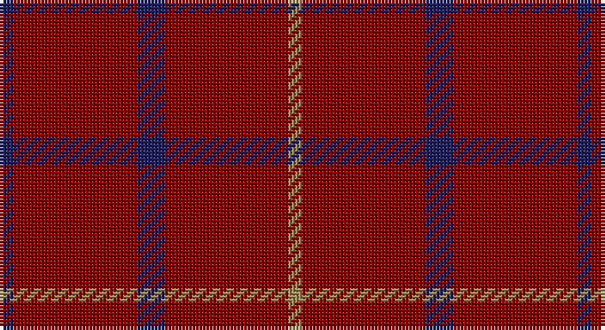

This page is one **sett** — a single exact thread-count. It belongs to the [tartan](/setts/db1r9db2r9lo1/)
(the same proportion at any scale), whose colour order is pattern [BRBRY](/stripes/brbry/).

Sourced from register-of-tartans.  It is a [5 stripe tartan](/stripes/stripes5/).

Original link https://www.tartanregister.gov.uk/tartanDetails.aspx?ref=384

## Also known as

This cloth is also recorded under:

- Brooks Bros Tattersall Red
- Brooks Brothers Tattersall Red

2 attestations — the source records this cloth was collapsed from (oldest owns this page)

<ul>
<li>01/01/2005 — Brooks Brothers Tattersall Red (register-of-tartans, <a href="https://www.tartanregister.gov.uk/tartanDetails.aspx?ref=384">record</a>)</li>
<li>pre 2005 — Brooks Bros Tattersall Red (Fashion) (tartans-authority, <a href="http://www.tartansauthority.com/tartan-ferret/display/6572/">record</a>)</li>
</ul>

## Register references

External register numbers recorded for this tartan.

- Scottish Register of Tartans: [384](https://www.tartanregister.gov.uk/tartanDetails.aspx?ref=384)
- Scottish Tartans Authority (ITI): 6572

## Thread count
DB/4 DR36 DB8 DR36 LT/4

One full sett is **168 threads**.

## Palette

Palette: <strong>Tartan Register</strong>
<table><thead><tr><th>Colour</th><th>Threads</th><th>Shade</th><th>Base</th><th>OKLCh</th></tr></thead><tbody><tr><td>DB/</td><td style="text-align:right;font-variant-numeric:tabular-nums">4</td><td><code style="background-color:#202060;">#202060</code> <small style="color:#888">#202060</small></td><td>B <code style="background-color:#2A418A;">#2A418A</code></td><td><small style="color:#888">oklch(28.9% 0.111 276.9)</small></td></tr><tr><td>DR</td><td style="text-align:right;font-variant-numeric:tabular-nums">36</td><td><code style="background-color:#880000;">#880000</code> <small style="color:#888">#880000</small></td><td>R <code style="background-color:#CC0000;">#CC0000</code></td><td><small style="color:#888">oklch(39.4% 0.162 29.2)</small></td></tr><tr><td>DB</td><td style="text-align:right;font-variant-numeric:tabular-nums">8</td><td><code style="background-color:#202060;">#202060</code> <small style="color:#888">#202060</small></td><td>B <code style="background-color:#2A418A;">#2A418A</code></td><td><small style="color:#888">oklch(28.9% 0.111 276.9)</small></td></tr><tr><td>DR</td><td style="text-align:right;font-variant-numeric:tabular-nums">36</td><td><code style="background-color:#880000;">#880000</code> <small style="color:#888">#880000</small></td><td>R <code style="background-color:#CC0000;">#CC0000</code></td><td><small style="color:#888">oklch(39.4% 0.162 29.2)</small></td></tr><tr><td>LT/</td><td style="text-align:right;font-variant-numeric:tabular-nums">4</td><td><code style="background-color:#A08858;">#A08858</code> <small style="color:#888">#A08858</small></td><td>Y <code style="background-color:#F2BF00;">#F2BF00</code></td><td><small style="color:#888">oklch(63.7% 0.071 84.0)</small></td></tr></tbody></table>

# Sample pattern

## Nearest tartans

The nearest existing variants by ΔTartan distance, with this tartan at the top so the swatches line up against it.

ΔTartan

Tartan

Sett

—

<a href="/ttd/edit/#slug=db1r9db2r9lo1~x4">Brooks Brothers Tattersall Red</a> <a class="nn-out" href="/variants/s5/db1r9db2r9lo1~x4/" title="open its dictionary page">↗</a>

1.64

<a href="/ttd/edit/#slug=r10y3r24lb3r16k3r8~x2&amp;base=db1r9db2r9lo1~x4">Rannoch Red</a> <a class="nn-out" href="/variants/s7/r10y3r24lb3r16k3r8~x2/" title="open its dictionary page">↗</a>

1.73

<a href="/ttd/edit/#slug=o5k2o28k10o26k4o4~x2&amp;base=db1r9db2r9lo1~x4">Dunbar, John Telfer (Personal)</a> <a class="nn-out" href="/variants/s7/o5k2o28k10o26k4o4~x2/" title="open its dictionary page">↗</a>

1.75

<a href="/ttd/edit/#slug=r2dy1r4ri1r12lo1~x2&amp;base=db1r9db2r9lo1~x4">Killiechassie</a> <a class="nn-out" href="/variants/s6/r2dy1r4ri1r12lo1~x2/" title="open its dictionary page">↗</a>

2.16

<a href="/ttd/edit/#slug=m18dg1k5dg1k1dg1m9~x2&amp;base=db1r9db2r9lo1~x4">Inverness Augustus</a> <a class="nn-out" href="/variants/s7/m18dg1k5dg1k1dg1m9~x2/" title="open its dictionary page">↗</a>

2.21

<a href="/ttd/edit/#slug=r3dy16dy10r3dy3lb2dy3r3~x2&amp;base=db1r9db2r9lo1~x4">Scott Htg (Error 2)</a> <a class="nn-out" href="/variants/s8/r3dy16dy10r3dy3lb2dy3r3~x2/" title="open its dictionary page">↗</a>

2.32

<a href="/variants/s6/dp3g1dp9r3~x4/">Highland Spring (1988)</a>

2.34

<a href="/ttd/edit/#slug=r8g2r2k1r1g2~x10&amp;base=db1r9db2r9lo1~x4">Waverley Care Aids Trust (Corporate)</a> <a class="nn-out" href="/variants/s6/r8g2r2k1r1g2~x10/" title="open its dictionary page">↗</a>

2.34

<a href="/ttd/edit/#slug=r38dg2r5dg16~x2&amp;base=db1r9db2r9lo1~x4">MacDonald Lord of the Isles</a> <a class="nn-out" href="/variants/s4/r38dg2r5dg16~x2/" title="open its dictionary page">↗</a>

2.46

<a href="/ttd/edit/#slug=dp5g2dp19r5~x2&amp;base=db1r9db2r9lo1~x4">Highland Spring Corporate Tartan</a> <a class="nn-out" href="/variants/s4/dp5g2dp19r5~x2/" title="open its dictionary page">↗</a>

2.52

<a href="/ttd/edit/#slug=dp3g1dp9r3~x4&amp;base=db1r9db2r9lo1~x4">Highland Spring (1988) (Corporate)</a> <a class="nn-out" href="/variants/s4/dp3g1dp9r3~x4/" title="open its dictionary page">↗</a>

## Neighbour map

Every grey dot is one of 14360 variants placed by the first two principal components of the ΔTartan feature space (44% of its variance). Red is this tartan; blue dots are its nearest — click one to open its page.

<svg viewBox="0 0 640 380" role="img" style="max-width:100%;height:auto;border:1px solid #e0e0e0;border-radius:4px;display:block" xmlns="http://www.w3.org/2000/svg"><image href="/nn/cloud.v1.png" width="640" height="380"/><a href="/variants/s7/r10y3r24lb3r16k3r8~x2/"><circle cx="588.6" cy="244.3" r="4" fill="#3465a4"><title>Rannoch Red</title></circle></a><a href="/variants/s7/o5k2o28k10o26k4o4~x2/"><circle cx="601.1" cy="251.2" r="4" fill="#3465a4"><title>Dunbar, John Telfer (Personal)</title></circle></a><a href="/variants/s6/r2dy1r4ri1r12lo1~x2/"><circle cx="626.0" cy="232.3" r="4" fill="#3465a4"><title>Killiechassie</title></circle></a><a href="/variants/s7/m18dg1k5dg1k1dg1m9~x2/"><circle cx="587.3" cy="221.7" r="4" fill="#3465a4"><title>Inverness Augustus</title></circle></a><a href="/variants/s8/r3dy16dy10r3dy3lb2dy3r3~x2/"><circle cx="510.7" cy="252.6" r="4" fill="#3465a4"><title>Scott Htg (Error 2)</title></circle></a><a href="/variants/s6/dp3g1dp9r3~x4/"><circle cx="550.9" cy="265.9" r="4" fill="#3465a4"><title>Highland Spring (1988)</title></circle></a><a href="/variants/s6/r8g2r2k1r1g2~x10/"><circle cx="470.6" cy="254.5" r="4" fill="#3465a4"><title>Waverley Care Aids Trust (Corporate)</title></circle></a><a href="/variants/s4/r38dg2r5dg16~x2/"><circle cx="555.1" cy="251.3" r="4" fill="#3465a4"><title>MacDonald Lord of the Isles</title></circle></a><a href="/variants/s4/dp5g2dp19r5~x2/"><circle cx="560.6" cy="272.3" r="4" fill="#3465a4"><title>Highland Spring Corporate Tartan</title></circle></a><a href="/variants/s4/dp3g1dp9r3~x4/"><circle cx="501.3" cy="276.3" r="4" fill="#3465a4"><title>Highland Spring (1988) (Corporate)</title></circle></a><circle cx="605.6" cy="274.2" r="5" fill="#c00000"/></svg>

ID: /variants/s5/db1r9db2r9lo1~x4/
