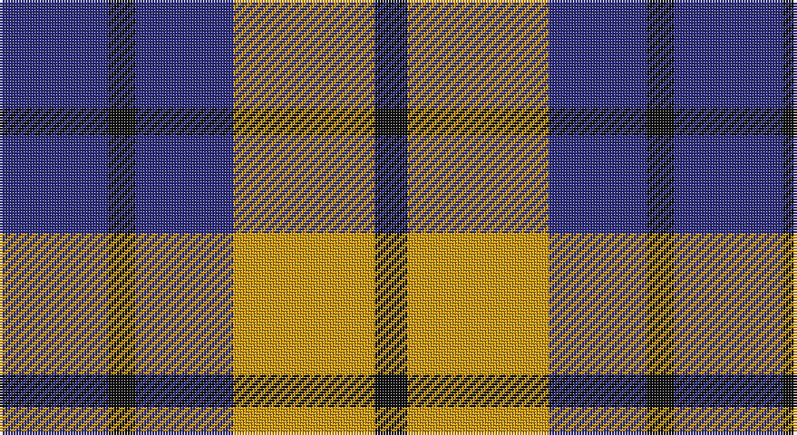

This page is one **sett** — a single exact thread-count. It belongs to the [tartan](/setts/db20k5db18lo26k6/)
(the same proportion at any scale), whose colour order is pattern [BKBYK](/stripes/bkbyk/).

Sourced from tartans-authority.  It is a [5 stripe tartan](/stripes/stripes5/).

Original link http://www.tartansauthority.com/tartan-ferret/display/260/

## Register references

External register numbers recorded for this tartan.

- Scottish Tartans Authority (ITI): 260

## Thread count
DB/40 K10 DB36 DY52 K/12

One full sett is **248 threads**.

## Palette

Palette: <strong>Tartan Register</strong> <small style="color:#888">(2 of 3 colours)</small>
<table><thead><tr><th>Colour</th><th>Threads</th><th>Shade</th><th>Base</th><th>OKLCh</th></tr></thead><tbody><tr><td>DB/</td><td style="text-align:right;font-variant-numeric:tabular-nums">40</td><td><code style="background-color:#2C2C80;">#2C2C80</code> <small style="color:#888">#2C2C80</small></td><td>B <code style="background-color:#2A418A;">#2A418A</code></td><td><small style="color:#888">oklch(35.0% 0.138 276.6)</small></td></tr><tr><td>K</td><td style="text-align:right;font-variant-numeric:tabular-nums">10</td><td><code style="background-color:#101010;">#101010</code> <small style="color:#888">#101010</small></td><td>K <code style="background-color:#000000;">#000000</code></td><td><small style="color:#888">oklch(17.3% 0.000 89.9)</small></td></tr><tr><td>DB</td><td style="text-align:right;font-variant-numeric:tabular-nums">36</td><td><code style="background-color:#2C2C80;">#2C2C80</code> <small style="color:#888">#2C2C80</small></td><td>B <code style="background-color:#2A418A;">#2A418A</code></td><td><small style="color:#888">oklch(35.0% 0.138 276.6)</small></td></tr><tr><td>DY</td><td style="text-align:right;font-variant-numeric:tabular-nums">52</td><td><code style="background-color:#D09800;">#D09800</code> <small style="color:#888">#D09800</small></td><td>Y <code style="background-color:#F2BF00;">#F2BF00</code></td><td><small style="color:#888">oklch(71.4% 0.147 82.1)</small></td></tr><tr><td>K/</td><td style="text-align:right;font-variant-numeric:tabular-nums">12</td><td><code style="background-color:#101010;">#101010</code> <small style="color:#888">#101010</small></td><td>K <code style="background-color:#000000;">#000000</code></td><td><small style="color:#888">oklch(17.3% 0.000 89.9)</small></td></tr></tbody></table>

# Sample pattern

## Nearest tartans

The nearest existing variants by ΔTartan distance, with this tartan at the top so the swatches line up against it.

ΔTartan

Tartan

Sett

—

<a href="/ttd/edit/#slug=db20k5db18lo26k6~x2">Johore Regiment (Military)</a> <a class="nn-out" href="/variants/s5/db20k5db18lo26k6~x2/" title="open its dictionary page">↗</a>

0.88

<a href="/ttd/edit/#slug=db20k5db18ly26k6~x2&amp;base=db20k5db18lo26k6~x2">Jahore</a> <a class="nn-out" href="/variants/s5/db20k5db18ly26k6~x2/" title="open its dictionary page">↗</a>

1.01

<a href="/ttd/edit/#slug=k12n3k12n18w5~x2&amp;base=db20k5db18lo26k6~x2">Grampian Television (Corporate)</a> <a class="nn-out" href="/variants/s5/k12n3k12n18w5~x2/" title="open its dictionary page">↗</a>

1.14

<a href="/variants/s8/db20k5db18lo26k6~x2/">Johore Regiment</a>

1.24

<a href="/ttd/edit/#slug=db13r5g5w3~x8&amp;base=db20k5db18lo26k6~x2">International Highland Games Fed.</a> <a class="nn-out" href="/variants/s4/db13r5g5w3~x8/" title="open its dictionary page">↗</a>

1.29

<a href="/ttd/edit/#slug=o5dp3o18k16ly3~x4&amp;base=db20k5db18lo26k6~x2">New York State Police Pipe Band</a> <a class="nn-out" href="/variants/s5/o5dp3o18k16ly3~x4/" title="open its dictionary page">↗</a>

1.31

<a href="/ttd/edit/#slug=g21db34r14w6~x2&amp;base=db20k5db18lo26k6~x2">Harbison (2015)</a> <a class="nn-out" href="/variants/s4/g21db34r14w6~x2/" title="open its dictionary page">↗</a>

1.40

<a href="/ttd/edit/#slug=db3lo9db3lo9db20r3~x2&amp;base=db20k5db18lo26k6~x2">Latin</a> <a class="nn-out" href="/variants/s6/db3lo9db3lo9db20r3~x2/" title="open its dictionary page">↗</a>

1.43

<a href="/ttd/edit/#slug=w7k6lo15k16k8w3~x2&amp;base=db20k5db18lo26k6~x2">Longford County, Crest Range</a> <a class="nn-out" href="/variants/s6/w7k6lo15k16k8w3~x2/" title="open its dictionary page">↗</a>

1.43

<a href="/ttd/edit/#slug=db2db4ly1db1ly2db4ly2~x12&amp;base=db20k5db18lo26k6~x2">Creek Indian Nation (District)</a> <a class="nn-out" href="/variants/s7/db2db4ly1db1ly2db4ly2~x12/" title="open its dictionary page">↗</a>

1.44

<a href="/ttd/edit/#slug=db6r1db6r5w5~x4&amp;base=db20k5db18lo26k6~x2">U.S. Coast Guard (Corporate)</a> <a class="nn-out" href="/variants/s5/db6r1db6r5w5~x4/" title="open its dictionary page">↗</a>

## Neighbour map

Every grey dot is one of 14360 variants placed by the first two principal components of the ΔTartan feature space (44% of its variance). Red is this tartan; blue dots are its nearest — click one to open its page.

<svg viewBox="0 0 640 380" role="img" style="max-width:100%;height:auto;border:1px solid #e0e0e0;border-radius:4px;display:block" xmlns="http://www.w3.org/2000/svg"><image href="/nn/cloud.v1.png" width="640" height="380"/><a href="/variants/s5/db20k5db18ly26k6~x2/"><circle cx="205.7" cy="266.2" r="4" fill="#3465a4"><title>Jahore</title></circle></a><a href="/variants/s5/k12n3k12n18w5~x2/"><circle cx="229.7" cy="282.0" r="4" fill="#3465a4"><title>Grampian Television (Corporate)</title></circle></a><a href="/variants/s8/db20k5db18lo26k6~x2/"><circle cx="195.4" cy="253.2" r="4" fill="#3465a4"><title>Johore Regiment</title></circle></a><a href="/variants/s4/db13r5g5w3~x8/"><circle cx="193.9" cy="271.4" r="4" fill="#3465a4"><title>International Highland Games Fed.</title></circle></a><a href="/variants/s5/o5dp3o18k16ly3~x4/"><circle cx="234.9" cy="235.1" r="4" fill="#3465a4"><title>New York State Police Pipe Band</title></circle></a><a href="/variants/s4/g21db34r14w6~x2/"><circle cx="175.6" cy="267.1" r="4" fill="#3465a4"><title>Harbison (2015)</title></circle></a><a href="/variants/s6/db3lo9db3lo9db20r3~x2/"><circle cx="305.0" cy="240.8" r="4" fill="#3465a4"><title>Latin</title></circle></a><a href="/variants/s6/w7k6lo15k16k8w3~x2/"><circle cx="217.3" cy="262.4" r="4" fill="#3465a4"><title>Longford County, Crest Range</title></circle></a><a href="/variants/s7/db2db4ly1db1ly2db4ly2~x12/"><circle cx="162.6" cy="257.6" r="4" fill="#3465a4"><title>Creek Indian Nation (District)</title></circle></a><a href="/variants/s5/db6r1db6r5w5~x4/"><circle cx="211.3" cy="278.4" r="4" fill="#3465a4"><title>U.S. Coast Guard (Corporate)</title></circle></a><circle cx="226.7" cy="276.1" r="5" fill="#c00000"/></svg>

ID: /variants/s5/db20k5db18lo26k6~x2/
