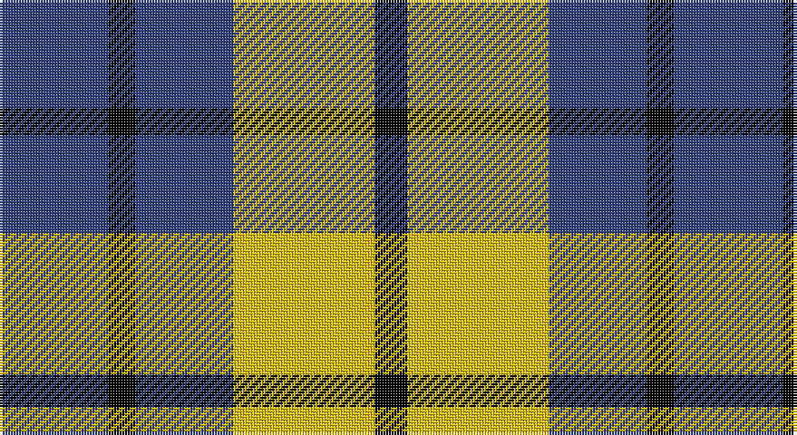

This page is one **sett** — a single exact thread-count. It belongs to the [tartan](/setts/db20k5db18ly26k6/)
(the same proportion at any scale), whose colour order is pattern [BKBYK](/stripes/bkbyk/).

Sourced from weddslist.  It is a [5 stripe tartan](/stripes/stripes5/).

Original link http://www.weddslist.com/cgi-bin/tartans/pg.pl?source=sts

## Thread count
B/40 K10 B36 Y52 K/12

One full sett is **248 threads**.

## Palette

Palette: <strong>Ingles Buchan</strong> <small style="color:#888">(1 of 3 colours)</small>
<table><thead><tr><th>Colour</th><th>Threads</th><th>Shade</th><th>Base</th><th>OKLCh</th></tr></thead><tbody><tr><td>B/</td><td style="text-align:right;font-variant-numeric:tabular-nums">40</td><td><code style="background-color:#304080;">#304080</code> <small style="color:#888">#304080</small></td><td>B <code style="background-color:#2A418A;">#2A418A</code></td><td><small style="color:#888">oklch(39.4% 0.109 270.2)</small></td></tr><tr><td>K</td><td style="text-align:right;font-variant-numeric:tabular-nums">10</td><td><code style="background-color:#000000;">#000000</code> <small style="color:#888">#000000</small></td><td>K <code style="background-color:#000000;">#000000</code></td><td><small style="color:#888">oklch(0.0% 0.000 0.0)</small></td></tr><tr><td>B</td><td style="text-align:right;font-variant-numeric:tabular-nums">36</td><td><code style="background-color:#304080;">#304080</code> <small style="color:#888">#304080</small></td><td>B <code style="background-color:#2A418A;">#2A418A</code></td><td><small style="color:#888">oklch(39.4% 0.109 270.2)</small></td></tr><tr><td>Y</td><td style="text-align:right;font-variant-numeric:tabular-nums">52</td><td><code style="background-color:#F0C000;">#F0C000</code> <small style="color:#888">#F0C000</small></td><td>Y <code style="background-color:#F2BF00;">#F2BF00</code></td><td><small style="color:#888">oklch(82.7% 0.169 90.5)</small></td></tr><tr><td>K/</td><td style="text-align:right;font-variant-numeric:tabular-nums">12</td><td><code style="background-color:#000000;">#000000</code> <small style="color:#888">#000000</small></td><td>K <code style="background-color:#000000;">#000000</code></td><td><small style="color:#888">oklch(0.0% 0.000 0.0)</small></td></tr></tbody></table>

# Sample pattern

## Nearest tartans

The nearest existing variants by ΔTartan distance, with this tartan at the top so the swatches line up against it.

ΔTartan

Tartan

Sett

—

<a href="/ttd/edit/#slug=db20k5db18ly26k6~x2">Jahore</a> <a class="nn-out" href="/variants/s5/db20k5db18ly26k6~x2/" title="open its dictionary page">↗</a>

0.88

<a href="/ttd/edit/#slug=db20k5db18lo26k6~x2&amp;base=db20k5db18ly26k6~x2">Johore Regiment (Military)</a> <a class="nn-out" href="/variants/s5/db20k5db18lo26k6~x2/" title="open its dictionary page">↗</a>

0.95

<a href="/ttd/edit/#slug=w7k6lo15k16k8w3~x2&amp;base=db20k5db18ly26k6~x2">Longford County, Crest Range</a> <a class="nn-out" href="/variants/s6/w7k6lo15k16k8w3~x2/" title="open its dictionary page">↗</a>

1.23

<a href="/variants/s8/db20k5db18lo26k6~x2/">Johore Regiment</a>

1.34

<a href="/ttd/edit/#slug=db10w3db12ly14r4~x2&amp;base=db20k5db18ly26k6~x2">MacLeod, of Argentina</a> <a class="nn-out" href="/variants/s5/db10w3db12ly14r4~x2/" title="open its dictionary page">↗</a>

1.35

<a href="/ttd/edit/#slug=db3dg6ly1r3~x10&amp;base=db20k5db18ly26k6~x2">Delroeux, John Michael (Personal)</a> <a class="nn-out" href="/variants/s4/db3dg6ly1r3~x10/" title="open its dictionary page">↗</a>

1.37

<a href="/ttd/edit/#slug=o5dp3o18k16ly3~x4&amp;base=db20k5db18ly26k6~x2">New York State Police Pipe Band</a> <a class="nn-out" href="/variants/s5/o5dp3o18k16ly3~x4/" title="open its dictionary page">↗</a>

1.38

<a href="/ttd/edit/#slug=w5r5w5k15r2~x2&amp;base=db20k5db18ly26k6~x2">Braes High School Falkirk (School)</a> <a class="nn-out" href="/variants/s5/w5r5w5k15r2~x2/" title="open its dictionary page">↗</a>

1.38

<a href="/ttd/edit/#slug=k12n3k12n18w5~x2&amp;base=db20k5db18ly26k6~x2">Grampian Television (Corporate)</a> <a class="nn-out" href="/variants/s5/k12n3k12n18w5~x2/" title="open its dictionary page">↗</a>

1.40

<a href="/ttd/edit/#slug=k5lo5w1lo5k5r1~x10&amp;base=db20k5db18ly26k6~x2">Canyon County Idaho Sheriff</a> <a class="nn-out" href="/variants/s6/k5lo5w1lo5k5r1~x10/" title="open its dictionary page">↗</a>

1.49

<a href="/ttd/edit/#slug=k4w3k4o9r1~x4&amp;base=db20k5db18ly26k6~x2">Oban Grey District Tartan</a> <a class="nn-out" href="/variants/s5/k4w3k4o9r1~x4/" title="open its dictionary page">↗</a>

## Neighbour map

Every grey dot is one of 14360 variants placed by the first two principal components of the ΔTartan feature space (44% of its variance). Red is this tartan; blue dots are its nearest — click one to open its page.

<svg viewBox="0 0 640 380" role="img" style="max-width:100%;height:auto;border:1px solid #e0e0e0;border-radius:4px;display:block" xmlns="http://www.w3.org/2000/svg"><image href="/nn/cloud.v1.png" width="640" height="380"/><a href="/variants/s5/db20k5db18lo26k6~x2/"><circle cx="226.7" cy="276.1" r="4" fill="#3465a4"><title>Johore Regiment (Military)</title></circle></a><a href="/variants/s6/w7k6lo15k16k8w3~x2/"><circle cx="217.3" cy="262.4" r="4" fill="#3465a4"><title>Longford County, Crest Range</title></circle></a><a href="/variants/s8/db20k5db18lo26k6~x2/"><circle cx="195.4" cy="253.2" r="4" fill="#3465a4"><title>Johore Regiment</title></circle></a><a href="/variants/s5/db10w3db12ly14r4~x2/"><circle cx="186.2" cy="256.5" r="4" fill="#3465a4"><title>MacLeod, of Argentina</title></circle></a><a href="/variants/s4/db3dg6ly1r3~x10/"><circle cx="170.4" cy="258.1" r="4" fill="#3465a4"><title>Delroeux, John Michael (Personal)</title></circle></a><a href="/variants/s5/o5dp3o18k16ly3~x4/"><circle cx="234.9" cy="235.1" r="4" fill="#3465a4"><title>New York State Police Pipe Band</title></circle></a><a href="/variants/s5/w5r5w5k15r2~x2/"><circle cx="213.3" cy="229.2" r="4" fill="#3465a4"><title>Braes High School Falkirk (School)</title></circle></a><a href="/variants/s5/k12n3k12n18w5~x2/"><circle cx="229.7" cy="282.0" r="4" fill="#3465a4"><title>Grampian Television (Corporate)</title></circle></a><a href="/variants/s6/k5lo5w1lo5k5r1~x10/"><circle cx="186.7" cy="255.3" r="4" fill="#3465a4"><title>Canyon County Idaho Sheriff</title></circle></a><a href="/variants/s5/k4w3k4o9r1~x4/"><circle cx="185.2" cy="223.7" r="4" fill="#3465a4"><title>Oban Grey District Tartan</title></circle></a><circle cx="205.7" cy="266.2" r="5" fill="#c00000"/></svg>

ID: /variants/s5/db20k5db18ly26k6~x2/
