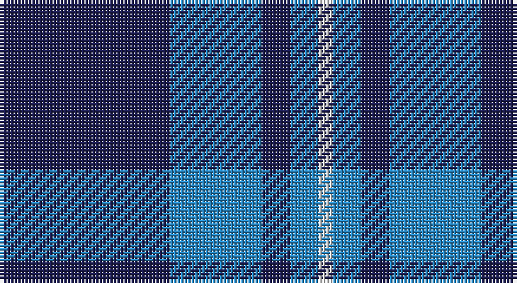

This page is one **sett** — a single exact thread-count. It belongs to the [tartan](/setts/db24t13db4t4w2/)
(the same proportion at any scale), whose colour order is pattern [BBBBW](/stripes/bbbbw/).

Sourced from tartans-authority.  It is a [5 stripe tartan](/stripes/stripes5/).

Original link http://www.tartansauthority.com/tartan-ferret/display/7820/

2 attestations — the source records this cloth was collapsed from (oldest owns this page)

<ul>
<li>2008 — Gallaecia (Unofficial) (District) (tartans-authority, <a href="http://www.tartansauthority.com/tartan-ferret/display/7820/">record</a>)</li>
<li>undated — Gallaecia (Unofficial) (register-of-tartans, <a href="https://www.tartanregister.gov.uk/tartanDetails.aspx?ref=5776">record</a>)</li>
</ul>

## Register references

External register numbers recorded for this tartan.

- Scottish Register of Tartans: [5776](https://www.tartanregister.gov.uk/tartanDetails.aspx?ref=5776)
- Scottish Tartans Authority (ITI): 7820

## Thread count
DB/48 B26 DB8 B8 LN/4

One full sett is **136 threads**.

## Palette

Palette: <strong>Tartan Register</strong>
<table><thead><tr><th>Colour</th><th>Threads</th><th>Shade</th><th>Base</th><th>OKLCh</th></tr></thead><tbody><tr><td>DB/</td><td style="text-align:right;font-variant-numeric:tabular-nums">48</td><td><code style="background-color:#1C1C50;">#1C1C50</code> <small style="color:#888">#1C1C50</small></td><td>B <code style="background-color:#2A418A;">#2A418A</code></td><td><small style="color:#888">oklch(26.2% 0.093 277.9)</small></td></tr><tr><td>B</td><td style="text-align:right;font-variant-numeric:tabular-nums">26</td><td><code style="background-color:#2888C4;">#2888C4</code> <small style="color:#888">#2888C4</small></td><td>B <code style="background-color:#2A418A;">#2A418A</code></td><td><small style="color:#888">oklch(60.1% 0.125 241.5)</small></td></tr><tr><td>DB</td><td style="text-align:right;font-variant-numeric:tabular-nums">8</td><td><code style="background-color:#1C1C50;">#1C1C50</code> <small style="color:#888">#1C1C50</small></td><td>B <code style="background-color:#2A418A;">#2A418A</code></td><td><small style="color:#888">oklch(26.2% 0.093 277.9)</small></td></tr><tr><td>B</td><td style="text-align:right;font-variant-numeric:tabular-nums">8</td><td><code style="background-color:#2888C4;">#2888C4</code> <small style="color:#888">#2888C4</small></td><td>B <code style="background-color:#2A418A;">#2A418A</code></td><td><small style="color:#888">oklch(60.1% 0.125 241.5)</small></td></tr><tr><td>LN/</td><td style="text-align:right;font-variant-numeric:tabular-nums">4</td><td><code style="background-color:#E0E0E0;">#E0E0E0</code> <small style="color:#888">#E0E0E0</small></td><td>W <code style="background-color:#F7F7F7;">#F7F7F7</code></td><td><small style="color:#888">oklch(90.7% 0.000 89.9)</small></td></tr></tbody></table>

# Sample pattern

## Nearest tartans

The nearest existing variants by ΔTartan distance, with this tartan at the top so the swatches line up against it.

ΔTartan

Tartan

Sett

—

<a href="/ttd/edit/#slug=db24t13db4t4w2~x2">Gallaecia (Unofficial) (District)</a> <a class="nn-out" href="/variants/s5/db24t13db4t4w2~x2/" title="open its dictionary page">↗</a>

1.15

<a href="/ttd/edit/#slug=w4t28db49ly3~x2&amp;base=db24t13db4t4w2~x2">McKerrell of Hillhouse</a> <a class="nn-out" href="/variants/s4/w4t28db49ly3~x2/" title="open its dictionary page">↗</a>

1.23

<a href="/ttd/edit/#slug=db24n13db4n4w2~x2&amp;base=db24t13db4t4w2~x2">Gallaecia - Galicia National</a> <a class="nn-out" href="/variants/s5/db24n13db4n4w2~x2/" title="open its dictionary page">↗</a>

1.38

<a href="/ttd/edit/#slug=m4k28b3k3b25k3~x2&amp;base=db24t13db4t4w2~x2">Slanj (Corporate)</a> <a class="nn-out" href="/variants/s6/m4k28b3k3b25k3~x2/" title="open its dictionary page">↗</a>

1.42

<a href="/ttd/edit/#slug=dt5b5dt30w4dt4b18w3dt3~x2&amp;base=db24t13db4t4w2~x2">Salem Scottish Dancers (Corporate)</a> <a class="nn-out" href="/variants/s8/dt5b5dt30w4dt4b18w3dt3~x2/" title="open its dictionary page">↗</a>

1.44

<a href="/ttd/edit/#slug=t12ly2t1k5t4k2~x4&amp;base=db24t13db4t4w2~x2">Rea</a> <a class="nn-out" href="/variants/s6/t12ly2t1k5t4k2~x4/" title="open its dictionary page">↗</a>

1.45

<a href="/ttd/edit/#slug=t9db14r1~x4&amp;base=db24t13db4t4w2~x2">Stakis Hotels (Corporate)</a> <a class="nn-out" href="/variants/s3/t9db14r1~x4/" title="open its dictionary page">↗</a>

1.46

<a href="/ttd/edit/#slug=w4t34db60ly3~x2&amp;base=db24t13db4t4w2~x2">MacKerral Family Tartan</a> <a class="nn-out" href="/variants/s4/w4t34db60ly3~x2/" title="open its dictionary page">↗</a>

1.47

<a href="/ttd/edit/#slug=db3dbi2t31db34w2~x2&amp;base=db24t13db4t4w2~x2">Gilt Edge (Corporate)</a> <a class="nn-out" href="/variants/s5/db3dbi2t31db34w2~x2/" title="open its dictionary page">↗</a>

1.47

<a href="/ttd/edit/#slug=db3t3db16t16db16w3~x2&amp;base=db24t13db4t4w2~x2">Murray Taylor</a> <a class="nn-out" href="/variants/s6/db3t3db16t16db16w3~x2/" title="open its dictionary page">↗</a>

1.48

<a href="/ttd/edit/#slug=db26lp11db3lp4k2~x4&amp;base=db24t13db4t4w2~x2">Debbie Munro Memorial (Corporate)</a> <a class="nn-out" href="/variants/s5/db26lp11db3lp4k2~x4/" title="open its dictionary page">↗</a>

## Neighbour map

Every grey dot is one of 14360 variants placed by the first two principal components of the ΔTartan feature space (44% of its variance). Red is this tartan; blue dots are its nearest — click one to open its page.

<svg viewBox="0 0 640 380" role="img" style="max-width:100%;height:auto;border:1px solid #e0e0e0;border-radius:4px;display:block" xmlns="http://www.w3.org/2000/svg"><image href="/nn/cloud.v1.png" width="640" height="380"/><a href="/variants/s4/w4t28db49ly3~x2/"><circle cx="345.4" cy="211.7" r="4" fill="#3465a4"><title>McKerrell of Hillhouse</title></circle></a><a href="/variants/s5/db24n13db4n4w2~x2/"><circle cx="397.1" cy="254.9" r="4" fill="#3465a4"><title>Gallaecia - Galicia National</title></circle></a><a href="/variants/s6/m4k28b3k3b25k3~x2/"><circle cx="323.2" cy="228.3" r="4" fill="#3465a4"><title>Slanj (Corporate)</title></circle></a><a href="/variants/s8/dt5b5dt30w4dt4b18w3dt3~x2/"><circle cx="328.6" cy="204.1" r="4" fill="#3465a4"><title>Salem Scottish Dancers (Corporate)</title></circle></a><a href="/variants/s6/t12ly2t1k5t4k2~x4/"><circle cx="363.3" cy="219.2" r="4" fill="#3465a4"><title>Rea</title></circle></a><a href="/variants/s3/t9db14r1~x4/"><circle cx="346.5" cy="264.5" r="4" fill="#3465a4"><title>Stakis Hotels (Corporate)</title></circle></a><a href="/variants/s4/w4t34db60ly3~x2/"><circle cx="380.2" cy="207.9" r="4" fill="#3465a4"><title>MacKerral Family Tartan</title></circle></a><a href="/variants/s5/db3dbi2t31db34w2~x2/"><circle cx="345.4" cy="202.6" r="4" fill="#3465a4"><title>Gilt Edge (Corporate)</title></circle></a><a href="/variants/s6/db3t3db16t16db16w3~x2/"><circle cx="323.2" cy="273.0" r="4" fill="#3465a4"><title>Murray Taylor</title></circle></a><a href="/variants/s5/db26lp11db3lp4k2~x4/"><circle cx="377.4" cy="207.0" r="4" fill="#3465a4"><title>Debbie Munro Memorial (Corporate)</title></circle></a><circle cx="365.3" cy="235.6" r="5" fill="#c00000"/></svg>

ID: /variants/s5/db24t13db4t4w2~x2/
