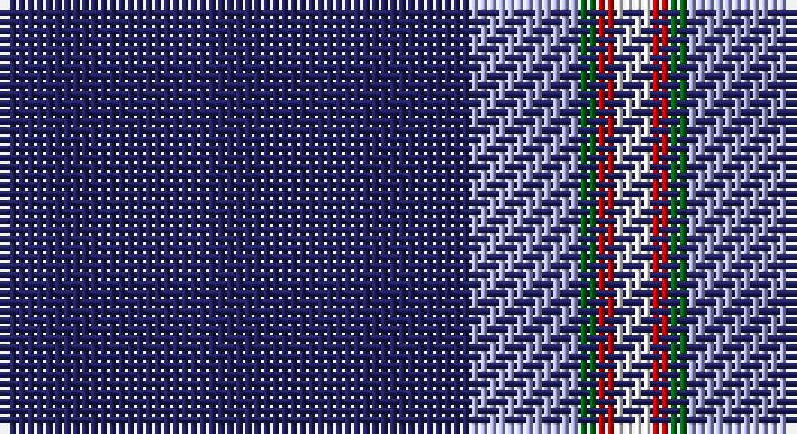

This page is one **sett** — a single exact thread-count. It belongs to the [tartan](/setts/db26lb6g1r1w2/)
(the same proportion at any scale), whose colour order is pattern [BWGRW](/stripes/bwgrw/).

Part of the [Special Air Service](/tartans/special-air-service/) tartan — the named design grouping this sett with its other cloths.

Sourced from tartans-authority.  It is a [5 stripe tartan](/stripes/stripes5/).

Original link http://www.tartansauthority.com/tartan-ferret/display/10886/

## Register references

External register numbers recorded for this tartan.

- Scottish Register of Tartans: [10886](https://www.tartanregister.gov.uk/tartanDetails?ref=10886)
- Scottish Tartans Authority (ITI): 10886

## Thread count
DB/52 LP12 G2 R2 W/4

One full sett is **88 threads**.

## Palette

Palette: <strong>Tartan Register</strong>
<table><thead><tr><th>Colour</th><th>Threads</th><th>Shade</th><th>Base</th><th>OKLCh</th></tr></thead><tbody><tr><td>DB/</td><td style="text-align:right;font-variant-numeric:tabular-nums">52</td><td><code style="background-color:#202060;">#202060</code> <small style="color:#888">#202060</small></td><td>B <code style="background-color:#2A418A;">#2A418A</code></td><td><small style="color:#888">oklch(28.9% 0.111 276.9)</small></td></tr><tr><td>LP</td><td style="text-align:right;font-variant-numeric:tabular-nums">12</td><td><code style="background-color:#A8ACE8;">#A8ACE8</code> <small style="color:#888">#A8ACE8</small></td><td>W <code style="background-color:#F7F7F7;">#F7F7F7</code></td><td><small style="color:#888">oklch(76.3% 0.086 281.2)</small></td></tr><tr><td>G</td><td style="text-align:right;font-variant-numeric:tabular-nums">2</td><td><code style="background-color:#006818;">#006818</code> <small style="color:#888">#006818</small></td><td>G <code style="background-color:#006100;">#006100</code></td><td><small style="color:#888">oklch(45.0% 0.142 145.0)</small></td></tr><tr><td>R</td><td style="text-align:right;font-variant-numeric:tabular-nums">2</td><td><code style="background-color:#C80000;">#C80000</code> <small style="color:#888">#C80000</small></td><td>R <code style="background-color:#CC0000;">#CC0000</code></td><td><small style="color:#888">oklch(52.3% 0.215 29.2)</small></td></tr><tr><td>W/</td><td style="text-align:right;font-variant-numeric:tabular-nums">4</td><td><code style="background-color:#FCFCFC;">#FCFCFC</code> <small style="color:#888">#FCFCFC</small></td><td>W <code style="background-color:#F7F7F7;">#F7F7F7</code></td><td><small style="color:#888">oklch(99.1% 0.000 89.9)</small></td></tr></tbody></table>

# Sample pattern

## Compared to the master

This cloth is one sett of its design; the master sett (the exemplar the design is anchored on) is below for comparison.

<figure style="margin:0"><figcaption style="color:#888;font-size:smaller">this sett</figcaption></figure>
<figure style="margin:0"><figcaption style="color:#888;font-size:smaller"><a href="/setts/db26t6dg1o1w2/">master sett →</a></figcaption></figure>

## Nearest tartans

The nearest existing variants by ΔTartan distance, with this tartan at the top so the swatches line up against it.

ΔTartan

Tartan

Sett

—

<a href="/ttd/edit/#slug=db26lb6g1r1w2~x2">Special Air Service</a> <a class="nn-out" href="/variants/s5/db26lb6g1r1w2~x2/" title="open its dictionary page">↗</a>

1.02

<a href="/ttd/edit/#slug=db26t6dg1o1w2~x2&amp;base=db26lb6g1r1w2~x2">Special Air Service</a> <a class="nn-out" href="/variants/s5/db26t6dg1o1w2~x2/" title="open its dictionary page">↗</a>

1.40

<a href="/ttd/edit/#slug=db39ly8r3w1~x4&amp;base=db26lb6g1r1w2~x2">Norwich University (Corporate)</a> <a class="nn-out" href="/variants/s4/db39ly8r3w1~x4/" title="open its dictionary page">↗</a>

1.41

<a href="/ttd/edit/#slug=w2db49r5ly2r5ly2~x2&amp;base=db26lb6g1r1w2~x2">Balmer (Personal)</a> <a class="nn-out" href="/variants/s6/w2db49r5ly2r5ly2~x2/" title="open its dictionary page">↗</a>

1.42

<a href="/ttd/edit/#slug=db35k10db4w2db3r2ly2~x2&amp;base=db26lb6g1r1w2~x2">Laidlaw's Highland Drovers (Corp)</a> <a class="nn-out" href="/variants/s7/db35k10db4w2db3r2ly2~x2/" title="open its dictionary page">↗</a>

1.43

<a href="/ttd/edit/#slug=db28dr3w1dr3db4w2dp1w5~x4&amp;base=db26lb6g1r1w2~x2">Baker Family Tartan</a> <a class="nn-out" href="/variants/s8/db28dr3w1dr3db4w2dp1w5~x4/" title="open its dictionary page">↗</a>

1.45

<a href="/ttd/edit/#slug=db50ly4db3ly4db8k2dbi12w5~x2&amp;base=db26lb6g1r1w2~x2">Indiana #2</a> <a class="nn-out" href="/variants/s8/db50ly4db3ly4db8k2dbi12w5~x2/" title="open its dictionary page">↗</a>

1.48

<a href="/ttd/edit/#slug=db60g16w8ly3~x2&amp;base=db26lb6g1r1w2~x2">Hsu (Personal)</a> <a class="nn-out" href="/variants/s4/db60g16w8ly3~x2/" title="open its dictionary page">↗</a>

1.53

<a href="/ttd/edit/#slug=db80r7w1r7ly20db15~x2&amp;base=db26lb6g1r1w2~x2">Auchtermuchty Tartan Army (Corp)</a> <a class="nn-out" href="/variants/s6/db80r7w1r7ly20db15~x2/" title="open its dictionary page">↗</a>

1.56

<a href="/ttd/edit/#slug=db80r8w1r8ly20db15~x2&amp;base=db26lb6g1r1w2~x2">Auchtermuchty Tartan Army</a> <a class="nn-out" href="/variants/s6/db80r8w1r8ly20db15~x2/" title="open its dictionary page">↗</a>

1.57

<a href="/ttd/edit/#slug=db28o3w1o3db4w2dp1w5~x4&amp;base=db26lb6g1r1w2~x2">Baker</a> <a class="nn-out" href="/variants/s8/db28o3w1o3db4w2dp1w5~x4/" title="open its dictionary page">↗</a>

## Neighbour map

Every grey dot is one of 14360 variants placed by the first two principal components of the ΔTartan feature space (44% of its variance). Red is this tartan; blue dots are its nearest — click one to open its page.

<svg viewBox="0 0 640 380" role="img" style="max-width:100%;height:auto;border:1px solid #e0e0e0;border-radius:4px;display:block" xmlns="http://www.w3.org/2000/svg"><image href="/nn/cloud.v1.png" width="640" height="380"/><a href="/variants/s5/db26t6dg1o1w2~x2/"><circle cx="452.7" cy="149.5" r="4" fill="#3465a4"><title>Special Air Service</title></circle></a><a href="/variants/s4/db39ly8r3w1~x4/"><circle cx="503.0" cy="153.2" r="4" fill="#3465a4"><title>Norwich University (Corporate)</title></circle></a><a href="/variants/s6/w2db49r5ly2r5ly2~x2/"><circle cx="507.6" cy="140.8" r="4" fill="#3465a4"><title>Balmer (Personal)</title></circle></a><a href="/variants/s7/db35k10db4w2db3r2ly2~x2/"><circle cx="452.2" cy="154.0" r="4" fill="#3465a4"><title>Laidlaw's Highland Drovers (Corp)</title></circle></a><a href="/variants/s8/db28dr3w1dr3db4w2dp1w5~x4/"><circle cx="427.3" cy="122.7" r="4" fill="#3465a4"><title>Baker Family Tartan</title></circle></a><a href="/variants/s8/db50ly4db3ly4db8k2dbi12w5~x2/"><circle cx="411.8" cy="124.1" r="4" fill="#3465a4"><title>Indiana #2</title></circle></a><a href="/variants/s4/db60g16w8ly3~x2/"><circle cx="410.3" cy="190.7" r="4" fill="#3465a4"><title>Hsu (Personal)</title></circle></a><a href="/variants/s6/db80r7w1r7ly20db15~x2/"><circle cx="485.8" cy="125.4" r="4" fill="#3465a4"><title>Auchtermuchty Tartan Army (Corp)</title></circle></a><a href="/variants/s6/db80r8w1r8ly20db15~x2/"><circle cx="475.3" cy="125.7" r="4" fill="#3465a4"><title>Auchtermuchty Tartan Army</title></circle></a><a href="/variants/s8/db28o3w1o3db4w2dp1w5~x4/"><circle cx="413.7" cy="116.1" r="4" fill="#3465a4"><title>Baker</title></circle></a><circle cx="438.9" cy="137.6" r="5" fill="#c00000"/></svg>

ID: /variants/s5/db26lb6g1r1w2~x2/
