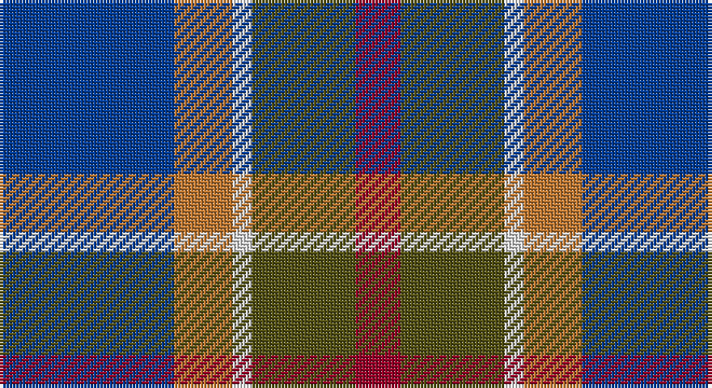

This page is one **sett** — a single exact thread-count. It belongs to the [tartan](/setts/db27o9w3dy16r7/)
(the same proportion at any scale), whose colour order is pattern [BRWGR](/stripes/brwgr/).

Part of the [Unidentified](/tartans/unidentified/) tartan — the named design grouping this sett with its other cloths.

Sourced from register-of-tartans.  It is a [5 stripe tartan](/stripes/stripes5/).

Original link https://www.tartanregister.gov.uk/tartanDetails.aspx?ref=4273

## Also known as

This cloth is also recorded under:

- Unidentified #10
- Unidentified #12
- Unidentified #14
- Unidentified #15
- Unidentified #16
- Unidentified #18
- Unidentified #2
- Unidentified #21
- Unidentified #22
- Unidentified #24
- Unidentified #25
- Unidentified #28
- Unidentified #29
- Unidentified #30
- Unidentified #31
- Unidentified #32
- Unidentified #36
- Unidentified #37
- Unidentified #38
- Unidentified #40
- Unidentified #43
- Unidentified #44
- Unidentified #45
- Unidentified #46
- Unidentified #47
- Unidentified #48
- Unidentified #49
- Unidentified #5
- Unidentified #50
- Unidentified #51
- Unidentified #52
- Unidentified #53
- Unidentified #54
- Unidentified #55
- Unidentified #56
- Unidentified #57
- Unidentified #58
- Unidentified #59
- Unidentified #60
- Unidentified #61
- Unidentified #62
- Unidentified #63
- Unidentified #64
- Unidentified #65
- Unidentified #66
- Unidentified #7
- Unidentified #8
- Unidentified #9
- Unidentified 16
- Unidentified Artifact
- Unidentified Plaid
- Unidentified Plaid #11
- Unidentified Plaid #13
- Unidentified Plaid #2
- Unidentified Plaid #3
- Unidentified Plaid #7
- Unidentified Plaid #8
- Unidentified Plaid #9
- Unidentified Portrait

## Register references

External register numbers recorded for this tartan.

- Scottish Register of Tartans: [4273](https://www.tartanregister.gov.uk/tartanDetails.aspx?ref=4273)
- Scottish Tartans World Register: 2792

## Thread count
B/54 DO18 LN6 T32 DR/14

One full sett is **180 threads**.

## Palette

Palette: <strong>Tartan Register</strong> <small style="color:#888">(3 of 5 colours)</small>
<table><thead><tr><th>Colour</th><th>Threads</th><th>Shade</th><th>Base</th><th>OKLCh</th></tr></thead><tbody><tr><td>B/</td><td style="text-align:right;font-variant-numeric:tabular-nums">54</td><td><code style="background-color:#003C96;">#003C96</code> <small style="color:#888">#003C96</small></td><td>B <code style="background-color:#2A418A;">#2A418A</code></td><td><small style="color:#888">oklch(38.6% 0.158 260.0)</small></td></tr><tr><td>DO</td><td style="text-align:right;font-variant-numeric:tabular-nums">18</td><td><code style="background-color:#BE7832;">#BE7832</code> <small style="color:#888">#BE7832</small></td><td>R <code style="background-color:#CC0000;">#CC0000</code></td><td><small style="color:#888">oklch(63.5% 0.121 62.2)</small></td></tr><tr><td>LN</td><td style="text-align:right;font-variant-numeric:tabular-nums">6</td><td><code style="background-color:#E0E0E0;">#E0E0E0</code> <small style="color:#888">#E0E0E0</small></td><td>W <code style="background-color:#F7F7F7;">#F7F7F7</code></td><td><small style="color:#888">oklch(90.7% 0.000 89.9)</small></td></tr><tr><td>T</td><td style="text-align:right;font-variant-numeric:tabular-nums">32</td><td><code style="background-color:#525014;">#525014</code> <small style="color:#888">#525014</small></td><td>G <code style="background-color:#006100;">#006100</code></td><td><small style="color:#888">oklch(42.1% 0.079 107.5)</small></td></tr><tr><td>DR/</td><td style="text-align:right;font-variant-numeric:tabular-nums">14</td><td><code style="background-color:#960028;">#960028</code> <small style="color:#888">#960028</small></td><td>R <code style="background-color:#CC0000;">#CC0000</code></td><td><small style="color:#888">oklch(42.7% 0.171 18.3)</small></td></tr></tbody></table>

# Sample pattern

## Compared to the master

This cloth is one sett of its design; the master sett (the exemplar the design is anchored on) is below for comparison.

<figure style="margin:0"><figcaption style="color:#888;font-size:smaller">this sett</figcaption></figure>
<figure style="margin:0"><figcaption style="color:#888;font-size:smaller"><a href="/setts/dp4r3dp26r26dg26r4/">master sett →</a></figcaption></figure>

## Nearest tartans

The nearest existing variants by ΔTartan distance, with this tartan at the top so the swatches line up against it.

ΔTartan

Tartan

Sett

—

<a href="/ttd/edit/#slug=db27o9w3dy16r7~x2">Unidentified (Sock Tie)</a> <a class="nn-out" href="/variants/s5/db27o9w3dy16r7~x2/" title="open its dictionary page">↗</a>

0.86

<a href="/ttd/edit/#slug=k4t3dp11dg14w2~x2&amp;base=db27o9w3dy16r7~x2">Wellington No 229</a> <a class="nn-out" href="/variants/s5/k4t3dp11dg14w2~x2/" title="open its dictionary page">↗</a>

1.06

<a href="/ttd/edit/#slug=db30ly3dy11ly3o33r6~x2&amp;base=db27o9w3dy16r7~x2">Balfour Family Tartan</a> <a class="nn-out" href="/variants/s6/db30ly3dy11ly3o33r6~x2/" title="open its dictionary page">↗</a>

1.08

<a href="/ttd/edit/#slug=dp10db10g10w1ly1~x6&amp;base=db27o9w3dy16r7~x2">Edelstein (Personal)</a> <a class="nn-out" href="/variants/s5/dp10db10g10w1ly1~x6/" title="open its dictionary page">↗</a>

1.10

<a href="/ttd/edit/#slug=r5o20dt13db42dt13o20lo5&amp;base=db27o9w3dy16r7~x2">Newmill Corporate Tartan</a> <a class="nn-out" href="/variants/s7/r5o20dt13db42dt13o20lo5/" title="open its dictionary page">↗</a>

1.11

<a href="/ttd/edit/#slug=r4db24k12g14k4lb3~x2&amp;base=db27o9w3dy16r7~x2">MacPhail Hunting #2</a> <a class="nn-out" href="/variants/s6/r4db24k12g14k4lb3~x2/" title="open its dictionary page">↗</a>

1.13

<a href="/ttd/edit/#slug=db15r6dg8k2w2k2~x6&amp;base=db27o9w3dy16r7~x2">Stovell (2015)</a> <a class="nn-out" href="/variants/s6/db15r6dg8k2w2k2~x6/" title="open its dictionary page">↗</a>

1.13

<a href="/ttd/edit/#slug=db22w2k10g11r3g4~x2&amp;base=db27o9w3dy16r7~x2">Paterson Blue (Personal)</a> <a class="nn-out" href="/variants/s6/db22w2k10g11r3g4~x2/" title="open its dictionary page">↗</a>

1.15

<a href="/ttd/edit/#slug=m3k17n11m2o20w2~x2&amp;base=db27o9w3dy16r7~x2">Commonwealth Games Council (Corp.)</a> <a class="nn-out" href="/variants/s6/m3k17n11m2o20w2~x2/" title="open its dictionary page">↗</a>

1.16

<a href="/ttd/edit/#slug=w2k1m10k6b12lo2~x2&amp;base=db27o9w3dy16r7~x2">Soroptimist International (Corporate</a> <a class="nn-out" href="/variants/s6/w2k1m10k6b12lo2~x2/" title="open its dictionary page">↗</a>

1.17

<a href="/ttd/edit/#slug=r7ly3dg28db28w3~x2&amp;base=db27o9w3dy16r7~x2">Turnbull Hunting</a> <a class="nn-out" href="/variants/s5/r7ly3dg28db28w3~x2/" title="open its dictionary page">↗</a>

## Neighbour map

Every grey dot is one of 14360 variants placed by the first two principal components of the ΔTartan feature space (44% of its variance). Red is this tartan; blue dots are its nearest — click one to open its page.

<svg viewBox="0 0 640 380" role="img" style="max-width:100%;height:auto;border:1px solid #e0e0e0;border-radius:4px;display:block" xmlns="http://www.w3.org/2000/svg"><image href="/nn/cloud.v1.png" width="640" height="380"/><a href="/variants/s5/k4t3dp11dg14w2~x2/"><circle cx="172.9" cy="232.2" r="4" fill="#3465a4"><title>Wellington No 229</title></circle></a><a href="/variants/s6/db30ly3dy11ly3o33r6~x2/"><circle cx="198.6" cy="188.4" r="4" fill="#3465a4"><title>Balfour Family Tartan</title></circle></a><a href="/variants/s5/dp10db10g10w1ly1~x6/"><circle cx="162.0" cy="221.8" r="4" fill="#3465a4"><title>Edelstein (Personal)</title></circle></a><a href="/variants/s7/r5o20dt13db42dt13o20lo5/"><circle cx="177.0" cy="219.4" r="4" fill="#3465a4"><title>Newmill Corporate Tartan</title></circle></a><a href="/variants/s6/r4db24k12g14k4lb3~x2/"><circle cx="172.4" cy="221.9" r="4" fill="#3465a4"><title>MacPhail Hunting #2</title></circle></a><a href="/variants/s6/db15r6dg8k2w2k2~x6/"><circle cx="182.0" cy="211.7" r="4" fill="#3465a4"><title>Stovell (2015)</title></circle></a><a href="/variants/s6/db22w2k10g11r3g4~x2/"><circle cx="203.8" cy="205.8" r="4" fill="#3465a4"><title>Paterson Blue (Personal)</title></circle></a><a href="/variants/s6/m3k17n11m2o20w2~x2/"><circle cx="159.8" cy="192.2" r="4" fill="#3465a4"><title>Commonwealth Games Council (Corp.)</title></circle></a><a href="/variants/s6/w2k1m10k6b12lo2~x2/"><circle cx="163.9" cy="189.5" r="4" fill="#3465a4"><title>Soroptimist International (Corporate</title></circle></a><a href="/variants/s5/r7ly3dg28db28w3~x2/"><circle cx="224.5" cy="219.3" r="4" fill="#3465a4"><title>Turnbull Hunting</title></circle></a><circle cx="195.1" cy="225.5" r="5" fill="#c00000"/></svg>

ID: /variants/s5/db27o9w3dy16r7~x2/
