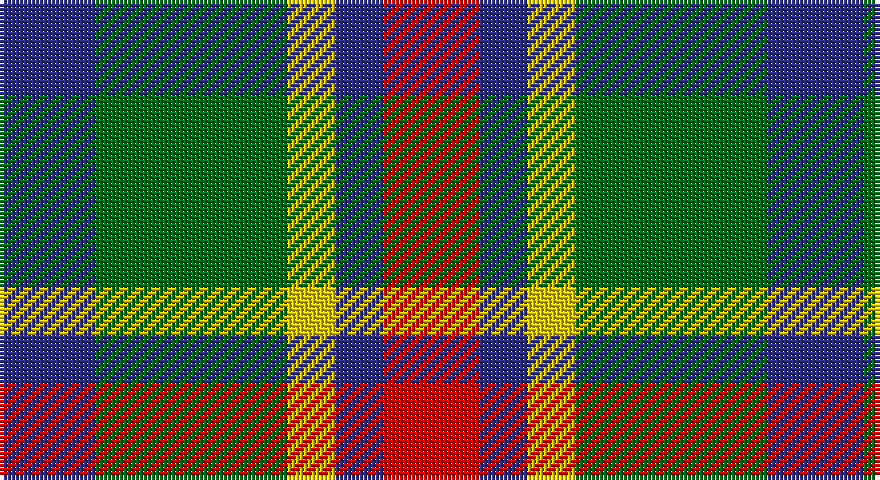

This page is one **sett** — a single exact thread-count. It belongs to the [tartan](/setts/db2g4ly1db1r2/)
(the same proportion at any scale), whose colour order is pattern [BGYBR](/stripes/bgybr/).

Part of the [Creek Indian Nation](/tartans/creek-indian-nation/) tartan — the named design grouping this sett with its other cloths.

Sourced from register-of-tartans.  It is a [5 stripe tartan](/stripes/stripes5/).

Original link https://www.tartanregister.gov.uk/tartanDetails.aspx?ref=802

## Register references

External register numbers recorded for this tartan.

- Scottish Register of Tartans: [802](https://www.tartanregister.gov.uk/tartanDetails.aspx?ref=802)
- Scottish Tartans Authority (ITI): 4610

## Thread count
DB/24 G48 Y12 DB12 R/24

One full sett is **192 threads**.

## Palette

Palette: <strong>Tartan Register</strong>
<table><thead><tr><th>Colour</th><th>Threads</th><th>Shade</th><th>Base</th><th>OKLCh</th></tr></thead><tbody><tr><td>DB/</td><td style="text-align:right;font-variant-numeric:tabular-nums">24</td><td><code style="background-color:#2C2C80;">#2C2C80</code> <small style="color:#888">#2C2C80</small></td><td>B <code style="background-color:#2A418A;">#2A418A</code></td><td><small style="color:#888">oklch(35.0% 0.138 276.6)</small></td></tr><tr><td>G</td><td style="text-align:right;font-variant-numeric:tabular-nums">48</td><td><code style="background-color:#006818;">#006818</code> <small style="color:#888">#006818</small></td><td>G <code style="background-color:#006100;">#006100</code></td><td><small style="color:#888">oklch(45.0% 0.142 145.0)</small></td></tr><tr><td>Y</td><td style="text-align:right;font-variant-numeric:tabular-nums">12</td><td><code style="background-color:#E8C000;">#E8C000</code> <small style="color:#888">#E8C000</small></td><td>Y <code style="background-color:#F2BF00;">#F2BF00</code></td><td><small style="color:#888">oklch(81.9% 0.168 93.7)</small></td></tr><tr><td>DB</td><td style="text-align:right;font-variant-numeric:tabular-nums">12</td><td><code style="background-color:#2C2C80;">#2C2C80</code> <small style="color:#888">#2C2C80</small></td><td>B <code style="background-color:#2A418A;">#2A418A</code></td><td><small style="color:#888">oklch(35.0% 0.138 276.6)</small></td></tr><tr><td>R/</td><td style="text-align:right;font-variant-numeric:tabular-nums">24</td><td><code style="background-color:#C80000;">#C80000</code> <small style="color:#888">#C80000</small></td><td>R <code style="background-color:#CC0000;">#CC0000</code></td><td><small style="color:#888">oklch(52.3% 0.215 29.2)</small></td></tr></tbody></table>

# Sample pattern

## Nearest tartans

The nearest existing variants by ΔTartan distance, with this tartan at the top so the swatches line up against it.

ΔTartan

Tartan

Sett

—

<a href="/ttd/edit/#slug=db2g4ly1db1r2~x12">Creek Indian Nation</a> <a class="nn-out" href="/variants/s5/db2g4ly1db1r2~x12/" title="open its dictionary page">↗</a>

0.65

<a href="/ttd/edit/#slug=g4r3t1k1t3~x4&amp;base=db2g4ly1db1r2~x12">Wilson's, No 214</a> <a class="nn-out" href="/variants/s5/g4r3t1k1t3~x4/" title="open its dictionary page">↗</a>

0.93

<a href="/ttd/edit/#slug=db21g34r14w6~x2&amp;base=db2g4ly1db1r2~x12">Harbison (2015)</a> <a class="nn-out" href="/variants/s4/db21g34r14w6~x2/" title="open its dictionary page">↗</a>

0.98

<a href="/ttd/edit/#slug=db3g6ly1r3~x10&amp;base=db2g4ly1db1r2~x12">Delroeux (Personal)</a> <a class="nn-out" href="/variants/s4/db3g6ly1r3~x10/" title="open its dictionary page">↗</a>

1.05

<a href="/ttd/edit/#slug=r2g4db8r9g9k2r2~x2&amp;base=db2g4ly1db1r2~x12">Stewart, Plaid</a> <a class="nn-out" href="/variants/s7/r2g4db8r9g9k2r2~x2/" title="open its dictionary page">↗</a>

1.05

<a href="/ttd/edit/#slug=k19t10dp19g40ly10&amp;base=db2g4ly1db1r2~x12">Gallowater Old District Tartan</a> <a class="nn-out" href="/variants/s5/k19t10dp19g40ly10/" title="open its dictionary page">↗</a>

1.06

<a href="/ttd/edit/#slug=y3dg6k6y4r1y1~x2&amp;base=db2g4ly1db1r2~x12">Waterloo</a> <a class="nn-out" href="/variants/s6/y3dg6k6y4r1y1~x2/" title="open its dictionary page">↗</a>

1.14

<a href="/ttd/edit/#slug=t2r4g5ly1~x4&amp;base=db2g4ly1db1r2~x12">Wilson's No.203</a> <a class="nn-out" href="/variants/s4/t2r4g5ly1~x4/" title="open its dictionary page">↗</a>

1.15

<a href="/ttd/edit/#slug=o6r1k6r1g6~x6&amp;base=db2g4ly1db1r2~x12">Timespan</a> <a class="nn-out" href="/variants/s5/o6r1k6r1g6~x6/" title="open its dictionary page">↗</a>

1.15

<a href="/ttd/edit/#slug=dt6k6dt6r14ly3~x2&amp;base=db2g4ly1db1r2~x12">Chivas Regal</a> <a class="nn-out" href="/variants/s5/dt6k6dt6r14ly3~x2/" title="open its dictionary page">↗</a>

1.16

<a href="/ttd/edit/#slug=r5t12ly11dt21lo5~x2&amp;base=db2g4ly1db1r2~x12">Inspiration</a> <a class="nn-out" href="/variants/s5/r5t12ly11dt21lo5~x2/" title="open its dictionary page">↗</a>

## Neighbour map

Every grey dot is one of 14360 variants placed by the first two principal components of the ΔTartan feature space (44% of its variance). Red is this tartan; blue dots are its nearest — click one to open its page.

<svg viewBox="0 0 640 380" role="img" style="max-width:100%;height:auto;border:1px solid #e0e0e0;border-radius:4px;display:block" xmlns="http://www.w3.org/2000/svg"><image href="/nn/cloud.v1.png" width="640" height="380"/><a href="/variants/s5/g4r3t1k1t3~x4/"><circle cx="108.6" cy="277.5" r="4" fill="#3465a4"><title>Wilson's, No 214</title></circle></a><a href="/variants/s4/db21g34r14w6~x2/"><circle cx="178.1" cy="269.4" r="4" fill="#3465a4"><title>Harbison (2015)</title></circle></a><a href="/variants/s4/db3g6ly1r3~x10/"><circle cx="194.3" cy="270.5" r="4" fill="#3465a4"><title>Delroeux (Personal)</title></circle></a><a href="/variants/s7/r2g4db8r9g9k2r2~x2/"><circle cx="145.6" cy="247.8" r="4" fill="#3465a4"><title>Stewart, Plaid</title></circle></a><a href="/variants/s5/k19t10dp19g40ly10/"><circle cx="108.6" cy="257.2" r="4" fill="#3465a4"><title>Gallowater Old District Tartan</title></circle></a><a href="/variants/s6/y3dg6k6y4r1y1~x2/"><circle cx="157.3" cy="255.4" r="4" fill="#3465a4"><title>Waterloo</title></circle></a><a href="/variants/s4/t2r4g5ly1~x4/"><circle cx="176.9" cy="278.3" r="4" fill="#3465a4"><title>Wilson's No.203</title></circle></a><a href="/variants/s5/o6r1k6r1g6~x6/"><circle cx="129.3" cy="257.6" r="4" fill="#3465a4"><title>Timespan</title></circle></a><a href="/variants/s5/dt6k6dt6r14ly3~x2/"><circle cx="160.5" cy="269.8" r="4" fill="#3465a4"><title>Chivas Regal</title></circle></a><a href="/variants/s5/r5t12ly11dt21lo5~x2/"><circle cx="97.7" cy="247.8" r="4" fill="#3465a4"><title>Inspiration</title></circle></a><circle cx="144.2" cy="274.7" r="5" fill="#c00000"/></svg>

ID: /variants/s5/db2g4ly1db1r2~x12/
