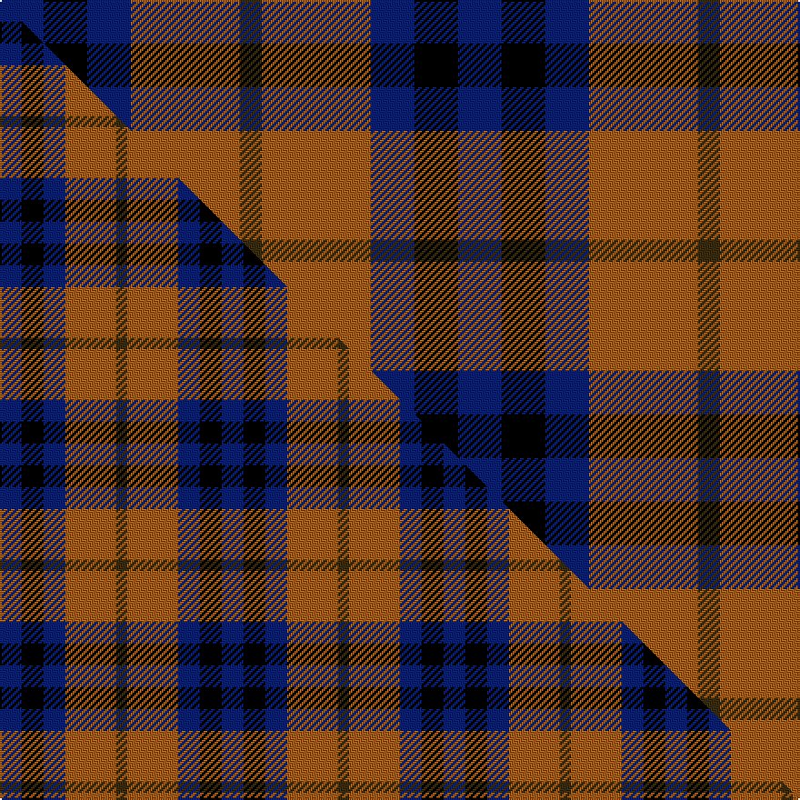

This page is one **sett** — a single exact thread-count. It belongs to the [tartan](/setts/db2k2db2o5dy1/)
(the same proportion at any scale), whose colour order is pattern [BKBRG](/stripes/bkbrg/).

Part of the [Chivas Regal](/tartans/chivas-regal/) tartan — the named design grouping this sett with its other cloths.

Sourced from tartans-authority.  It is a [5 stripe tartan](/stripes/stripes5/).

Original link [https://www.tartanregister.gov.uk/tartanDetails.aspx?ref=3949](https://www.tartanregister.gov.uk/tartanDetails.aspx?ref=3949)

Dataset <small>— provenance for this record, inherited from the source manifest</small>

<dl class="dataset-prov">
<dt>source</dt><dd><a href="/sources/tartans-authority/">Scottish Tartans Authority</a></dd>
<dt>data captured from</dt><dd><a href="https://github.com/thetartan/tartan-database/blob/master/data/tartans-authority/data.csv">https://github.com/thetartan/tartan-database/blob/master/data/tartans-authority/data.csv</a></dd>
<dt>data date</dt><dd>1980s <small>(this record)</small></dd>
<dt>licence</dt><dd><a href="https://creativecommons.org/licenses/by-nc-nd/4.0/">CC BY-NC-ND 4.0</a></dd>
</dl>

Capture chain <small>— the hands this data passed through, oldest first; each capture carries its own licence</small>

<ol class="capture-chain">
<li><a href="https://www.tartansauthority.com/">Scottish Tartans Authority</a> <small>the heritage body's archive — its tartan-ferret record browser is retired (links repaired to the SRT, above)</small></li>
<li><a href="https://github.com/thetartan/tartan-database">thetartan/tartan-database</a> <small>2016-2017</small> · <a href="https://creativecommons.org/licenses/by-nc-nd/4.0/">CC BY-NC-ND 4.0</a> <small>Levko Kravets's frozen compilation — the capture we vendored, and where its CC licence text came from</small></li>
<li>this dictionary <small>captured 2026-06-10 · commit 5bf86c7566</small> <small>each re-capture is a git commit to data/sources</small></li>
</ol>

## Register references

External register numbers recorded for this tartan.

- Scottish Tartans Authority (ITI): 3949

## Thread count
DB/24 K24 DB24 O60 DY/12

One full sett is **252 threads**.

## Palette
<table><thead><tr><th>Colour</th><th>Shade</th><th>OKLCh</th></tr></thead><tbody><tr><td>DB</td><td><code style="background-color:#082077;">#082077</code> <small style="color:#888">#082077</small></td><td><small style="color:#888">oklch(30.0% 0.149 265.1)</small></td></tr><tr><td>K</td><td><code style="background-color:#000000;">#000000</code> <small style="color:#888">#000000</small></td><td><small style="color:#888">oklch(0.0% 0.000 0.0)</small></td></tr><tr><td>O</td><td><code style="background-color:#A65C11;">#A65C11</code> <small style="color:#888">#A65C11</small></td><td><small style="color:#888">oklch(55.0% 0.125 58.3)</small></td></tr><tr><td>DY</td><td><code style="background-color:#3A2B0D;">#3A2B0D</code> <small style="color:#888">#3A2B0D</small></td><td><small style="color:#888">oklch(30.0% 0.049 82.0)</small></td></tr></tbody></table>

# Sample pattern

## Compared to the master

This cloth is one sett of its design; the master sett (the exemplar the design is anchored on) is below for comparison.

Its **ΔTartan distance** from the master is **0.08** — the same measure the nearest-tartans table ranks by (0 is identical; a re-scale of the same cloth is near 0, a recolour or a different proportion further).

<figure class="master-compare" style="margin:0">

this sett
master sett ★

<figcaption style="color:#888;font-size:smaller">One weave of this sett against the <a href="/setts/db6k6db6o14dy3/">master sett ★</a>, split on the diagonal: a shared proportion runs seamlessly across it with only the shades shifting; a different proportion breaks on it.</figcaption>
</figure>

## Nearest tartan variants

The nearest existing variants by ΔTartan distance, with this cloth at the top so the swatches line up against it.

ΔTartan

Threads

Variant

Sett

—

252

<a href="/variants/s5/db2k2db2o5dy1~x12/">Chivas Regal (Corporate)</a>

<a href="/ttd/edit/#slug=db6k6db6o14dy3~x2&amp;base=db2k2db2o5dy1~x12" title="compare in the TTD">0.08</a>

122

<a href="/variants/s5/db6k6db6o14dy3~x2/">Chivas Regal</a>

<a href="/ttd/edit/#slug=b10k10b10dg26y5~x2&amp;base=db2k2db2o5dy1~x12" title="compare in the TTD">1.40</a>

214

<a href="/variants/s5/b10k10b10dg26y5~x2/">Marshall of Keith (Personal)</a>

<a href="/ttd/edit/#slug=db13k13db13r29y4~x2&amp;base=db2k2db2o5dy1~x12" title="compare in the TTD">1.79</a>

254

<a href="/variants/s5/db13k13db13r29y4~x2/">Highland Pub Company</a>

<a href="/ttd/edit/#slug=db20k5db18y26k6~x2&amp;base=db2k2db2o5dy1~x12" title="compare in the TTD">1.94</a>

248

<a href="/variants/s5/db20k5db18y26k6~x2/">Jahore</a>

<a href="/ttd/edit/#slug=r5db35k25db8ly10r5~x2&amp;base=db2k2db2o5dy1~x12" title="compare in the TTD">2.07</a>

332

<a href="/variants/s6/r5db35k25db8ly10r5~x2/">University of Notre Dame</a>

<a href="/ttd/edit/#slug=dp6k5g5r1~x2&amp;base=db2k2db2o5dy1~x12" title="compare in the TTD">2.53</a>

54

<a href="/variants/s4/dp6k5g5r1~x2/">Unidentified No 60</a>

<a href="/ttd/edit/#slug=dp8k11g9r2~x2~dp1607327&amp;base=db2k2db2o5dy1~x12" title="compare in the TTD">2.62</a>

100

<a href="/variants/s4/dp8k11g9r2~x2~dp1607327/">Norwich Collection No. 60</a>

<a href="/ttd/edit/#slug=o4db19o3k20oi24db3~x2~o2102055-oi2104058&amp;base=db2k2db2o5dy1~x12" title="compare in the TTD">2.66</a>

278

<a href="/variants/s6/o4db19o3k20oi24db3~x2~o2102055-oi2104058/">Edinburgh International Conference Centre</a>

<a href="/ttd/edit/#slug=dr3n16k16lb3~x4&amp;base=db2k2db2o5dy1~x12" title="compare in the TTD">2.75</a>

280

<a href="/variants/s4/dr3n16k16lb3~x4/">Thompson, Dress (Clan)</a>

<a href="/ttd/edit/#slug=db5k1g1k1r3k1~x4&amp;base=db2k2db2o5dy1~x12" title="compare in the TTD">2.77</a>

72

<a href="/variants/s6/db5k1g1k1r3k1~x4/">Clerk</a>

## Neighbour map

Every grey dot is one of 13621 variants placed by the first two principal components of the ΔTartan feature space (42% of its variance). Red is this tartan; blue dots are its nearest — click one to open its page.

<svg viewBox="0 0 640 380" role="img" style="max-width:100%;height:auto;border:1px solid #e0e0e0;border-radius:4px;display:block" xmlns="http://www.w3.org/2000/svg"><image href="/nn/cloud.v1.png" width="640" height="380"/><a href="/variants/s5/db6k6db6o14dy3~x2/"><circle cx="158.5" cy="267.2" r="4" fill="#3465a4"><title>Chivas Regal</title></circle></a><a href="/variants/s5/b10k10b10dg26y5~x2/"><circle cx="181.0" cy="263.2" r="4" fill="#3465a4"><title>Marshall of Keith (Personal)</title></circle></a><a href="/variants/s5/db13k13db13r29y4~x2/"><circle cx="171.3" cy="237.0" r="4" fill="#3465a4"><title>Highland Pub Company</title></circle></a><a href="/variants/s5/db20k5db18y26k6~x2/"><circle cx="238.6" cy="273.5" r="4" fill="#3465a4"><title>Jahore</title></circle></a><a href="/variants/s6/r5db35k25db8ly10r5~x2/"><circle cx="199.8" cy="208.9" r="4" fill="#3465a4"><title>University of Notre Dame</title></circle></a><a href="/variants/s4/dp6k5g5r1~x2/"><circle cx="125.1" cy="271.1" r="4" fill="#3465a4"><title>Unidentified No 60</title></circle></a><a href="/variants/s4/dp8k11g9r2~x2~dp1607327/"><circle cx="116.1" cy="270.8" r="4" fill="#3465a4"><title>Norwich Collection No. 60</title></circle></a><a href="/variants/s6/o4db19o3k20oi24db3~x2~o2102055-oi2104058/"><circle cx="147.4" cy="215.0" r="4" fill="#3465a4"><title>Edinburgh International Conference Centre</title></circle></a><a href="/variants/s4/dr3n16k16lb3~x4/"><circle cx="184.0" cy="247.0" r="4" fill="#3465a4"><title>Thompson, Dress (Clan)</title></circle></a><a href="/variants/s6/db5k1g1k1r3k1~x4/"><circle cx="156.5" cy="220.1" r="4" fill="#3465a4"><title>Clerk</title></circle></a><circle cx="170.8" cy="259.4" r="5" fill="#c00000"/><text x="320" y="376" text-anchor="middle" font-size="11" fill="#999">ground</text><text x="11" y="190" text-anchor="middle" font-size="11" fill="#999" transform="rotate(-90 11 190)">complexity</text></svg>

ID: /variants/s5/db2k2db2o5dy1~x12/
