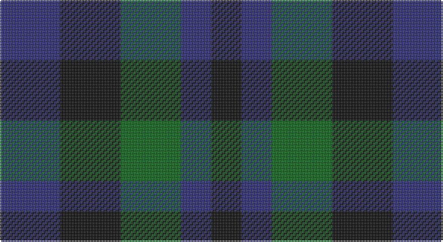

This page is one **sett** — a single exact thread-count. It belongs to the [tartan](/setts/db2k2g2db1k1/)
(the same proportion at any scale), whose colour order is pattern [BKGBK](/stripes/bkgbk/).

Sourced from tartans-authority.  It is a [5 stripe tartan](/stripes/stripes5/).

Original link http://www.tartansauthority.com/tartan-ferret/display/10169/

## Also known as

This cloth is also recorded under:

- Shepherd, Derek

## Register references

External register numbers recorded for this tartan.

- Scottish Register of Tartans: [10169](https://www.tartanregister.gov.uk/tartanDetails?ref=10169)
- Scottish Tartans Authority (ITI): 10169

## Thread count
DB/40 K40 G40 DB20 K/20

One full sett is **260 threads**.

## Palette

Palette: <strong>Tartan Register</strong>
<table><thead><tr><th>Colour</th><th>Threads</th><th>Shade</th><th>Base</th><th>OKLCh</th></tr></thead><tbody><tr><td>DB/</td><td style="text-align:right;font-variant-numeric:tabular-nums">40</td><td><code style="background-color:#2C2C80;">#2C2C80</code> <small style="color:#888">#2C2C80</small></td><td>B <code style="background-color:#2A418A;">#2A418A</code></td><td><small style="color:#888">oklch(35.0% 0.138 276.6)</small></td></tr><tr><td>K</td><td style="text-align:right;font-variant-numeric:tabular-nums">40</td><td><code style="background-color:#101010;">#101010</code> <small style="color:#888">#101010</small></td><td>K <code style="background-color:#000000;">#000000</code></td><td><small style="color:#888">oklch(17.3% 0.000 89.9)</small></td></tr><tr><td>G</td><td style="text-align:right;font-variant-numeric:tabular-nums">40</td><td><code style="background-color:#006818;">#006818</code> <small style="color:#888">#006818</small></td><td>G <code style="background-color:#006100;">#006100</code></td><td><small style="color:#888">oklch(45.0% 0.142 145.0)</small></td></tr><tr><td>DB</td><td style="text-align:right;font-variant-numeric:tabular-nums">20</td><td><code style="background-color:#2C2C80;">#2C2C80</code> <small style="color:#888">#2C2C80</small></td><td>B <code style="background-color:#2A418A;">#2A418A</code></td><td><small style="color:#888">oklch(35.0% 0.138 276.6)</small></td></tr><tr><td>K/</td><td style="text-align:right;font-variant-numeric:tabular-nums">20</td><td><code style="background-color:#101010;">#101010</code> <small style="color:#888">#101010</small></td><td>K <code style="background-color:#000000;">#000000</code></td><td><small style="color:#888">oklch(17.3% 0.000 89.9)</small></td></tr></tbody></table>

# Sample pattern

## Nearest tartans

The nearest existing variants by ΔTartan distance, with this tartan at the top so the swatches line up against it.

ΔTartan

Tartan

Sett

—

<a href="/ttd/edit/#slug=db2k2g2db1k1~x20">Wandering Shepherd (Personal)</a> <a class="nn-out" href="/variants/s5/db2k2g2db1k1~x20/" title="open its dictionary page">↗</a>

1.66

<a href="/ttd/edit/#slug=k1dg3k3db3k1db1~x4&amp;base=db2k2g2db1k1~x20">Sutherland 42nd</a> <a class="nn-out" href="/variants/s6/k1dg3k3db3k1db1~x4/" title="open its dictionary page">↗</a>

1.71

<a href="/ttd/edit/#slug=k1g3k3db3r1~x4&amp;base=db2k2g2db1k1~x20">Durham District Tartan</a> <a class="nn-out" href="/variants/s5/k1g3k3db3r1~x4/" title="open its dictionary page">↗</a>

1.79

<a href="/ttd/edit/#slug=db4k4db4g9k2~x2&amp;base=db2k2g2db1k1~x20">Austin Clan</a> <a class="nn-out" href="/variants/s5/db4k4db4g9k2~x2/" title="open its dictionary page">↗</a>

1.91

<a href="/ttd/edit/#slug=n3k3n3dg6k2~x2&amp;base=db2k2g2db1k1~x20">Austin WI</a> <a class="nn-out" href="/variants/s5/n3k3n3dg6k2~x2/" title="open its dictionary page">↗</a>

1.91

<a href="/ttd/edit/#slug=n3k3n3dg6k2&amp;base=db2k2g2db1k1~x20">Austin WI</a> <a class="nn-out" href="/variants/s5/n3k3n3dg6k2/" title="open its dictionary page">↗</a>

1.94

<a href="/ttd/edit/#slug=k4dg4ly1dg4k4db4k1~x2&amp;base=db2k2g2db1k1~x20">MacKay Coat</a> <a class="nn-out" href="/variants/s7/k4dg4ly1dg4k4db4k1~x2/" title="open its dictionary page">↗</a>

1.94

<a href="/ttd/edit/#slug=k4dg4k1dg4k4db4ly1~x2&amp;base=db2k2g2db1k1~x20">Unidentified No 39</a> <a class="nn-out" href="/variants/s7/k4dg4k1dg4k4db4ly1~x2/" title="open its dictionary page">↗</a>

1.95

<a href="/ttd/edit/#slug=k3dg4k1dg4k3db4k1~x2&amp;base=db2k2g2db1k1~x20">Unidentified No 63</a> <a class="nn-out" href="/variants/s7/k3dg4k1dg4k3db4k1~x2/" title="open its dictionary page">↗</a>

1.96

<a href="/ttd/edit/#slug=k5n5k9db5k5db5~x2&amp;base=db2k2g2db1k1~x20">Macintosh, Charles Rennie (Commem)</a> <a class="nn-out" href="/variants/s6/k5n5k9db5k5db5~x2/" title="open its dictionary page">↗</a>

1.97

<a href="/ttd/edit/#slug=db4k5dg4r1~x4&amp;base=db2k2g2db1k1~x20">Unidentified pattern #3</a> <a class="nn-out" href="/variants/s4/db4k5dg4r1~x4/" title="open its dictionary page">↗</a>

## Neighbour map

Every grey dot is one of 14360 variants placed by the first two principal components of the ΔTartan feature space (44% of its variance). Red is this tartan; blue dots are its nearest — click one to open its page.

<svg viewBox="0 0 640 380" role="img" style="max-width:100%;height:auto;border:1px solid #e0e0e0;border-radius:4px;display:block" xmlns="http://www.w3.org/2000/svg"><image href="/nn/cloud.v1.png" width="640" height="380"/><a href="/variants/s6/k1dg3k3db3k1db1~x4/"><circle cx="234.1" cy="350.3" r="4" fill="#3465a4"><title>Sutherland 42nd</title></circle></a><a href="/variants/s5/k1g3k3db3r1~x4/"><circle cx="130.3" cy="319.2" r="4" fill="#3465a4"><title>Durham District Tartan</title></circle></a><a href="/variants/s5/db4k4db4g9k2~x2/"><circle cx="209.3" cy="324.9" r="4" fill="#3465a4"><title>Austin Clan</title></circle></a><a href="/variants/s5/n3k3n3dg6k2~x2/"><circle cx="140.7" cy="336.3" r="4" fill="#3465a4"><title>Austin WI</title></circle></a><a href="/variants/s5/n3k3n3dg6k2/"><circle cx="140.7" cy="336.3" r="4" fill="#3465a4"><title>Austin WI</title></circle></a><a href="/variants/s7/k4dg4ly1dg4k4db4k1~x2/"><circle cx="169.1" cy="306.5" r="4" fill="#3465a4"><title>MacKay Coat</title></circle></a><a href="/variants/s7/k4dg4k1dg4k4db4ly1~x2/"><circle cx="169.1" cy="306.5" r="4" fill="#3465a4"><title>Unidentified No 39</title></circle></a><a href="/variants/s7/k3dg4k1dg4k3db4k1~x2/"><circle cx="235.9" cy="345.5" r="4" fill="#3465a4"><title>Unidentified No 63</title></circle></a><a href="/variants/s6/k5n5k9db5k5db5~x2/"><circle cx="254.6" cy="366.0" r="4" fill="#3465a4"><title>Macintosh, Charles Rennie (Commem)</title></circle></a><a href="/variants/s4/db4k5dg4r1~x4/"><circle cx="169.5" cy="323.7" r="4" fill="#3465a4"><title>Unidentified pattern #3</title></circle></a><circle cx="155.3" cy="366.0" r="5" fill="#c00000"/></svg>

ID: /variants/s5/db2k2g2db1k1~x20/
