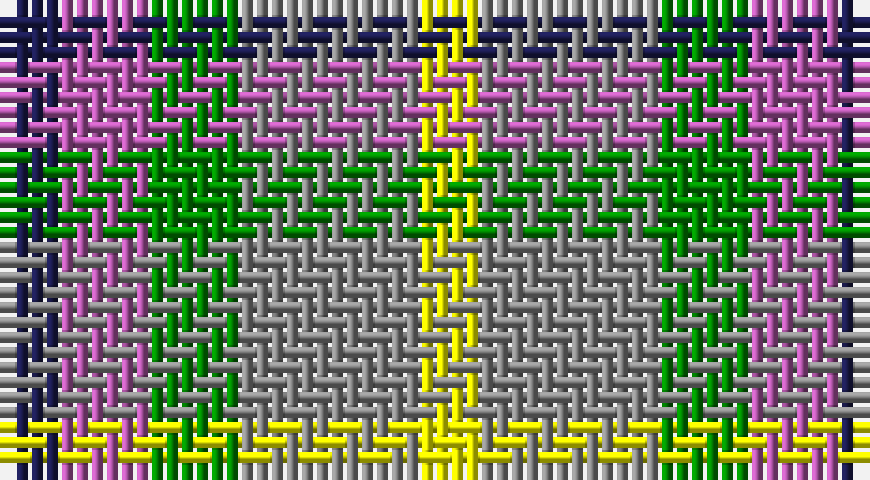

This page is one **sett** — a single exact thread-count. It belongs to the [tartan](/setts/db2m3g3o6ly2/)
(the same proportion at any scale), whose colour order is pattern [BRGRY](/stripes/brgry/).

Sourced from register-of-tartans.  It is a [5 stripe tartan](/stripes/stripes5/).

Original link https://www.tartanregister.gov.uk/tartanDetails.aspx?ref=11629

## Register references

External register numbers recorded for this tartan.

- Scottish Register of Tartans: [11629](https://www.tartanregister.gov.uk/tartanDetails.aspx?ref=11629)

## Thread count
DB/4 P6 G6 N12 Y/4

One full sett is **56 threads**.

## Palette

Palette: <strong>Tartan Register</strong>
<table><thead><tr><th>Colour</th><th>Threads</th><th>Shade</th><th>Base</th><th>OKLCh</th></tr></thead><tbody><tr><td>DB/</td><td style="text-align:right;font-variant-numeric:tabular-nums">4</td><td><code style="background-color:#1C1C50;">#1C1C50</code> <small style="color:#888">#1C1C50</small></td><td>B <code style="background-color:#2A418A;">#2A418A</code></td><td><small style="color:#888">oklch(26.2% 0.093 277.9)</small></td></tr><tr><td>P</td><td style="text-align:right;font-variant-numeric:tabular-nums">6</td><td><code style="background-color:#B458AC;">#B458AC</code> <small style="color:#888">#B458AC</small></td><td>R <code style="background-color:#CC0000;">#CC0000</code></td><td><small style="color:#888">oklch(60.2% 0.158 330.7)</small></td></tr><tr><td>G</td><td style="text-align:right;font-variant-numeric:tabular-nums">6</td><td><code style="background-color:#008B00;">#008B00</code> <small style="color:#888">#008B00</small></td><td>G <code style="background-color:#006100;">#006100</code></td><td><small style="color:#888">oklch(55.2% 0.188 142.5)</small></td></tr><tr><td>N</td><td style="text-align:right;font-variant-numeric:tabular-nums">12</td><td><code style="background-color:#888888;">#888888</code> <small style="color:#888">#888888</small></td><td>R <code style="background-color:#CC0000;">#CC0000</code></td><td><small style="color:#888">oklch(62.7% 0.000 89.9)</small></td></tr><tr><td>Y/</td><td style="text-align:right;font-variant-numeric:tabular-nums">4</td><td><code style="background-color:#FFFF00;">#FFFF00</code> <small style="color:#888">#FFFF00</small></td><td>Y <code style="background-color:#F2BF00;">#F2BF00</code></td><td><small style="color:#888">oklch(96.8% 0.211 109.8)</small></td></tr></tbody></table>

# Sample pattern

## Nearest tartans

The nearest existing variants by ΔTartan distance, with this tartan at the top so the swatches line up against it.

ΔTartan

Tartan

Sett

—

<a href="/ttd/edit/#slug=db2m3g3o6ly2~x2">Dunoon Burgh Hall Trust</a> <a class="nn-out" href="/variants/s5/db2m3g3o6ly2~x2/" title="open its dictionary page">↗</a>

1.13

<a href="/ttd/edit/#slug=r5db12lyi11n21ly5~x2&amp;base=db2m3g3o6ly2~x2">Inspiration</a> <a class="nn-out" href="/variants/s5/r5db12lyi11n21ly5~x2/" title="open its dictionary page">↗</a>

1.18

<a href="/ttd/edit/#slug=r5t12ly11dt21lo5~x2&amp;base=db2m3g3o6ly2~x2">Inspiration</a> <a class="nn-out" href="/variants/s5/r5t12ly11dt21lo5~x2/" title="open its dictionary page">↗</a>

1.21

<a href="/ttd/edit/#slug=r13ly13g13b22w4~x2&amp;base=db2m3g3o6ly2~x2">Clan Haggis World (Corporate)</a> <a class="nn-out" href="/variants/s5/r13ly13g13b22w4~x2/" title="open its dictionary page">↗</a>

1.29

<a href="/ttd/edit/#slug=db7o8dg15ly6lo3~x10&amp;base=db2m3g3o6ly2~x2">Unidentified Silk Plaid</a> <a class="nn-out" href="/variants/s5/db7o8dg15ly6lo3~x10/" title="open its dictionary page">↗</a>

1.36

<a href="/ttd/edit/#slug=lr12lo8r5k6lr7g5~x4&amp;base=db2m3g3o6ly2~x2">Mitchell, Martin (Personal)</a> <a class="nn-out" href="/variants/s6/lr12lo8r5k6lr7g5~x4/" title="open its dictionary page">↗</a>

1.39

<a href="/ttd/edit/#slug=t3w10db10g10r2~x4&amp;base=db2m3g3o6ly2~x2">MacTeddy</a> <a class="nn-out" href="/variants/s5/t3w10db10g10r2~x4/" title="open its dictionary page">↗</a>

1.48

<a href="/ttd/edit/#slug=g4r3t1k1t3~x4&amp;base=db2m3g3o6ly2~x2">Wilson's, No 214</a> <a class="nn-out" href="/variants/s5/g4r3t1k1t3~x4/" title="open its dictionary page">↗</a>

1.53

<a href="/ttd/edit/#slug=r13lo13g13db22w4~x2&amp;base=db2m3g3o6ly2~x2">Clan Haggis World (Corporate)</a> <a class="nn-out" href="/variants/s5/r13lo13g13db22w4~x2/" title="open its dictionary page">↗</a>

1.60

<a href="/ttd/edit/#slug=k19t10dp19g40ly10&amp;base=db2m3g3o6ly2~x2">Gallowater Old District Tartan</a> <a class="nn-out" href="/variants/s5/k19t10dp19g40ly10/" title="open its dictionary page">↗</a>

1.61

<a href="/ttd/edit/#slug=db7o8g15ly6y3~x10&amp;base=db2m3g3o6ly2~x2">Unidentified, Silk Plaid</a> <a class="nn-out" href="/variants/s5/db7o8g15ly6y3~x10/" title="open its dictionary page">↗</a>

## Neighbour map

Every grey dot is one of 14360 variants placed by the first two principal components of the ΔTartan feature space (44% of its variance). Red is this tartan; blue dots are its nearest — click one to open its page.

<svg viewBox="0 0 640 380" role="img" style="max-width:100%;height:auto;border:1px solid #e0e0e0;border-radius:4px;display:block" xmlns="http://www.w3.org/2000/svg"><image href="/nn/cloud.v1.png" width="640" height="380"/><a href="/variants/s5/r5db12lyi11n21ly5~x2/"><circle cx="94.6" cy="241.3" r="4" fill="#3465a4"><title>Inspiration</title></circle></a><a href="/variants/s5/r5t12ly11dt21lo5~x2/"><circle cx="97.7" cy="247.8" r="4" fill="#3465a4"><title>Inspiration</title></circle></a><a href="/variants/s5/r13ly13g13b22w4~x2/"><circle cx="51.1" cy="238.0" r="4" fill="#3465a4"><title>Clan Haggis World (Corporate)</title></circle></a><a href="/variants/s5/db7o8dg15ly6lo3~x10/"><circle cx="91.5" cy="243.5" r="4" fill="#3465a4"><title>Unidentified Silk Plaid</title></circle></a><a href="/variants/s6/lr12lo8r5k6lr7g5~x4/"><circle cx="79.6" cy="288.9" r="4" fill="#3465a4"><title>Mitchell, Martin (Personal)</title></circle></a><a href="/variants/s5/t3w10db10g10r2~x4/"><circle cx="52.4" cy="239.3" r="4" fill="#3465a4"><title>MacTeddy</title></circle></a><a href="/variants/s5/g4r3t1k1t3~x4/"><circle cx="108.6" cy="277.5" r="4" fill="#3465a4"><title>Wilson's, No 214</title></circle></a><a href="/variants/s5/r13lo13g13db22w4~x2/"><circle cx="72.1" cy="247.0" r="4" fill="#3465a4"><title>Clan Haggis World (Corporate)</title></circle></a><a href="/variants/s5/k19t10dp19g40ly10/"><circle cx="108.6" cy="257.2" r="4" fill="#3465a4"><title>Gallowater Old District Tartan</title></circle></a><a href="/variants/s5/db7o8g15ly6y3~x10/"><circle cx="97.6" cy="247.0" r="4" fill="#3465a4"><title>Unidentified, Silk Plaid</title></circle></a><circle cx="63.3" cy="268.2" r="5" fill="#c00000"/></svg>

ID: /variants/s5/db2m3g3o6ly2~x2/
