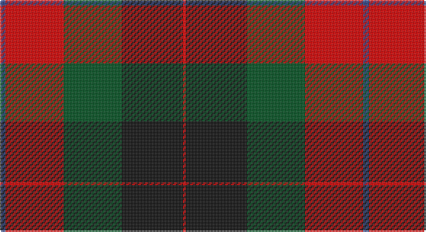

This page is one **sett** — a single exact thread-count. It belongs to the [tartan](/setts/db2r20dg20k21r1/)
(the same proportion at any scale), whose colour order is pattern [BRGKR](/stripes/brgkr/).

Part of the [Skene of Cromar](/tartans/skene-of-cromar/) tartan — the named design grouping this sett with its other cloths.

Sourced from register-of-tartans.  It is a [5 stripe tartan](/stripes/stripes5/).

Original link https://www.tartanregister.gov.uk/tartanDetails.aspx?ref=3806

## Also known as

This cloth is also recorded under:

- Skene, of Cromar

## Register references

External register numbers recorded for this tartan.

- Scottish Register of Tartans: [3806](https://www.tartanregister.gov.uk/tartanDetails.aspx?ref=3806)
- Scottish Tartans World Register: 535

## Thread count
B/4 R40 G40 K42 R/2

One full sett is **250 threads**.

## Palette

Palette: <strong>Tartan Register</strong>
<table><thead><tr><th>Colour</th><th>Threads</th><th>Shade</th><th>Base</th><th>OKLCh</th></tr></thead><tbody><tr><td>B/</td><td style="text-align:right;font-variant-numeric:tabular-nums">4</td><td><code style="background-color:#2C4084;">#2C4084</code> <small style="color:#888">#2C4084</small></td><td>B <code style="background-color:#2A418A;">#2A418A</code></td><td><small style="color:#888">oklch(39.4% 0.117 268.3)</small></td></tr><tr><td>R</td><td style="text-align:right;font-variant-numeric:tabular-nums">40</td><td><code style="background-color:#DC0000;">#DC0000</code> <small style="color:#888">#DC0000</small></td><td>R <code style="background-color:#CC0000;">#CC0000</code></td><td><small style="color:#888">oklch(56.2% 0.230 29.2)</small></td></tr><tr><td>G</td><td style="text-align:right;font-variant-numeric:tabular-nums">40</td><td><code style="background-color:#005020;">#005020</code> <small style="color:#888">#005020</small></td><td>G <code style="background-color:#006100;">#006100</code></td><td><small style="color:#888">oklch(37.7% 0.105 149.6)</small></td></tr><tr><td>K</td><td style="text-align:right;font-variant-numeric:tabular-nums">42</td><td><code style="background-color:#101010;">#101010</code> <small style="color:#888">#101010</small></td><td>K <code style="background-color:#000000;">#000000</code></td><td><small style="color:#888">oklch(17.3% 0.000 89.9)</small></td></tr><tr><td>R/</td><td style="text-align:right;font-variant-numeric:tabular-nums">2</td><td><code style="background-color:#DC0000;">#DC0000</code> <small style="color:#888">#DC0000</small></td><td>R <code style="background-color:#CC0000;">#CC0000</code></td><td><small style="color:#888">oklch(56.2% 0.230 29.2)</small></td></tr></tbody></table>

# Sample pattern

## Nearest tartans

The nearest existing variants by ΔTartan distance, with this tartan at the top so the swatches line up against it.

ΔTartan

Tartan

Sett

—

<a href="/ttd/edit/#slug=db2r20dg20k21r1~x2">Skene of Cromar (1885)</a> <a class="nn-out" href="/variants/s5/db2r20dg20k21r1~x2/" title="open its dictionary page">↗</a>

0.96

<a href="/ttd/edit/#slug=o2dr14o1k14o14ly2~x2&amp;base=db2r20dg20k21r1~x2">United Distillers</a> <a class="nn-out" href="/variants/s6/o2dr14o1k14o14ly2~x2/" title="open its dictionary page">↗</a>

1.12

<a href="/ttd/edit/#slug=w3dg18db22r19dg1r2~x2&amp;base=db2r20dg20k21r1~x2">Nibley (Personal)</a> <a class="nn-out" href="/variants/s6/w3dg18db22r19dg1r2~x2/" title="open its dictionary page">↗</a>

1.15

<a href="/ttd/edit/#slug=db2r20g20k21r1~x2&amp;base=db2r20dg20k21r1~x2">Skene of Cromar</a> <a class="nn-out" href="/variants/s5/db2r20g20k21r1~x2/" title="open its dictionary page">↗</a>

1.22

<a href="/ttd/edit/#slug=k6r2dg17r16k1t2~x2&amp;base=db2r20dg20k21r1~x2">Unidentified #15</a> <a class="nn-out" href="/variants/s6/k6r2dg17r16k1t2~x2/" title="open its dictionary page">↗</a>

1.25

<a href="/ttd/edit/#slug=g21k21r1db20r20k2~x2&amp;base=db2r20dg20k21r1~x2">Skene of Cromar (Cant version)</a> <a class="nn-out" href="/variants/s6/g21k21r1db20r20k2~x2/" title="open its dictionary page">↗</a>

1.26

<a href="/ttd/edit/#slug=k9lr4k1lr4dg15r4k1~x4&amp;base=db2r20dg20k21r1~x2">Logan - 1797 (Dark)</a> <a class="nn-out" href="/variants/s7/k9lr4k1lr4dg15r4k1~x4/" title="open its dictionary page">↗</a>

1.31

<a href="/ttd/edit/#slug=dg12g6dg6r15k1r1k2~x2&amp;base=db2r20dg20k21r1~x2">Cook (Name)</a> <a class="nn-out" href="/variants/s7/dg12g6dg6r15k1r1k2~x2/" title="open its dictionary page">↗</a>

1.31

<a href="/ttd/edit/#slug=w2k1dg16k12r12k1w2~x2&amp;base=db2r20dg20k21r1~x2">Prince Edward Island #2</a> <a class="nn-out" href="/variants/s7/w2k1dg16k12r12k1w2~x2/" title="open its dictionary page">↗</a>

1.33

<a href="/ttd/edit/#slug=db1r5dg18r4db9r10w1~x4&amp;base=db2r20dg20k21r1~x2">MacKintosh Geddes</a> <a class="nn-out" href="/variants/s7/db1r5dg18r4db9r10w1~x4/" title="open its dictionary page">↗</a>

1.35

<a href="/ttd/edit/#slug=w3g15db18r15g1r2~x2&amp;base=db2r20dg20k21r1~x2">Nibley</a> <a class="nn-out" href="/variants/s6/w3g15db18r15g1r2~x2/" title="open its dictionary page">↗</a>

## Neighbour map

Every grey dot is one of 14360 variants placed by the first two principal components of the ΔTartan feature space (44% of its variance). Red is this tartan; blue dots are its nearest — click one to open its page.

<svg viewBox="0 0 640 380" role="img" style="max-width:100%;height:auto;border:1px solid #e0e0e0;border-radius:4px;display:block" xmlns="http://www.w3.org/2000/svg"><image href="/nn/cloud.v1.png" width="640" height="380"/><a href="/variants/s6/o2dr14o1k14o14ly2~x2/"><circle cx="204.0" cy="194.2" r="4" fill="#3465a4"><title>United Distillers</title></circle></a><a href="/variants/s6/w3dg18db22r19dg1r2~x2/"><circle cx="224.2" cy="180.6" r="4" fill="#3465a4"><title>Nibley (Personal)</title></circle></a><a href="/variants/s5/db2r20g20k21r1~x2/"><circle cx="186.6" cy="188.9" r="4" fill="#3465a4"><title>Skene of Cromar</title></circle></a><a href="/variants/s6/k6r2dg17r16k1t2~x2/"><circle cx="258.0" cy="179.2" r="4" fill="#3465a4"><title>Unidentified #15</title></circle></a><a href="/variants/s6/g21k21r1db20r20k2~x2/"><circle cx="165.8" cy="205.5" r="4" fill="#3465a4"><title>Skene of Cromar (Cant version)</title></circle></a><a href="/variants/s7/k9lr4k1lr4dg15r4k1~x4/"><circle cx="214.9" cy="186.2" r="4" fill="#3465a4"><title>Logan - 1797 (Dark)</title></circle></a><a href="/variants/s7/dg12g6dg6r15k1r1k2~x2/"><circle cx="252.7" cy="191.8" r="4" fill="#3465a4"><title>Cook (Name)</title></circle></a><a href="/variants/s7/w2k1dg16k12r12k1w2~x2/"><circle cx="191.0" cy="168.3" r="4" fill="#3465a4"><title>Prince Edward Island #2</title></circle></a><a href="/variants/s7/db1r5dg18r4db9r10w1~x4/"><circle cx="249.2" cy="180.7" r="4" fill="#3465a4"><title>MacKintosh Geddes</title></circle></a><a href="/variants/s6/w3g15db18r15g1r2~x2/"><circle cx="205.1" cy="188.0" r="4" fill="#3465a4"><title>Nibley</title></circle></a><circle cx="216.2" cy="199.2" r="5" fill="#c00000"/></svg>

ID: /variants/s5/db2r20dg20k21r1~x2/
