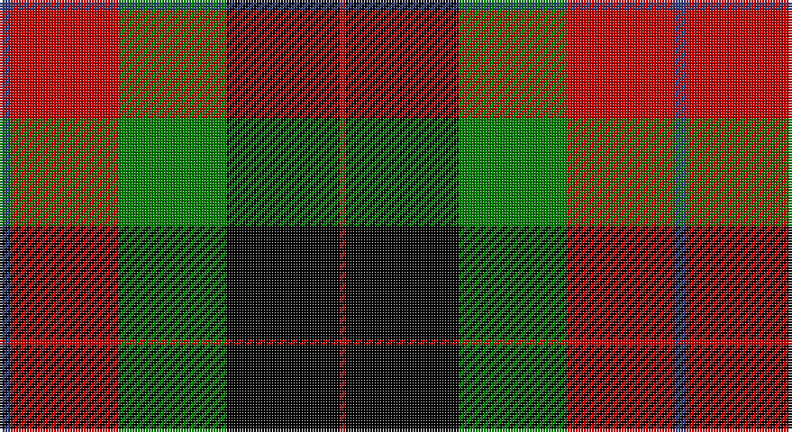

This page is one **sett** — a single exact thread-count. It belongs to the [tartan](/setts/db2r20g20k21r1/)
(the same proportion at any scale), whose colour order is pattern [BRGKR](/stripes/brgkr/).

Part of the [Skene of Cromar](/tartans/skene-of-cromar/) tartan — the named design grouping this sett with its other cloths.

Sourced from weddslist.  It is a [5 stripe tartan](/stripes/stripes5/).

Original link http://www.weddslist.com/cgi-bin/tartans/pg.pl?source=sts

## Provenance

Earliest known date: pre 2003 Count divided by 2 for display purposes.

## Also known as

This cloth is also recorded under:

- Skene, of Cromar

2 attestations — the source records this cloth was collapsed from (oldest owns this page)

<ul>
<li>undated — Skene of Cromar (weddslist, <a href="http://www.weddslist.com/cgi-bin/tartans/pg.pl?source=sts">record</a>)</li>
<li>undated — Skene of Cromar Clan Tartan (house-of-tartan, <a href="http://www.house-of-tartan.scotland.net/house/TartanViewjs.asp?colr=Def&tnam=535">record</a>)</li>
</ul>

## Thread count
B/4 R40 G40 K42 R/2

One full sett is **250 threads**.

## Palette

Palette: <strong>Ingles Buchan</strong> <small style="color:#888">(1 of 4 colours)</small>
<table><thead><tr><th>Colour</th><th>Threads</th><th>Shade</th><th>Base</th><th>OKLCh</th></tr></thead><tbody><tr><td>B/</td><td style="text-align:right;font-variant-numeric:tabular-nums">4</td><td><code style="background-color:#304080;">#304080</code> <small style="color:#888">#304080</small></td><td>B <code style="background-color:#2A418A;">#2A418A</code></td><td><small style="color:#888">oklch(39.4% 0.109 270.2)</small></td></tr><tr><td>R</td><td style="text-align:right;font-variant-numeric:tabular-nums">40</td><td><code style="background-color:#C00000;">#C00000</code> <small style="color:#888">#C00000</small></td><td>R <code style="background-color:#CC0000;">#CC0000</code></td><td><small style="color:#888">oklch(50.7% 0.208 29.2)</small></td></tr><tr><td>G</td><td style="text-align:right;font-variant-numeric:tabular-nums">40</td><td><code style="background-color:#008000;">#008000</code> <small style="color:#888">#008000</small></td><td>G <code style="background-color:#006100;">#006100</code></td><td><small style="color:#888">oklch(52.0% 0.177 142.5)</small></td></tr><tr><td>K</td><td style="text-align:right;font-variant-numeric:tabular-nums">42</td><td><code style="background-color:#000000;">#000000</code> <small style="color:#888">#000000</small></td><td>K <code style="background-color:#000000;">#000000</code></td><td><small style="color:#888">oklch(0.0% 0.000 0.0)</small></td></tr><tr><td>R/</td><td style="text-align:right;font-variant-numeric:tabular-nums">2</td><td><code style="background-color:#C00000;">#C00000</code> <small style="color:#888">#C00000</small></td><td>R <code style="background-color:#CC0000;">#CC0000</code></td><td><small style="color:#888">oklch(50.7% 0.208 29.2)</small></td></tr></tbody></table>

# Sample pattern

## Compared to the master

This cloth is one sett of its design; the master sett (the exemplar the design is anchored on) is below for comparison.

<figure style="margin:0"><figcaption style="color:#888;font-size:smaller">this sett</figcaption></figure>
<figure style="margin:0"><figcaption style="color:#888;font-size:smaller"><a href="/setts/db2r20dg20k21r1/">master sett →</a></figcaption></figure>

## Nearest tartans

The nearest existing variants by ΔTartan distance, with this tartan at the top so the swatches line up against it.

ΔTartan

Tartan

Sett

—

<a href="/ttd/edit/#slug=db2r20g20k21r1~x2">Skene of Cromar</a> <a class="nn-out" href="/variants/s5/db2r20g20k21r1~x2/" title="open its dictionary page">↗</a>

1.15

<a href="/ttd/edit/#slug=db2r20dg20k21r1~x2&amp;base=db2r20g20k21r1~x2">Skene of Cromar (1885)</a> <a class="nn-out" href="/variants/s5/db2r20dg20k21r1~x2/" title="open its dictionary page">↗</a>

1.18

<a href="/variants/s6/o2k14o1ki14o14ly2~x2/">United Distillers (Corporate)</a>

1.21

<a href="/ttd/edit/#slug=k9r4k1r4g15ri4k1~x2&amp;base=db2r20g20k21r1~x2">Logan, Dark</a> <a class="nn-out" href="/variants/s7/k9r4k1r4g15ri4k1~x2/" title="open its dictionary page">↗</a>

1.23

<a href="/ttd/edit/#slug=w2k1g16k12r12k1w2~x2&amp;base=db2r20g20k21r1~x2">Prince Edward Island</a> <a class="nn-out" href="/variants/s7/w2k1g16k12r12k1w2~x2/" title="open its dictionary page">↗</a>

1.32

<a href="/ttd/edit/#slug=w2k1dg16k12r12k1w2~x2&amp;base=db2r20g20k21r1~x2">Prince Edward Island #2</a> <a class="nn-out" href="/variants/s7/w2k1dg16k12r12k1w2~x2/" title="open its dictionary page">↗</a>

1.41

<a href="/ttd/edit/#slug=k6r2g17r16k1t2~x2&amp;base=db2r20g20k21r1~x2">Unidentified 12</a> <a class="nn-out" href="/variants/s6/k6r2g17r16k1t2~x2/" title="open its dictionary page">↗</a>

1.47

<a href="/ttd/edit/#slug=o2dr14o1k14o14ly2~x2&amp;base=db2r20g20k21r1~x2">United Distillers</a> <a class="nn-out" href="/variants/s6/o2dr14o1k14o14ly2~x2/" title="open its dictionary page">↗</a>

1.50

<a href="/ttd/edit/#slug=dg17k1r16k2y14k19y14k2r6&amp;base=db2r20g20k21r1~x2">Borthwick</a> <a class="nn-out" href="/variants/s9/dg17k1r16k2y14k19y14k2r6/" title="open its dictionary page">↗</a>

1.52

<a href="/ttd/edit/#slug=k3ly18g6r17k31g3~x2&amp;base=db2r20g20k21r1~x2">MacMillan Variant (Unidentified)</a> <a class="nn-out" href="/variants/s6/k3ly18g6r17k31g3~x2/" title="open its dictionary page">↗</a>

1.54

<a href="/ttd/edit/#slug=g3r20g16k22lo6k3g2~x2&amp;base=db2r20g20k21r1~x2">Wcwm 1062</a> <a class="nn-out" href="/variants/s7/g3r20g16k22lo6k3g2~x2/" title="open its dictionary page">↗</a>

## Neighbour map

Every grey dot is one of 14360 variants placed by the first two principal components of the ΔTartan feature space (44% of its variance). Red is this tartan; blue dots are its nearest — click one to open its page.

<svg viewBox="0 0 640 380" role="img" style="max-width:100%;height:auto;border:1px solid #e0e0e0;border-radius:4px;display:block" xmlns="http://www.w3.org/2000/svg"><image href="/nn/cloud.v1.png" width="640" height="380"/><a href="/variants/s5/db2r20dg20k21r1~x2/"><circle cx="216.2" cy="199.2" r="4" fill="#3465a4"><title>Skene of Cromar (1885)</title></circle></a><a href="/variants/s6/o2k14o1ki14o14ly2~x2/"><circle cx="179.5" cy="194.0" r="4" fill="#3465a4"><title>United Distillers (Corporate)</title></circle></a><a href="/variants/s7/k9r4k1r4g15ri4k1~x2/"><circle cx="189.1" cy="173.6" r="4" fill="#3465a4"><title>Logan, Dark</title></circle></a><a href="/variants/s7/w2k1g16k12r12k1w2~x2/"><circle cx="171.3" cy="162.6" r="4" fill="#3465a4"><title>Prince Edward Island</title></circle></a><a href="/variants/s7/w2k1dg16k12r12k1w2~x2/"><circle cx="191.0" cy="168.3" r="4" fill="#3465a4"><title>Prince Edward Island #2</title></circle></a><a href="/variants/s6/k6r2g17r16k1t2~x2/"><circle cx="234.6" cy="171.3" r="4" fill="#3465a4"><title>Unidentified 12</title></circle></a><a href="/variants/s6/o2dr14o1k14o14ly2~x2/"><circle cx="204.0" cy="194.2" r="4" fill="#3465a4"><title>United Distillers</title></circle></a><a href="/variants/s9/dg17k1r16k2y14k19y14k2r6/"><circle cx="148.5" cy="173.4" r="4" fill="#3465a4"><title>Borthwick</title></circle></a><a href="/variants/s6/k3ly18g6r17k31g3~x2/"><circle cx="179.4" cy="191.6" r="4" fill="#3465a4"><title>MacMillan Variant (Unidentified)</title></circle></a><a href="/variants/s7/g3r20g16k22lo6k3g2~x2/"><circle cx="179.2" cy="197.8" r="4" fill="#3465a4"><title>Wcwm 1062</title></circle></a><circle cx="186.6" cy="188.9" r="5" fill="#c00000"/></svg>

ID: /variants/s5/db2r20g20k21r1~x2/
