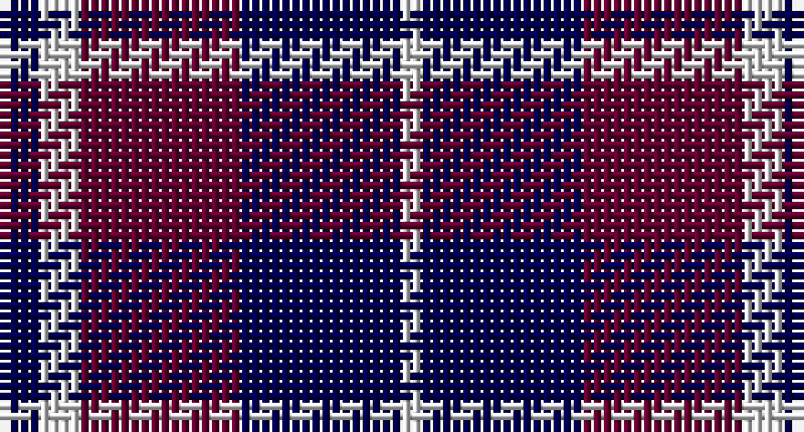

This page is one **sett** — a single exact thread-count. It belongs to the [tartan](/setts/db2w2dr8db8w1/)
(the same proportion at any scale), whose colour order is pattern [BWBBW](/stripes/bwbbw/).

Sourced from weddslist.  It is a [5 stripe tartan](/stripes/stripes5/).

Original link http://www.weddslist.com/cgi-bin/tartans/pg.pl?source=sts

## Provenance

Earliest known date: 1988 "Purple (Wine red is sample) and blue (Dark blue) are the city's official colours. The symbolize the wealth and the quality of life and the development of a human city. White combines with blue and red to remind us of our French and British origins." (Guy Menard - Communication Services, Laval)

2 attestations — the source records this cloth was collapsed from (oldest owns this page)

<ul>
<li>undated — Laval (Tartan de..) (weddslist, <a href="http://www.weddslist.com/cgi-bin/tartans/pg.pl?source=sts">record</a>)</li>
<li>undated — Laval (Tartan de..) District Tartan (house-of-tartan, <a href="http://www.house-of-tartan.scotland.net/house/TartanViewjs.asp?colr=Def&tnam=2120">record</a>)</li>
</ul>

## Thread count
DB/4 LN4 DR16 DB16 LN/2

One full sett is **78 threads**.

## Palette

Palette: <strong>Tartan Dictionary</strong> <small style="color:#888">(1 of 3 colours)</small>
<table><thead><tr><th>Colour</th><th>Threads</th><th>Shade</th><th>Base</th><th>OKLCh</th></tr></thead><tbody><tr><td>DB/</td><td style="text-align:right;font-variant-numeric:tabular-nums">4</td><td><code style="background-color:#000050;">#000050</code> <small style="color:#888">#000050</small></td><td>B <code style="background-color:#2A418A;">#2A418A</code></td><td><small style="color:#888">oklch(19.5% 0.135 264.1)</small></td></tr><tr><td>LN</td><td style="text-align:right;font-variant-numeric:tabular-nums">4</td><td><code style="background-color:#E0E0E0;">#E0E0E0</code> <small style="color:#888">#E0E0E0</small></td><td>W <code style="background-color:#F7F7F7;">#F7F7F7</code></td><td><small style="color:#888">oklch(90.7% 0.000 89.9)</small></td></tr><tr><td>DR</td><td style="text-align:right;font-variant-numeric:tabular-nums">16</td><td><code style="background-color:#600030;">#600030</code> <small style="color:#888">#600030</small></td><td>B <code style="background-color:#2A418A;">#2A418A</code></td><td><small style="color:#888">oklch(31.7% 0.129 359.5)</small></td></tr><tr><td>DB</td><td style="text-align:right;font-variant-numeric:tabular-nums">16</td><td><code style="background-color:#000050;">#000050</code> <small style="color:#888">#000050</small></td><td>B <code style="background-color:#2A418A;">#2A418A</code></td><td><small style="color:#888">oklch(19.5% 0.135 264.1)</small></td></tr><tr><td>LN/</td><td style="text-align:right;font-variant-numeric:tabular-nums">2</td><td><code style="background-color:#E0E0E0;">#E0E0E0</code> <small style="color:#888">#E0E0E0</small></td><td>W <code style="background-color:#F7F7F7;">#F7F7F7</code></td><td><small style="color:#888">oklch(90.7% 0.000 89.9)</small></td></tr></tbody></table>

# Sample pattern

## Nearest tartans

The nearest existing variants by ΔTartan distance, with this tartan at the top so the swatches line up against it.

ΔTartan

Tartan

Sett

—

<a href="/ttd/edit/#slug=db2w2dr8db8w1~x2">Laval (Tartan de..)</a> <a class="nn-out" href="/variants/s5/db2w2dr8db8w1~x2/" title="open its dictionary page">↗</a>

1.27

<a href="/ttd/edit/#slug=db1lb1dr4db4lb1~x4&amp;base=db2w2dr8db8w1~x2">Laval, Tartan de</a> <a class="nn-out" href="/variants/s5/db1lb1dr4db4lb1~x4/" title="open its dictionary page">↗</a>

1.29

<a href="/ttd/edit/#slug=db6r1db6r9lr1~x2&amp;base=db2w2dr8db8w1~x2">Hamilton</a> <a class="nn-out" href="/variants/s5/db6r1db6r9lr1~x2/" title="open its dictionary page">↗</a>

1.30

<a href="/ttd/edit/#slug=r5db35k25db8ly10r5~x2&amp;base=db2w2dr8db8w1~x2">University of Notre Dame</a> <a class="nn-out" href="/variants/s6/r5db35k25db8ly10r5~x2/" title="open its dictionary page">↗</a>

1.38

<a href="/ttd/edit/#slug=r21dbi43db86w10&amp;base=db2w2dr8db8w1~x2">Fong Wedding (Personal)</a> <a class="nn-out" href="/variants/s4/r21dbi43db86w10/" title="open its dictionary page">↗</a>

1.40

<a href="/ttd/edit/#slug=db6r1db6r9lb1~x2&amp;base=db2w2dr8db8w1~x2">Hamilton</a> <a class="nn-out" href="/variants/s5/db6r1db6r9lb1~x2/" title="open its dictionary page">↗</a>

1.41

<a href="/ttd/edit/#slug=db2ly1db7w1k7w2~x6&amp;base=db2w2dr8db8w1~x2">Hawick Rugby Club (Corporate)</a> <a class="nn-out" href="/variants/s6/db2ly1db7w1k7w2~x6/" title="open its dictionary page">↗</a>

1.44

<a href="/ttd/edit/#slug=k60w8lo15dp74k14&amp;base=db2w2dr8db8w1~x2">Gingles (Personal)</a> <a class="nn-out" href="/variants/s5/k60w8lo15dp74k14/" title="open its dictionary page">↗</a>

1.44

<a href="/ttd/edit/#slug=k15ly2k10db18w3~x2&amp;base=db2w2dr8db8w1~x2">College of Radiographers Corporate Tartan</a> <a class="nn-out" href="/variants/s5/k15ly2k10db18w3~x2/" title="open its dictionary page">↗</a>

1.54

<a href="/ttd/edit/#slug=k1db7k7ly1~x10&amp;base=db2w2dr8db8w1~x2">Wallace (Personal)</a> <a class="nn-out" href="/variants/s4/k1db7k7ly1~x10/" title="open its dictionary page">↗</a>

1.59

<a href="/ttd/edit/#slug=dp23dg8dp23dg35w5~x2&amp;base=db2w2dr8db8w1~x2">Baru</a> <a class="nn-out" href="/variants/s5/dp23dg8dp23dg35w5~x2/" title="open its dictionary page">↗</a>

## Neighbour map

Every grey dot is one of 14360 variants placed by the first two principal components of the ΔTartan feature space (44% of its variance). Red is this tartan; blue dots are its nearest — click one to open its page.

<svg viewBox="0 0 640 380" role="img" style="max-width:100%;height:auto;border:1px solid #e0e0e0;border-radius:4px;display:block" xmlns="http://www.w3.org/2000/svg"><image href="/nn/cloud.v1.png" width="640" height="380"/><a href="/variants/s5/db1lb1dr4db4lb1~x4/"><circle cx="217.6" cy="275.7" r="4" fill="#3465a4"><title>Laval, Tartan de</title></circle></a><a href="/variants/s5/db6r1db6r9lr1~x2/"><circle cx="312.5" cy="251.2" r="4" fill="#3465a4"><title>Hamilton</title></circle></a><a href="/variants/s6/r5db35k25db8ly10r5~x2/"><circle cx="220.4" cy="222.4" r="4" fill="#3465a4"><title>University of Notre Dame</title></circle></a><a href="/variants/s4/r21dbi43db86w10/"><circle cx="259.0" cy="238.0" r="4" fill="#3465a4"><title>Fong Wedding (Personal)</title></circle></a><a href="/variants/s5/db6r1db6r9lb1~x2/"><circle cx="298.6" cy="241.2" r="4" fill="#3465a4"><title>Hamilton</title></circle></a><a href="/variants/s6/db2ly1db7w1k7w2~x6/"><circle cx="196.8" cy="218.7" r="4" fill="#3465a4"><title>Hawick Rugby Club (Corporate)</title></circle></a><a href="/variants/s5/k60w8lo15dp74k14/"><circle cx="247.5" cy="218.8" r="4" fill="#3465a4"><title>Gingles (Personal)</title></circle></a><a href="/variants/s5/k15ly2k10db18w3~x2/"><circle cx="267.1" cy="245.9" r="4" fill="#3465a4"><title>College of Radiographers Corporate Tartan</title></circle></a><a href="/variants/s4/k1db7k7ly1~x10/"><circle cx="308.5" cy="283.0" r="4" fill="#3465a4"><title>Wallace (Personal)</title></circle></a><a href="/variants/s5/dp23dg8dp23dg35w5~x2/"><circle cx="292.8" cy="279.1" r="4" fill="#3465a4"><title>Baru</title></circle></a><circle cx="254.2" cy="244.1" r="5" fill="#c00000"/></svg>

ID: /variants/s5/db2w2dr8db8w1~x2/
