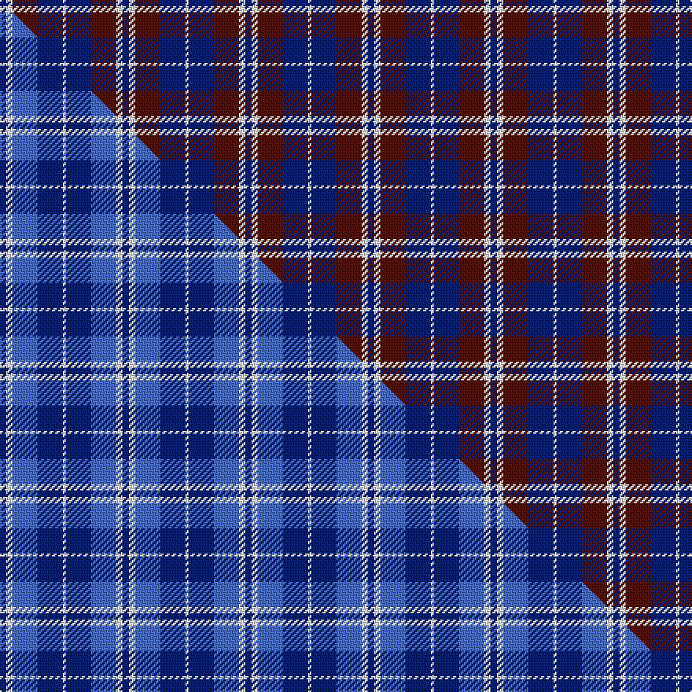

This is one **variant** — a specific cloth: this exact thread count and colourway, with its own
provenance below. It is one weaving of the [sett](/setts/db2w2dr8db8w1/) (the scale-free proportion — the
same cloth at any scale or shade), whose colour order is pattern [BWBBW](/stripes/bwbbw/).

Part of the [Laval](/tartans/l/la/laval/) tartan — the named design grouping this sett with its other cloths.

Sourced from house-of-tartan.  It is a [5 stripe tartan](/stripes/stripes5/).

Original link [http://www.house-of-tartan.scotland.net/house/TartanViewjs.asp?colr=Def&tnam=2120](http://www.house-of-tartan.scotland.net/house/TartanViewjs.asp?colr=Def&tnam=2120)

## Provenance

Earliest known date: 1988 "Purple (Wine red is sample) and blue (Dark blue) are the city's official colours. The symbolize the wealth and the quality of life and the development of a human city. White combines with blue and red to remind us of our French and British origins." (Guy Menard - Communication Services, Laval)

Dataset <small>— provenance for this record, inherited from the source manifest</small>

<dl class="dataset-prov">
<dt>source</dt><dd><a href="/sources/house-of-tartan/">House of Tartan</a></dd>
<dt>data captured from</dt><dd><a href="https://github.com/thetartan/tartan-database/blob/master/data/house-of-tartan/data.csv">https://github.com/thetartan/tartan-database/blob/master/data/house-of-tartan/data.csv</a></dd>
<dt>data date</dt><dd>1988 <small>(this record)</small></dd>
<dt>licence</dt><dd><a href="https://creativecommons.org/licenses/by-nc-nd/4.0/">CC BY-NC-ND 4.0</a></dd>
</dl>

Capture chain <small>— the hands this data passed through, oldest first; each capture carries its own licence</small>

<ol class="capture-chain">
<li><a href="http://www.house-of-tartan.scotland.net/">House of Tartan</a> <small>the weaver/retailer's database — the site is now offline; the URL is kept as the ultimate source's identity</small></li>
<li><a href="https://github.com/thetartan/tartan-database">thetartan/tartan-database</a> <small>2016-2017</small> · <a href="https://creativecommons.org/licenses/by-nc-nd/4.0/">CC BY-NC-ND 4.0</a> <small>Levko Kravets's frozen compilation — the capture we vendored, and where its CC licence text came from</small></li>
<li>this dictionary <small>captured 2026-06-10 · commit 5bf86c7566</small> <small>each re-capture is a git commit to data/sources</small></li>
</ol>

## Thread count
DB/4 W4 DR16 DB16 W/2

One full sett is **78 threads**.

## Palette
<table><thead><tr><th>Colour</th><th>Shade</th><th>OKLCh</th></tr></thead><tbody><tr><td>DB</td><td><code style="background-color:#082077;">#082077</code> <small style="color:#888">#082077</small></td><td><small style="color:#888">oklch(30.0% 0.149 265.1)</small></td></tr><tr><td>DR</td><td><code style="background-color:#55120C;">#55120C</code> <small style="color:#888">#55120C</small></td><td><small style="color:#888">oklch(30.0% 0.099 29.3)</small></td></tr><tr><td>W</td><td><code style="background-color:#F7F7F7;">#F7F7F7</code> <small style="color:#888">#F7F7F7</small></td><td><small style="color:#888">oklch(97.6% 0.000 89.9)</small></td></tr></tbody></table>

# Sample pattern

## Compared to the master

This cloth is one sett of its design; the master sett (the exemplar the design is anchored on) is below for comparison.

Its **ΔTartan distance** from the master is **1.40** — the same measure the nearest-tartans table ranks by (0 is identical; a re-scale of the same cloth is near 0, a recolour or a different proportion further).

<figure class="master-compare" style="margin:0">

this sett
master sett ★

<figcaption style="color:#888;font-size:smaller">One weave of this sett against the <a href="/setts/db2w2b8db8w1/">master sett ★</a>, split on the diagonal: a shared proportion runs seamlessly across it with only the shades shifting; a different proportion breaks on it.</figcaption>
</figure>

## Nearest tartan variants

The nearest existing variants by ΔTartan distance, with this cloth at the top so the swatches line up against it.

ΔTartan

Threads

Variant

Sett

—

78

<a href="/variants/s5/db2w2dr8db8w1~x2/">Laval (Tartan de..) District Tartan</a>

<a href="/ttd/edit/#slug=w32dr12db12w2db3~x2&amp;base=db2w2dr8db8w1~x2" title="compare in the TTD">0.69</a>

174

<a href="/variants/s5/w32dr12db12w2db3~x2/">Fraser Arisaid Red (Dance)</a>

<a href="/ttd/edit/#slug=db9dr12g9db5w2~x4&amp;base=db2w2dr8db8w1~x2" title="compare in the TTD">1.39</a>

252

<a href="/variants/s5/db9dr12g9db5w2~x4/">Battle of Prestonpans (1745) Heritage Trust, The</a>

<a href="/ttd/edit/#slug=db2w2b8db8w1~x2&amp;base=db2w2dr8db8w1~x2" title="compare in the TTD">1.40</a>

78

<a href="/variants/s5/db2w2b8db8w1~x2/">Laval (Tartan de..)</a>

<a href="/ttd/edit/#slug=db1n8w1db4dr8w1~x6&amp;base=db2w2dr8db8w1~x2" title="compare in the TTD">1.45</a>

264

<a href="/variants/s6/db1n8w1db4dr8w1~x6/">Little's Chauffeur Drive</a>

<a href="/ttd/edit/#slug=db2g7db7w1~x2&amp;base=db2w2dr8db8w1~x2" title="compare in the TTD">1.83</a>

62

<a href="/variants/s4/db2g7db7w1~x2/">Unidentified No 78</a>

<a href="/ttd/edit/#slug=db4w35db31w4~x2&amp;base=db2w2dr8db8w1~x2" title="compare in the TTD">1.83</a>

280

<a href="/variants/s4/db4w35db31w4~x2/">Lewis, Navy (Dance)</a>

<a href="/ttd/edit/#slug=w4db30g10dr25w2~x2&amp;base=db2w2dr8db8w1~x2" title="compare in the TTD">1.86</a>

272

<a href="/variants/s5/w4db30g10dr25w2~x2/">Highland Spring Dress (2004) (Corp)</a>

<a href="/ttd/edit/#slug=w3dr27w16db27ly3~x2&amp;base=db2w2dr8db8w1~x2" title="compare in the TTD">1.88</a>

292

<a href="/variants/s5/w3dr27w16db27ly3~x2/">Common Ground Dress (Fashion)</a>

<a href="/ttd/edit/#slug=y3db27w16dr27w3~x2&amp;base=db2w2dr8db8w1~x2" title="compare in the TTD">1.88</a>

292

<a href="/variants/s5/y3db27w16dr27w3~x2/">Common Ground (Dress)</a>

<a href="/ttd/edit/#slug=dr10db15g2db2w1db1w1~x4&amp;base=db2w2dr8db8w1~x2" title="compare in the TTD">1.93</a>

212

<a href="/variants/s7/dr10db15g2db2w1db1w1~x4/">Ikelman #4 (Personal)</a>

## Neighbour map

Every grey dot is one of 13621 variants placed by the first two principal components of the ΔTartan feature space (42% of its variance). Red is this tartan; blue dots are its nearest — click one to open its page. The map is a flat projection of a many-dimensional space — [how to read it](/posts/neighbourhood-maps/).

<svg viewBox="0 0 640 380" role="img" style="max-width:100%;height:auto;border:1px solid #e0e0e0;border-radius:4px;display:block" xmlns="http://www.w3.org/2000/svg"><image href="/nn/cloud.v1.png" width="640" height="380"/><a href="/variants/s5/w32dr12db12w2db3~x2/"><circle cx="342.8" cy="228.7" r="4" fill="#3465a4"><title>Fraser Arisaid Red (Dance)</title></circle></a><a href="/variants/s5/db9dr12g9db5w2~x4/"><circle cx="197.7" cy="299.0" r="4" fill="#3465a4"><title>Battle of Prestonpans (1745) Heritage Trust, The</title></circle></a><a href="/variants/s5/db2w2b8db8w1~x2/"><circle cx="316.6" cy="281.4" r="4" fill="#3465a4"><title>Laval (Tartan de..)</title></circle></a><a href="/variants/s6/db1n8w1db4dr8w1~x6/"><circle cx="253.9" cy="259.8" r="4" fill="#3465a4"><title>Little's Chauffeur Drive</title></circle></a><a href="/variants/s4/db2g7db7w1~x2/"><circle cx="323.1" cy="293.2" r="4" fill="#3465a4"><title>Unidentified No 78</title></circle></a><a href="/variants/s4/db4w35db31w4~x2/"><circle cx="367.0" cy="288.2" r="4" fill="#3465a4"><title>Lewis, Navy (Dance)</title></circle></a><a href="/variants/s5/w4db30g10dr25w2~x2/"><circle cx="268.4" cy="225.6" r="4" fill="#3465a4"><title>Highland Spring Dress (2004) (Corp)</title></circle></a><a href="/variants/s5/w3dr27w16db27ly3~x2/"><circle cx="216.0" cy="258.8" r="4" fill="#3465a4"><title>Common Ground Dress (Fashion)</title></circle></a><a href="/variants/s5/y3db27w16dr27w3~x2/"><circle cx="194.1" cy="243.6" r="4" fill="#3465a4"><title>Common Ground (Dress)</title></circle></a><a href="/variants/s7/dr10db15g2db2w1db1w1~x4/"><circle cx="371.1" cy="187.3" r="4" fill="#3465a4"><title>Ikelman #4 (Personal)</title></circle></a><circle cx="309.2" cy="273.0" r="5" fill="#c00000"/><text x="320" y="376" text-anchor="middle" font-size="11" fill="#999">ground</text><text x="11" y="190" text-anchor="middle" font-size="11" fill="#999" transform="rotate(-90 11 190)">complexity</text></svg>

ID: /variants/s5/db2w2dr8db8w1~x2/
