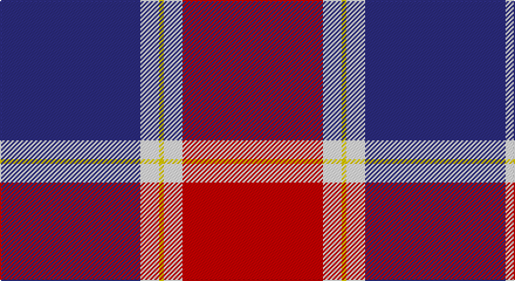

This page is one **sett** — a single exact thread-count. It belongs to the [tartan](/setts/db30w4ly1w4r30/)
(the same proportion at any scale), whose colour order is pattern [BWYWR](/stripes/bwywr/).

Sourced from tartans-authority.  It is a [5 stripe tartan](/stripes/stripes5/).

Original link http://www.tartansauthority.com/tartan-ferret/display/10660/

## Provenance

Earliest known date: 16/07/2012 The colours of this tartan are taken from the flag of the Philippines. Colours: white represents peace and purity; yellow represents independence from Spain; blue represents patriotism and justice; red represents the blood spilt for freedom and independence. Developed for weaving by A Trivett on behalf of the Scottish Tartans Authority.

2 attestations — the source records this cloth was collapsed from (oldest owns this page)

<ul>
<li>16/07/2012 — Philippine Heritage (Corporate) (tartans-authority, <a href="http://www.tartansauthority.com/tartan-ferret/display/10660/">record</a>)</li>
<li>undated — Philippine Heritage Corporate Tartan (house-of-tartan, <a href="http://www.house-of-tartan.scotland.net/house/TartanViewjs.asp?colr=Def&tnam=10660">record</a>)</li>
</ul>

## Register references

External register numbers recorded for this tartan.

- Scottish Register of Tartans: [10660](https://www.tartanregister.gov.uk/tartanDetails?ref=10660)
- Scottish Tartans Authority (ITI): 10660

## Thread count
DB/120 W16 Y4 W16 R/120

One full sett is **312 threads**.

## Palette

Palette: <strong>Tartan Register</strong>
<table><thead><tr><th>Colour</th><th>Threads</th><th>Shade</th><th>Base</th><th>OKLCh</th></tr></thead><tbody><tr><td>DB/</td><td style="text-align:right;font-variant-numeric:tabular-nums">120</td><td><code style="background-color:#2C2C80;">#2C2C80</code> <small style="color:#888">#2C2C80</small></td><td>B <code style="background-color:#2A418A;">#2A418A</code></td><td><small style="color:#888">oklch(35.0% 0.138 276.6)</small></td></tr><tr><td>W</td><td style="text-align:right;font-variant-numeric:tabular-nums">16</td><td><code style="background-color:#FCFCFC;">#FCFCFC</code> <small style="color:#888">#FCFCFC</small></td><td>W <code style="background-color:#F7F7F7;">#F7F7F7</code></td><td><small style="color:#888">oklch(99.1% 0.000 89.9)</small></td></tr><tr><td>Y</td><td style="text-align:right;font-variant-numeric:tabular-nums">4</td><td><code style="background-color:#FCCC00;">#FCCC00</code> <small style="color:#888">#FCCC00</small></td><td>Y <code style="background-color:#F2BF00;">#F2BF00</code></td><td><small style="color:#888">oklch(86.2% 0.176 91.5)</small></td></tr><tr><td>W</td><td style="text-align:right;font-variant-numeric:tabular-nums">16</td><td><code style="background-color:#FCFCFC;">#FCFCFC</code> <small style="color:#888">#FCFCFC</small></td><td>W <code style="background-color:#F7F7F7;">#F7F7F7</code></td><td><small style="color:#888">oklch(99.1% 0.000 89.9)</small></td></tr><tr><td>R/</td><td style="text-align:right;font-variant-numeric:tabular-nums">120</td><td><code style="background-color:#C80000;">#C80000</code> <small style="color:#888">#C80000</small></td><td>R <code style="background-color:#CC0000;">#CC0000</code></td><td><small style="color:#888">oklch(52.3% 0.215 29.2)</small></td></tr></tbody></table>

# Sample pattern

## Nearest tartans

The nearest existing variants by ΔTartan distance, with this tartan at the top so the swatches line up against it.

ΔTartan

Tartan

Sett

—

<a href="/ttd/edit/#slug=db30w4ly1w4r30~x4">Philippine Heritage (Corporate)</a> <a class="nn-out" href="/variants/s5/db30w4ly1w4r30~x4/" title="open its dictionary page">↗</a>

0.31

<a href="/ttd/edit/#slug=db30w4lo1w4r30~x4&amp;base=db30w4ly1w4r30~x4">Philippine Heritage</a> <a class="nn-out" href="/variants/s5/db30w4lo1w4r30~x4/" title="open its dictionary page">↗</a>

1.26

<a href="/ttd/edit/#slug=m3w1m20k8w8g2~x4&amp;base=db30w4ly1w4r30~x4">Nisbet Dress Rose (Dance)</a> <a class="nn-out" href="/variants/s6/m3w1m20k8w8g2~x4/" title="open its dictionary page">↗</a>

1.27

<a href="/ttd/edit/#slug=db1r16db6ly4db6w1~x4&amp;base=db30w4ly1w4r30~x4">Superfast Ferries (Corporate)</a> <a class="nn-out" href="/variants/s6/db1r16db6ly4db6w1~x4/" title="open its dictionary page">↗</a>

1.30

<a href="/ttd/edit/#slug=db5w4r1db26r26w1r8w5k1~x2&amp;base=db30w4ly1w4r30~x4">Boring and Dull</a> <a class="nn-out" href="/variants/s9/db5w4r1db26r26w1r8w5k1~x2/" title="open its dictionary page">↗</a>

1.32

<a href="/ttd/edit/#slug=db5w4r1db26r25w1r8w5dt1~x2&amp;base=db30w4ly1w4r30~x4">Boring and Dull</a> <a class="nn-out" href="/variants/s9/db5w4r1db26r25w1r8w5dt1~x2/" title="open its dictionary page">↗</a>

1.32

<a href="/ttd/edit/#slug=k4b32r30b2w5k2~x2&amp;base=db30w4ly1w4r30~x4">Masai Shuka 17 (Artefact)</a> <a class="nn-out" href="/variants/s6/k4b32r30b2w5k2~x2/" title="open its dictionary page">↗</a>

1.42

<a href="/ttd/edit/#slug=dg2r1db16r16db1ly2~x2&amp;base=db30w4ly1w4r30~x4">Galloway Dress (Yellow Line)</a> <a class="nn-out" href="/variants/s6/dg2r1db16r16db1ly2~x2/" title="open its dictionary page">↗</a>

1.48

<a href="/ttd/edit/#slug=lb3dg15db18r30db1r2~x2&amp;base=db30w4ly1w4r30~x4">Ruthven</a> <a class="nn-out" href="/variants/s6/lb3dg15db18r30db1r2~x2/" title="open its dictionary page">↗</a>

1.55

<a href="/ttd/edit/#slug=r4db36ri35g2ri2g8w4~x2&amp;base=db30w4ly1w4r30~x4">Cherry, John S (Personal)</a> <a class="nn-out" href="/variants/s7/r4db36ri35g2ri2g8w4~x2/" title="open its dictionary page">↗</a>

1.56

<a href="/ttd/edit/#slug=r40db15k2dp1db15k6~x2&amp;base=db30w4ly1w4r30~x4">Double Elvis Gallery (Corporate)</a> <a class="nn-out" href="/variants/s6/r40db15k2dp1db15k6~x2/" title="open its dictionary page">↗</a>

## Neighbour map

Every grey dot is one of 14360 variants placed by the first two principal components of the ΔTartan feature space (44% of its variance). Red is this tartan; blue dots are its nearest — click one to open its page.

<svg viewBox="0 0 640 380" role="img" style="max-width:100%;height:auto;border:1px solid #e0e0e0;border-radius:4px;display:block" xmlns="http://www.w3.org/2000/svg"><image href="/nn/cloud.v1.png" width="640" height="380"/><a href="/variants/s5/db30w4lo1w4r30~x4/"><circle cx="300.6" cy="151.2" r="4" fill="#3465a4"><title>Philippine Heritage</title></circle></a><a href="/variants/s6/m3w1m20k8w8g2~x4/"><circle cx="300.2" cy="152.8" r="4" fill="#3465a4"><title>Nisbet Dress Rose (Dance)</title></circle></a><a href="/variants/s6/db1r16db6ly4db6w1~x4/"><circle cx="278.6" cy="169.1" r="4" fill="#3465a4"><title>Superfast Ferries (Corporate)</title></circle></a><a href="/variants/s9/db5w4r1db26r26w1r8w5k1~x2/"><circle cx="288.4" cy="114.7" r="4" fill="#3465a4"><title>Boring and Dull</title></circle></a><a href="/variants/s9/db5w4r1db26r25w1r8w5dt1~x2/"><circle cx="283.6" cy="112.7" r="4" fill="#3465a4"><title>Boring and Dull</title></circle></a><a href="/variants/s6/k4b32r30b2w5k2~x2/"><circle cx="284.0" cy="163.1" r="4" fill="#3465a4"><title>Masai Shuka 17 (Artefact)</title></circle></a><a href="/variants/s6/dg2r1db16r16db1ly2~x2/"><circle cx="307.5" cy="167.7" r="4" fill="#3465a4"><title>Galloway Dress (Yellow Line)</title></circle></a><a href="/variants/s6/lb3dg15db18r30db1r2~x2/"><circle cx="282.2" cy="151.1" r="4" fill="#3465a4"><title>Ruthven</title></circle></a><a href="/variants/s7/r4db36ri35g2ri2g8w4~x2/"><circle cx="220.2" cy="121.6" r="4" fill="#3465a4"><title>Cherry, John S (Personal)</title></circle></a><a href="/variants/s6/r40db15k2dp1db15k6~x2/"><circle cx="367.4" cy="144.5" r="4" fill="#3465a4"><title>Double Elvis Gallery (Corporate)</title></circle></a><circle cx="291.6" cy="146.4" r="5" fill="#c00000"/></svg>

ID: /variants/s5/db30w4ly1w4r30~x4/
