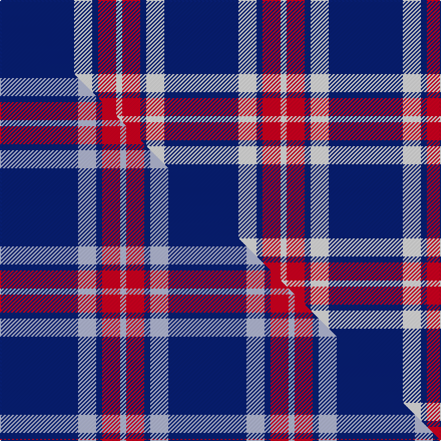

This is one **variant** — a specific cloth: this exact thread count and colourway, with its own
provenance below. It is one weaving of the [sett](/setts/db37w9db3r9w3/) (the scale-free proportion — the
same cloth at any scale or shade), whose colour order is pattern [BWBRW](/stripes/bwbrw/).

Part of the [Glen Moy](/tartans/glen-moy-2/) tartan — the named design grouping this sett with its other cloths.

Sourced from house-of-tartan.  It is a [5 stripe tartan](/stripes/stripes5/).

Original link [http://www.house-of-tartan.scotland.net/house/TartanViewjs.asp?colr=Def&tnam=635](http://www.house-of-tartan.scotland.net/house/TartanViewjs.asp?colr=Def&tnam=635)

## Provenance

Earliest known date: pre 1992 Its mainly Sheep farming in Glen Moy. Off the beaten track, its a very quiet area of the Angus glens close to Cortachy castle and great for walking if you like it to yourself! Its also close to Glen Clova which is the busiest glen around here with some fantastic mountains for walking and taking photos.

2 attestations — the source records this cloth was collapsed from (oldest owns this page)

<ul>
<li>pre 1992 — Glen Moy Trade Tartan (house-of-tartan, <a href="http://www.house-of-tartan.scotland.net/house/TartanViewjs.asp?colr=Def&tnam=635">record</a>) </li>
<li>undated — Glen Moy (weddslist, <a href="http://www.weddslist.com/cgi-bin/tartans/pg.pl?source=sts">record</a>) </li>
</ul>

Dataset <small>— provenance for this record, inherited from the source manifest</small>

<dl class="dataset-prov">
<dt>source</dt><dd><a href="/sources/house-of-tartan/">House of Tartan</a></dd>
<dt>data captured from</dt><dd><a href="https://github.com/thetartan/tartan-database/blob/master/data/house-of-tartan/data.csv">https://github.com/thetartan/tartan-database/blob/master/data/house-of-tartan/data.csv</a></dd>
<dt>data date</dt><dd>pre 1992 <small>(this record)</small></dd>
<dt>licence</dt><dd><a href="https://creativecommons.org/licenses/by-nc-nd/4.0/">CC BY-NC-ND 4.0</a></dd>
</dl>

Capture chain <small>— the hands this data passed through, oldest first; each capture carries its own licence</small>

<ol class="capture-chain">
<li><a href="http://www.house-of-tartan.scotland.net/">House of Tartan</a> <small>the weaver/retailer's database — the site is now offline; the URL is kept as the ultimate source's identity</small></li>
<li><a href="https://github.com/thetartan/tartan-database">thetartan/tartan-database</a> <small>2016-2017</small> · <a href="https://creativecommons.org/licenses/by-nc-nd/4.0/">CC BY-NC-ND 4.0</a> <small>Levko Kravets's frozen compilation — the capture we vendored, and where its CC licence text came from</small></li>
<li>this dictionary <small>captured 2026-06-10 · commit 5bf86c7566</small> <small>each re-capture is a git commit to data/sources</small></li>
</ol>

## Thread count
DB/74 W18 DB6 R18 W/6

One full sett is **164 threads**.

## Palette
<table><thead><tr><th>Colour</th><th>Shade</th><th>OKLCh</th></tr></thead><tbody><tr><td>DB</td><td><code style="background-color:#082077;">#082077</code> <small style="color:#888">#082077</small></td><td><small style="color:#888">oklch(30.0% 0.149 265.1)</small></td></tr><tr><td>W</td><td><code style="background-color:#F7F7F7;">#F7F7F7</code> <small style="color:#888">#F7F7F7</small></td><td><small style="color:#888">oklch(97.6% 0.000 89.9)</small></td></tr><tr><td>R</td><td><code style="background-color:#D60020;">#D60020</code> <small style="color:#888">#D60020</small></td><td><small style="color:#888">oklch(55.2% 0.224 25.5)</small></td></tr></tbody></table>

# Sample pattern

## Compared to the master

This cloth is one sett of its design; the master sett (the exemplar the design is anchored on) is below for comparison.

Its **ΔTartan distance** from the master is **2.35** — the same measure the nearest-tartans table ranks by (0 is identical; a re-scale of the same cloth is near 0, a recolour or a different proportion further).

<figure class="master-compare" style="margin:0">

this sett
master sett ★

<figcaption style="color:#888;font-size:smaller">One weave of this sett against the <a href="/setts/db13lb3db1r3lb1/">master sett ★</a>, split on the diagonal: a shared proportion runs seamlessly across it with only the shades shifting; a different proportion breaks on it.</figcaption>
</figure>

## Nearest tartan variants

The nearest existing variants by ΔTartan distance, with this cloth at the top so the swatches line up against it.

ΔTartan

Threads

Variant

Sett

—

164

<a href="/variants/s5/db37w9db3r9w3~x2/">Glen Moy Trade Tartan</a>

<a href="/ttd/edit/#slug=w4k26lb26k2lb5w2~x2&amp;base=db37w9db3r9w3~x2" title="compare in the TTD">1.48</a>

248

<a href="/variants/s6/w4k26lb26k2lb5w2~x2/">Indian Pipe Band (Corporate)</a>

<a href="/ttd/edit/#slug=db30lb2k9w3db6w4k3lb6~x2&amp;base=db37w9db3r9w3~x2" title="compare in the TTD">1.59</a>

180

<a href="/variants/s8/db30lb2k9w3db6w4k3lb6~x2/">Detroit Lions</a>

<a href="/ttd/edit/#slug=db40w8db25w14db8y4~x2&amp;base=db37w9db3r9w3~x2" title="compare in the TTD">1.76</a>

308

<a href="/variants/s6/db40w8db25w14db8y4~x2/">Auchterlonie (Personal)</a>

<a href="/ttd/edit/#slug=db35w4db10dr3r3dr3~x4&amp;base=db37w9db3r9w3~x2" title="compare in the TTD">1.88</a>

312

<a href="/variants/s6/db35w4db10dr3r3dr3~x4/">Steffen, Markus (Personal)</a>

<a href="/ttd/edit/#slug=w5db16w5db16w33r3~x2&amp;base=db37w9db3r9w3~x2" title="compare in the TTD">1.95</a>

296

<a href="/variants/s6/w5db16w5db16w33r3~x2/">Buchanan Dress, Blue (Dance)</a>

<a href="/ttd/edit/#slug=b40k4b12k21b17w4~x2&amp;base=db37w9db3r9w3~x2" title="compare in the TTD">1.95</a>

304

<a href="/variants/s6/b40k4b12k21b17w4~x2/">Granger</a>

<a href="/ttd/edit/#slug=w11db20y3db8~x2&amp;base=db37w9db3r9w3~x2" title="compare in the TTD">1.97</a>

130

<a href="/variants/s4/w11db20y3db8~x2/">Lucard, Stéphane (Personal)</a>

<a href="/ttd/edit/#slug=w6db2w3db2g2db20r1~x2&amp;base=db37w9db3r9w3~x2" title="compare in the TTD">2.00</a>

130

<a href="/variants/s7/w6db2w3db2g2db20r1~x2/">Gonzaga University’s True Blue and White</a>

<a href="/ttd/edit/#slug=lb12y2lb1k5lb4k2~x4&amp;base=db37w9db3r9w3~x2" title="compare in the TTD">2.04</a>

152

<a href="/variants/s6/lb12y2lb1k5lb4k2~x4/">Rea</a>

<a href="/ttd/edit/#slug=db25r8db3r4k1w3~x2&amp;base=db37w9db3r9w3~x2" title="compare in the TTD">2.18</a>

120

<a href="/variants/s6/db25r8db3r4k1w3~x2/">Clan Gregor Tartan</a>

## Neighbour map

Every grey dot is one of 13621 variants placed by the first two principal components of the ΔTartan feature space (42% of its variance). Red is this tartan; blue dots are its nearest — click one to open its page.

<svg viewBox="0 0 640 380" role="img" style="max-width:100%;height:auto;border:1px solid #e0e0e0;border-radius:4px;display:block" xmlns="http://www.w3.org/2000/svg"><image href="/nn/cloud.v1.png" width="640" height="380"/><a href="/variants/s6/w4k26lb26k2lb5w2~x2/"><circle cx="255.2" cy="182.1" r="4" fill="#3465a4"><title>Indian Pipe Band (Corporate)</title></circle></a><a href="/variants/s8/db30lb2k9w3db6w4k3lb6~x2/"><circle cx="273.8" cy="148.2" r="4" fill="#3465a4"><title>Detroit Lions</title></circle></a><a href="/variants/s6/db40w8db25w14db8y4~x2/"><circle cx="421.8" cy="236.5" r="4" fill="#3465a4"><title>Auchterlonie (Personal)</title></circle></a><a href="/variants/s6/db35w4db10dr3r3dr3~x4/"><circle cx="475.9" cy="178.0" r="4" fill="#3465a4"><title>Steffen, Markus (Personal)</title></circle></a><a href="/variants/s6/w5db16w5db16w33r3~x2/"><circle cx="306.8" cy="221.7" r="4" fill="#3465a4"><title>Buchanan Dress, Blue (Dance)</title></circle></a><a href="/variants/s6/b40k4b12k21b17w4~x2/"><circle cx="362.0" cy="209.8" r="4" fill="#3465a4"><title>Granger</title></circle></a><a href="/variants/s4/w11db20y3db8~x2/"><circle cx="354.2" cy="285.1" r="4" fill="#3465a4"><title>Lucard, Stéphane (Personal)</title></circle></a><a href="/variants/s7/w6db2w3db2g2db20r1~x2/"><circle cx="374.4" cy="143.5" r="4" fill="#3465a4"><title>Gonzaga University’s True Blue and White</title></circle></a><a href="/variants/s6/lb12y2lb1k5lb4k2~x4/"><circle cx="331.1" cy="194.9" r="4" fill="#3465a4"><title>Rea</title></circle></a><a href="/variants/s6/db25r8db3r4k1w3~x2/"><circle cx="359.8" cy="130.1" r="4" fill="#3465a4"><title>Clan Gregor Tartan</title></circle></a><circle cx="372.7" cy="198.1" r="5" fill="#c00000"/><text x="320" y="376" text-anchor="middle" font-size="11" fill="#999">ground</text><text x="11" y="190" text-anchor="middle" font-size="11" fill="#999" transform="rotate(-90 11 190)">complexity</text></svg>

ID: /variants/s5/db37w9db3r9w3~x2/
