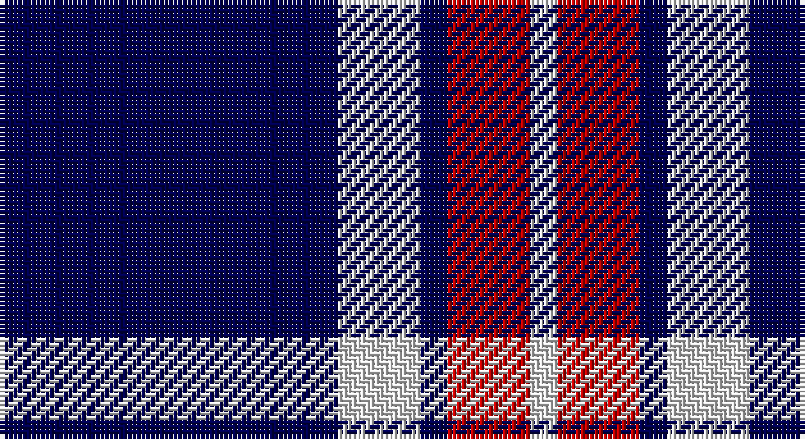

This page is one **sett** — a single exact thread-count. It belongs to the [tartan](/setts/db37w9db3r9w3/)
(the same proportion at any scale), whose colour order is pattern [BWBRW](/stripes/bwbrw/).

Part of the [Glen Moy](/tartans/glen-moy/) tartan — the named design grouping this sett with its other cloths.

Sourced from weddslist.  It is a [5 stripe tartan](/stripes/stripes5/).

Original link http://www.weddslist.com/cgi-bin/tartans/pg.pl?source=sts

## Provenance

Earliest known date: pre 1992 Its mainly Sheep farming in Glen Moy. Off the beaten track, its a very quiet area of the Angus glens close to Cortachy castle and great for walking if you like it to yourself! Its also close to Glen Clova which is the busiest glen around here with some fantastic mountains for walking and taking photos.

## Also known as

This cloth is also recorded under:

- Glen Moy #2
- Glen Moy 1986

2 attestations — the source records this cloth was collapsed from (oldest owns this page)

<ul>
<li>undated — Glen Moy (weddslist, <a href="http://www.weddslist.com/cgi-bin/tartans/pg.pl?source=sts">record</a>)</li>
<li>undated — Glen Moy Trade Tartan (house-of-tartan, <a href="http://www.house-of-tartan.scotland.net/house/TartanViewjs.asp?colr=Def&tnam=635">record</a>)</li>
</ul>

## Thread count
DB/74 LN18 DB6 R18 LN/6

One full sett is **164 threads**.

## Palette

Palette: <strong>Tartan Dictionary</strong> <small style="color:#888">(1 of 3 colours)</small>
<table><thead><tr><th>Colour</th><th>Threads</th><th>Shade</th><th>Base</th><th>OKLCh</th></tr></thead><tbody><tr><td>DB/</td><td style="text-align:right;font-variant-numeric:tabular-nums">74</td><td><code style="background-color:#000050;">#000050</code> <small style="color:#888">#000050</small></td><td>B <code style="background-color:#2A418A;">#2A418A</code></td><td><small style="color:#888">oklch(19.5% 0.135 264.1)</small></td></tr><tr><td>LN</td><td style="text-align:right;font-variant-numeric:tabular-nums">18</td><td><code style="background-color:#E0E0E0;">#E0E0E0</code> <small style="color:#888">#E0E0E0</small></td><td>W <code style="background-color:#F7F7F7;">#F7F7F7</code></td><td><small style="color:#888">oklch(90.7% 0.000 89.9)</small></td></tr><tr><td>DB</td><td style="text-align:right;font-variant-numeric:tabular-nums">6</td><td><code style="background-color:#000050;">#000050</code> <small style="color:#888">#000050</small></td><td>B <code style="background-color:#2A418A;">#2A418A</code></td><td><small style="color:#888">oklch(19.5% 0.135 264.1)</small></td></tr><tr><td>R</td><td style="text-align:right;font-variant-numeric:tabular-nums">18</td><td><code style="background-color:#C00000;">#C00000</code> <small style="color:#888">#C00000</small></td><td>R <code style="background-color:#CC0000;">#CC0000</code></td><td><small style="color:#888">oklch(50.7% 0.208 29.2)</small></td></tr><tr><td>LN/</td><td style="text-align:right;font-variant-numeric:tabular-nums">6</td><td><code style="background-color:#E0E0E0;">#E0E0E0</code> <small style="color:#888">#E0E0E0</small></td><td>W <code style="background-color:#F7F7F7;">#F7F7F7</code></td><td><small style="color:#888">oklch(90.7% 0.000 89.9)</small></td></tr></tbody></table>

# Sample pattern

## Compared to the master

This cloth is one sett of its design; the master sett (the exemplar the design is anchored on) is below for comparison.

<figure style="margin:0"><figcaption style="color:#888;font-size:smaller">this sett</figcaption></figure>
<figure style="margin:0"><figcaption style="color:#888;font-size:smaller"><a href="/setts/db13lb3db1r3lb1/">master sett →</a></figcaption></figure>

## Nearest tartans

The nearest existing variants by ΔTartan distance, with this tartan at the top so the swatches line up against it.

ΔTartan

Tartan

Sett

—

<a href="/ttd/edit/#slug=db37w9db3r9w3~x2">Glen Moy</a> <a class="nn-out" href="/variants/s5/db37w9db3r9w3~x2/" title="open its dictionary page">↗</a>

0.83

<a href="/ttd/edit/#slug=db13lb3db1r3lb1~x6&amp;base=db37w9db3r9w3~x2">Glen Moy</a> <a class="nn-out" href="/variants/s5/db13lb3db1r3lb1~x6/" title="open its dictionary page">↗</a>

1.08

<a href="/ttd/edit/#slug=lr3k3lr3k10r1~x6&amp;base=db37w9db3r9w3~x2">Burberry Blue</a> <a class="nn-out" href="/variants/s5/lr3k3lr3k10r1~x6/" title="open its dictionary page">↗</a>

1.22

<a href="/ttd/edit/#slug=w8k16w2db2w1k1~x4&amp;base=db37w9db3r9w3~x2">Ikelman No 1</a> <a class="nn-out" href="/variants/s6/w8k16w2db2w1k1~x4/" title="open its dictionary page">↗</a>

1.30

<a href="/ttd/edit/#slug=t50k4t12k23lo4k4~x2&amp;base=db37w9db3r9w3~x2">Sligo Irish County Tartan</a> <a class="nn-out" href="/variants/s6/t50k4t12k23lo4k4~x2/" title="open its dictionary page">↗</a>

1.38

<a href="/ttd/edit/#slug=db12w1r3w1r3w1db6~x4&amp;base=db37w9db3r9w3~x2">BC Corps of Commissionaires</a> <a class="nn-out" href="/variants/s7/db12w1r3w1r3w1db6~x4/" title="open its dictionary page">↗</a>

1.49

<a href="/ttd/edit/#slug=db8r1w1r1k1~x8&amp;base=db37w9db3r9w3~x2">Laing of Archiestown</a> <a class="nn-out" href="/variants/s5/db8r1w1r1k1~x8/" title="open its dictionary page">↗</a>

1.54

<a href="/ttd/edit/#slug=db33w7db5r2db5w2r13db3~x2&amp;base=db37w9db3r9w3~x2">Americana - 1978 (Fashion)</a> <a class="nn-out" href="/variants/s8/db33w7db5r2db5w2r13db3~x2/" title="open its dictionary page">↗</a>

1.55

<a href="/variants/s6/db60ly6db11r25~x2/">South Australian Pipes &amp; Drums (Corp</a>

1.55

<a href="/ttd/edit/#slug=r4db32k15w2~x2&amp;base=db37w9db3r9w3~x2">Scottish Nuclear</a> <a class="nn-out" href="/variants/s4/r4db32k15w2~x2/" title="open its dictionary page">↗</a>

1.58

<a href="/ttd/edit/#slug=lo8w3db40k12w3lo3~x2&amp;base=db37w9db3r9w3~x2">Wolverines (Corporate)</a> <a class="nn-out" href="/variants/s6/lo8w3db40k12w3lo3~x2/" title="open its dictionary page">↗</a>

## Neighbour map

Every grey dot is one of 14360 variants placed by the first two principal components of the ΔTartan feature space (44% of its variance). Red is this tartan; blue dots are its nearest — click one to open its page.

<svg viewBox="0 0 640 380" role="img" style="max-width:100%;height:auto;border:1px solid #e0e0e0;border-radius:4px;display:block" xmlns="http://www.w3.org/2000/svg"><image href="/nn/cloud.v1.png" width="640" height="380"/><a href="/variants/s5/db13lb3db1r3lb1~x6/"><circle cx="394.6" cy="201.9" r="4" fill="#3465a4"><title>Glen Moy</title></circle></a><a href="/variants/s5/lr3k3lr3k10r1~x6/"><circle cx="351.1" cy="237.5" r="4" fill="#3465a4"><title>Burberry Blue</title></circle></a><a href="/variants/s6/w8k16w2db2w1k1~x4/"><circle cx="325.0" cy="176.5" r="4" fill="#3465a4"><title>Ikelman No 1</title></circle></a><a href="/variants/s6/t50k4t12k23lo4k4~x2/"><circle cx="369.2" cy="198.3" r="4" fill="#3465a4"><title>Sligo Irish County Tartan</title></circle></a><a href="/variants/s7/db12w1r3w1r3w1db6~x4/"><circle cx="395.0" cy="207.1" r="4" fill="#3465a4"><title>BC Corps of Commissionaires</title></circle></a><a href="/variants/s5/db8r1w1r1k1~x8/"><circle cx="369.2" cy="199.8" r="4" fill="#3465a4"><title>Laing of Archiestown</title></circle></a><a href="/variants/s8/db33w7db5r2db5w2r13db3~x2/"><circle cx="394.0" cy="168.0" r="4" fill="#3465a4"><title>Americana - 1978 (Fashion)</title></circle></a><a href="/variants/s6/db60ly6db11r25~x2/"><circle cx="409.5" cy="215.7" r="4" fill="#3465a4"><title>South Australian Pipes &amp; Drums (Corp</title></circle></a><a href="/variants/s4/r4db32k15w2~x2/"><circle cx="345.8" cy="209.9" r="4" fill="#3465a4"><title>Scottish Nuclear</title></circle></a><a href="/variants/s6/lo8w3db40k12w3lo3~x2/"><circle cx="306.2" cy="167.4" r="4" fill="#3465a4"><title>Wolverines (Corporate)</title></circle></a><circle cx="368.2" cy="202.6" r="5" fill="#c00000"/></svg>

ID: /variants/s5/db37w9db3r9w3~x2/
