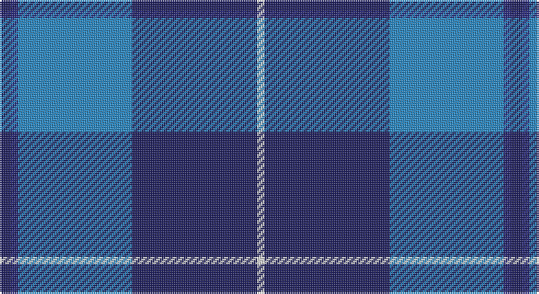

This page is one **sett** — a single exact thread-count. It belongs to the [tartan](/setts/db3dbi2t31db34w2/)
(the same proportion at any scale), whose colour order is pattern [BBBBW](/stripes/bbbbw/).

Sourced from tartans-authority.  It is a [5 stripe tartan](/stripes/stripes5/).

Original link http://www.tartansauthority.com/tartan-ferret/display/4986/

2 attestations — the source records this cloth was collapsed from (oldest owns this page)

<ul>
<li>1998 — Gilt Edge (Corporate) (tartans-authority, <a href="http://www.tartansauthority.com/tartan-ferret/display/4986/">record</a>)</li>
<li>01/02/2001 — Gilt Edge (register-of-tartans, <a href="https://www.tartanregister.gov.uk/tartanDetails.aspx?ref=1346">record</a>)</li>
</ul>

## Register references

External register numbers recorded for this tartan.

- Scottish Register of Tartans: [1346](https://www.tartanregister.gov.uk/tartanDetails.aspx?ref=1346)
- Scottish Tartans Authority (ITI): 4986
- Scottish Tartans World Register: 2817

## Thread count
DB/6 DBa4 B62 DB68 LN/4

One full sett is **278 threads**.

## Palette

Palette: <strong>Tartan Register</strong>
<table><thead><tr><th>Colour</th><th>Threads</th><th>Shade</th><th>Base</th><th>OKLCh</th></tr></thead><tbody><tr><td>DB/</td><td style="text-align:right;font-variant-numeric:tabular-nums">6</td><td><code style="background-color:#202060;">#202060</code> <small style="color:#888">#202060</small></td><td>B <code style="background-color:#2A418A;">#2A418A</code></td><td><small style="color:#888">oklch(28.9% 0.111 276.9)</small></td></tr><tr><td>DBa</td><td style="text-align:right;font-variant-numeric:tabular-nums">4</td><td><code style="background-color:#2C2C80;">#2C2C80</code> <small style="color:#888">#2C2C80</small></td><td>B <code style="background-color:#2A418A;">#2A418A</code></td><td><small style="color:#888">oklch(35.0% 0.138 276.6)</small></td></tr><tr><td>B</td><td style="text-align:right;font-variant-numeric:tabular-nums">62</td><td><code style="background-color:#2888C4;">#2888C4</code> <small style="color:#888">#2888C4</small></td><td>B <code style="background-color:#2A418A;">#2A418A</code></td><td><small style="color:#888">oklch(60.1% 0.125 241.5)</small></td></tr><tr><td>DB</td><td style="text-align:right;font-variant-numeric:tabular-nums">68</td><td><code style="background-color:#202060;">#202060</code> <small style="color:#888">#202060</small></td><td>B <code style="background-color:#2A418A;">#2A418A</code></td><td><small style="color:#888">oklch(28.9% 0.111 276.9)</small></td></tr><tr><td>LN/</td><td style="text-align:right;font-variant-numeric:tabular-nums">4</td><td><code style="background-color:#E0E0E0;">#E0E0E0</code> <small style="color:#888">#E0E0E0</small></td><td>W <code style="background-color:#F7F7F7;">#F7F7F7</code></td><td><small style="color:#888">oklch(90.7% 0.000 89.9)</small></td></tr></tbody></table>

# Sample pattern

## Nearest tartans

The nearest existing variants by ΔTartan distance, with this tartan at the top so the swatches line up against it.

ΔTartan

Tartan

Sett

—

<a href="/ttd/edit/#slug=db3dbi2t31db34w2~x2">Gilt Edge (Corporate)</a> <a class="nn-out" href="/variants/s5/db3dbi2t31db34w2~x2/" title="open its dictionary page">↗</a>

0.70

<a href="/ttd/edit/#slug=db4r1db18b18w1b4~x4&amp;base=db3dbi2t31db34w2~x2">Ewell Castle School</a> <a class="nn-out" href="/variants/s6/db4r1db18b18w1b4~x4/" title="open its dictionary page">↗</a>

1.01

<a href="/ttd/edit/#slug=w4t34db60ly3~x2&amp;base=db3dbi2t31db34w2~x2">MacKerral Family Tartan</a> <a class="nn-out" href="/variants/s4/w4t34db60ly3~x2/" title="open its dictionary page">↗</a>

1.07

<a href="/ttd/edit/#slug=w4t28db49ly3~x2&amp;base=db3dbi2t31db34w2~x2">McKerrell of Hillhouse</a> <a class="nn-out" href="/variants/s4/w4t28db49ly3~x2/" title="open its dictionary page">↗</a>

1.09

<a href="/ttd/edit/#slug=db6lb2db2lb3db16b26r2~x2&amp;base=db3dbi2t31db34w2~x2">Federal Bureau of Investigation</a> <a class="nn-out" href="/variants/s7/db6lb2db2lb3db16b26r2~x2/" title="open its dictionary page">↗</a>

1.21

<a href="/ttd/edit/#slug=b30k12dt12k2w3~x2&amp;base=db3dbi2t31db34w2~x2">MacNeil - 1994 (Personal)</a> <a class="nn-out" href="/variants/s5/b30k12dt12k2w3~x2/" title="open its dictionary page">↗</a>

1.26

<a href="/ttd/edit/#slug=b52db28w5db3w2db10~x2&amp;base=db3dbi2t31db34w2~x2">St. Andrews, Earl of (District)</a> <a class="nn-out" href="/variants/s6/b52db28w5db3w2db10~x2/" title="open its dictionary page">↗</a>

1.30

<a href="/ttd/edit/#slug=r2db19n6b44lb2~x2&amp;base=db3dbi2t31db34w2~x2">World Fed. of Bldg Contractors (Corp</a> <a class="nn-out" href="/variants/s5/r2db19n6b44lb2~x2/" title="open its dictionary page">↗</a>

1.36

<a href="/ttd/edit/#slug=db7r3db26t2db2t26ly4~x2&amp;base=db3dbi2t31db34w2~x2">Int. Police Association (Official)</a> <a class="nn-out" href="/variants/s7/db7r3db26t2db2t26ly4~x2/" title="open its dictionary page">↗</a>

1.37

<a href="/ttd/edit/#slug=b18k2b4k6dp12lo1~x2&amp;base=db3dbi2t31db34w2~x2">Joker, The</a> <a class="nn-out" href="/variants/s6/b18k2b4k6dp12lo1~x2/" title="open its dictionary page">↗</a>

1.42

<a href="/ttd/edit/#slug=db4p2dp3db24b24w3~x2&amp;base=db3dbi2t31db34w2~x2">Aberdeen Academy of Performing Arts</a> <a class="nn-out" href="/variants/s6/db4p2dp3db24b24w3~x2/" title="open its dictionary page">↗</a>

## Neighbour map

Every grey dot is one of 14360 variants placed by the first two principal components of the ΔTartan feature space (44% of its variance). Red is this tartan; blue dots are its nearest — click one to open its page.

<svg viewBox="0 0 640 380" role="img" style="max-width:100%;height:auto;border:1px solid #e0e0e0;border-radius:4px;display:block" xmlns="http://www.w3.org/2000/svg"><image href="/nn/cloud.v1.png" width="640" height="380"/><a href="/variants/s6/db4r1db18b18w1b4~x4/"><circle cx="345.4" cy="205.1" r="4" fill="#3465a4"><title>Ewell Castle School</title></circle></a><a href="/variants/s4/w4t34db60ly3~x2/"><circle cx="380.2" cy="207.9" r="4" fill="#3465a4"><title>MacKerral Family Tartan</title></circle></a><a href="/variants/s4/w4t28db49ly3~x2/"><circle cx="345.4" cy="211.7" r="4" fill="#3465a4"><title>McKerrell of Hillhouse</title></circle></a><a href="/variants/s7/db6lb2db2lb3db16b26r2~x2/"><circle cx="288.2" cy="191.5" r="4" fill="#3465a4"><title>Federal Bureau of Investigation</title></circle></a><a href="/variants/s5/b30k12dt12k2w3~x2/"><circle cx="280.1" cy="212.0" r="4" fill="#3465a4"><title>MacNeil - 1994 (Personal)</title></circle></a><a href="/variants/s6/b52db28w5db3w2db10~x2/"><circle cx="361.3" cy="184.3" r="4" fill="#3465a4"><title>St. Andrews, Earl of (District)</title></circle></a><a href="/variants/s5/r2db19n6b44lb2~x2/"><circle cx="370.3" cy="170.8" r="4" fill="#3465a4"><title>World Fed. of Bldg Contractors (Corp</title></circle></a><a href="/variants/s7/db7r3db26t2db2t26ly4~x2/"><circle cx="288.1" cy="180.6" r="4" fill="#3465a4"><title>Int. Police Association (Official)</title></circle></a><a href="/variants/s6/b18k2b4k6dp12lo1~x2/"><circle cx="306.2" cy="200.1" r="4" fill="#3465a4"><title>Joker, The</title></circle></a><a href="/variants/s6/db4p2dp3db24b24w3~x2/"><circle cx="264.3" cy="188.9" r="4" fill="#3465a4"><title>Aberdeen Academy of Performing Arts</title></circle></a><circle cx="345.4" cy="202.6" r="5" fill="#c00000"/></svg>

ID: /variants/s5/db3dbi2t31db34w2~x2/
