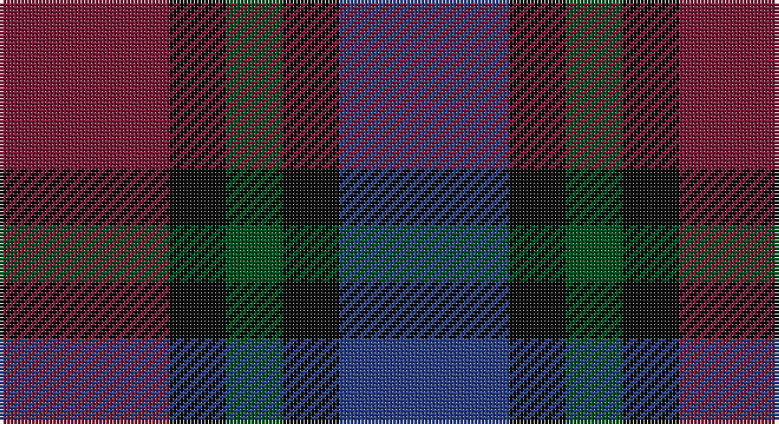

This page is one **sett** — a single exact thread-count. It belongs to the [tartan](/setts/db3k1dg1k1m3/)
(the same proportion at any scale), whose colour order is pattern [BKGKR](/stripes/bkgkr/).

Sourced from register-of-tartans.  It is a [5 stripe tartan](/stripes/stripes5/).

Original link https://www.tartanregister.gov.uk/tartanDetails.aspx?ref=667

## Register references

External register numbers recorded for this tartan.

- Scottish Register of Tartans: [667](https://www.tartanregister.gov.uk/tartanDetails.aspx?ref=667)
- Scottish Tartans World Register: 329

## Thread count
DR/48 K16 G16 K16 B/48

One full sett is **192 threads**.

## Palette

Palette: <strong>Tartan Register</strong>
<table><thead><tr><th>Colour</th><th>Threads</th><th>Shade</th><th>Base</th><th>OKLCh</th></tr></thead><tbody><tr><td>DR/</td><td style="text-align:right;font-variant-numeric:tabular-nums">48</td><td><code style="background-color:#781C38;">#781C38</code> <small style="color:#888">#781C38</small></td><td>R <code style="background-color:#CC0000;">#CC0000</code></td><td><small style="color:#888">oklch(38.7% 0.127 7.4)</small></td></tr><tr><td>K</td><td style="text-align:right;font-variant-numeric:tabular-nums">16</td><td><code style="background-color:#101010;">#101010</code> <small style="color:#888">#101010</small></td><td>K <code style="background-color:#000000;">#000000</code></td><td><small style="color:#888">oklch(17.3% 0.000 89.9)</small></td></tr><tr><td>G</td><td style="text-align:right;font-variant-numeric:tabular-nums">16</td><td><code style="background-color:#005020;">#005020</code> <small style="color:#888">#005020</small></td><td>G <code style="background-color:#006100;">#006100</code></td><td><small style="color:#888">oklch(37.7% 0.105 149.6)</small></td></tr><tr><td>K</td><td style="text-align:right;font-variant-numeric:tabular-nums">16</td><td><code style="background-color:#101010;">#101010</code> <small style="color:#888">#101010</small></td><td>K <code style="background-color:#000000;">#000000</code></td><td><small style="color:#888">oklch(17.3% 0.000 89.9)</small></td></tr><tr><td>B/</td><td style="text-align:right;font-variant-numeric:tabular-nums">48</td><td><code style="background-color:#2C4084;">#2C4084</code> <small style="color:#888">#2C4084</small></td><td>B <code style="background-color:#2A418A;">#2A418A</code></td><td><small style="color:#888">oklch(39.4% 0.117 268.3)</small></td></tr></tbody></table>

# Sample pattern

## Nearest tartans

The nearest existing variants by ΔTartan distance, with this tartan at the top so the swatches line up against it.

ΔTartan

Tartan

Sett

—

<a href="/ttd/edit/#slug=db3k1dg1k1m3~x16">Clark Clerk(e)</a> <a class="nn-out" href="/variants/s5/db3k1dg1k1m3~x16/" title="open its dictionary page">↗</a>

1.45

<a href="/ttd/edit/#slug=t25dg25k6dp10r6~x2&amp;base=db3k1dg1k1m3~x16">Breon (Jersey Shore, Pennsylvania) (Personal)</a> <a class="nn-out" href="/variants/s5/t25dg25k6dp10r6~x2/" title="open its dictionary page">↗</a>

1.49

<a href="/ttd/edit/#slug=k2dg10y2k9dp8dg2~x2&amp;base=db3k1dg1k1m3~x16">Lennie</a> <a class="nn-out" href="/variants/s6/k2dg10y2k9dp8dg2~x2/" title="open its dictionary page">↗</a>

1.58

<a href="/ttd/edit/#slug=m4k29dr30dt29m4~x2&amp;base=db3k1dg1k1m3~x16">Glen Shee #3 (Fashion)</a> <a class="nn-out" href="/variants/s5/m4k29dr30dt29m4~x2/" title="open its dictionary page">↗</a>

1.58

<a href="/ttd/edit/#slug=k2dg8db2k9dp7k2~x2&amp;base=db3k1dg1k1m3~x16">Campbell, Sir Walter Scott</a> <a class="nn-out" href="/variants/s6/k2dg8db2k9dp7k2~x2/" title="open its dictionary page">↗</a>

1.61

<a href="/ttd/edit/#slug=dp2dg6k2db6k1r2~x4&amp;base=db3k1dg1k1m3~x16">MacCaughan or MacEachain (Personal)</a> <a class="nn-out" href="/variants/s6/dp2dg6k2db6k1r2~x4/" title="open its dictionary page">↗</a>

1.71

<a href="/variants/s6/r4ni3n12db8ni2r4/">Bristol Gramar School Check (School)</a>

1.80

<a href="/ttd/edit/#slug=k1dg3k3db3k1db1~x4&amp;base=db3k1dg1k1m3~x16">Sutherland 42nd</a> <a class="nn-out" href="/variants/s6/k1dg3k3db3k1db1~x4/" title="open its dictionary page">↗</a>

1.83

<a href="/ttd/edit/#slug=db3k1n3dp4g3~x4&amp;base=db3k1dg1k1m3~x16">Crinnion (Personal)</a> <a class="nn-out" href="/variants/s5/db3k1n3dp4g3~x4/" title="open its dictionary page">↗</a>

1.84

<a href="/ttd/edit/#slug=db4k5dg4r1~x4&amp;base=db3k1dg1k1m3~x16">Unidentified pattern #3</a> <a class="nn-out" href="/variants/s4/db4k5dg4r1~x4/" title="open its dictionary page">↗</a>

1.86

<a href="/ttd/edit/#slug=k4dg16k13db16t3db3~x2&amp;base=db3k1dg1k1m3~x16">I Y</a> <a class="nn-out" href="/variants/s6/k4dg16k13db16t3db3~x2/" title="open its dictionary page">↗</a>

## Neighbour map

Every grey dot is one of 14360 variants placed by the first two principal components of the ΔTartan feature space (44% of its variance). Red is this tartan; blue dots are its nearest — click one to open its page.

<svg viewBox="0 0 640 380" role="img" style="max-width:100%;height:auto;border:1px solid #e0e0e0;border-radius:4px;display:block" xmlns="http://www.w3.org/2000/svg"><image href="/nn/cloud.v1.png" width="640" height="380"/><a href="/variants/s5/t25dg25k6dp10r6~x2/"><circle cx="163.9" cy="282.9" r="4" fill="#3465a4"><title>Breon (Jersey Shore, Pennsylvania) (Personal)</title></circle></a><a href="/variants/s6/k2dg10y2k9dp8dg2~x2/"><circle cx="201.0" cy="282.3" r="4" fill="#3465a4"><title>Lennie</title></circle></a><a href="/variants/s5/m4k29dr30dt29m4~x2/"><circle cx="222.8" cy="288.1" r="4" fill="#3465a4"><title>Glen Shee #3 (Fashion)</title></circle></a><a href="/variants/s6/k2dg8db2k9dp7k2~x2/"><circle cx="224.1" cy="294.6" r="4" fill="#3465a4"><title>Campbell, Sir Walter Scott</title></circle></a><a href="/variants/s6/dp2dg6k2db6k1r2~x4/"><circle cx="165.7" cy="265.0" r="4" fill="#3465a4"><title>MacCaughan or MacEachain (Personal)</title></circle></a><a href="/variants/s6/r4ni3n12db8ni2r4/"><circle cx="197.3" cy="266.6" r="4" fill="#3465a4"><title>Bristol Gramar School Check (School)</title></circle></a><a href="/variants/s6/k1dg3k3db3k1db1~x4/"><circle cx="234.1" cy="350.3" r="4" fill="#3465a4"><title>Sutherland 42nd</title></circle></a><a href="/variants/s5/db3k1n3dp4g3~x4/"><circle cx="87.0" cy="317.2" r="4" fill="#3465a4"><title>Crinnion (Personal)</title></circle></a><a href="/variants/s4/db4k5dg4r1~x4/"><circle cx="169.5" cy="323.7" r="4" fill="#3465a4"><title>Unidentified pattern #3</title></circle></a><a href="/variants/s6/k4dg16k13db16t3db3~x2/"><circle cx="239.2" cy="311.5" r="4" fill="#3465a4"><title>I Y</title></circle></a><circle cx="182.9" cy="327.2" r="5" fill="#c00000"/></svg>

ID: /variants/s5/db3k1dg1k1m3~x16/
